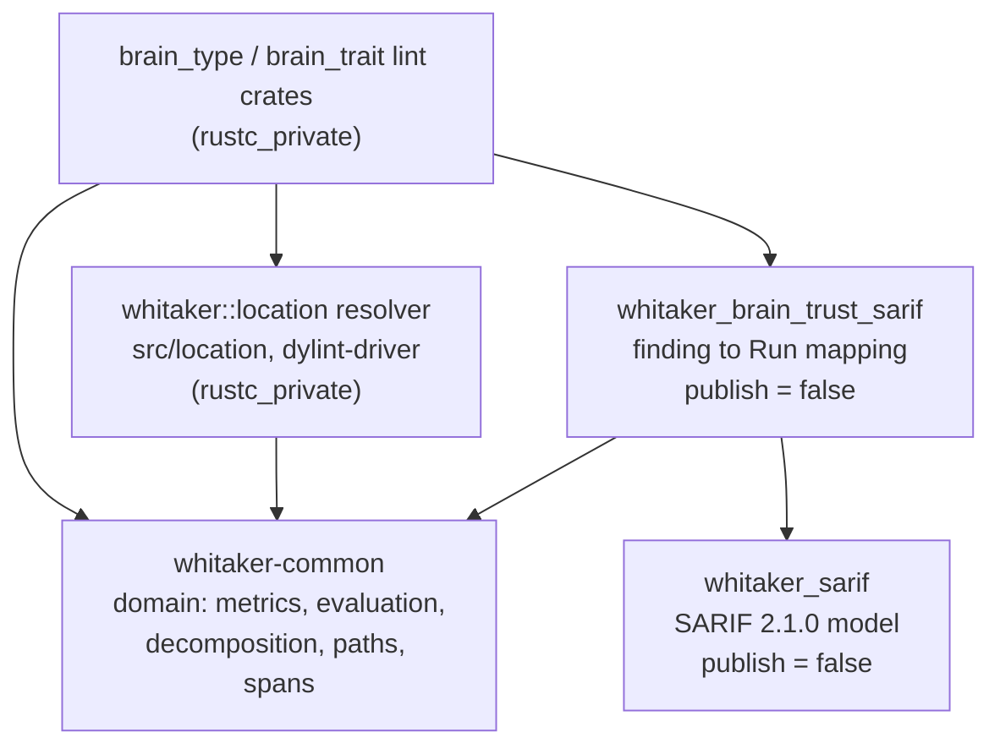

# Architectural decision record (ADR) 005: brain trust lint driver interfaces

## Status

Accepted (2026-09-27): Hold `whitaker-common` and `whitaker_sarif` as
independent leaves and place the brain trust finding-to-SARIF mapping in a
third adapter crate, `whitaker_brain_trust_sarif`, whose manifest cannot name
the localization stack; and fix the location, capture, rendering, lifecycle,
and language-boundary contracts here rather than leaving each consumer to
reinvent them.

## Date

2026-09-27.

## Context and problem statement

The `brain_type` and `brain_trait` lints (roadmap items 6.2 and 6.3) detect
types and traits whose complexity and cohesion have grown past a threshold.
Both lints must resolve a compiler span to a location, walk compiler
intermediate representation (HIR) to populate metric builders, turn
decomposition advice into both a compiler diagnostic and a Static Analysis
Results Interchange Format (SARIF) result, and do so under a lint-pass
lifecycle that begins before the crate has been fully visited and ends after
rustc would otherwise have dropped the pass.

None of that is a single consumer's business. Roadmap item 6.2.4 builds
`brain_type`, 6.3.3 builds `brain_trait`, 6.5.1 emits brain trust findings as
SARIF, and 6.6.2 and 6.6.3 localize the diagnostics. Six roadmap items would
otherwise each decide for themselves how a `rustc_span::Span` becomes a file
identifier, which HIR callbacks capture what, when a suggestion is computed,
how a finding reaches the compiler, and which text is translated. Those
choices interlock: the location rule determines which `#[allow]` attribute
works, the capture rule determines whether the lightweight threshold can see a
complete method set, and the emission rule determines whether a reader can
suppress the lint at all.

The question is therefore not what the lints should measure — the design
document settles that — but where the seam lies between compiler-facing code
and the pure domain, and what crosses it.

Two constraints make the seam non-obvious.

The first is a dependency cycle. `whitaker-common` holds the domain: metric
builders, evaluation, decomposition advice, spans, and the localization
helpers. `whitaker_sarif` holds the SARIF 2.1.0 model. The mapping from a
finding to a SARIF result needs both, because a `FindingLocation` carries a
`RepoRelativePath` and a `SourceSpan` from the domain while a `Run` is a wire
type. If either crate depends on the other, the other's reason for existing is
undermined: `whitaker-common` is published
(`.github/workflows/release.yml:338`) and `whitaker_sarif` is not
(`crates/whitaker_sarif/Cargo.toml:5`).

The second is that `whitaker-common` reaches its localization stack
unconditionally. `common/src/lib.rs:14` is a bare `pub mod i18n;` with no `cfg`
gate, and `common/Cargo.toml:11-12` declares `[features] default = []` while
`fluent-templates` is a non-optional dependency (`common/Cargo.toml:17`). A
rule of the form "SARIF is English-only, and the crate that writes it must not
be able to load a Fluent bundle" therefore cannot be expressed as "that crate
does not depend on `whitaker-common`". It has to be expressed against the
localization dependencies themselves.

Concurrent with this ADR, roadmap item 6.5.1 carries its own execplan proposing
a different placement, so the two documents must be reconciled rather than
merged.

## Decision drivers

- Keep the cycle broken without disturbing what either leaf is for:
  `whitaker-common` must remain publishable and `whitaker_sarif` must remain a
  pure wire-format model.
- Make every rule that a future implementer could get wrong without noticing
  decidable by inspecting one manifest, one type, or one callback.
- Preserve the byte-stability that the merge and continuous-integration
  comparison workflow depends on.
- Keep the lightweight gate cheap, so deep analysis runs only for subjects
  that have already crossed a threshold.
- Keep compiler-facing code out of the pure domain, so the domain can be
  tested without a compiler.
- Give a reader a way to suppress each lint at the item it complains about.

## Requirements

### Functional requirements

- `BTD-REQ-01`: a `rustc_span::Span` and a typing context must yield a
  repository-root-relative file identifier and a `SourceSpan`.
- `BTD-REQ-02`: HIR traversal must populate `TypeMetricsBuilder` and
  `TraitMetricsBuilder`.
- `BTD-REQ-03`: `DecompositionSuggestion` values must reach diagnostic and
  SARIF rendering.
- `BTD-REQ-04`: the lint-pass lifecycle must collect and finalize findings.
- `BTD-REQ-05`: the boundary between English SARIF text and localized
  diagnostics must be stated.

Requirement identifiers quote `docs/roadmap.md:288-297`, where item 6.1.3
names this ADR as its deliverable.

### Technical requirements

- No rule may require a change to an existing public signature in either leaf
  crate, since `whitaker-common` is published.
- No new dependency may be introduced into either leaf crate.
- Output must be byte-stable across runs and across compilation units.
- The SARIF output must conform to SARIF 2.1.0, including its column and
  end-column conventions.

## Options considered

The three options below concern the crate-edge decision, which is the only
choice here that changing later would break published artefacts. The capture
strategy and the emission lifecycle are compared after it.

### Option A: `whitaker-common` depends on `whitaker_sarif`

The domain would own the SARIF mapping by depending on the wire model. This
is the smallest change in file terms, and it puts the mapping next to the
metrics it reads.

It is rejected on two counts. It breaks `cargo publish -p whitaker-common`:
`whitaker-common` is published while `whitaker_sarif` carries
`publish = false`, so the packaged manifest would carry an unresolvable
registry requirement. And it inverts the dependency that the layering exists
to preserve — a pure domain would depend on a wire format, so every consumer
of the metrics would also acquire the SARIF model.

### Option B: `whitaker_sarif` depends on `whitaker-common`

The wire model would depend on the domain in order to offer the mapping as an
inherent capability. This is acyclic and publishable, and it keeps the mapping
in one crate.

It is rejected because it drags the localization stack into every consumer of
the SARIF model. `whitaker_sarif`'s only current consumer is the clone
detector, which has no use for Fluent bundles, and `common/src/lib.rs:14`
makes `i18n` unreachable-by-cfg from any dependent. It also leaves the mapping
inside `whitaker-common`'s orbit if that is where the module is placed, beside
`common/src/i18n/`, where no manifest check can distinguish a mapping that
writes English text from one that resolves a Fluent key.

### Option C: a third adapter crate depends on both (chosen)

Neither leaf depends on the other. A new `crates/whitaker_brain_trust_sarif`,
marked `publish = false`, depends on both and owns the mapping.

This mirrors the shape the repository already uses for the clone detector:
`crates/whitaker_clones_core` depends on `whitaker_sarif` and is itself
`publish = false` (`crates/whitaker_clones_core/Cargo.toml:5,21`), while
depending on no compiler crate. The adapter is the only crate that must know
both vocabularies, and it is the only crate that needs to.

| Topic                                            | Option A                              | Option B                        | Option C                                    |
| ------------------------------------------------ | ------------------------------------- | ------------------------------- | ------------------------------------------- |
| Cycle                                            | Broken                                | Broken                          | Broken                                      |
| `whitaker-common` publishable                    | No: unresolvable registry requirement | Yes                             | Yes                                         |
| `whitaker_sarif` a pure model                    | Yes                                   | No: gains the domain and Fluent | Yes                                         |
| Mapping crate's manifest names the Fluent stack  | n/a                                   | Yes                             | No: its absence is checkable                |
| Existing precedent                               | None                                  | None                            | `whitaker_clones_core`                      |
| New crates                                       | 0                                     | 0                               | 1                                           |

_Table 1: Comparison of crate-edge options._

Option B is the strongest alternative and the one the 6.5.1 execplan
effectively proposes. It is rejected because the property it gives up — that
the English-only rule is a manifest fact rather than a convention — is the
property that makes the rule enforceable at all.

### Capture strategy: single-phase fan-out against two-phase capture

The first draft of this decision required a single traversal that fanned out
to all four metric sinks as it went. That makes the traversal itself the deep
analysis, so the lightweight threshold can only gate the clustering step, and
it forces the pass to retain six string collections per method for every type
in the crate until the crate has been fully visited.

The chosen strategy is two-phase. Cheap scalars are recorded during the
callbacks — per method, a `DefId`, a name, a `BodyId`, a `Span`, and a line
count. At finalization the lightweight threshold is evaluated against the
_complete_ accumulated method count, and only then are the surviving subjects'
bodies re-fetched through the typing context and walked deeply.

This satisfies both halves of a requirement that a single phase cannot: the
design document states that deep analysis runs only after lightweight
thresholds are crossed
(`docs/brain-trust-lints-design.md:361-365`), and the gate must see a complete
method count to be meaningful. `BodyId` is `Copy` and carries no lifetime, so
phase one can live on a pass struct that is not parameterized by the compiler's
lifetime — which every shipped driver's is not
(`crates/bumpy_road_function/src/driver/mod.rs:75`).

### Emission lifecycle: emit during traversal against defer to crate-post

Emitting during traversal is what nine of the ten shipped lint crates do, by
calling `cx.emit_span_lint`. For a per-item lint that is correct, because the
context's notion of "the item currently being linted" is the item just
visited.

It is rejected here because the deferred lifecycle is the one both lints need,
and because deferral changes which suppression attributes work. The two lints
reach that requirement by different routes, which is worth stating plainly
rather than papering over.

`brain_type` is whole-crate by necessity. A type's methods are spread across
arbitrarily many `impl` items, so no single callback has seen enough to decide
anything, and the gate cannot run until the crate has been fully visited.

`brain_trait` is not. Its unit of analysis is a single trait definition
(`docs/brain-trust-lints-design.md:60-64`), and every item it measures — a
required method, a default method body, an associated type, an associated
const — lives inside the one `ItemKind::Trait` item. `TraitMetricsBuilder`
reflects that shape: it is constructed with a trait name and accepts only trait
items (`common/src/brain_trait_metrics/metrics.rs:120-235`), so it needs no
data from any other item. A trait's `check_item` callback has therefore seen
everything the lint needs, and emitting there would be correct on its own
terms. This is not a hypothetical:
`crates/bumpy_road_function/src/driver/mod.rs:99-100` reaches a trait default
body's `BodyId` synchronously from `check_trait_item` — the same data
`brain_trait` would need — so an immediate-emission path is demonstrably
available.

`brain_trait` is nonetheless deferred. The reason is uniformity of the seam,
not a constraint that forced the choice. Both lints share this ADR, and a
future contributor reading one lifecycle contract with a single carve-out is
more likely to reintroduce the suppression bug below in the lint that has the
exception than to reproduce the exception faithfully. Deferral also gives the
two lints one deterministic-order guarantee and one artefact handoff instead of
two. The cost is real and is accepted: `brain_trait` pays a deferral it did not
need.

Deferral changes which suppression attributes work.
`LateContext::opt_span_lint` resolves the lint level at
`self.last_node_with_lint_attrs` (`rustc_lint/src/context.rs:600-615`, field
at `:500`), which at crate-post time is the crate root. The ordinary
`cx.emit_span_lint` path would therefore silently ignore an
`#[allow(brain_trait)]` on the trait and ship an unsuppressable lint — and it
is precisely because `brain_trait` could otherwise emit immediately that the
hazard is worth stating for it explicitly.

The chosen lifecycle is deferred emission through a path that takes the
subject's `HirId` explicitly, so the level is resolved at the offending item.

## Decision outcome / proposed direction

Adopt Option C, with two-phase capture and `HirId`-aware deferred emission.

In the context of two whole-crate complexity lints that must each produce both
a localized compiler diagnostic and an English SARIF result, facing a
dependency cycle between the pure domain and the wire-format model and a
localization stack that no feature gate can hide, Whitaker chooses a third
adapter crate owning the mapping, over making either leaf depend on the other,
to keep both leaves fit for their purpose, accepting a new crate and the
requirement that the language boundary be stated as a dependency rule rather
than a crate rule.

The dependency direction this establishes:

Screen-reader description: the diagram shows five participants in three tiers.
The top tier holds the two Dylint lint crates and the root `whitaker` crate's
location resolver, all of which use the compiler's internals. The middle tier
holds one adapter crate that maps findings to SARIF. The bottom tier holds two
independent leaf crates that depend on nothing else in the workspace:
`whitaker-common`, the pure domain, and `whitaker_sarif`, the wire-format
model. Arrows point downward only. The two leaves do not depend on each other.



_Figure 1: Dependency direction across the brain trust lint driver seam._

Two rules follow from the diagram, and both are load-bearing.

1. **Everything that knows about the compiler lives in the top tier, and
   nothing below it may depend on anything above it.**
2. **`whitaker-common` and `whitaker_sarif` are leaves and must not depend on
   each other.** Wherever the two must meet, they meet in
   `whitaker_brain_trust_sarif`.

The mapping crate depends on `whitaker-common`, because the value crossing the
seam — a `FindingLocation`, carrying a `RepoRelativePath` and a `SourceSpan` —
is a domain type. It must not depend on `fluent-templates` or `unic-langid`,
which is the edge that makes the English-only rule checkable. It must not
depend on a compiler crate either: `SubjectLocation` pairs that domain value
with the `HirId` that deferred emission needs, and it stays in the root
`whitaker` crate, above the seam. The adapter consumes the domain half and
never sees the compiler half.

## Location resolution

The domain has no file identity today: `SourceSpan` holds only start and end
line and column (`common/src/span.rs:50-53`). A sibling type is added rather
than growing it.

Screen-reader description: the first of the following three code blocks
declares a validated repository-relative path type in `whitaker-common`. It has
a constructing function that validates and normalizes, and an accessor
returning the forward-slashed form used in diagnostics and fingerprints, which
callers must percent-encode before building a SARIF URI. The second declares
the compiler-free location value that crosses the seam, also in
`whitaker-common`, bundling that path with a source span and carrying the
reason a location may be unavailable. The third declares, in the root
`whitaker` crate, the resolving function that takes a late context, a span,
and an `HirId`, and the type it returns: the domain location paired with the
`HirId` the lint driver needs to emit at the right node.

```rust,ignore
// common/src/paths.rs — no rustc_private, built on camino.

/// A validated repository-root-relative path, forward-slashed.
#[derive(Clone, Debug, PartialEq, Eq, PartialOrd, Ord, Hash)]
pub struct RepoRelativePath(Utf8PathBuf);

impl RepoRelativePath {
    /// Validates and normalizes a candidate path.
    ///
    /// # Errors
    ///
    /// Returns an error when the path is absolute, contains a `..` or `.`
    /// component, carries a drive prefix, or is empty.
    pub fn new(candidate: &Utf8Path) -> Result<Self, PathError> { todo!() }

    /// Returns the decoded, forward-slashed path, for diagnostics and
    /// fingerprints.
    ///
    /// This is **not** a SARIF URI reference and is **not** percent-encoded.
    /// A caller building `artifactLocation.uri` must percent-encode the result
    /// first, or a path containing a space or a `#` will not be a valid URI
    /// reference. See the encoding rule in `Location resolution`.
    #[must_use]
    pub fn as_str(&self) -> &str { todo!() }
}
```

```rust,ignore
// common/src/paths.rs, continued — still camino only, still no rustc_private.

/// A subject's location as the domain sees it.
///
/// This is the value that crosses the seam. It carries no compiler type, so
/// the SARIF adapter can name it without gaining a rustc dependency.
#[derive(Clone, Debug, PartialEq, Eq)]
pub struct FindingLocation {
    file: RepoRelativePath,
    span: SourceSpan,
}

impl FindingLocation {
    /// Constructs a location from a validated path and a span.
    #[must_use]
    pub fn new(file: RepoRelativePath, span: SourceSpan) -> Self { todo!() }

    /// Returns the repository-relative file.
    #[must_use]
    pub fn file(&self) -> &RepoRelativePath { todo!() }

    /// Returns the span within that file.
    #[must_use]
    pub fn span(&self) -> SourceSpan { todo!() }
}

/// Why a subject's location could not be resolved.
#[non_exhaustive]
#[derive(Clone, Debug, PartialEq, Eq)]
pub enum LocationUnavailable {
    /// The span has no real backing file.
    NotRealFile,
    /// The source map could not resolve the span.
    Unresolvable,
    /// The path resolved outwith the repository root.
    OutwithRepositoryRoot { path: Utf8PathBuf },
}
```

```rust,ignore
// src/location/mod.rs in the root `whitaker` crate, behind `dylint-driver`.

/// A resolved location for a lint subject, with the node to emit at.
///
/// This is the driver's type, not the adapter's: it pairs the domain's
/// `FindingLocation` with the `HirId` that deferred emission resolves the lint
/// level at (lifecycle rule 1). The `HirId` stays here, above the seam, so the
/// adapter never needs a compiler crate.
#[derive(Clone, Debug)]
pub struct SubjectLocation {
    location: whitaker_common::paths::FindingLocation,
    hir_id: rustc_hir::HirId,
}

impl SubjectLocation {
    /// Returns the compiler-free location the SARIF adapter consumes.
    #[must_use]
    pub fn location(&self) -> &whitaker_common::paths::FindingLocation { todo!() }

    /// Returns the node whose lint level governs emission.
    #[must_use]
    pub fn hir_id(&self) -> rustc_hir::HirId { todo!() }
}

/// Resolves a compiler span to a repository-relative location.
pub fn resolve_subject_location(
    cx: &rustc_lint::LateContext<'_>,
    span: rustc_span::Span,
    hir_id: rustc_hir::HirId,
) -> Result<SubjectLocation, whitaker_common::paths::LocationUnavailable> { todo!() }
```

The normative rules are these.

1. **Home, and where the seam falls.** `RepoRelativePath` and
   `FindingLocation` live in `whitaker-common`, whose invariant is a
   repository-path invariant rather than a SARIF one. `resolve_subject_location`
   lives in the root `whitaker` crate at `src/location/mod.rs` behind
   `dylint-driver` — the established home for shared compiler-facing helpers
   (`src/lib.rs:13-25`), already depended on by every lint crate with that
   feature, and not in the publish set. A new module rather than `src/hir/`,
   which is 374 lines against the 400-line cap in `AGENTS.md:31`.
2. **Path source.** The file is obtained from the session's source map. A path
   the compiler reports as relative is used unchanged; an absolute path has the
   compiler's working directory stripped. Under Cargo the relative case is the
   live one: `cargo` sets the compiler's working directory to the workspace
   root and hands rustc a workspace-root-relative source path, so the stripping
   branch is a fallback for the non-Cargo case. This was confirmed by
   probe — see `docs/execplans/6-1-3-...md` `Artefacts and notes`.
3. **Normalization, and encoding at the URI boundary.** Forward slashes on every
   platform, no leading `./`, no leading slash, no `..` component, per SARIF
   2.1.0 §3.4.3, which requires a relative-path reference under RFC 3986 §4.2.
   No source-path normalization exists in the tree today; the forward-slash
   intent documented at `crates/whitaker_sarif/src/paths.rs:24-25` concerns the
   output artefact directory, not source URIs.

   Normalization is not encoding, and the two must not be conflated.
   `RepoRelativePath::as_str` yields the decoded repository path — the characters
   a reader sees in a diagnostic — and it is **not** percent-encoded. Encoding is
   the SARIF boundary's job rather than the path type's, because the same value
   feeds compiler diagnostics and fingerprints, where percent-encoding would be
   wrong, and `artifactLocation.uri`, where it is required. A path containing a
   space or a `#` must therefore be percent-encoded when the mapping builds
   `artifactLocation.uri`, or the result is not a valid URI reference. This is a
   live case rather than a hypothetical: the repository tracks
   `docs/execplans/3.4.6. Record download-versus-build rates.md`, whose name
   contains spaces.

   The incumbent producer does **not** do this. It copies its file path into
   `artefact_location.uri` with no encoding, which is why the clone detector's
   goldens read `"src/a.rs"` verbatim
   (`crates/whitaker_clones_core/src/run0/tests.rs:192`). Its paths happen to
   contain no reserved characters, so the defect is latent rather than
   observable, and no percent-encoder exists anywhere in the tree today. The
   mapping crate is where the encoder belongs, and this rule makes writing one a
   requirement rather than a judgement call. **Recorded as follow-up work**: the
   clone detector shares the defect, and no existing verification property
   covers it, because the properties are over region coordinates rather than
   over URI text.
4. **Column convention.** Lines and columns are one-based, and columns count
   UTF-16 code units, satisfying `RegionBuilder::build`, which rejects a zero
   column (`crates/whitaker_sarif/src/builders/location_builder.rs:91`) and
   matching the unit the repository's only existing SARIF producer counts
   (`crates/whitaker_clones_core/src/run0/span.rs:78-79`, which converts
   through `line_slice.encode_utf16().count()`). The compiler reports
   zero-based `CharPos` columns in Unicode scalar values, and its two line
   accessors differ: `span_to_lines` yields a zero-based `line_index` while
   `lookup_char_pos` yields a one-based `Loc::line`. The conversion is
   therefore stated per accessor, adding one to each axis.

   The two axes do not terminate alike, and the difference is normative rather
   than cosmetic. `endLine` is **inclusive** — it names the last line the
   region occupies. `endColumn` is **exclusive** — per SARIF 2.1.0 Errata 01
   §3.30.8 it is "one greater than the column number of the last character in
   the region", and "a text region does not include the character specified by
   `endColumn`", so `startColumn: 2, endColumn: 4` spans the two characters
   `bc`. A region ending at the final character of line 3 therefore pairs
   `endLine: 3` with the column _past_ that character, which on a single-line
   region is one more than `startColumn` plus the character count. Setting
   `endColumn` to the last included character's own column is an off-by-one,
   and it is the error the incumbent producer makes — see `Goals and
   non-goals` and `Known risks`. `span_to_region` is the only place the rule
   is enforced, and `VP-3` is the obligation that tests it.
5. **Enforcement point.** `SourceLocation::new` is an infallible `const fn`
   and does not enforce the convention (`common/src/span.rs:31`). The single
   enforcement point is `span_to_region`, which **rejects** a zero line or
   column rather than clamping it. Clamping would convert a driver off-by-one
   into a valid-but-wrong region that no gate can catch. Where a column
   genuinely cannot be determined — a span starting mid-grapheme, a
   tab-indented line under an ambiguous width rule — `startColumn` is omitted
   entirely, which `Region.start_column: Option<usize>` already permits,
   rather than fabricating `1`.
6. **No real file.** Macro expansions, command-line inputs, doctests, and any
   non-real `FileName` yield `Err(NotRealFile)`. The lint still emits its
   compiler diagnostic, because rustc renders such spans correctly. The
   finding is excluded from SARIF and counted.
7. **Outwith the repository.** A path escaping the repository root yields
   `Err(OutwithRepositoryRoot)`, with the same consequence as rule 6.
8. **Never a bug channel.** `resolve_subject_location` must not call
   `span_delayed_bug`, `delayed_bug`, `span_bug`, or `bug` on any
   data-dependent path. On the pinned toolchain a flushed delayed bug becomes
   an internal compiler error when the compilation is otherwise clean
   (`rustc_errors/src/lib.rs:1480-1486`), and a warn-only lint never emits a
   real error, so every delayed bug it creates aborts the build. Unresolvable
   input is reported through `log::debug!` and the run's counters. The
   precedent to follow is `crates/module_max_lines/src/driver.rs:86-93`, which
   logs and returns. **Known limitation**: four existing call sites carry this
   hazard today — `crates/bumpy_road_function/src/driver/mod.rs:224` and
   `:235`, and `segment_builder.rs:164` and `:186` — recorded here as
   follow-up work.
9. **Observability.** Every drop emits one `log::debug!` naming the subject
   and the reason, matching the discipline in
   `crates/rstest_helper_should_be_fixture/src/collector.rs:140-144`. The
   emitted run carries an unresolved-subject count per reason **even when it
   is zero**, so that "clean" is falsifiably different from "resolution
   broken".
10. **`uriBaseId`.** Brain trust results emit `artifactLocation.uri` as the
    repository-relative path with `uriBaseId` absent. SARIF §3.4.4 permits
    this, and GitHub code scanning documents a repository-root-relative path
    as the preferred form. Emitting `%SRCROOT%` would additionally require a
    conforming `originalUriBaseIds` entry whose `uri` ends in a single forward
    slash (§3.14.14), and `Run` has no such field today. **Outstanding**: the
    clone detector also emits `uri_base_id: None`
    (`crates/whitaker_clones_core/src/run0/emit.rs:174`) while the model's
    doctests show `%SRCROOT%` (`model/location.rs:178`); a future item should
    settle that across both producers at once.
11. **`columnKind`.** Every Whitaker run must state
    `columnKind: "utf16CodeUnits"` explicitly. `Run` has no such field
    (`crates/whitaker_sarif/src/model/run.rs:36-54`) and must gain one. The
    default for an absent `columnKind` is contested, so relying on it is
    unsafe regardless of which reading is correct, and SARIF §3.14.27 requires
    a text-artefact producer to state it whenever it reports a non-empty
    result set.

## HIR capture

The contract is **two-phase capture**: cheap scalars during the callbacks,
deep capture at finalization for gated subjects only.

1. **Callbacks.** `brain_type` captures from `check_item` for
   `ItemKind::Impl`, and from `check_item` for `ItemKind::Struct`,
   `ItemKind::Enum`, and `ItemKind::Union`. The latter is what supplies the
   subject's **declaration** span and `HirId`; without it the diagnostic has
   nowhere to point and, per the lifecycle rules below, no site at which the
   lint can be suppressed. `brain_trait` captures from `check_item` for
   `ItemKind::Trait`. No capture callback emits.
2. **Phase one records scalars only, and only the scalars an item has.** For a
   method _with a body_ — an inherent or trait-impl method, or a trait default
   method — phase one records the `DefId`, the name, the `BodyId`, the `Span`,
   and the line count. `BodyId` is `Copy` and carries no lifetime, so it can
   live on a pass struct that is not parameterized by the compiler's lifetime.
   For everything else the trait metrics count — required methods, associated
   types, and associated constants — phase one records the name and the `Span`
   and nothing further, because those are the only scalars such an item has. A
   required method is a declaration with no body, so it has no `BodyId`; the
   builder reflects that asymmetry exactly, since `add_required_method`,
   `add_associated_type`, and `add_associated_const` each take a name and
   nothing more, while only `add_default_method` takes a complexity value
   (`common/src/brain_trait_metrics/metrics.rs:168-235`). Recording a `BodyId`
   per _method_ without that qualification would be unsatisfiable for a
   `brain_trait` subject. Phase one must not build `MethodInfo`,
   `MethodProfile`, or any string set.
3. **The gate runs between the phases.** At finalization, the lightweight
   threshold is evaluated on the _complete_ accumulated method count, and only
   then is each surviving subject's bodies re-fetched through the typing
   context and walked deeply. This satisfies both
   `docs/brain-trust-lints-design.md:361-365` ("deep analysis is only
   performed after lightweight thresholds are crossed") and the requirement
   that the gate see a complete method count.
4. **Phase two fans out from one walk.** For a gated subject, each method body
   is visited once and dispatched to all four sinks —
   `CognitiveComplexityBuilder`, `MethodInfoBuilder`, `MethodProfileBuilder`,
   and `ForeignReferenceSet`. This resolves the divergence between
   `lcom4::MethodInfo` and `decomposition_advice::MethodProfile` at the driver
   without changing either domain type. The dispatch surface is a single
   visitor type owning all four builders, exposing one method per HIR event
   rather than one per sink, so that a contributor cannot feed three sinks and
   forget the fourth.
5. **Nesting balance is structural, not disciplinary.**
   `CognitiveComplexityBuilder::build` panics on an unbalanced nesting stack
   and `pop_nesting` panics on an empty one
   (`docs/brain-trust-lints-design.md:257-259`). Because nesting is entered
   and left across separate visitor callbacks, the pairing is enforced by a
   scope guard whose `Drop` pops, not by matching call sites.
6. **Macro filtering happens once, in the driver.** The driver computes
   `span.from_expansion()` per HIR node and passes the boolean to every builder
   that accepts one. The domain never sees a `Span`. This extends the
   convention recorded for roadmap items 6.1.2 and 6.2.3
   (`docs/brain-trust-lints-design.md:162-169`, `:237-247`). Consequently the
   resolver never receives an expanded subject span in the ordinary path; rule
   6 of the location contract covers the residual case where a subject's own
   declaration is macro-generated.
7. **Subject keying must be total.** The self type is normalized through
   `tcx.type_of(...)`, and both an `AdtDef` and a local `DefId` are required. A
   subject yielding neither is skipped, with the stated consequence that
   blanket implementations, implementations on primitives, references, slices,
   tuples, function pointers, and `dyn Trait`, and implementations on foreign
   types, contribute to no brain type. References are peeled before the test,
   so `impl Trait for &Foo` merges into `Foo`. Multiple instantiations of one
   source `impl` merge into one subject, and a method is counted **once per
   source definition site**: `impl<T> Foo<T> { fn bar }` is one `impl` item and
   contributes once, while `impl Foo<u8> { fn bar }` and
   `impl Foo<String> { fn bar }` are two distinct source methods and both
   contribute. See `Counting a method once` below.
8. **Bound the clustering input.** `suggest_decomposition` builds a similarity
   edge for every method pair
   (`common/src/decomposition_advice/community.rs:40-68`) and runs label
   propagation for up to twice the node count (`community.rs:77`), so it is
   quadratic in edges and cubic in the worst case — and a warned brain type is
   by definition the dense worst case. The existing caps
   (`common/src/decomposition_advice/note.rs:14-15`) bound the _output_, not
   the input. A configurable `max_methods_for_advice` above which clustering is
   skipped and the note omitted, with the omission reported, is therefore
   normative here rather than left for 6.2.4 and 6.3.3 to invent
   independently.

### Counting a method once

The design document's subject boundary reads "the type definition and all
inherent `impl` blocks; all trait implementation methods for that type in the
crate", followed by "each method contributes to complexity and cohesion
metrics" (`docs/brain-trust-lints-design.md:51-58`). Read against the capture
rule above, this yields one contribution per source definition site, and that
is the rule.

Per-instantiation duplication cannot arise under this contract, because the
capture is HIR-based and rustc's HIR holds one `ImplItem` per source `impl`
block regardless of its generic parameters. Enumerating instantiations would
require a typing-context walk over monomorphized instances, which no shipped
code does — every method-bearing construct in the tree is reached through HIR
callbacks — and which this ADR does not mandate.

That two entries may share a name is expected rather than exceptional, and the
shipped cohesion code already accommodates it.
`build_method_index` is documented as a "method-name-to-indices map,
preserving duplicate names" (`common/src/lcom4/mod.rs:235-242`), and
`union_by_method_calls` states the reason: "when multiple methods share a name
(e.g. trait impl methods on the same type), the caller is unioned with every
matching callee" (`:244-248`). A driver that deduplicated by name would defeat
that design, and would silently discard one body's measured complexity.

`TypeMetricsBuilder::add_method` takes only a name, a cognitive-complexity
value, and a line count, and pushes unconditionally
(`common/src/brain_type_metrics/mod.rs:295-306`). It is therefore not a
deduplicating API and must not be treated as one: the count is exactly the
number of source definitions the driver feeds it.

## Suggestion rendering

1. **Computation.** `suggest_decomposition` is called once per gated subject
   at finalization, on the complete method set. Calling it per callback would
   cluster a partial set and produce advice that changes with visitation
   order.
2. **Diagnostic path.** The shipped `format_decomposition_note` renders the
   note, and the result is attached as a `note`. That renderer is English-only
   today by an explicit earlier decision
   (`docs/brain-trust-lints-design.md:446-449`); moving it behind Fluent
   belongs to roadmap item 6.6.2 and does not change this contract.
3. **SARIF path.** A `DecompositionSuggestion` carries a label, an extraction
   kind, method _names_, and a rationale
   (`common/src/decomposition_advice/suggestion.rs:95-118`) — no spans. SARIF
   `relatedLocations` is therefore not merely unattractive but
   _unrepresentable_: `RelatedLocation.physical_location` is mandatory in this
   model (`crates/whitaker_sarif/src/model/location.rs:121-131`). Suggestions
   reach SARIF as structured property-bag data under the `whitaker` key, with
   the same English note text also present in the result message.
4. **One source, two renderings.** Both derive from the same
   `Vec<DecompositionSuggestion>` on the finding. Neither renderer may
   re-cluster or re-order. The display caps of three suggestions and three
   methods each are _presentation_ limits; where SARIF inherits them it must
   also emit an omitted-count, mirroring the `brainMethodsOmitted` shape the
   6.5.1 execplan already uses for methods, so that a machine consumer can
   tell truncation from absence.
5. **The property bag needs a schema statement.** `WhitakerProperties` has no
   version field, no `#[serde(default)]`, and no `deny_unknown_fields`
   (`crates/whitaker_sarif/src/whitaker_properties.rs:37-52`), so every
   existing field is mandatory on read while unknown fields are tolerated.
   Turning it into an internally tagged enum makes the tag mandatory and would
   reject every artefact the shipped detector has already written under
   `target/whitaker/`, which `merge_runs` re-reads
   (`crates/whitaker_sarif/src/merge.rs:104-145`). This contract therefore
   requires: one versioning convention rather than two, a transitional read
   rule for the absent tag, and a normative statement that consumers ignore
   unknown keys. It also records the `rename_all` trap — an internally tagged
   enum's `rename_all` renames _variants_, not the variants' fields, so each
   payload struct must carry its own.
6. **Outstanding**: adding per-method spans to `DecompositionSuggestion` would
   allow true related locations. That is a domain-type change for a future
   item.

## Lint-pass lifecycle

| Callback                                                          | Responsibility                                                                                                                                                                    |
| ----------------------------------------------------------------- | --------------------------------------------------------------------------------------------------------------------------------------------------------------------------------- |
| `check_crate`                                                     | Clear all accumulated state unconditionally, then load configuration, build the `Localizer`, and resolve the SARIF mode.                                                          |
| `check_item`, `check_impl_item`, `check_trait_item`               | Capture scalars only. Never evaluate, never emit, never build a string set.                                                                                                       |
| `check_crate_post`                                                | Finalize once; gate; deep-capture surviving subjects; evaluate; build findings; emit through an `HirId`-aware path in a deterministic order; hand the run to the artefact writer. |

_Table 2: Responsibilities of each lint-pass callback._

1. **Emission must be `HirId`-aware.** `LateContext::opt_span_lint` resolves
   the level at `self.last_node_with_lint_attrs`
   (`rustc_lint/src/context.rs:600-615`), which at crate-post time is the crate
   root — so the ordinary `cx.emit_span_lint` path silently ignores
   `#[allow(brain_type)]` and `#[expect(...)]` on the type or `impl`, leaving
   an unsuppressable lint. Deferred emission must therefore capture the
   subject's `HirId` and emit through `TyCtxt::emit_node_span_lint`
   (`rustc_middle/src/ty/context.rs:2461-2470`), which resolves the level at
   the supplied node. The lint crates gain `rustc_middle` under
   `dylint-driver` for this; `crates/clippy_utils` is a local stub carrying
   only `macros::is_panic` (`crates/clippy_utils/src/lib.rs:1-12`) and
   provides no alternative.
2. **Finalize once, by construction.** The accumulator is consumed by
   finalization and yields a distinct finalized type, so reading unfinalized
   state is unrepresentable rather than merely discouraged. The nearest
   precedent, `CallSiteCollector::finalize`
   (`crates/rstest_helper_should_be_fixture/src/collector.rs:171-181`), is
   idempotent by accident — it is a sort — and its `iter()` is explicitly
   callable beforehand (`:186-192`). This contract asks for a stronger
   guarantee and says so rather than claiming to mirror the precedent.
3. **Deterministic order.** Findings are emitted ordered by _(definition path,
   subject name, file identifier, start line, start column)_. Definition path
   leads because it is globally unique and always available, whereas the file
   identifier is absent for any subject whose location did not resolve — and
   those subjects are still diagnosed. A location-led key also collides for
   two `impl` blocks on one line, for macro-generated types sharing an
   expansion span, and for the same subject compiled for the library and test
   targets. Every accumulator is an ordered container, so order never depends
   on hashing.
4. **Reset unconditionally.** State is cleared as the first statement of
   `check_crate`, _before and independent of_ the configuration path. In the
   closest precedent the reset sits inside the configuration routine
   (`crates/rstest_helper_should_be_fixture/src/driver.rs:187`), so a future
   refactor that caches the parsed configuration would silently drop it.
5. **The artefact handoff must be named.** `check_crate_post` returns `()` and
   rustc drops the pass, so "produce a `Run` and nothing more" is not
   implementable on its own. One artefact is written per _compilation unit_,
   under `target/whitaker/` following the existing layout convention
   (`crates/whitaker_sarif/src/paths.rs:10-39`), with a name derived from the
   package, crate, and target kind. It is written to a unique temporary file
   in the same directory and then renamed, never appended: `cargo dylint` runs
   one rustc process per crate _and per target_, concurrently, so an
   unsynchronized append interleaves and corrupts the file — which is what the
   only in-tree precedent does today
   (`crates/rstest_helper_should_be_fixture/src/driver.rs:325-328`). A
   separate merge step reduces the per-unit runs through the shipped
   `merge_runs` and `deduplicate_results`, and that step — not the lint — owns
   the final artefact.
6. **Per-target duplication.** The same source file is compiled for the
   library target and the test target, and the test target sees
   `#[cfg(test)]` methods, so one subject at one location yields different
   metrics under an otherwise identical key. The merge step either states
   which target's result wins or keys the subject by target as well.
7. **Incremental builds.** Cargo skips rustc for unchanged crates, so a brain
   trust artefact for an unchanged crate is stale-but-valid. That is stated
   explicitly so that a continuous-integration recipe can choose between
   accepting it and forcing a rebuild.
8. **Ordered fingerprints.** `SarifResult::partial_fingerprints` must be an
   ordered map. It is a `HashMap` today
   (`crates/whitaker_sarif/src/model/result.rs:107-108`), serialized in
   randomized order, which defeats the byte-stability that the merge and
   comparison workflow depends on. This **confirms** the 6.5.1 execplan, which
   already changes the field to a `BTreeMap` with no compatibility shim
   (`6-5-1-...md:302-312`); it is not a supersession.
9. **Zero cost when disabled.** With SARIF disabled, no finding is converted
   and no artefact is written. The _analysis_ cost is bounded by the gate in
   the capture contract, not by the SARIF mode; the two are separate budgets.
10. **Rule identifiers.** The brain trust lints allocate `WHK004` for
    `brain_type` and `WHK005` for `brain_trait`, continuing the sequence
    `WHK001` to `WHK003` that the clone detector already holds
    (`crates/whitaker_sarif/src/rules.rs:13-19`). Identifiers are never
    reused and never renumbered, because users write suppressions against
    them. Rule metadata — `shortDescription`, `fullDescription`, and
    `helpUri` — is English-only static data.

## Language boundary

1. **Findings hold values, not prose.** A finding carries the subject kind and
   name, the disposition, the measured metrics, the resolved location or the
   reason it is absent, and the decomposition suggestions. It carries no
   rendered message. This is what lets a localized diagnostic and an English
   SARIF result stay semantically identical without either being a translation
   of the other.
2. **SARIF is English-only, and the mapping crate does not declare the
   localization stack.** The SARIF mapping lives in
   `crates/whitaker_brain_trust_sarif`, which does not depend on
   `fluent-templates` or `unic-langid`. That is a claim about the crate's _direct
   manifest edges_, and the narrower claim is the accurate one: the crate does
   depend on `whitaker-common`, because the `FindingLocation` that crosses the
   seam carries a `RepoRelativePath` and a `SourceSpan`. It does not depend on
   a compiler crate, because `SubjectLocation` — which adds the `HirId` that
   deferred emission resolves the lint level at — stays in the root `whitaker`
   crate and is destructured before the adapter is called. `whitaker-common`
   re-exports `get_localizer_for_lint` and `Localizer`, and `Localizer` exposes
   `message`, `message_with_args`, `attribute`, and `attribute_with_args`
   (`common/src/lib.rs:89-105`, `common/src/i18n/loader.rs:101-136`). A future
   author holding that edge could therefore resolve a Fluent message, and would
   need no manifest edit to do it: the re-export is already reachable from the
   crate the mapping depends on. The rule is not a reachability proof, and
   `EP-M2`'s fitness guard checks dependency names rather than claiming one. The
   rule binds by construction instead: a finding holds values, not prose (rule
   1), and the mapping renders those values through English static metadata.

   What the dependency-name rule buys is an _informative_ manifest, which is the
   property Option B and the 6.5.1 placement both surrender.
   `whitaker-common`'s manifest declares `fluent-templates` and `unic-langid`
   outright (`common/Cargo.toml:17`), and must, for its own localization work; a
   mapping nested at `common/src/brain_trust_sarif/` would sit in a crate whose
   manifest says nothing about the mapping's own dependencies, and whose Fluent
   edges cannot be removed to make it say something. `whitaker_brain_trust_sarif`
   is the one crate that can reach `whitaker-common` _and_ still be checked for
   the absence of a localization edge, so the absence is a deliberate,
   reviewable constraint rather than an accident of cohabitation.

   The `i18n` module itself cannot be gated, which is why the rule is stated on
   the dependency names rather than on the crate: `common/src/lib.rs:14` is a
   bare `pub mod i18n;` with no feature gate, so no manifest edge can make it
   unreachable for any dependent. **This supersedes the 6.5.1 execplan's
   mapping-module placement** — the same decision recorded under
   `Decision outcome`, stated here from the language-boundary side.
3. **Diagnostics are localized.** Compiler diagnostics resolve primary, note,
   and help text through `safe_resolve_message_set`, which falls back to a
   lint-supplied English `DiagnosticMessageSet` when a Fluent key is missing
   (`common/src/i18n/helpers.rs:180-206`). Fluent entries arrive in roadmap
   item 6.6.2; until then the English fallbacks are the only path, which is a
   temporary state rather than a separate design.
4. **Rule metadata is English-only static data**, as stated in the lifecycle
   contract. The namespace convention governing future allocations is that
   identifiers are allocated sequentially and never reused; roadmap item 3.6.1
   remains free to assign its own selector codes.
5. **Measured values are not translated.** Numbers, type names, method names,
   and extraction kinds appear verbatim in both renderings. Only the
   connecting prose differs.
6. **Consequence to accept.** A localized diagnostic and its SARIF counterpart
   will not be string-equal, and no test should assert that they are. The
   invariant worth asserting, and which roadmap item 6.6.3's user-interface
   tests should assert, is that both carry the same measured values.

## Goals and non-goals

- Goals:
  - Give all six consuming roadmap items one contract, so that none of them
    re-decides the seam.
  - Keep both leaf crates fit for their purpose: one publishable, one pure.
  - Make each rule decidable by inspecting a manifest, a type, or a callback.
  - Preserve byte-stable output.
- Non-goals:
  - Ratifying the existing clone detector's `endColumn`, which is off by one
    against SARIF §3.30.8 and must not be copied.
  - Moving `format_decomposition_note` behind Fluent, which belongs to roadmap
    item 6.6.2.
  - Adding per-method spans to `DecompositionSuggestion` to enable true SARIF
    related locations.
  - Settling whether `uriBaseId` should be emitted, which spans both producers.

## Known risks and limitations

- **This ADR supersedes the 6.5.1 execplan in four places.** Each is a
  deliberate divergence, not an oversight, and the 6.5.1 plan states that
  where the two disagree "the ADR wins" (`6-5-1-...md:1395-1398`):
  1. _The crate edge and the mapping module's placement._ The 6.5.1 plan
     places the mapping at `common/src/brain_trust_sarif/`; this ADR places it
     in `crates/whitaker_brain_trust_sarif`. The rationale is publishability
     and the enforceability of the English-only rule — see `Decision outcome`
     and `Language boundary`.
  2. _`FileUri`'s home crate._ The 6.5.1 plan places it in
     `whitaker_sarif::model::location`; this ADR places the equivalent
     `RepoRelativePath` in `whitaker-common`, because its invariant is a
     repository-path invariant rather than a SARIF one, and `whitaker-common`
     already depends on `camino` (`common/Cargo.toml:16`).
  3. _`span_to_region`'s home crate._ The 6.5.1 plan moves `region_for_range`
     into `whitaker_sarif` and adds `span_to_region` beside it; this ADR
     relocates both into `whitaker_brain_trust_sarif`, because
     `span_to_region` is the only function in that shape which would force
     `whitaker_sarif` to know about `whitaker-common`.
  4. _`columnKind`._ The 6.5.1 plan treats the clone detector's convention as
     already matching SARIF's default and relies on that; this ADR makes the
     field normative. The reliance is not merely unstated but currently wrong:
     the incumbent's `endColumn` is off by one against §3.30.8.
- **Four existing call sites use a delayed-bug channel on a data-dependent
  path** and will abort a build if reached:
  `crates/bumpy_road_function/src/driver/mod.rs:224` and `:235`, and
  `segment_builder.rs:164` and `:186`. Recorded as follow-up work; this ADR
  does not fix them.
- **The mapping crate does not exist yet**, so the architecture-fitness guard
  in roadmap item 6.1.3's execplan (`EP-M2`) carries a dormant half: a test that
  scans the mapping crate's real manifest _when one exists_ and returns early
  otherwise, alongside fixture cases that verify the rule in the meantime. The
  dormant test activates on its own when the crate lands, so the rule stops
  resting on fixtures alone without anyone having to remember to wire it up.
- **`SourceLocation` does not enforce its own convention.**
  `SourceLocation::new` is an infallible `const fn`; the single enforcement
  point is `span_to_region`. A consumer constructing a `SourceLocation`
  directly can still pass a zero column.
- **`whitaker_sarif`'s `partial_fingerprints` is a `HashMap` today**, so
  byte-stability depends on there being at most one key until the field is
  changed.
- **`WhitakerProperties` has no version field**, so a future tag cannot be
  made mandatory in one step without rejecting artefacts already written under
  `target/whitaker/`.
- **`crates/clippy_utils` is a local stub, not upstream Clippy**
  (`crates/clippy_utils/src/lib.rs:1-12`), so no rule may reach for a
  diagnostic helper such as `span_lint_hir`. The `rustc_middle` route is the
  only one available.
- **Per-target duplication is stated but the resolution is deferred** to the
  merge step, which does not exist yet.
- **Incremental builds produce stale-but-valid artefacts** for unchanged
  crates. This is accepted rather than fixed.

## Outstanding decisions

These are recorded rather than deferred silently. Each is a decision this ADR
leaves to the item that owns it, or one that must be settled before the named
milestone closes.

- **Which target's result wins at merge time** when one subject is compiled
  for both the library and the test target (lifecycle rule 6).
- **Whether `uriBaseId` should be emitted**, which affects the clone detector
  as well as the brain trust producer (location rule 10).
- **Whether `SourceLocation` should gain an enforcement path**, or whether
  `span_to_region` remains the sole gate (location rule 5).
- **Whether the four delayed-bug call sites should be repaired** in this
  series or tracked separately (location rule 8).
- **Whether per-method spans should be added to `DecompositionSuggestion`**, to
  enable true SARIF related locations rather than property-bag data
  (suggestion rule 6).
