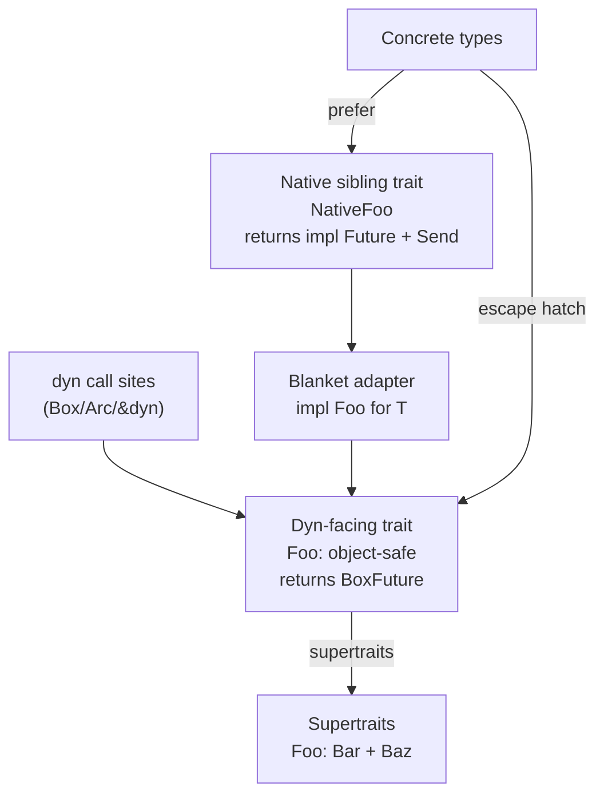
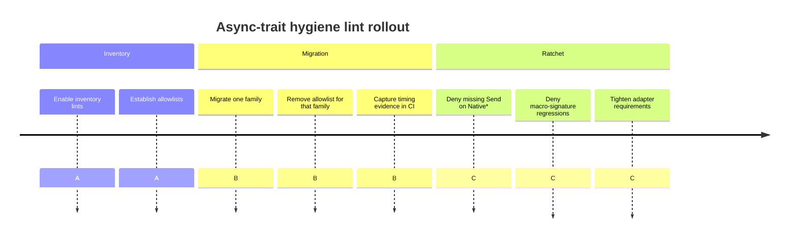

# Async-trait Architecture Hygiene Dylint Suite Design for Whitaker

## Executive summary

The goal of this design is to add an opinionated, architecture-hygiene lint
suite to the Whitaker Dylint workspace that makes “async + dyn dispatch”
interfaces explicit, consistent, and enforceable, while also preventing teams
from reaching for `async-trait` when they do not actually need dynamic
dispatch. The suite operationalizes the dual-trait pattern described in Axinite
ADR 006: keep an object-safe dyn-facing trait that returns boxed futures, add a
`Native*` sibling trait that returns `impl Future + Send`, and bridge them with
a blanket adapter. [^1]

The technical centrepiece is a shared crate-local analysis,
`AsyncTraitFamilyIndex`, built once per compilation session and reused by
multiple lints. It identifies dyn-backed “async interface families”, computes
the dyn-required closure (direct dyn uses plus supertrait closure), detects
`Native*` siblings, blanket adapters, and boxed-future aliases, and exposes
enough derived structure to make individual lints cheap and deterministic.

The suite is intentionally scoped to single-crate analysis (no cross-crate
inventories, no workspace-wide graphing), mirroring existing Whitaker design
choices and keeping performance predictable. [^2]

## Repository reconnaissance

### Whitaker locations inspected

The existing Whitaker workspace is structured around per-lint `cdylib` crates
under `crates/*`, a shared `common` helper crate, and an aggregated suite crate
that registers multiple lints in one Dylint library. [^2] The suite wiring uses
a combined late lint pass and a registry list of included lints. [^2]

For lint-crate ergonomics and build hygiene, Whitaker uses feature-gating
(`dylint-driver`) to keep `rustc_private` dependencies out of unit-test builds,
and enables `constituent` for suite aggregation. [^2] The root `whitaker` crate
already hosts `rustc_private`-bound helpers behind the same feature gate. [^2]

Code-level “HIR helper” precedent exists in `src/hir.rs` (module spans,
attribute conversion, test-attribute detection), which is an obvious
integration point for a new trait-family index. [^2]

### Axinite materials inspected

Axinite’s migration plan and ADR provide the design target and concrete failure
modes the lints should encode:

- ExecPlan: “Migrate from async-trait to native async traits” (inventory,
  dyn-blocking reality, and incremental batching). [^3]
- ADR 006: “Dual-trait pattern for dyn-backed async interfaces” (accepted
  shape, BoxFuture alias convention, blanket adapter, and migration gotchas).
  [^1]
- ExecPlan: “Roll out ADR 006…” (wave-based rollout discipline, explicit `Send`
  policy, and evidence collection expectations). [^3]

### External primary sources consulted

This design relies on primary/official sources for language constraints and
library mechanics:

- Rust Reference: trait objects require a dyn-compatible base trait; dyn traits
  include supertraits; `async fn` and return-position `impl Trait` make a trait
  not dyn-compatible. [^4]
- `async-trait` docs: the crate exists specifically to support async-in-traits
  with dyn traits by erasing the future to `Pin<Box<dyn Future + …>>`; it
  defaults to `Send` futures unless `#[async_trait(?Send)]` is used. [^5]
- Rust Blog announcement for `async fn`/RPITIT in traits: dynamic dispatch
  remains unsupported; `trait-variant` is positioned as a utility, with dyn
  support described as future work. [^6]
- rustc’s `async_fn_in_trait` lint rationale: public async trait methods do not
  promise auto-trait bounds like `Send` on the returned future, motivating
  explicit `+ Send` when that matters. [^7]
- Dylint docs: conditional compilation works for most lints via
  `cfg_attr(dylint_lib=...)`, but pre-expansion lints require
  `#[allow(unknown_lints)]` to avoid “unknown lint” warnings. [^8]

## Goals, scope, non-goals, and taxonomy

### Goals

The suite should:

1. Detect and classify dyn-backed async interface families (trait +
   implementations + call sites) in a single crate, including supertrait
   relationships that implicitly tie traits to dyn usage.
2. Enforce the ADR 006 dual-trait pattern **where dynamic dispatch is actually
   in play**: dyn-facing trait returning boxed futures, sibling `Native*` trait
   returning `impl Future + Send`, and blanket adapter bridging them. [^1]
3. Prevent unnecessary use of `async-trait`-style boxing when the trait is not
   dyn-required (directly or as a supertrait of a dyn trait), reflecting
   Axinite’s real-world discovery that “concrete-only” candidates were rarer
   than expected once dyn usage and supertrait inheritance were accounted for.
   [^3]
4. Encode the migration “sharp edges” observed during rollout—especially
   `Send`-bound parity and multi-borrow lifetime binding—into lintable
   structural rules. [^1][^3]

### Scope

These lints operate at the Rust compiler HIR/type-check level and are
crate-local, consistent with Whitaker’s existing approach to local analysis and
avoidance of whole-program graphing. [^2]

The suite targets **architecture hygiene**, not style: it reasons about trait
families, dispatch modes, and boundary representations; it is allowed to be
opinionated, but it must ship with strong false-positive controls and clear
“escape hatch” guidance.

### Non-goals

- Cross-crate / whole-workspace enforcement (for example, proving that *no
  downstream crate* uses a trait as `dyn`). This is not a tractable contract
  for a Dylint pass running per crate and is explicitly avoided by other
  Whitaker “architecture-ish” designs. [^2]
- Automated refactors. The suite should suggest shapes (and occasionally
  machine-applicable edits for local syntax), but it should not attempt
  whole-program rewrites.
- Measuring compile times inside lints. Axinite’s rollout plan treats timing
  evidence as a separate artefact captured by CI commands like
  `cargo check --timings`, not something enforced via static analysis. [^3]

### Categorization taxonomy for Whitaker lints

Whitaker already uses a “kind” vocabulary such as `style`, `restriction`,
`pedantic`, and `maintainability`. [^2] To avoid “random bugbear” accretion,
this suite should commit to a narrow taxonomy mapping:

- **restriction**: rules that prevent semantically risky or
  architecture-breaking patterns (eg. reintroducing `async-trait` boxing on a
  dyn-backed family that has an established native sibling).
- **maintainability**: rules that preserve consistency and readability of
  boundary signatures (eg. boxed-future alias uniformity).
- **compatibility** (documented sublabel, but mapped to
  restriction/maintainability in crate docs): rules whose purpose is preserving
  behaviour during or after migration (eg. requiring `+ Send` where
  `async-trait` previously implied it by default). [^5][^3]

## Lint catalogue

The suite is intended as a *cohesive set*: some lints are “inventory”/advisory
for early rollout; others become “ratchets” once a family is migrated.

### Proposed lint table

| Lint name                                           | Kind                      | Default | Trigger summary                                                                                                                      | HIR queries and patterns                                                                                                                                                            | False-positive controls                                                                                                                      | Suggested fix                                                                                          | Canonical UI tests                                                   |
| --------------------------------------------------- | ------------------------- | ------: | ------------------------------------------------------------------------------------------------------------------------------------ | ----------------------------------------------------------------------------------------------------------------------------------------------------------------------------------- | -------------------------------------------------------------------------------------------------------------------------------------------- | ------------------------------------------------------------------------------------------------------ | -------------------------------------------------------------------- |
| `async_trait_concrete_only`                         | maintainability           | warn    | Trait uses boxed-future async pattern but is **not dyn-required** in this crate                                                      | Build `dyn_required` set from `dyn Trait` uses plus supertrait closure; identify boxed-future async traits by return types matching boxed-future alias or `Pin<Box<dyn Future…>>`   | Ignore traits in allowlist; ignore macro-expanded items by default; optionally require “high confidence” `async-trait` signature markers     | Convert trait to native `fn -> impl Future + …` or `async fn` in impls; remove boxing                  | `ui/concrete_only_trait_warn.rs`, `ui/supertrait_blocked_no_warn.rs` |
| `async_dyn_family_requires_native_sibling`          | restriction               | warn    | Dyn-required boxed-future trait lacks `Native*` sibling                                                                              | Detect dyn-facing traits (dyn-required + boxed-future methods); sibling lookup by same parent module + name convention                                                              | Allowlist of traits or modules; ignore test-only modules; configurable naming prefix/suffix                                                  | Add `NativeX` trait with `fn -> impl Future + Send` and delegate defaults                              | `ui/dyn_trait_missing_native.rs`                                     |
| `async_dyn_family_requires_blanket_adapter`         | restriction               | warn    | Dyn-facing + native sibling exist but no blanket adapter bridging them                                                               | Scan `impl Trait for T` items; identify adapter as impl of dyn trait for a type param with a where-bound on `Native*`                                                               | Allow explicit “manual impl allowed” setting per family; ignore provided trait impls in macro expansions                                     | Add `impl<X: NativeX + …> X for X` pattern and delegate methods via `Box::pin(NativeX::m(self,…))`     | `ui/missing_blanket_impl.rs`                                         |
| `async_dyn_direct_impl_prefers_native`              | maintainability           | warn    | A concrete type implements dyn-facing trait directly even though a native sibling + blanket adapter exist                            | For each impl of dyn trait, if self-type is concrete (not a type param) and family has adapter, flag                                                                                | Allow in tests; allow via `#[allow]`; allowlist for tiny fakes                                                                               | Implement `Native*` instead; rely on blanket impl for dyn trait                                        | `ui/direct_dyn_impl_warn.rs`                                         |
| `async_dyn_boxed_future_alias_required`             | maintainability           | warn    | Dyn-facing trait method return types spell out `Pin<Box<dyn Future…>>` (or vary inconsistently) instead of using a family alias      | Inspect dyn-facing trait methods; classify return ty; require it be a path to an approved alias def_id                                                                              | Allow futures’ `BoxFuture` by config; ignore single-method traits by config                                                                  | Introduce/standardize `type XFuture<'a, T> = …` and use it                                             | `ui/raw_pin_box_return_warn.rs`                                      |
| `native_async_future_must_be_send`                  | compatibility restriction | deny    | Native sibling method returns `impl Future` without `+ Send` when policy requires Send parity                                        | Inspect `Native*` trait method return bounds; require explicit `+ Send` unless family marked `allow_nonsend`                                                                        | Config toggle per family (for `#[async_trait(?Send)]`-equivalent designs)                                                                    | Add `+ Send` to return type                                                                            | `ui/native_missing_send_deny.rs`, `ui/native_nonsend_allowed.rs`     |
| `native_async_multi_borrow_requires_named_lifetime` | maintainability           | warn    | Native sibling method uses `+ '_` but captures more than `&self` (multi-borrow), risking E0477-style failure and brittle signatures  | Detect `impl Future + … + '_` combined with ≥2 reference-bearing inputs; require an explicit named lifetime parameter applied consistently                                          | Only fire when a `'_` lifetime appears explicitly; allowlist specific methods                                                                | Introduce `'a` and apply to all borrows and return `+ 'a`                                              | `ui/native_multi_borrow_lifetime_warn.rs`                            |
| `async_trait_signature_markers_present`             | restriction               | warn    | “High confidence” `async-trait` macro expansion markers still present (eg. `< 'async_trait>` lifetime + boxed dyn future return)     | Inspect trait/impl method generics for `'async_trait` and return types for boxed dyn futures with `'async_trait` bound                                                              | Allow on legacy modules; ignore `async_trait` name collisions by requiring both markers                                                      | Migrate to native/dual-trait pattern; eliminate macro-generated signature                              | `ui/async_trait_markers_warn.rs`                                     |

The Axinite rollout explicitly called out two recurrent migration
hazards—losing implicit `Send` guarantees and multi-borrow lifetime binding—so
those are treated as first-class lint rules rather than “docs-only” advice.
[^1][^3]

### Implementation notes on lint granularity

The lints are deliberately fine-grained rather than one monolithic “ADR 006
compliance” lint. This enables migration waves that start with inventory-only
warnings and end with a small number of `deny` ratchets once a family is
migrated, matching Axinite’s incremental approach. [^3]

## Shared analysis design

### AsyncTraitFamilyIndex fields

The `AsyncTraitFamilyIndex` is a crate-local, derived-data index computed once
per compilation session (per crate being linted). It is analogous in spirit to
“metric builder” helpers elsewhere in Whitaker: do the expensive work once,
keep results deterministic, and let individual lints become simple queries over
the index. [^2]

| Field                  | Type                                          | Computation source                                                                                 | Used by                                        |
| ---------------------- | --------------------------------------------- | -------------------------------------------------------------------------------------------------- | ---------------------------------------------- |
| `traits`               | `BTreeMap<DefId, TraitInfo>`                  | HIR item traversal of local traits                                                                 | all lints                                      |
| `dyn_uses`             | `BTreeMap<DefId, Vec<Span>>`                  | Visitor over `hir::TyKind::TraitObject` occurrences                                                | `async_trait_concrete_only`, dyn-family rules  |
| `supertraits`          | `BTreeMap<DefId, Vec<DefId>>`                 | From each trait’s declared bounds                                                                  | dyn-closure computation                        |
| `dyn_required`         | `BTreeSet<DefId>`                             | `dyn_uses` plus transitive supertrait closure                                                      | “concrete-only” and dyn-family classifiers     |
| `boxed_future_aliases` | `BTreeMap<DefId, BoxedFutureAliasInfo>`       | Scan `type` aliases; match `Pin<Box<dyn Future…>>` shape                                           | alias lints, family classification             |
| `trait_method_shapes`  | `BTreeMap<(DefId, Symbol), AsyncMethodShape>` | For each trait method, inspect return type and bounds                                              | family method matching, Send/lifetime rules    |
| `impls`                | `Vec<ImplInfo>`                               | Scan `impl` items; record `trait_def_id`, `self_ty_kind`, where-bounds                             | adapter detection, impl counts                 |
| `adapter_impls`        | `BTreeMap<DefId, AdapterInfo>`                | Filter `impls` to “blanket impl implementing dyn trait for type param bounded by native trait”     | adapter-required lint, direct-impl lint        |
| `native_siblings`      | `BTreeMap<DefId, NativeSiblingInfo>`          | Name convention + same-parent module lookup                                                        | family completeness lints                      |
| `impl_counts`          | `BTreeMap<DefId, ImplCounts>`                 | Aggregate `impls` by trait                                                                         | severity heuristics and messaging              |
| `diagnostic_paths`     | small strings                                 | `tcx.def_path_str(def_id)` snapshots for messages                                                  | stable reporting                               |

Determinism note: choose `BTreeMap/BTreeSet` for stable iteration and stable
diagnostics ordering, consistent with other Whitaker architecture designs. [^2]

### Algorithms

#### Candidate trait discovery

A “candidate async interface trait” is a local trait that contains at least one
method whose return type is either:

- A known boxed-future alias (as discovered by `boxed_future_aliases`), or
- A syntactic shape matching `Pin<Box<dyn Future<Output=…> + … + 'a>>`.

This intentionally classifies both hand-written boxed-future dyn traits and
`async-trait` macro output, because for architecture hygiene they are the same
artefact: an object-safe async boundary expressed via erased futures. [^5]

#### Dyn-use closure and supertrait closure

Two language facts shape the closure computation:

- Trait objects require a dyn-compatible base trait, and trait objects
  implement the base trait **and its supertraits**. [^4]
- `async fn` and return-position `impl Trait` prevent dyn compatibility.
  [^4][^5]

Axinite’s migration audit found repeated cases where a trait had *no direct dyn
call sites* but still could not migrate because a dyn-backed trait inherited it
as a supertrait. [^3]

`dyn_required` is computed as:

```text
dyn_required = dyn_used ∪ supertraits_transitive(dyn_used)
```

HIR-oriented pseudocode:

```rust
// Step 1: direct dyn uses
visit all hir::Ty:
  if TyKind::TraitObject(bounds, ..):
    for trait_bound in bounds:
      dyn_used[trait_def_id(trait_bound)].push(ty.span)

// Step 2: supertrait edges for local traits
for each local trait ItemKind::Trait(.., bounds, ..):
  supertraits[trait_def_id] = bounds.filter_map(bound_trait_def_id)

// Step 3: closure
dyn_required = dyn_used.keys()
worklist = dyn_used.keys()
while let Some(t) = worklist.pop():
  for s in supertraits[t]:
    if dyn_required.insert(s): worklist.push(s)
```

#### Native sibling detection

ADR 006 formalizes the naming rule: keep `Tool`/`Database`/… as the dyn-facing
trait name, and use `NativeTool`/`NativeDatabase` as the sibling. [^1]

Sibling traits are detected by finding, for a given dyn-facing trait `T`:

- expected native name = `format!("{prefix}{T}")` (default prefix `Native`)
- sibling must live in the same parent module (same `tcx.parent(def_id)`),
  unless `allow_cross_module_siblings = true` in config.

This “same parent” rule keeps the match unambiguous in large codebases with
repeated trait names.

#### Blanket adapter detection

The ADR defines the adapter as a blanket impl bridging `Native*` into the dyn
trait. [^1]

An impl is treated as the family’s canonical adapter when all hold:

- it implements the **dyn-facing** trait,
- the self type is a type parameter (e.g. `T`) rather than a concrete type, and
- the where-clause includes `T: NativeTrait` (plus any required auto
  traits/bounds).

Method-body inspection (e.g. checking for `Box::pin(NativeTrait::method(..))`)
is optional and should be a second-stage “confidence upgrade”, not a required
condition, because HIR body matching across rustc versions is brittle.

#### Boxed-future alias detection

ADR 006 recommends a single boxed-future alias to keep signatures readable (and
to avoid repeating long `Pin<Box<dyn Future…>>` types). [^1]

Aliases are detected by scanning `type` items and matching the syntactic shape:

- outer: `Pin< … >` in `core::pin` or `std::pin`
- inner: `Box< … >` in `alloc::boxed` or `std::boxed`
- boxed element: `dyn Future<Output = X> + … + 'a` (with optional `Send`)

This detection is deliberately syntactic/structural rather than string-based.

### Family graph diagram

This diagram shows how dyn-facing and native sibling traits connect through the
blanket adapter and concrete implementation choices.



Caption: Family graph showing dyn-facing traits, native siblings, and the
blanket adapter.

## Integration plan and rollout strategy

### Shared helper placement in Whitaker

Whitaker distinguishes between:

- a compiler-independent `common` crate, and
- `rustc_private`-bound helpers in the root `whitaker` crate behind the
  `dylint-driver` feature. [^2]

`AsyncTraitFamilyIndex` should live in the `whitaker` crate (not `common`)
under `#[cfg(feature = "dylint-driver")]`, alongside existing HIR helpers. [^2]
This keeps the index available to lint crates without forcing compiler
dependencies into `common`, consistent with other Whitaker designs that keep
pure logic separate from extraction. [^2]

Proposed module layout:

- `whitaker/src/async_trait_hygiene/mod.rs`
- `whitaker/src/async_trait_hygiene/index.rs`
- `whitaker/src/async_trait_hygiene/shape.rs` (type-shape classifiers)
- `whitaker/src/async_trait_hygiene/config.rs` (shared config structs and
  parsing helpers)

### New lint crates

Whitaker’s documented convention is one lint per `cdylib` crate with
feature-gated rustc dependencies. [^2]

Add eight crates under `crates/` corresponding to the lint table. Each depends
on:

- `whitaker` with `features = ["dylint-driver"]` (to access
  `AsyncTraitFamilyIndex`)
- `common` (diagnostic helpers, i18n, etc)

### Suite plumbing

There are two viable integration modes:

- **Specialized suite (recommended)**: create an `async-trait`-focused
  aggregated suite crate, e.g. `async_trait_suite/`, to keep the default
  `whitaker_suite` from expanding into a highly domain-specific policy set.
- **Feature-gated inclusion in `whitaker_suite`**: include these lints behind a
  Cargo feature on the suite crate so teams opt in explicitly.

Either way, the suite wiring pattern is clear: add lint declarations to the
suite list and register pass types in the combined pass. [^2]

### Configuration model

A practical config model for migration waves:

- a shared table `[async_trait_hygiene]` for suite-wide defaults:
  - naming convention (`native_prefix`, default `Native`)
  - Send policy (`require_send = true`)
  - alias policy (`allowed_box_future_aliases`, `prefer_local_alias = true`)
  - allowlists (`allow_traits`, `allow_modules`, `allow_paths`)
- per-lint tables to override:
  - `[async_dyn_family_requires_native_sibling]` etc.

This mirrors Whitaker’s existing “load with defaults, allow small overrides”
philosophy. [^2]

Directory/crate overrides should be implemented via explicit allowlists and
path-prefix matching against `SourceMap` filenames, not by attempting to infer
Cargo workspace structure from inside rustc.

### Migration waves and default levels

Align the rollout with Axinite’s “prove in waves” discipline (inventory →
migrate family-by-family → ratchet). [^3]

Suggested wave policy:

- **Wave A: inventory-only**
  - enable: `async_trait_concrete_only`,
    `async_trait_signature_markers_present` as `warn`
  - keep all pattern-enforcement lints as `allow` (or set to `warn` but
    allowlist all known families)
- **Wave B: enforce for migrated families**
  - for migrated families, remove allowlist entries and enforce:
    - `native_async_future_must_be_send` as `deny`
    - `async_dyn_family_requires_blanket_adapter` as `warn` → `deny` once stable
- **Wave C: regression prevention**
  - deny “reintroduced macro-shape” (`async_trait_signature_markers_present`)
    in production modules
  - warn on direct dyn impls where native+adapter exist

#### Rollout timeline diagram

This diagram summarizes the staged rollout from inventory to migration and then
to the regression-prevention ratchet.



Caption: Rollout timeline showing the inventory, migration, and ratchet waves.

## Performance, CI boundaries, and open decisions

### Performance and compile-time cost considerations

The motivation for eliminating `async-trait` in dyn-heavy codebases is not
“micro-optimizing futures”; it is reducing proc-macro expansion and boilerplate
generation. Axinite measured 158 `async-trait` uses across 74 files early in
the migration and described each use as generating boxing/dynamic dispatch
boilerplate at compile time. [^3] The `async-trait` crate documentation
confirms the core mechanical transformation into boxed futures and the default
`Send` behaviour, which are exactly the costs and semantics teams must make
explicit when migrating. [^5]

For the lint suite itself, the expensive step is building
`AsyncTraitFamilyIndex`. The design keeps that cost bounded:

- single HIR traversal for dyn uses and trait/impl discovery
- closure computation over trait graph edges
- purely structural matching for boxed-future aliases and adapter impls
- deterministic collections to avoid reordering noise (useful for UI snapshot
  stability)

This is consistent with Whitaker’s documented preference for local, linear
analyses rather than global program graphs. [^2]

### CI and xtask responsibilities versus lints

Two responsibilities should explicitly remain outside lints:

- **Timing evidence**: Axinite’s rollout treats `cargo check --timings` and
  similar measurements as required artefacts captured per wave. That belongs in
  CI scripts/xtasks, not static analysis, because it is inherently
  environment-dependent. [^3]
- **Workspace-level inventory**: lints cannot reliably answer “is this trait
  ever used as dyn anywhere in the workspace?”; they can answer “in this crate,
  it is dyn-required due to direct dyn use or supertrait closure.” That
  limitation is structurally unavoidable for per-crate linting and should be
  documented prominently.

### Pending architectural decisions and trade-offs

**Alias locality versus shared alias module.** ADR 006 defaults to a shared
boxed-future alias (“one helper module”) to reduce signature verbosity.
[^1][^3] Whitaker lints should support both “one canonical alias” and
“family-local alias” modes, because some codebases prefer keeping interface
types private to the module. The trade-off is between global consistency
(better for large migrations) and local encapsulation.

**Native trait surface form.** Using `fn -> impl Future + Send` in `Native*`
traits avoids both dyn-compatibility issues and the rustc `async_fn_in_trait`
warning about unspecified auto-trait bounds on futures. [^7][^6] This suite
should treat `async fn` *in native sibling traits* as a lintable smell (at
least for exported traits), even if it sometimes compiles fine, because it
undermines the main point of the native sibling: making `Send`/lifetime bounds
explicit.

**Detecting `#[async_trait]` usage.** A pre-expansion lint would be the most
direct way to catch the attribute, but Dylint’s own documentation notes that
pre-expansion lints have special “unknown lint” suppression requirements. [^8]
The proposed `async_trait_signature_markers_present` lint avoids that
complexity by detecting high-confidence expansion markers in HIR instead. The
trade-off is that it is a heuristic (though a strong one).

**How hard to enforce “generic bounds prefer Native*”.** This can quickly
become a high false-positive rule because a generic bound may exist for future
dyn adaptation or because the same function might return a trait object later.
The design therefore keeps this as an optional “advisory” lint (not in the
initial core) unless a downstream team explicitly wants to ratchet on it.

**Cross-crate truth versus crate-local truth.** Because trait objects include
supertraits, crate-local closure computation is necessary and useful. [^4] But
it still cannot capture downstream dyn usage. The suite should expose this
limitation directly in help text for `async_trait_concrete_only`, and strongly
encourage teams to pair it with a separate, workspace-level audit step when
planning migrations, matching Axinite’s discipline of explicit inventories and
approvals. [^1][^3]

## References

[^1]: Axinite ADR 006, `Dual-trait pattern for dyn-backed async interfaces`.
      <https://raw.githubusercontent.com/leynos/axinite/refs/heads/main/docs/adr-006-dual-trait-pattern-for-dyn-backed-async-interfaces.md>
[^2]: Whitaker design and implementation references: brain-trust lints design,
      Dylint suite design, suite driver wiring, suite lint registry,
      `dylint-driver` feature configuration, root `lib.rs`, and `src/hir.rs`.
      <https://github.com/leynos/whitaker/blob/a39e9a21431133855a0da7fb4d521d425f9477b6/docs/brain-trust-lints-design.md>
      <https://github.com/leynos/whitaker/blob/a39e9a21431133855a0da7fb4d521d425f9477b6/docs/whitaker-dylint-suite-design.md>
      <https://github.com/leynos/whitaker/blob/a39e9a21431133855a0da7fb4d521d425f9477b6/suite/src/driver.rs>
      <https://github.com/leynos/whitaker/blob/a39e9a21431133855a0da7fb4d521d425f9477b6/suite/src/lints.rs>
      <https://github.com/leynos/whitaker/blob/a39e9a21431133855a0da7fb4d521d425f9477b6/crates/no_std_fs_operations/Cargo.toml>
      <https://github.com/leynos/whitaker/blob/a39e9a21431133855a0da7fb4d521d425f9477b6/src/lib.rs>
      <https://github.com/leynos/whitaker/blob/a39e9a21431133855a0da7fb4d521d425f9477b6/src/hir.rs>
[^3]: Axinite migration planning artefacts: `migrate-async-trait.md` and
      `adr-006-broad-rollout.md`.
      <https://raw.githubusercontent.com/leynos/axinite/refs/heads/main/docs/execplans/migrate-async-trait.md>
      <https://raw.githubusercontent.com/leynos/axinite/refs/heads/main/docs/execplans/adr-006-broad-rollout.md>
[^4]: Rust Reference material on trait objects and dyn-compatibility.
      <https://doc.rust-lang.org/stable/reference/types/trait-object.html?highlight=dyn>
      <https://doc.rust-lang.org/stable/reference/items/traits.html?highlight=extension+trait>
[^5]: `async-trait` crate documentation.
      <https://docs.rs/async-trait/latest/async_trait/>
[^6]: Rust Blog announcement for `async fn` and RPITIT in traits.
      <https://blog.rust-lang.org/2023/12/21/async-fn-rpit-in-traits/>
[^7]: rustc documentation for the `async_fn_in_trait` lint.
      <https://doc.rust-lang.org/nightly/nightly-rustc/rustc_lint/async_fn_in_trait/static.ASYNC_FN_IN_TRAIT.html>
[^8]: Dylint documentation, including conditional compilation and
      pre-expansion-lint guidance.
      <https://trailofbits.github.io/dylint/>
