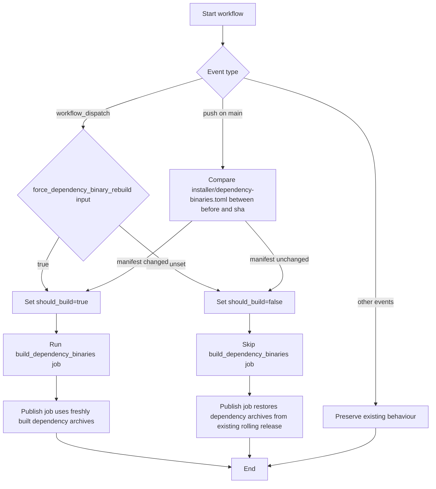

# Whitaker Developer's Guide

This guide is for contributors who want to develop new lints or work on
Whitaker itself. For using Whitaker lints in a project, see the
[User's Guide](users-guide.md).

## Prerequisites

- Rust nightly toolchain (version specified in `rust-toolchain.toml`)
- `cargo-dylint` and `dylint-link` installed:

  ```sh
  cargo install cargo-dylint dylint-link
  ```

## Running Tests

Run the test suite from the workspace root:

```sh
make test
```

This executes unit, behaviour, and UI harness tests. The shared target enables
`rstest` fixtures and `rstest-bdd` scenarios.

### Integration tests for lint exclusion behaviour

The `no_std_fs_operations` crate includes end-to-end behavioural coverage for
the `excluded_crates` configuration. These integration tests invoke
`cargo dylint` in a subprocess, so they exercise the full lint-loading and
configuration path, rather than only unit-level helpers.

The fixtures live under `crates/no_std_fs_operations/tests/fixtures/` as two
small crates: `excluded_project`, which configures the exclusion, and
`non_excluded_project`, which leaves the lint unexcluded. Each fixture
`Cargo.toml` includes an empty `[workspace]` table so Cargo treats the fixture
as its own workspace root. This prevents Cargo from resolving upwards to the
enclosing Whitaker workspace and inheriting unrelated configuration.

The harness centres on `run_cargo_dylint`, which executes
`cargo dylint --all -- --message-format json` with `DYLINT_LIBRARY_PATH` set to
the built lint library and `DYLINT_RUSTFLAGS=-D warnings` set to deny warnings
during the run. `diagnostic_count` then parses the JSON message stream with
`cargo_metadata::Message` and counts only `CompilerMessage` entries whose
`code.code` is `no_std_fs_operations`, which keeps the assertions tied to the
lint's structured diagnostics instead of brittle text matching.

The tests are annotated with `#[serial]` from `serial_test`, and the
repository-level nextest contract also requires them to match the
`serial-dylint-ui` test group in `.config/nextest.toml` when they are exercised
through `make test`. Both the attribute and the repo-level group are required
for correct serialized execution because nextest runs each test in a separate
process, so the in-process `#[serial]` mutex alone is not sufficient. They are
also marked `#[ignore]` by default because they depend on external tooling and
a buildable workspace. Before running them, install `cargo-dylint` and
`dylint-link`. The harness calls `build_lint_library()` before running
`cargo dylint`, so the workspace build is handled automatically. Run them with
one of the following commands:

```sh
cargo test -p no_std_fs_operations --test integration_exclusion -- --ignored
cargo nextest run -p no_std_fs_operations --test integration_exclusion --run-ignored ignored-only
```

The parameterized `#[rstest]` case
`exclusion_behaviour_matches_fixture_configuration` covers both fixtures. For
each case, it asserts the subprocess exit status and the `no_std_fs_operations`
diagnostic count, so the test verifies both the success path for excluded
crates and the failure path for non-excluded crates.

### Test profiles

By default, `make test` excludes slow installer integration tests
(`behaviour_toolchain` and `behaviour_cli`) via a nextest default-filter
defined in `.config/nextest.toml`. These tests perform real `rustup` installs
and `cargo` builds, so they can take upwards of fifteen minutes. Note that the
exclusion relies on hardcoded binary names in `.config/nextest.toml`; renaming
or splitting these test binaries requires updating the filter to match (see
[#180][issue-180]).

To run the full suite including installer tests, pass the `ci` profile:

```sh
make test NEXTEST_PROFILE=ci
```

Continuous Integration (CI) always uses the `ci` profile, so installer tests
are never silently skipped in the pipeline.

Table: Test profiles and typical usage.

| Profile   | What runs                                  | Typical use        |
| --------- | ------------------------------------------ | ------------------ |
| (default) | All tests **except** installer integration | Local development  |
| `ci`      | All tests                                  | CI and pre-release |

When working on `whitaker-installer` code, run the full suite locally before
pushing to catch installer regressions early.

### Other useful commands

```sh
make lint       # Run Clippy
make check-fmt  # Verify formatting
make fmt        # Apply formatting
```

## Proof workflows

Whitaker now ships repository-managed proof tooling for the formal verification
work introduced around decomposition advice and the clone-detector pipeline.
Run these commands from the workspace root.

### Make targets

Use the Makefile targets for normal proof runs:

```sh
make verus                 # Run all Verus proof files
make verus-clone-detector  # Run clone-detector Verus proofs only
make kani                  # Run all Kani harness groups
make kani-clone-detector   # Run clone-detector Kani harnesses only
```

`make verus` currently runs both decomposition-advice proofs and the
clone-detector `LshConfig::new` proof. `make kani` runs the decomposition
adjacency harnesses and the clone-detector harness group in one pass.

### Tooling scripts

The proof targets are thin wrappers over repository scripts:

- `scripts/install-verus.sh` downloads the pinned Verus release into
  `${XDG_CACHE_HOME:-$HOME/.cache}/whitaker/verus`, makes the binaries
  executable, and installs the Rust toolchain that Verus requests.
- `scripts/run-verus.sh` selects proof groups and executes each `.rs` proof
  file in turn.
- `scripts/install-kani.sh` downloads the pinned pre-built Kani release into
  `${XDG_CACHE_HOME:-$HOME/.cache}/whitaker/kani`, installs the matching
  nightly Rust toolchain via `rustup`, and symlinks that toolchain into the
  Kani directory structure.
- `scripts/run-kani.sh` sets the Kani-specific environment, runs the
  decomposition/common harnesses through the existing workflow, and runs the
  clone-detector harnesses one harness per `cargo-kani` invocation so each
  proof appears explicitly in the output.

The installer scripts are idempotent. The first proof run may take longer while
toolchains and verifier binaries are downloaded; later runs reuse the cached
install.

The installer scripts are idempotent. The first proof run may take longer while
toolchains and verifier binaries are downloaded; later runs reuse the cached
installation.

### Examples

Run the narrow clone-detector proof workflow during iteration:

```sh
make verus-clone-detector
make kani-clone-detector
```

Run a Verus group directly through the wrapper:

```sh
./scripts/run-verus.sh clone-detector
./scripts/run-verus.sh all --time
```

Run a specific decomposition Kani harness or the clone-detector group
directly:

```sh
./scripts/run-kani.sh verify_build_adjacency_preserves_edges
./scripts/run-kani.sh clone-detector
```

## Kani bounded model checking

Whitaker uses the [Kani model checker](https://model-checking.github.io/kani/)
to verify critical algorithms with bounded symbolic verification. Kani proofs
complement traditional testing by exhaustively checking properties over all
possible inputs within configured bounds.

### Writing Kani harnesses

Kani harnesses live colocated with the code they verify, typically in a
`#[cfg(kani)]` verification submodule. For example:

```rust
#[cfg(kani)]
mod verification {
    use super::*;

    #[kani::proof]
    fn verify_property() {
        // Generate symbolic inputs
        let input: u32 = kani::any();

        // Add preconditions
        kani::assume(input > 0);
        kani::assume(input < 100);

        // Call function under test
        let result = function_to_verify(input);

        // Assert postconditions
        assert!(result.is_valid());
    }
}
```

Key principles:

- **Bounded symbolic inputs**: Use fixed-size arrays or bounded ranges to keep
  the state space tractable. Rust's standard `sort_by` and nested loops can
  cause CBMC (C Bounded Model Checker) state-space explosion at higher bounds.
- **Input contracts**: Use `kani::assume` to constrain symbolic inputs to match
  the preconditions that production code guarantees. Model the actual input
  contract, not arbitrary malformed inputs.
- **One property per harness**: Separate harnesses simplify root-cause analysis
  when a property fails. Focused harnesses are clearer than one combined check.
- **Crate visibility**: Kani harnesses can call `pub(crate)` functions directly,
  avoiding the need to widen the public API for verification purposes.

### `cfg(kani)` configuration and crate visibility

Kani harnesses are gated behind `#[cfg(kani)]`, which is only defined when Kani
compiles the crate. Under the Rust 2024 edition, any `cfg` name not registered
with the compiler triggers an `unexpected_cfgs` lint warning. To suppress this,
register `cfg(kani)` in the crate's `Cargo.toml`:

```toml
[lints.rust]
unexpected_cfgs = { level = "warn", check-cfg = ['cfg(kani)'] }
```

This tells `rustc` that `kani` is an expected configuration name, so normal
`cargo check` and `cargo clippy` runs do not emit spurious warnings. The entry
lives in `common/Cargo.toml` for the decomposition harnesses and in
`crates/whitaker_clones_core/Cargo.toml` for the clone-detector harnesses.

Kani harnesses verify private helpers that are not part of the public API.
Rather than making these helpers fully public, the following items are promoted
to `pub(crate)` visibility:

- **`community` module** (`common/src/decomposition_advice/mod.rs`): Promoted
  from `mod community` to `pub(crate) mod community` so that
  `test_support::decomposition` helpers and unit tests can import
  `SimilarityEdge` and `build_adjacency`.
- **`build_adjacency` function**
  (`common/src/decomposition_advice/community.rs`): Promoted from `fn` to
  `pub(crate) fn` so that colocated Kani harnesses and the test-support
  adjacency report can call it directly without widening the crate's public API
  surface.
- **`SimilarityEdge::new(left, right, weight)`**
  (`common/src/decomposition_advice/community.rs`): A `pub(crate)` constructor
  added to allow Kani harnesses and test-support modules to create edge values
  without exposing a public constructor on the production type. It is used
  internally by `adjacency_report` to convert validated `EdgeInput` values into
  `SimilarityEdge` instances before delegating to `build_adjacency`. External
  callers should use `adjacency_report` rather than constructing
  `SimilarityEdge` directly.

This pattern keeps the runtime API narrow while giving verification and test
code the access it needs.

### Test-support APIs for adjacency testing

The `common::test_support::decomposition` module provides declarative helpers
for integration and behaviour-driven tests:

- **`adjacency_report(node_count, edges)`**: Validates edge input (canonical
  order, in-bounds, positive weights), builds adjacency lists via
  `build_adjacency`, and returns `Result<AdjacencyReport, AdjacencyError>`.
  Callers can `match` on the result, `.expect(...)` in tests, or propagate the
  error upward when invalid declarative input should fail the caller.
- **`AdjacencyError`**: Typed validation failure for the `Err` branch. The
  shipped variants are `NonCanonicalEdge { index, left, right }` when
  `left >= right`, `EndpointOutOfRange { index, right, node_count }` when an
  endpoint exceeds the graph size, and `ZeroWeight { index }` when a weight is
  non-positive for the production contract. Callers should inspect these
  variants when they need to assert a specific rejection path.
- **`AdjacencyReport`**: Wrapper around adjacency vectors on the `Ok` branch,
  with methods for testing properties:
  - `is_symmetric()`: Checks that all edges appear in both directions
  - `all_indices_in_bounds()`: Verifies neighbour indices are valid
  - `is_sorted()`: Confirms neighbours are sorted by index
  - `neighbours_of(node)`: Returns neighbours of a node (or `None` if
    out-of-bounds)
- **`EdgeInput`**: Declarative edge struct with `left`, `right`, `weight`
  fields, passed to `adjacency_report` and interpreted on the `Ok` branch as
  canonical-order, in-range, positive-weight edge input for behaviour-driven
  development (BDD) scenarios.

The test-support API validates input and delegates to the shipped
`build_adjacency` function, keeping raw adjacency vectors crate-internal while
providing a clean testing interface.

See
[`docs/execplans/6-4-5-use-kani-to-verify-build-adjacency-preserves-similarity-edges.md`](./execplans/6-4-5-use-kani-to-verify-build-adjacency-preserves-similarity-edges.md)
for the complete design rationale and implementation decisions.

## Installer release helper binaries

The `whitaker-installer` crate exposes several internal release-helper binaries
used by GitHub workflows and packaging scripts. These are part of the build
contract even though they are not user-facing CLI entry points.

### Why `autobins = false` is required

`installer/Cargo.toml` sets `autobins = false` and declares every binary target
explicitly. This is required because the release workflows invoke specific bin
names that do not always match Cargo's filename-derived defaults.

Current explicit targets:

- `whitaker-installer` from `src/main.rs`
- `whitaker-package-lints` from `src/bin/package_lints.rs`
- `whitaker-package-installer` from `src/bin/package_installer_bin.rs`
- `whitaker-package-dependency-binary` from
  `src/bin/package_dependency_binary.rs`

Without explicit declarations, Cargo would infer fallback names such as
`package_lints` and `package_installer_bin`. Those names do not match the
workflow invocations, so release and rolling-release builds would fail even
though the source files exist.

### Validation coverage and purpose

Workflow validation in `tests/workflows/` protects this contract from drift:

- `test_installer_packaging_bins_match_release_workflow_contract` asserts that
  the workflow-facing binary names exist in workspace metadata.
- The same test also asserts that filename-derived fallback target names are
  absent, proving the crate still relies on explicit target declarations rather
  than accidental Cargo defaults.
- `workflow_test_helpers.py` centralizes the `cargo metadata --no-deps` lookup
  used by these contract tests so packaging changes fail with one clear error
  path.

When modifying release helpers, keep the workflow YAML, `installer/Cargo.toml`,
and the metadata-based tests in lock-step.

### Workflow test support and local runner configuration

The rolling-release contract tests share YAML and shell-parsing helpers in
`tests/workflows/rolling_release_workflow_test_support.py`. Keep parsing and
failure messages centralized there when adding more rolling-release assertions,
instead of duplicating small YAML walkers or shell-branch extractors across
multiple test modules. In particular, `_workflow_dispatch_branch_body()`
returns only the matched branch body and excludes the closing `fi`, so
follow-on assertions can stay focused on the branch contents rather than shell
framing.

#### GitHub-expression helpers

Four helpers in `rolling_release_workflow_test_support.py` analyse `if` guard
expressions on workflow steps:

| Helper                                         | Signature                                    | Purpose                                                                                                                                                               |
| ---------------------------------------------- | -------------------------------------------- | --------------------------------------------------------------------------------------------------------------------------------------------------------------------- |
| `_github_operand_pattern`                      | `(operand: str) -> re.Pattern[str]`          | Builds a regex that matches the operand as a standalone token, preventing partial-name false positives (e.g. a prefix or suffix sharing characters with the operand). |
| `_github_expression_mentions_operand`          | `(expression: object, operand: str) -> bool` | Returns `True` when the normalised expression contains the operand as a whole token.                                                                                  |
| `_github_expression_negates_operand`           | `(expression: object, operand: str) -> bool` | Returns `True` when the expression contains `!operand` or `!(operand)`. Double negation (`!!operand`) is not flagged.                                                 |
| `_github_expression_compares_operand_to_false` | `(expression: object, operand: str) -> bool` | Returns `True` when the expression contains `operand == false` (or `false == operand`) in any quoting style. Strict-equality only; `!=` comparisons are not matched.  |

Use these helpers together in step-guard assertions to verify gating semantics
rather than exact expression strings, making tests resilient to harmless
formatting changes in the workflow YAML.

Local workflow tests use the Makefile variables `UV` and `WORKFLOW_TEST_VENV`:

- `UV` selects the `uv` executable used to create and populate the
  workflow-test virtual environment.
- `WORKFLOW_TEST_VENV` selects the virtual-environment path, defaulting to
  `.venv`.

Use `make workflow-test-deps` to create or refresh that environment, and
`make workflow-test` to run the opt-in `act` plus `pytest` workflow smoke
tests against it.

### Worked example: adding another packaging binary

When adding a new internal helper binary, make all of the following changes in
one patch:

1. Add the Rust entry point under `installer/src/bin/`.
2. Add a matching `[[bin]]` stanza in `installer/Cargo.toml`.
3. Keep `autobins = false` so Cargo does not expose unexpected fallback names.
4. Update any workflow or script that invokes the helper to use the explicit
   bin name.
5. Extend the workflow contract test so the new target is asserted alongside
   the existing helpers.

Example `Cargo.toml` entry:

```toml
[[bin]]
name = "whitaker-package-example"
path = "src/bin/package_example.rs"
```

If the workflow should invoke that helper, add an assertion to
`test_installer_packaging_bins_match_release_workflow_contract` before relying
on it in release automation. That keeps the breakage in unit-style Python
tests instead of the rolling-release pipeline.

## Dependency binary packaging

Whitaker publishes repository-hosted copies of `cargo-dylint` and `dylint-link`
for the installer's supported targets. The installer prefers these repository
assets before falling back to `cargo binstall` and then `cargo install`.

### TOML (Tom's Obvious, Minimal Language) manifest schema

The committed manifest at `installer/dependency-binaries.toml` declares each
required dependency binary as a TOML array-of-tables entry. Every entry must
contain the following fields:

Table: Manifest schema for crate entries

| Field        | Type   | Description                                                                        |
| ------------ | ------ | ---------------------------------------------------------------------------------- |
| `package`    | string | Cargo package name (must be unique across entries)                                 |
| `binary`     | string | Executable basename without platform suffix                                        |
| `version`    | string | Required upstream version                                                          |
| `license`    | string | SPDX (Software Package Data Exchange) licence expression for provenance disclosure |
| `repository` | string | Upstream source repository URL                                                     |

Example entry:

```toml
[[dependency_binaries]]
package = "cargo-dylint"
binary = "cargo-dylint"
version = "4.1.0"
license = "MIT OR Apache-2.0"
repository = "https://github.com/trailofbits/dylint"
```

The Rust domain model (`DependencyBinary`) enforces all fields as mandatory
during deserialization. The manifest parser also rejects duplicate `package`
values to prevent ambiguous resolution.

### Manifest and public APIs

The committed manifest lives at `installer/dependency-binaries.toml`. It is
loaded through `whitaker_installer::dependency_binaries`, which exposes:

- `DependencyBinary` for typed manifest entries
- `required_dependency_binaries()` for the full manifest set
- `find_dependency_binary()` for package lookup
- archive and binary naming helpers shared by packaging and installation
- repository-install traits for archive download and extraction

The packaging surface lives in `whitaker_installer::dependency_packaging`:

- `DependencyPackageParams` for one packaging request
- `package_dependency_binary()` for one deterministic `.tgz` or `.zip`
  archive
- `render_provenance_markdown()` and `write_provenance_markdown()` for the
  shared provenance and licence sidecar

### Control flow

The dependency-install path is split into focused modules under
`installer/src/dependency_binaries/install/`:

- `metadata.rs` computes target-specific archive names, binary names, and the
  exact archive member path
- `downloader.rs` resolves rolling-release asset URLs and downloads archives
- `extractor.rs` extracts the exact packaged member into a temporary file and
  atomically renames it into the local bin directory
- `installer.rs` orchestrates directory discovery, download, extraction, and
  executable permission fixes

`installer/src/deps.rs` drives the high-level fallback order:

1. Attempt the repository-hosted dependency archive for the current target.
2. Verify the installed tool is now usable. `cargo-dylint` is checked by
   running `cargo dylint --version`, while `dylint-link` is checked by
   resolving the executable on `PATH` and invoking it with `--help`. The probe
   synthesizes `RUSTUP_TOOLCHAIN` from the host target when the environment
   variable is unset, because upstream reads that variable before processing
   CLI flags.
3. If the repository download reports `NotFound`, skip `cargo binstall` and
   fall back directly to `cargo install`.
4. For other repository failures, fall back to `cargo binstall` when available
   and then to `cargo install` if `cargo binstall` is absent or fails.

### Dependency fallback details

`installer/src/deps/install.rs` uses the `InstallOutcome` enum to describe how
each dependency tool was satisfied. `install_tool()` returns
`RepositoryRelease`, `CargoBinstall`, or `CargoInstall`, and
`update_status_after_install()` uses that outcome to decide whether it should
probe for `dylint-link` after installing `cargo-dylint`.

The HTTP download layers in
`installer/src/dependency_binaries/install/downloader.rs` and
`installer/src/artefact/download.rs` both map
`ureq::Error::StatusCode(404 | 410)` to a semantic `NotFound` error variant.
All other `ureq` failures become `Download` or `HttpError`. Callers inspect
`error.is_not_found()` to distinguish the missing-asset source-build path from
the generic Cargo fallback path.

`install_missing_tools()` iterates across `DEPENDENCY_TOOLS`, calls
`should_install_tool()` to skip any tool already present in `remaining_status`,
then calls `install_tool()` and feeds the returned `InstallOutcome` into
`update_status_after_install()`. This keeps `remaining_status` accurate for
later iterations so a successful `cargo-dylint` install can suppress a
redundant `dylint-link` install.

After resolving the dependency metadata entry, `install_tool()` copies
`dependency.version()` into `CargoInstallPlan` before attempting the
repository-release install. That means every subsequent `run_cargo_install()`
fallback, including the direct missing-asset path, invokes
`cargo install --locked --version <version>`. This preserves the version
recorded in `installer/dependency-binaries.toml` instead of silently using the
latest upstream release.

`update_status_after_install()` delegates the local-install probe decision to
`should_refresh_companions()`. That helper returns `true` only when the install
outcome was not `RepositoryRelease` and `dylint-link` is still missing, so the
code checks for a resolvable `dylint-link` binary only after local
`cargo-dylint` installs and does not re-check it when the pre-built repository
artefact was used or when `dylint-link` was already present.

The `dylint-link` verification in `installer/src/deps.rs` is implemented by
seven small private helpers:

- `find_binary_on_path(binary_name)` returns the first executable candidate so
  the installation check can validate the exact path it found.
- `find_binary_in_directory(directory, binary_name)` performs the per-directory
  search that `find_binary_on_path()` uses while walking `PATH`.
- `binary_candidates(directory, binary_name)` builds the ordered set of
  candidate paths that each directory contributes to the lookup.
- `dylint_link_probe_toolchain()` preserves an existing `RUSTUP_TOOLCHAIN`
  value or synthesizes `stable-<host-target>` so `dylint-link --help` can run
  in the same environments where `dylint-link --version` exits early.
- `dylint_link_probe_succeeds(path)` runs the resolved binary with `--help` and
  requires a successful exit status before Whitaker treats the tool as
  installed.
- `is_executable_file(path)` applies the platform-specific file test:
  executable-bit plus regular-file checks on Unix, and `path.is_file()` on
  non-Unix targets where the executable suffix carries the meaning.
- `windows_path_extensions()` normalizes `PATHEXT` on Windows so
  `binary_candidates()` can expand extensionless names the same way the shell
  does.

These key helpers are covered by direct unit tests in
`installer/src/deps/path_tests.rs` for missing PATH values, empty PATH values,
multiple PATH directories, non-executable Unix files, executable Unix files,
broken PATH shims, and Windows `PATHEXT` resolution via both direct helper
tests and `check_dylint_tools()`.

Installer PATH-fixture helpers now live in
`installer/src/test_utils/dependency_binary_helpers.rs` instead of being
duplicated across multiple test modules. The key helpers are:

- `with_fake_binary_on_path(binary_name, run)`, which creates a temporary PATH
  entry containing one executable and runs the closure under `env_test_guard()`.
- `with_fake_path(setup, run)`, which provides two temporary PATH directories
  for tests that need to control PATH ordering or place binaries in later
  entries.
- `write_fake_binary(path, is_executable)`, which writes a fake binary and, on
  Unix, sets executable permissions explicitly for positive and negative tests.
- `AlwaysNotFoundRepositoryInstaller`, a repository-installer test double used
  by `installer/src/tests.rs` to force the direct Cargo fallback path without
  network access.

### CLI tool usage

Release automation uses the `whitaker-package-dependency-binary` helper in
`installer/src/bin/package_dependency_binary.rs`.

Package one executable:

```sh
cargo run -p whitaker-installer --bin whitaker-package-dependency-binary -- \
  package \
  --package cargo-dylint \
  --target x86_64-unknown-linux-gnu \
  --binary-path /tmp/cargo-dylint \
  --output-dir /tmp/dist
```

Generate the shared provenance document:

```sh
cargo run -p whitaker-installer --bin whitaker-package-dependency-binary -- \
  provenance \
  --output-dir /tmp/dist
```

The release workflows consume both artefact types:

- deterministic dependency archives named from the manifest and target triple
- `dependency-binaries-licences.md` for provenance and third-party licence
  disclosure

### Rolling-release manual recovery

`.github/workflows/rolling-release.yml` rebuilds dependency binaries
automatically on pushes to `main` when `installer/dependency-binaries.toml`
changes.

Manual runs now expose an explicit `force_dependency_binary_rebuild` boolean
input instead of rebuilding dependency binaries on every `workflow_dispatch`.

Use that input when the rolling release needs to recover from an earlier
dependency-binary build or publish failure, or when the current rolling release
is missing the expected `.tgz` or `.zip` dependency archives. Leave it set to
`false` for a manual republish that should reuse or restore the existing
dependency archives.

Figure: Rolling-release dependency-binary decision flow. The workflow checks
whether the event is a manual dispatch or a push to `main`, then decides
whether to set `should_build` and either rebuild dependency binaries or restore
the existing rolling-release archives.



### Continuous Integration (CI) manifest script

`installer/scripts/dependency_binaries_manifest.py` is a thin CI helper that
reads `installer/dependency-binaries.toml` and emits tab-separated rows for
shell consumption. Each output line contains three columns: package name,
binary name, and version.

Usage:

```sh
python3 installer/scripts/dependency_binaries_manifest.py
python3 installer/scripts/dependency_binaries_manifest.py custom.toml
python3 installer/scripts/dependency_binaries_manifest.py -o matrix.tsv
```

The script validates manifest uniqueness (rejecting duplicate `package`
entries) and exits with code 1 on duplicates. It is invoked by the release and
rolling-release workflows to build the per-target build matrix.

Unit tests for this script live at
`tests/workflows/test_dependency_binaries_manifest.py` and cover argument
parsing, TOML loading, duplicate detection, TSV encoding, file output, and
error paths. Run them with:

```sh
python3 -m pytest tests/workflows/test_dependency_binaries_manifest.py -v
```

### Dependency binary Behaviour-Driven Development (BDD) tests

Dependency binary installation behaviour is specified in Gherkin feature files
and driven by rstest-bdd. The test architecture follows the same pattern used
across the project's behavioural tests.

#### File layout

- Feature file:
  `installer/tests/features/dependency_binaries.feature`
- Step definitions and scenario bindings:
  `installer/tests/behaviour_dependency_binaries.rs`
- Test helpers:
  `installer/src/test_utils/dependency_binary_helpers.rs`
- Shared test utilities:
  `installer/src/test_utils.rs`

#### Extending the BDD suite

To add a new scenario:

1. Append the scenario to the `.feature` file using existing Given/When/Then
   step vocabulary.
2. If the scenario requires new steps, add step functions annotated with
   `#[given(...)]`, `#[when(...)]`, or `#[then(...)]` in the behaviour test
   file.
3. Add a `#[scenario(path = "...", index = N)]` binding function at the
   bottom of the behaviour test file, where `N` is the zero-based scenario
   index.
4. Update `dependency_binary_helpers.rs` if the scenario introduces new
   expected command sequences.

#### Test infrastructure helpers

- **`StubExecutor`** records expected command invocations in sequence and
  returns predefined `Output` values. Call `assert_finished()` after the test
  body to verify all expected commands were consumed.
- **`ExpectedCallConfig`** drives `expected_calls()` to generate the full
  expected command sequence for a given tool and fallback configuration.
- **`StubDirs`** provides a minimal `BaseDirs` implementation that returns
  a configurable bin directory.
- **`StubRepositoryInstaller`** (in the behaviour test) implements
  `DependencyBinaryInstaller` with configurable success or failure behaviour
  for scenario isolation.

## Regression infrastructure

Two recent regression families rely on infrastructure that is easy to miss when
adding coverage or refactoring helpers.

### Async test harness detection

`no_expect_outside_tests` prefers source-level test attributes such as
`#[test]`, `#[rstest]`, and `#[tokio::test]`. In real `rustc --test`
compilations, async wrappers can lose that source-level marker and instead be
represented by a sibling `#[rustc_test_marker = "..."] const ...` descriptor.
The driver therefore falls back to matching that harness descriptor by symbol
name plus source range when direct attribute detection fails.

Keep the regression split aligned with that compiler boundary:

- Source-level attribute-shape coverage belongs in `ui/` fixtures.
- Regressions that need `--test`, example targets, or extra compiler flags
  belong in `crates/no_expect_outside_tests/src/lib_ui_tests.rs`.
- Real async framework regressions should use `examples/` targets when the bug
  depends on the same lowering path external consumers hit.

This separation exists so a proc-macro stub test cannot accidentally mask a
failure in the real harness-descriptor path.

### Staged-suite installer shortcut

Installer behavioural tests occasionally need the suite staging path without
recursively rebuilding the workspace from inside `nextest`. The debug-only
helper in `installer/src/staged_suite.rs` provides that shortcut.

- Behavioural tests opt in with `WHITAKER_INSTALLER_TEST_STAGE_SUITE=1`.
- The helper only activates for an exact suite-only request
  (`whitaker_suite` and nothing else).
- The helper returns `Ok(None)` in release binaries before reading the
  environment variable, so production installers never stage the placeholder
  artefact.

Use this hook only for installer orchestration tests. Release validation,
prebuilt-download coverage, and user-facing installation flows must continue to
exercise the real build or download paths.

### Test environment synchronization

Installer regression helpers that mutate process-wide environment variables
must coordinate through `installer/src/test_support.rs`.

- `env_test_guard()` acquires a shared `Mutex` before any test calls
  `temp_env::with_var` or `temp_env::with_var_unset`.
- Hold that guard for the full lifetime of the test setup so no parallel case
  can observe a half-applied environment change.
- `installer/src/staged_suite.rs` shows the intended pattern: acquire the
  guard, create the temporary target directory, then run the env-mutating test
  body.

For example:

```rust
let _guard = env_test_guard();
with_var(TEST_STAGE_SUITE_ENV, Some("1"), || {
    // exercise installer behaviour that reads the process environment
});
```

Keep the installer dev-dependencies aligned with that pattern when extending
the regression suite: `temp-env` provides scoped environment overrides,
`tempfile` provides isolated target directories, and `rstest` powers the
fixture-based test setup used by the staged-suite coverage.

### Configuration constant patterns

Lint crates that expose configurable thresholds or defaults should centralize
the default value as a public constant. This prevents drift between code,
tests, configuration files, and documentation.

**Pattern:** Define a public constant in the analysis module and reference it
from `Settings::default()`, configuration parsing tests, and documentation.

**Example** (`bumpy_road_function`):

```rust
// src/analysis.rs
pub const DEFAULT_THRESHOLD: f64 = 2.5;

impl Default for Settings {
    fn default() -> Self {
        Self {
            threshold: DEFAULT_THRESHOLD,
            // ... other fields
        }
    }
}
```

Add a regression test that validates the UI test configuration matches the
constant:

```rust
// tests/analysis_behaviour.rs
#[test]
fn ui_dylint_toml_threshold_matches_default() {
    let toml_path = Path::new(env!("CARGO_MANIFEST_DIR"))
        .join("ui/dylint.toml");
    let contents = fs::read_to_string(&toml_path)
        .expect("ui/dylint.toml should exist");
    let parsed: toml::Value = toml::from_str(&contents)
        .expect("ui/dylint.toml should parse");

    let threshold = parsed
        .get("bumpy_road_function")
        .and_then(|t| t.get("threshold"))
        .and_then(toml::Value::as_float)
        .expect("bumpy_road_function.threshold should be a float");

    assert_eq!(
        threshold, DEFAULT_THRESHOLD,
        "ui/dylint.toml threshold must match DEFAULT_THRESHOLD constant"
    );
}
```

### Nextest filter validation

When adding nextest test-group filters (e.g., for serializing UI tests), add a
regression test that verifies the filter expression captures all intended test
binaries.

**Pattern:** Create a test that discovers relevant test files, parses the
nextest config, and asserts the filter contains the necessary clauses.

**Example** (`tests/nextest_ui_filter.rs`):

```rust
use rstest::{fixture, rstest};

#[fixture]
fn serial_dylint_ui_override() -> Value {
    let config = load_nextest_config();
    find_serial_dylint_ui_override(&config).clone()
}

#[rstest]
fn serial_dylint_ui_filter_captures_integration_ui_binaries(
    serial_dylint_ui_override: Value
) {
    let filter = extract_filter(&serial_dylint_ui_override);
    let crates = crates_with_integration_ui_test();

    assert!(
        filter.contains("(binary(ui) & test(=ui))"),
        "filter must capture integration test binaries: {crates:?}"
    );
}
```

This pattern prevents CI flakes where a new UI test is excluded from
serialization due to an incomplete filter expression.

## Using whitaker-installer

The `whitaker-installer` command-line interface (CLI) builds, links, and stages
Dylint lint libraries for local development. This avoids rebuilding from source
on each `cargo dylint` invocation.

### Basic usage

From the workspace root:

```sh
cargo run --release -p whitaker-installer
```

Or install it globally:

```sh
cargo install --path installer
whitaker-installer
```

By default, this builds the aggregated suite and stages it to a
platform-specific directory:

- Linux: `~/.local/share/dylint/lib/<toolchain>/release`
- macOS: `~/Library/Application Support/dylint/lib/<toolchain>/release`
- Windows: `%LOCALAPPDATA%\dylint\lib\<toolchain>\release`

When a prebuilt artefact is available, the installer extracts it to the
Whitaker data directory keyed by toolchain and target:

- Linux:
  `~/.local/share/whitaker/lints/<toolchain>/<target>/lib`
- macOS:
  `~/Library/Application Support/whitaker/lints/<toolchain>/<target>/lib`
- Windows:
  `%LOCALAPPDATA%\whitaker\lints\<toolchain>\<target>\lib`

### Configuration options

- `-t, --target-dir DIR` — Staging directory for built libraries
- `-l, --lint NAME` — Build specific lint (repeatable)
- `--individual-lints` — Build individual crates instead of the suite
- `--experimental` — Include experimental lints in the build (none currently)
- `--toolchain TOOLCHAIN` — Override the detected toolchain
- `-j, --jobs N` — Number of parallel build jobs
- `--dry-run` — Show what would be done without running
- `-v, --verbose` — Increase output verbosity (repeatable)
- `-q, --quiet` — Suppress output except errors
- `--skip-deps` — Skip `cargo-dylint`/`dylint-link` installation check
- `--skip-wrapper` — Skip wrapper script generation
- `--no-update` — Don't update existing repository clone

### Using installed lints

After installation, set `DYLINT_LIBRARY_PATH` to the staged directory:

```sh
export DYLINT_LIBRARY_PATH="$HOME/.local/share/dylint/lib/nightly-2025-01-15/release"
cargo dylint --all
```

For prebuilt installs, use the toolchain-and-target-specific directory:

```sh
export DYLINT_LIBRARY_PATH="$HOME/.local/share/whitaker/lints/nightly-2025-01-15/x86_64-unknown-linux-gnu/lib"
cargo dylint --all
```

Alternatively, configure workspace metadata to use the pre-built libraries
directly:

```toml
[workspace.metadata.dylint]
libraries = [
  { path = "/home/user/.local/share/whitaker/lints/nightly-2025-01-15/x86_64-unknown-linux-gnu/lib" }
]
```

This skips building entirely, providing faster lint runs during development.

## Standard vs Experimental Lints

Whitaker categorizes lints into two tiers:

- **Standard lints** are stable, well-tested, and included in the default suite.
  They have predictable behaviour with minimal false positives.
- **Experimental lints** are newer or more aggressive checks that may produce
  false positives or undergo breaking changes. They require explicit opt-in via
  the `--experimental` flag.

At present, all shipped Whitaker lints are standard.

### Adding a new lint

New lints should typically start as experimental. To add a lint:

1. Create the lint crate under `crates/` (see
   [Creating a New Lint](#creating-a-new-lint))
2. Add the crate name to `EXPERIMENTAL_LINT_CRATES` in
   `installer/src/resolution.rs`
3. Add a feature flag for the lint in `suite/Cargo.toml` under `[features]`

### Promoting to standard

Once an experimental lint has been:

- Tested across multiple real-world codebases
- Refined to minimize false positives
- Stabilized with no breaking changes planned

It can be promoted to standard by:

1. Moving the crate name from `EXPERIMENTAL_LINT_CRATES` to `LINT_CRATES`
2. Adding the lint dependency to the suite `dylint-driver` feature in
   `suite/Cargo.toml`
3. Updating documentation to reflect the change

## Creating a New Lint

### Generating from the template

The `whitaker::LintCrateTemplate` helper generates both a `Cargo.toml` manifest
and a baseline `src/lib.rs`:

1. Create a directory for the lint under `crates/`.
2. Use the template to generate files:

   ```rust
   use cap_std::{ambient_authority, fs::Dir};
   use whitaker::LintCrateTemplate;

   fn main() -> Result<(), Box<dyn std::error::Error>> {
       let template = LintCrateTemplate::new("my_new_lint")?;
       let files = template.render();

       let root = Dir::open_ambient_dir(".", ambient_authority())?;
       root.create_dir_all("crates/my_new_lint/src")?;
       root.write("crates/my_new_lint/Cargo.toml", files.manifest())?;
       root.write("crates/my_new_lint/src/lib.rs", files.lib_rs())?;
       Ok(())
   }
   ```

3. Populate `ui/` fixtures for the lint. The generated `lib.rs` already declares
   the canonical `whitaker::declare_ui_tests!("ui")` test.

### Template options

`LintCrateTemplate::with_ui_tests_directory` targets alternative directories.
The helper:

- Normalizes Windows-style separators to forward slashes
- Rejects traversal via `..`
- Fails fast on empty names, uppercase characters, trailing separators, or
  absolute paths

### UI test fixtures

Create test fixtures under `crates/my_new_lint/ui/`:

- `pass_*.rs` - Code that should pass the lint
- `fail_*.rs` - Code that should trigger the lint
- `fail_*.stderr` - Expected diagnostic output

## Testing Lints from Git

To test lints directly from a Git repository without installing:

```sh
cargo dylint list --git https://github.com/leynos/whitaker --rev v0.1.0 --all
```

Swap `v0.1.0` for the tag to test, or omit `--rev` to use the current branch
tip.

## Localized Diagnostics

Whitaker supports multiple locales for diagnostic messages. Fluent resources
are bundled under `common/locales/`.

This layout is an architectural boundary rather than a convenience. The
`whitaker-common` crate is published independently, so `cargo package` only
ships files that live under `common/`. Keeping the Fluent bundles crate-local
ensures the published tarball contains the translations required by
`common::i18n` during package verification and downstream consumption.

### Available locales

- `en-GB` (default) - English
- `cy` - Welsh (Cymraeg)
- `gd` - Scottish Gaelic (Gàidhlig)

### Using the Localizer API

```rust
use common::i18n::{
    available_locales, Arguments, Localizer, FALLBACK_LOCALE, branch_phrase,
};
use common::i18n::FluentValue;
use std::borrow::Cow;
use std::collections::HashMap;

let preferred = "gd";
assert!(available_locales().contains(&preferred.to_string()));

let localizer = Localizer::new(Some(preferred));

let mut args: Arguments<'static> = HashMap::new();
let branch_count = 3;
let branch_limit = 2;
args.insert(Cow::Borrowed("name"), FluentValue::from("match on Foo"));
args.insert(Cow::Borrowed("branches"), FluentValue::from(branch_count));
args.insert(Cow::Borrowed("limit"), FluentValue::from(branch_limit));
let branch_phrase_text = branch_phrase(localizer.locale(), branch_count as usize);
args.insert(
    Cow::Borrowed("branch_phrase"),
    FluentValue::String(Cow::Owned(branch_phrase_text)),
);
let limit_phrase_text = branch_phrase(localizer.locale(), branch_limit as usize);
args.insert(
    Cow::Borrowed("limit_phrase"),
    FluentValue::String(Cow::Owned(limit_phrase_text)),
);

let message = localizer
    .message_with_args("conditional_max_n_branches", &args)?;
let note = localizer
    .attribute_with_args("conditional_max_n_branches", "note", &args)?;

if localizer.used_fallback() {
    eprintln!("Fell back to {FALLBACK_LOCALE}");
}
```

### Locale resolution

Language selection uses `common::i18n::available_locales()` to enumerate
compiled locales. When an unsupported locale is requested, the loader falls
back to `en-GB` and surfaces a missing message error if a slug is not
translated.

Locale can be set via:

1. `DYLINT_LOCALE` environment variable
2. `locale` entry in `dylint.toml`

The `common::i18n::resolve_localizer` helper combines explicit overrides with
environment and configuration, trimming whitespace and warning about
unsupported locales.

### Adding translations

Lints source messages directly from Fluent bundles at emission time. Each
diagnostic assembles structured arguments, so translations never depend on
hand-built strings. If a lookup fails, the lint records a delayed span bug and
falls back to deterministic English text.

To add a new locale:

1. Create a new directory under `common/locales/` (e.g.,
   `common/locales/fr/`)
2. Add `.ftl` files with translated messages
3. Update `common::i18n::available_locales()` to include the new locale

## Release tooling

Whitaker includes tooling for automating release-related tasks.

### `scripts/generate_checksums.py`

This script generates SHA-256 checksum files for release archives. It is
integrated into the rolling-release workflow to produce `.sha256` files for all
published archives.

#### Usage

Generate checksums for archives in the default `dist/` directory:

```sh
python scripts/generate_checksums.py
```

Generate checksums for archives in a custom directory:

```sh
python scripts/generate_checksums.py /path/to/archives
```

#### Public API

The script exposes the following functions for programmatic use:

- **`compute_sha256(path: Path) -> str`** — Computes the SHA-256 hex digest for
  a file using streaming reads to handle large files without memory pressure.

  ```python
  from pathlib import Path
  from scripts.generate_checksums import compute_sha256

  digest = compute_sha256(Path("archive.tgz"))
  print(f"SHA-256: {digest}")
  ```

- **`find_archives(directory: Path) -> list[Path]`** — Discovers archive files
  matching the configured patterns (`*.tgz`, `*.zip`). Returns a sorted list of
  paths. Raises `NoArchivesFoundError` if no matching archives are found.

  ```python
  from pathlib import Path
  from scripts.generate_checksums import find_archives

  archives = find_archives(Path("dist"))
  for archive in archives:
      print(f"Found: {archive.name}")
  ```

- **`generate_checksums(directory: Path) -> None`** — Generates `.sha256` files
  for all archives in the specified directory. Checksum files are written in
  the format `HASH  FILENAME\n` for compatibility with standard verification
  tools.

  ```python
  from pathlib import Path
  from scripts.generate_checksums import generate_checksums

  generate_checksums(Path("dist"))  # Creates dist/*.sha256 files
  ```

#### Exceptions

- **`NoArchivesFoundError`** — Raised when `find_archives()` or
  `generate_checksums()` cannot locate any archive files matching the
  configured patterns. This exception indicates either an empty directory or a
  path mismatch.

#### Integration with release workflow

The script is invoked by the rolling-release workflow after archives are
packaged. Checksum files are uploaded alongside archives as workflow artefacts,
allowing users to verify download integrity using standard tools (see the
[README](../README.md) for platform-specific verification instructions).

## Publishing

Before publishing, run the full validation suite:

```sh
make publish-check
```

This builds, tests, and validates packages in a production-like environment
without the `prefer-dynamic` flag used during development.

[issue-180]: https://github.com/leynos/whitaker/issues/180
