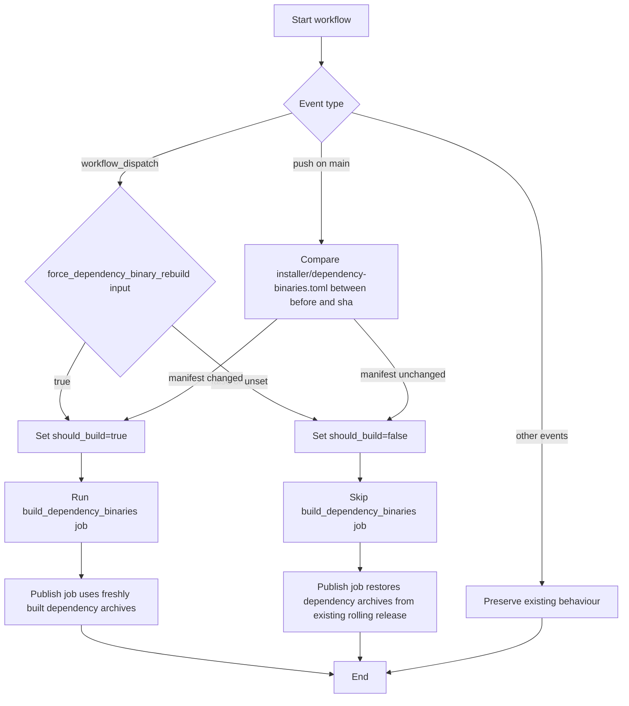

# Whitaker Developer's Guide

This guide is for contributors who want to develop new lints or work on
Whitaker itself. For using Whitaker lints in a project, see the
[User's Guide](users-guide.md).

## Prerequisites

- Rust nightly toolchain (version specified in `rust-toolchain.toml`)
- `jq` for extracting package metadata in release dry runs
- Python 3 for workflow tests and release checksum generation
- `cargo-dylint` and `dylint-link` installed:

  ```sh
  cargo install cargo-dylint dylint-link
  ```

  (`make publish-check` provisions these automatically at the pinned
  versions; see [Pre-publish validation](publishing.md#pre-publish-validation).)

CI also installs or provides job-specific tools such as `cargo-nextest`, `bun`,
`uv`, Mermaid CLI, and Nixie before running the targets that need them. Local
runs of those targets require the same tools on `PATH`.

## Running Tests

Run the test suite from the workspace root:

```sh
make test
```

This executes unit, behaviour, and UI harness tests. The shared target enables
`rstest` fixtures and `rstest-bdd` scenarios.

### Integration tests for lint exclusion behaviour

The `no_std_fs_operations` crate includes end-to-end behavioural coverage for
the `excluded_crates` configuration. These integration tests invoke
`cargo dylint` in a subprocess, so they exercise the full lint-loading and
configuration path, rather than only unit-level helpers.

Fixture projects are generated at runtime using `create_fixture_project`, which
writes a `Cargo.toml`, `dylint.toml`, and `src/lib.rs` into a `TempDir` and
returns a `FixtureProject` handle. The `FixtureProject` owns the `TempDir` so
the directory is cleaned up automatically when the handle is dropped. Passing
`is_excluded: true` writes `excluded_crates = ["<crate_name>"]` into
`dylint.toml`; `false` writes an empty list. Each fixture `Cargo.toml` contains
an empty `[workspace]` table (omitted here for brevity) so Cargo treats the
fixture as its own workspace root and does not resolve upwards to the enclosing
Whitaker workspace.

The harness centres on `run_cargo_dylint`, which executes
`cargo dylint --all -- --message-format json` with `DYLINT_LIBRARY_PATH` set to
the built lint library and `DYLINT_RUSTFLAGS=-D warnings` set to deny warnings
during the run. `diagnostic_count` then parses the JSON message stream with
`cargo_metadata::Message` and counts only `CompilerMessage` entries whose
`code.code` is `no_std_fs_operations`, which keeps the assertions tied to the
lint's structured diagnostics instead of brittle text matching.

The shared helper `run_exclusion_test(crate_name, is_excluded, expectation)`
resolves the lint library path via a `OnceLock`-cached `build_lint_library`
call, creates the fixture project, and delegates to `assert_fixture_behaviour`.
Both parametrized cases in `exclusion_crates_behaviour_test` delegate to this
helper.

The tests are annotated with `#[serial]` from `serial_test`, and the
repository-level nextest contract also requires them to match the
`serial-dylint-ui` test group in `.config/nextest.toml` when they are exercised
through `make test`. Both the attribute and the repo-level group are required
for correct serialized execution because nextest runs each test in a separate
process, so the in-process `#[serial]` mutex alone is not sufficient. They are
also marked `#[ignore]` by default because they depend on external tooling and
a buildable workspace. Before running them, install `cargo-dylint` and
`dylint-link`. The harness calls `build_lint_library()` before running
`cargo dylint`, so the workspace build is handled automatically. Run them with
one of the following commands:

```sh
cargo test -p no_std_fs_operations --test integration_exclusion -- --ignored
cargo nextest run -p no_std_fs_operations --test integration_exclusion --run-ignored ignored-only
```

The parametrized `#[rstest]` case `exclusion_crates_behaviour_test` covers both
fixture configurations. For each case it asserts the subprocess exit status and
the `no_std_fs_operations` diagnostic count, so the test verifies both the
success path for excluded crates (zero diagnostics, exit 0) and the failure
path for non-excluded crates (one or more diagnostics, non-zero exit).

### Fixture-based harness regressions

Some lint regressions need more than the plain `ui/` compiletest fixtures. For
those cases, crates such as `no_expect_outside_tests` keep a dedicated harness
runner in `src/lib_ui_tests.rs`.

The harness splits cases into two shapes:

- Example-based runs use `ExampleHarnessRun` plus
  `dylint_testing::ui::Test::example` when a single example target is enough
  and no extra fixture assets are needed.
- Fixture-based runs use `FixtureHarnessRun`, `prepare_fixture`, and
  `Test::src_base` when the case needs copied support files, a per-fixture
  `dylint.toml`, or additional `--extern` wiring.

We use `camino::Utf8Path` for fixture directory handling so temporary staged
paths remain explicitly UTF-8 and can be joined and passed through the harness
helpers without repeated lossy conversions.

When a fixture needs an external crate such as `tokio`, the harness resolves
the artefact from the dependency directory next to the current test binary.
`dependency_rlib` scans `target/.../deps` for `lib<crate>-*.rlib`, prefers the
most recently modified artefact from the current build, and falls back to a
stable path ordering when timestamps tie before emitting the `--extern` flag.

This split keeps ordinary UI fixtures simple while still letting regression
tests cover `rustc --test`, file-backed modules, per-case configuration, and
real proc-macro crates where needed.

### Test profiles

By default, `make test` excludes slow installer integration tests
(`behaviour_toolchain` and `behaviour_cli`) via a nextest default-filter
defined in `.config/nextest.toml`. These tests perform real `rustup` installs
and `cargo` builds, so they can take upwards of fifteen minutes. Note that the
exclusion relies on hardcoded binary names in `.config/nextest.toml`; renaming
or splitting these test binaries requires updating the filter to match (see
[#180][issue-180]).

To run the full suite including installer tests, pass the `ci` profile:

```sh
make test NEXTEST_PROFILE=ci
```

Continuous Integration (CI) always uses the `ci` profile, so installer tests
are never silently skipped in the pipeline.

The CI workflow is split by purpose rather than running the same stack on every
operating system. `linux-full` is the authoritative gate for formatting,
Mermaid/Nixie/Markdown validation, `make lint`, and `make publish-check`.
`windows-compat` is a narrower compatibility lane that runs
`make test NEXTEST_PROFILE=ci`, `make install-smoke`, and
`make release-installer-dry-run` to prove the workspace still builds on
Windows, the installed binary can execute, and the Windows installer release
packaging path stays valid. The release dry-run target is a POSIX-shell target;
Windows CI runs it under Bash and requires the same command-line tools as local
POSIX environments.

Both lanes share the workflow-level environment contract: `BUILD_PROFILE=debug`
narrows `sccache` keys to debug builds only, preventing cache pollution from
release builds; `CARGO_INCREMENTAL=0` disables incremental compilation, which
is incompatible with `sccache`; `RUSTC_WRAPPER=sccache` routes all `rustc`
invocations through `sccache`; `SCCACHE_GHA_ENABLED=true` activates the GitHub
Actions cache backend for `sccache`; and `RUSTFLAGS=-D warnings` and
`RUSTDOCFLAGS=-D warnings` deny compiler and doc warnings as errors across both
lanes. Together, these variables keep the cache scope narrow, ensure `sccache`
is active for all compilation, and enforce a warnings-as-errors build contract.

### CI build caching

CI uses `sccache` through the GitHub Actions backend to share Rust compilation
artefacts between the Linux and Windows lanes. The workflow sets
`SCCACHE_GHA_ENABLED=true` and `RUSTC_WRAPPER=sccache`, so Cargo invokes
`rustc` through `sccache` automatically.

The shared target cache is intentionally scoped to debug builds:

- `BUILD_PROFILE=debug` keeps cache paths centred on the profile used by the
  normal test and typecheck jobs.
- `CARGO_INCREMENTAL=0` disables incremental build artefacts, which are
  poorly suited to shared CI cache reuse and can make cache contents larger
  without improving repeatability.
- `RUSTFLAGS=-D warnings` and `RUSTDOCFLAGS=-D warnings` preserve the
  warnings-as-errors contract even when builds are routed through `sccache`.

Table: Test profiles and typical usage.

| Profile   | What runs                                  | Typical use        |
| --------- | ------------------------------------------ | ------------------ |
| (default) | All tests **except** installer integration | Local development  |
| `ci`      | All tests                                  | CI and pre-release |

When working on `whitaker-installer` code, run the full suite locally before
pushing to catch installer regressions early.

### Workflow pins and Dependabot

Dependabot owns the upgrade of GitHub Actions and reusable workflows,
including calls into `leynos/shared-actions`. Contract tests that assert a
caller's exact commit SHA create a lockstep dependency: every time Dependabot
opens a bump PR, the test fails until a human edits the pinned constant to
match. That defeats the purpose of automated dependency updates and turns a
routine bump into a manual chore.

Contract tests may still verify the *shape* of a reusable-workflow caller.
They must not verify the specific SHA value.

- Do assert the workflow references the correct reusable workflow path.
- Do assert the ref is pinned to a full 40-character commit SHA, not a
  mutable branch such as `main` or `rolling`.
- Do assert the expected `on:` triggers, least-privilege `permissions:`, and
  the inputs the caller relies on.
- Do not hard-code the current SHA value as an expected string. Match it with
  a pattern instead.
- Do not fail a test purely because Dependabot bumped the pinned SHA.

```python
import re

SHA_RE = re.compile(r"^[0-9a-f]{40}$")


def test_uses_pinned_full_sha(caller_step):
    ref = caller_step["uses"].split("@")[-1]
    assert SHA_RE.match(ref), f"expected a 40-hex commit SHA, got {ref!r}"
```

If a workflow's behaviour genuinely depends on a feature only present from a
particular commit onwards, express that as a comment or a changelog note, not
as a test assertion on the SHA string.

### Failure-mock test helpers

`installer/src/toolchain/tests/failure_mocks.rs` provides reusable helpers for
installer error-path tests that should stay deterministic and offline. They let
tests exercise failure handling without talking to `rustup`, downloading a
toolchain, or relying on network state.

`TOOLCHAIN_INSTALL_FAILURE_MESSAGE` and `COMPONENT_INSTALL_FAILURE_MESSAGE` are
the verbatim stderr payloads emitted by the mocks. The assertions match those
messages with exact equality, so wording changes fail immediately instead of
being hidden by looser substring checks.

`FailureSetup` packages the `InstallFailure` variant under test together with
any `additional_components` needed for that scenario. Pass the resulting value
to `setup_failure_mocks` to configure the command-runner sequence, and then to
`assert_failure_error` to check the resulting `InstallerError` variant.

```rust
let setup = FailureSetup {
    failure: InstallFailure::ComponentAdd,
    additional_components: &["rustfmt"],
};
setup_failure_mocks(&mut runner, &mut seq, channel, setup);
let err = toolchain.ensure_installed_with(&runner, setup.additional_components)
    .expect_err("component-add scenario should fail");
assert_failure_error(err, channel, setup);
```

`setup_failure_mocks(runner, seq, channel, setup)` wires the
`MockCommandRunner` sequence for the failure described by `setup` on the given
channel. It covers the shared rustc-version probe and the branch-specific mock
responses for toolchain install failure, component-add failure, or post-install
unusable toolchain.

`assert_failure_error(err, channel, setup)` checks that `err` matches the
expected `InstallerError` variant for the same scenario. When the shape does
not match, it panics with a message like
`"<Variant> for channel {channel} while exercising {failure}"`, which makes
multi-toolchain or multi-failure test failures much easier to diagnose.

### Other useful commands

```sh
make lint       # Run Clippy
make check-fmt  # Verify formatting
make fmt        # Apply formatting
```

## Proof workflows

Whitaker now ships repository-managed proof tooling for the formal verification
work introduced around decomposition advice and the clone-detector pipeline.
Run these commands from the workspace root.

### Clone-detector index structure

The clone-detector index code is grouped under
`crates/whitaker_clones_core/src/index/` by the candidate-generation feature it
serves. The module split keeps the public constructor contracts small enough to
test and verify directly:

- `fragment_id.rs` owns the `FragmentId` newtype. It is intentionally separate
  from the LSH and pair types because its lexical ordering is a contract that
  unit tests, BDD scenarios, and the Verus sidecar all rely on.
- `types.rs` owns `CandidatePair`, `LshConfig`, and the fixed MinHash
  signature types. `CandidatePair::new` consumes already validated `FragmentId`
  values, suppresses self-pairs, and canonicalizes distinct pairs by the
  ordering supplied by `FragmentId`.
- `lsh.rs` and `minhash.rs` own the indexing and sketching algorithms that use
  those small domain types, while `error.rs` keeps the index error contract out
  of the algorithm modules.
- `mod.rs` re-exports the public index surface so callers import
  `FragmentId`, `CandidatePair`, `LshConfig`, `LshIndex`, and `MinHasher`
  through `whitaker_clones_core` rather than depending on the internal module
  layout.

The `FragmentId` reorganization was done to remove a type-ownership tangle in
`types.rs`. Keeping the identifier newtype in its own module makes the trusted
ordering bridge in `verus/clone_detector_candidate_pair.rs` easy to audit:
Verus trusts the derived production ordering for `FragmentId`, while ordinary
tests pin the concrete string-backed behaviour.

The direct `CandidatePair::new` coverage lives in the clone-core crate:

- Unit tests in `crates/whitaker_clones_core/src/index/tests.rs` cover
  self-pair suppression, already ordered inputs, reversed inputs, and the
  lexical edge case `fragment-10 < fragment-2`.
- The BDD harness in
  `crates/whitaker_clones_core/tests/candidate_pair_behaviour.rs` exercises the
  same public constructor through `rstest-bdd` steps.
- The feature file is
  `crates/whitaker_clones_core/tests/features/candidate_pair.feature`.
- The test dependencies are declared in
  `crates/whitaker_clones_core/Cargo.toml` as `rstest`, `rstest-bdd`, and
  `rstest-bdd-macros`.

The direct `MinHasher::sketch` invariant coverage is split between ordinary
tests and Kani:

- Unit tests in `crates/whitaker_clones_core/src/index/tests.rs` cover
  deterministic sketches, duplicate-hash insensitivity, reordered set
  semantics, empty input, and representative full-width `u64` hash values.
- The BDD harness in
  `crates/whitaker_clones_core/tests/min_hash_lsh_behaviour.rs` includes a
  duplicate-retained-hash candidate-generation scenario.
- The Kani harnesses in `crates/whitaker_clones_core/src/index/kani.rs` call
  real `MinHasher::sketch` for the empty-input, deterministic-output, and
  duplicate-hash properties. They use a private `cfg(kani)` seed fixture and
  fixed-width signature builder so the proof focuses on sketch semantics rather
  than seed-stream array construction.

The direct `LshIndex` invariant coverage is also split between ordinary tests
and Kani:

- Unit tests in `crates/whitaker_clones_core/src/index/tests.rs` cover no
  self-pairs, canonical pair ordering, repeated-band deduplication, and
  insertion-order independence through the public `candidate_pairs()` API.
- The BDD harness in
  `crates/whitaker_clones_core/tests/min_hash_lsh_behaviour.rs` exercises LSH
  candidate generation as part of the token-pass behaviour surface.
- The Kani harnesses in `crates/whitaker_clones_core/src/index/kani.rs` verify
  bounded `LshIndex` states for the same invariants. Kani builds use a private
  fixed-size insertion log and compact band keys so the proof checks the LSH
  state transition and `CandidatePair::new` policy without modelling `BTreeMap`
  and `BTreeSet` allocator internals.

### Clone-detector AST structure

The clone-detector AST code is grouped under
`crates/whitaker_clones_core/src/ast/`. It is deliberately split into one
parser adapter and several parser-agnostic domain modules:

- `lowering.rs` is the only AST source file that may import `ra_ap_syntax`,
  `ra_ap_parser`, or `rowan`. It parses a Rust file, maps byte spans to the
  smallest covering syntax node, and lowers that node into the owned
  `NormalizedTree` representation.
- `tree.rs` owns the lowered domain types: `NormalizedTree`,
  `NormalizedNode`, `KindId`, `Depth`, `LeafClass`, and `ByteSpan`. `KindId`
  is an in-memory token and must not be persisted.
- `hash.rs` owns `AstHash` and `canonical_hash`.
- `features.rs`, `hash.rs`, and `cover.rs` operate only on the lowered domain
  types. They must not depend on parser crates or import the adapter module.
- `tests.rs` and the `tests/ast_*` behavioural suites cover feature math,
  parser lowering, snapshots, property tests, and the module-boundary guard.

The `tests/ast_boundary.rs` guard enforces this boundary. If it fails, fix the
module ownership problem rather than relaxing the guard: parser vocabulary
belongs in `lowering.rs`, and reusable AST algorithms belong in the lowered
domain.

AST feature vectors use an exact count substrate. `kind_counts` records exact
`(KindId, Depth) -> u32` counts, `kind_histogram` derives dyadic fixed-point
weights from those counts, `production_multiset` records deterministic
parent-child and parent-child-grandchild production counts, and
`canonical_hash` emits an `AstHash` seeded with `PARSER_SCHEMA_VERSION`.
Changing the parser pin, normalization rules, hash algorithm, or schema string
must produce a reviewable snapshot change.

`ra_ap_syntax` is exact-pinned in `Cargo.toml` because its parser vocabulary
and MSRV move with `0.0.x` snapshots. The dependency is behind the default
`parser` feature of `whitaker_clones_core`: normal builds compile the real
adapter, while Kani runs pass `--no-default-features` and compile the
parser-free adapter stub. Keep that split unless Kani's pinned toolchain can
compile the parser snapshot directly.

`crates/whitaker_clones_core/build_support.rs` owns pure build-time parser
dependency parsing. Only that crate's `build.rs` and its integration
verification test may import it; runtime code must not use it.

### Make targets

Use the Makefile targets for normal proof runs:

```sh
make verus                 # Run all Verus proof files
make verus-clone-detector  # Run clone-detector Verus proofs only
make kani                  # Run all Kani harness groups
make kani-clone-detector   # Run clone-detector Kani harnesses only
```

The Makefile prepends `~/.cargo/bin` and `~/.bun/bin` to `PATH` for all
make-target invocations
(`PATH := $(HOME)/.cargo/bin:$(HOME)/.bun/bin:$(PATH)`). This ensures that
`cargo`, `kani`, and Bun-based tooling installed in those locations are
resolved ahead of any system-level copies, without requiring developers to
modify their shell environment permanently.

`CARGO` and `MDLINT` are resolved at make-invocation time using `$(or ...)`
shell probes rather than fixed command names. `CARGO` is resolved at
make-invocation time: `command -v cargo` is tried first (it returns a
POSIX-safe path on all platforms, including Windows/Git Bash), falling back to
`~/.cargo/bin/cargo` when that file is executable. This ordering avoids Windows
drive-letter paths that confuse the POSIX shell used by make recipes. `MDLINT`
prefers the `markdownlint-cli2` binary found on `PATH` (typically a global npm
or Bun install), falling back to `~/.bun/bin/markdownlint-cli2`. Both variables
honour an existing environment value if set before invoking make, allowing
per-developer overrides without modifying the Makefile.

`make verus` currently runs both decomposition-advice proofs and the
clone-detector sidecars for `LshConfig::new`, `CandidatePair::new`, and AST
feature-count accumulation. `make kani` runs the decomposition adjacency
harnesses and the clone-detector harness group in one pass.

### Spelling gate

Run `make spelling` to enforce en-GB-oxendict spelling in tracked text. The
gate uses Typos 1.48.0 together with the repository's generated `typos.toml`,
and `make markdownlint` includes the spelling gate.

The tracked configuration is built from the shared estate dictionary and the
narrow `typos.local.toml` overlay. Run `make spelling-config-write` after an
intentional policy change, and run `make spelling-config` to verify that the
tracked output is current. The pinned builder refreshes the untracked local
cache only when the authoritative dictionary is newer, so an already populated
cache remains usable offline.

Do not edit `typos.toml` directly. Preserve public and serialized SARIF terms,
localization compatibility identifiers, compiler fixtures, workflow keys, and
formal diagnostic text through narrow local policy. The exact phrase gate
rejects the hyphenated variant in favour of `handwritten`, including in hidden
tracked source.

`make nixie` validates the repository's Mermaid diagrams. Continuous
Integration installs Nixie 1.1.0 and its Merman 0.7.0 dependency on the Linux
documentation leg.

### Verus scope and trust boundary

The clone-detector Verus files are intentionally implementation-shaped models
or algebraic sidecars, not direct proofs of the compiled Rust bodies in
`crates/whitaker_clones_core`.

This distinction matters. In the current sidecar setup, Verus can describe the
contract of an external Rust function with mechanisms such as
`assume_specification`, `external_fn_specification`, or `external_body`, but
those routes add trusted assumptions rather than proving the production
implementation itself. The repository therefore keeps the Verus proof honest:
it mirrors the real branch order and `checked_mul` overflow behaviour, while
Kani calls the actual constructor and checks its runtime behaviour directly.

For the current clone-detector constructors, the split is:

- Verus proves the `LshConfig::new` constructor model rejects zero bands,
  rejects zero rows, accepts only exact products of `MINHASH_SIZE`, and rejects
  overflowing products via the same `checked_mul` semantics as the runtime code.
- Verus proves the `CandidatePair::new` constructor model suppresses equal
  inputs, preserves already ordered distinct inputs, and swaps reversed
  distinct inputs into canonical order. The sidecar now formulates that proof
  over a trusted `FragmentId` bridge lemma: `FragmentId::partial_cmp` is
  modelled as a strict total order via a ghost `nat` ranking, rather than being
  left as an implicit assumption.
- Kani executes the real constructor with one concrete acceptance harness, one
  bounded symbolic harness over `[0, 128]²`, and one overflow harness that
  forces the `checked_mul(None)` branch.
- Kani executes real `MinHasher::sketch` calls for empty input, deterministic
  output, and duplicate retained hashes. The non-empty harnesses keep their
  symbolic domains intentionally bounded: determinism proves equality at an
  arbitrary signature lane for a fixed retained hash, while duplicate-hash
  insensitivity proves a symbolic bounded retained hash at the first signature
  lane.
- Kani verifies bounded `LshIndex` states for no self-pairs, canonical pair
  ordering, repeated-band deduplication, and insertion-order independence. In
  `#[cfg(kani)]` builds, `LshIndex` records inserted fragments in a fixed
  four-slot proof log with compact two-band keys; normal builds keep the
  production `BTreeMap`/`BTreeSet` implementation and public API.
- Kani verifies AST span-cover selection and bounded AST feature invariants
  over synthetic `NormalizedTree` values. It calls the production
  `select_smallest_covering` helper for covering-node minimality and root
  fallback, and uses compact bounded tree fixtures for feature invariants so
  the proof does not compile or model `ra_ap_syntax`.
- Verus proves the AST feature-count accumulator algebra for supplied
  `(kind, depth)` contributions. The proof establishes adjacent two-item order
  independence for exact counts; ordinary tests and proptest remain responsible
  for proving that production traversal supplies the intended contribution
  multiset.
- Ordinary unit tests and `rstest-bdd` scenarios pin the concrete lexical
  `FragmentId` ordering contract that the `CandidatePair` proof's bridge still
  trusts rather than proving from `String` internals, and they pin the AST
  adapter's parser-facing behaviour.

### Tooling scripts

The proof targets are thin wrappers over repository scripts:

- `scripts/install-verus.sh` downloads the pinned Verus release into
  `${XDG_CACHE_HOME:-$HOME/.cache}/whitaker/verus`, makes the binaries
  executable, and installs the Rust toolchain that Verus requests.
- `scripts/run-verus.sh` selects proof groups and executes each `.rs` proof
  file in turn, including `verus/clone_detector_ast_features.rs` for the
  clone-detector group.
- `scripts/install-kani.sh` downloads the pinned pre-built Kani release into
  `${XDG_CACHE_HOME:-$HOME/.cache}/whitaker/kani`, installs the matching
  nightly Rust toolchain via `rustup`, and symlinks that toolchain into the
  Kani directory structure.
- `scripts/run-kani.sh` sets the Kani-specific environment, runs the
  decomposition/common harnesses through the existing workflow, and runs the
  clone-detector harnesses one harness per `cargo-kani` invocation so each
  proof appears explicitly in the output, including the overflow-specific
  harness for `LshConfig::new`, the bounded `MinHasher::sketch` harnesses, and
  the bounded `LshIndex` candidate-pair invariant harnesses. Clone-detector
  Kani invocations use `--no-default-features` so parser-independent proofs do
  not compile `ra_ap_syntax`.

The installer scripts are idempotent. The first proof run may take longer while
toolchains and verifier binaries are downloaded; later runs reuse the cached
installation.

### Examples

Run the narrow clone-detector proof workflow during iteration:

```sh
make verus-clone-detector
make kani-clone-detector
```

Run a Verus group directly through the wrapper:

```sh
./scripts/run-verus.sh clone-detector
./scripts/run-verus.sh all --time
```

Run all Kani groups, a specific decomposition harness, or the clone-detector
group directly:

```sh
./scripts/run-kani.sh
./scripts/run-kani.sh verify_build_adjacency_preserves_edges
./scripts/run-kani.sh clone-detector
```

## Toolchain and parser maintenance runbooks

Use these runbooks when the Rust nightly or `ra_ap_syntax` parser snapshot must
move. They are intentionally procedural because both changes affect Dylint,
parser APIs, snapshots, and proof tooling.

### Rust toolchain bump runbook

1. Change `rust-toolchain.toml` to the target pinned nightly channel.
2. Install or refresh the required components:
   `rustup component add rust-src rustfmt clippy rustc-dev
   llvm-tools-preview`.
3. Rebuild the whole workspace with the newly pinned channel before making
   feature changes. Fix `clippy_utils`, lint-crate, and `rustc_private` API
   drift in the production code rather than suppressing warnings.
4. Confirm `cargo-dylint` and `dylint-link` can drive the pinned nightly. If
   no compatible Dylint release exists, stop and record the blocker.
5. Run the UI tests and re-baseline `.stderr` fixtures only after reviewing the
   diagnostic drift. Treat changed spans, wording, and suggestions as evidence
   to review, not as an automatic blessing.
6. Update load-bearing toolchain references, including installer package
   scripts, release workflow strings, ADR-001 notes, and any design or roadmap
   text that names the old channel.
7. Run the normal gates in order: `make check-fmt`, `make lint`, `make test`,
   and `make markdownlint`. Run relevant proof targets if the bump touches
   clone-detector or decomposition proof surfaces.
8. Keep `CARGO_LOCKED` empty by default. Makefile Cargo recipes pass the value
   through unchanged so callers can opt into `--locked` explicitly when they
   need Cargo to enforce the lockfile for a build, lint, package, or test
   command.

### `ra_ap_syntax` re-pinning runbook

1. Choose a `ra_ap_syntax` snapshot contemporaneous with the pinned Rust
   nightly rather than backwards-bisecting to an older parser unless the plan
   explicitly requires that trade-off.
2. Exact-pin the parser dependency in the workspace `Cargo.toml` under
   `[workspace.dependencies]`. The accepted outcome is an entry such as
   `ra_ap_syntax = "=0.0.334"` with the `parser` feature wired through
   `whitaker_clones_core`. Loose pins, invalid specifiers, or a missing
   workspace dependency must fail the re-pin attempt. If more than three
   transitive crates need manual `cargo update --precise` pins, stop and
   record the mismatch.
3. Keep parser imports confined to `src/ast/lowering.rs`. If a parser API
   change tempts domain code to import `ra_ap_syntax`, update the lowered
   `NormalizedTree` boundary instead.
4. Update `PARSER_SCHEMA_VERSION` for every parser re-pin or normalization
   change. The build script derives the schema version from the exact
   workspace dependency, so any missing or non-exact pin must fail before the
   hash module composes the value.
5. Refresh and review the AST snapshots, especially the parser schema
   snapshot and named-kind feature-vector snapshot, so syntax-kind drift is
   visible.
6. Run `cargo build -p whitaker_clones_core`, the AST-focused tests,
   `make check-fmt`, `make lint`, `make test`, `make verus-clone-detector`,
   `make kani-clone-detector`, and `make markdownlint`.
7. Preserve the default `parser` feature and the Kani `--no-default-features`
   proof path unless the Kani-pinned toolchain can compile the parser snapshot
   directly.

## Kani bounded model checking

Whitaker uses the [Kani model checker](https://model-checking.github.io/kani/)
to verify critical algorithms with bounded symbolic verification. Kani proofs
complement traditional testing by exhaustively checking properties over all
possible inputs within configured bounds.

### Writing Kani harnesses

Kani harnesses live colocated with the code they verify, typically in a
`#[cfg(kani)]` verification submodule. For example:

```rust
#[cfg(kani)]
mod verification {
    use super::*;

    #[kani::proof]
    fn verify_property() {
        // Generate symbolic inputs
        let input: u32 = kani::any();

        // Add preconditions
        kani::assume(input > 0);
        kani::assume(input < 100);

        // Call function under test
        let result = function_to_verify(input);

        // Assert postconditions
        assert!(result.is_valid());
    }
}
```

Key principles:

- **Bounded symbolic inputs**: Use fixed-size arrays or bounded ranges to keep
  the state space tractable. Rust's standard `sort_by` and nested loops can
  cause CBMC (C Bounded Model Checker) state-space explosion at higher bounds.
- **Input contracts**: Use `kani::assume` to constrain symbolic inputs to match
  the preconditions that production code guarantees. Model the actual input
  contract, not arbitrary malformed inputs.
- **One property per harness**: Separate harnesses simplify root-cause analysis
  when a property fails. Focused harnesses are clearer than one combined check.
- **Crate visibility**: Kani harnesses can call `pub(crate)` functions directly,
  avoiding the need to widen the public API for verification purposes.

### `cfg(kani)` configuration and crate visibility

Kani harnesses are gated behind `#[cfg(kani)]`, which is only defined when Kani
compiles the crate. Under the Rust 2024 edition, any `cfg` name not registered
with the compiler triggers an `unexpected_cfgs` lint warning. To suppress this,
register `cfg(kani)` in the crate's `Cargo.toml`:

```toml
[lints.rust]
unexpected_cfgs = { level = "warn", check-cfg = ['cfg(kani)'] }
```

This tells `rustc` that `kani` is an expected configuration name, so normal
`cargo check` and `cargo clippy` runs do not emit spurious warnings. The entry
lives in `common/Cargo.toml` for the decomposition harnesses and in
`crates/whitaker_clones_core/Cargo.toml` for the clone-detector harnesses.

Kani harnesses verify private helpers that are not part of the public API.
Rather than making these helpers fully public, the following items are promoted
to `pub(crate)` visibility:

- **`community` module** (`common/src/decomposition_advice/mod.rs`): Promoted
  from `mod community` to `pub(crate) mod community` so that
  `test_support::decomposition` helpers and unit tests can import
  `SimilarityEdge` and `build_adjacency`.
- **`build_adjacency` function**
  (`common/src/decomposition_advice/community.rs`): Promoted from `fn` to
  `pub(crate) fn` so that colocated Kani harnesses and the test-support
  adjacency report can call it directly without widening the crate's public API
  surface.
- **`SimilarityEdge::new(left, right, weight)`**
  (`common/src/decomposition_advice/community.rs`): A `pub(crate)` constructor
  added to allow Kani harnesses and test-support modules to create edge values
  without exposing a public constructor on the production type. It is used
  internally by `adjacency_report` to convert validated `EdgeInput` values into
  `SimilarityEdge` instances before delegating to `build_adjacency`. External
  callers should use `adjacency_report` rather than constructing
  `SimilarityEdge` directly.

This pattern keeps the runtime API narrow while giving verification and test
code the access it needs.

### Test-support APIs for adjacency testing

The `common::test_support::decomposition` module provides declarative helpers
for integration and behaviour-driven tests:

- **`adjacency_report(node_count, edges)`**: Validates edge input (canonical
  order, in-bounds, positive weights), builds adjacency lists via
  `build_adjacency`, and returns `Result<AdjacencyReport, AdjacencyError>`.
  Callers can `match` on the result, `.expect(...)` in tests, or propagate the
  error upward when invalid declarative input should fail the caller.
- **`AdjacencyError`**: Typed validation failure for the `Err` branch. The
  shipped variants are `NonCanonicalEdge { index, left, right }` when
  `left >= right`, `EndpointOutOfRange { index, right, node_count }` when an
  endpoint exceeds the graph size, and `ZeroWeight { index }` when a weight is
  non-positive for the production contract. Callers should inspect these
  variants when they need to assert a specific rejection path.
- **`AdjacencyReport`**: Wrapper around adjacency vectors on the `Ok` branch,
  with methods for testing properties:
  - `is_symmetric()`: Checks that all edges appear in both directions
  - `all_indices_in_bounds()`: Verifies neighbour indices are valid
  - `is_sorted()`: Confirms neighbours are sorted by index
  - `neighbours_of(node)`: Returns neighbours of a node (or `None` if
    out-of-bounds)
- **`EdgeInput`**: Declarative edge struct with `left`, `right`, `weight`
  fields, passed to `adjacency_report` and interpreted on the `Ok` branch as
  canonical-order, in-range, positive-weight edge input for behaviour-driven
  development (BDD) scenarios.

The test-support API validates input and delegates to the shipped
`build_adjacency` function, keeping raw adjacency vectors crate-internal while
providing a clean testing interface.

See
[`docs/execplans/6-4-5-use-kani-to-verify-build-adjacency-preserves-similarity-edges.md`](./execplans/6-4-5-use-kani-to-verify-build-adjacency-preserves-similarity-edges.md)
for the complete design rationale and implementation decisions.

### Test-support APIs for label-propagation testing

The `common::test_support::decomposition` module also provides a declarative
label-propagation helper for integration and behaviour-driven tests:

- **`label_propagation_report(method_names, edges, max_iterations)`**:
  Validates edge input by delegating to `validate_edges`, constructs minimal
  method vectors from `method_names`, runs deterministic label propagation for
  up to `max_iterations` passes, and returns
  `Result<LabelPropagationReport, AdjacencyError>`. The same `AdjacencyError`
  variants used by `adjacency_report` apply, because malformed declarative
  graph input is rejected before runtime propagation is called.
- **`LabelPropagationReport`**: Wrapper around the runtime propagation report
  on the `Ok` branch, with methods for testing properties:
  - `labels()`: Returns the final label vector
  - `label_of(node)`: Returns the propagated label for a node, or `None` when
    the node is out of bounds
  - `iteration_count()`: Returns the number of propagation passes performed
  - `has_active_nodes()`: Reports whether the validated input graph contains at
    least one non-isolated node
  - `all_labels_in_bounds()`: Verifies every final label is a valid node index

The test-support API validates input and delegates to the shipped label
propagation runtime, keeping raw adjacency vectors and runtime reports
crate-internal while providing a clean testing interface.

See
[`docs/execplans/6-4-6-kani-verification-propagate-labels-preserves-indices.md`](./execplans/6-4-6-kani-verification-propagate-labels-preserves-indices.md)
for the complete design rationale and implementation decisions.

## Installer release helper binaries

The `whitaker-installer` crate exposes several internal release-helper binaries
used by GitHub workflows and packaging scripts. These are part of the build
contract even though they are not user-facing CLI entry points.

### Why `autobins = false` is required

`installer/Cargo.toml` sets `autobins = false` and declares every binary target
explicitly. This is required because the release workflows invoke specific bin
names that do not always match Cargo's filename-derived defaults.

Current explicit targets:

- `whitaker-installer` from `src/main.rs`
- `whitaker-package-lints` from `src/bin/package_lints.rs`
- `whitaker-package-installer` from `src/bin/package_installer_bin.rs`
- `whitaker-package-dependency-binary` from
  `src/bin/package_dependency_binary.rs`

Without explicit declarations, Cargo would infer fallback names such as
`package_lints` and `package_installer_bin`. Those names do not match the
workflow invocations, so release and rolling-release builds would fail even
though the source files exist.

### Validation coverage and purpose

Workflow validation in `tests/workflows/` protects this contract from drift:

- `test_installer_packaging_bins_match_release_workflow_contract` asserts that
  the workflow-facing binary names exist in workspace metadata.
- The same test also asserts that filename-derived fallback target names are
  absent, proving the crate still relies on explicit target declarations rather
  than accidental Cargo defaults.
- `workflow_test_helpers.py` centralizes the `cargo metadata --no-deps` lookup
  used by these contract tests so packaging changes fail with one clear error
  path.

When modifying release helpers, keep the workflow YAML, `installer/Cargo.toml`,
and the metadata-based tests in lock-step.

### Workflow test support and local runner configuration

The rolling-release contract tests share YAML and shell-parsing helpers in
`tests/workflows/rolling_release_workflow_test_support.py`. Keep parsing and
failure messages centralized there when adding more rolling-release assertions,
instead of duplicating small YAML walkers or shell-branch extractors across
multiple test modules. In particular, `_workflow_dispatch_branch_body()`
returns only the matched branch body and excludes the closing `fi`, so
follow-on assertions can stay focused on the branch contents rather than shell
framing.

#### GitHub-expression helpers

Four helpers in `rolling_release_workflow_test_support.py` analyse `if` guard
expressions on workflow steps:

| Helper                                         | Signature                                    | Purpose                                                                                                                                                               |
| ---------------------------------------------- | -------------------------------------------- | --------------------------------------------------------------------------------------------------------------------------------------------------------------------- |
| `_github_operand_pattern`                      | `(operand: str) -> re.Pattern[str]`          | Builds a regex that matches the operand as a standalone token, preventing partial-name false positives (e.g. a prefix or suffix sharing characters with the operand). |
| `_github_expression_mentions_operand`          | `(expression: object, operand: str) -> bool` | Returns `True` when the normalized expression contains the operand as a whole token.                                                                                  |
| `_github_expression_negates_operand`           | `(expression: object, operand: str) -> bool` | Returns `True` when the expression contains `!operand` or `!(operand)`. Double negation (`!!operand`) is not flagged.                                                 |
| `_github_expression_compares_operand_to_false` | `(expression: object, operand: str) -> bool` | Returns `True` when the expression contains `operand == false` (or `false == operand`) in any quoting style. Strict-equality only; `!=` comparisons are not matched.  |

Use these helpers together in step-guard assertions to verify gating semantics
rather than exact expression strings, making tests resilient to harmless
formatting changes in the workflow YAML.

Local workflow tests use the Makefile variables `UV` and `WORKFLOW_TEST_VENV`:

- `UV` selects the `uv` executable used to create and populate the
  workflow-test virtual environment.
- `WORKFLOW_TEST_VENV` selects the virtual-environment path, defaulting to
  `.venv`.

Use `make workflow-test-deps` to create or refresh that environment, and
`make workflow-test` to run the opt-in `act` plus `pytest` workflow smoke tests
against it.

### Worked example: adding another packaging binary

When adding a new internal helper binary, make all of the following changes in
one patch:

1. Add the Rust entry point under `installer/src/bin/`.
2. Add a matching `[[bin]]` stanza in `installer/Cargo.toml`.
3. Keep `autobins = false` so Cargo does not expose unexpected fallback names.
4. Update any workflow or script that invokes the helper to use the explicit
   bin name.
5. Extend the workflow contract test so the new target is asserted alongside
   the existing helpers.

Example `Cargo.toml` entry:

```toml
[[bin]]
name = "whitaker-package-example"
path = "src/bin/package_example.rs"
```

If the workflow should invoke that helper, add an assertion to
`test_installer_packaging_bins_match_release_workflow_contract` before relying
on it in release automation. That keeps the breakage in unit-style Python tests
instead of the rolling-release pipeline.

## Dependency binary packaging

Whitaker publishes repository-hosted copies of `cargo-dylint` and `dylint-link`
for the installer's supported targets. The installer prefers these repository
assets before falling back to `cargo binstall` and then `cargo install`.

### TOML (Tom's Obvious, Minimal Language) manifest schema

The committed manifest at `installer/dependency-binaries.toml` declares each
required dependency binary as a TOML array-of-tables entry. Every entry must
contain the following fields:

Table: Manifest schema for crate entries

| Field        | Type   | Description                                                                        |
| ------------ | ------ | ---------------------------------------------------------------------------------- |
| `package`    | string | Cargo package name (must be unique across entries)                                 |
| `binary`     | string | Executable basename without platform suffix                                        |
| `version`    | string | Required upstream version                                                          |
| `license`    | string | SPDX (Software Package Data Exchange) licence expression for provenance disclosure |
| `repository` | string | Upstream source repository URL                                                     |

Example entry:

```toml
[[dependency_binaries]]
package = "cargo-dylint"
binary = "cargo-dylint"
version = "6.0.1"
license = "MIT OR Apache-2.0"
repository = "https://github.com/trailofbits/dylint"
```

The Rust domain model (`DependencyBinary`) enforces all fields as mandatory
during deserialization. The manifest parser also rejects duplicate `package`
values to prevent ambiguous resolution.

### Manifest and public APIs

The committed manifest lives at `installer/dependency-binaries.toml`. It is
loaded through `whitaker_installer::dependency_binaries`, which exposes:

- `DependencyBinary` for typed manifest entries
- `required_dependency_binaries()` for the full manifest set
- `find_dependency_binary()` for package lookup
- archive and binary naming helpers shared by packaging and installation
- repository-install traits for archive download and extraction

The packaging surface lives in `whitaker_installer::dependency_packaging`:

- `DependencyPackageParams` for one packaging request
- `package_dependency_binary()` for one deterministic `.tgz` or `.zip`
  archive
- `render_provenance_markdown()` and `write_provenance_markdown()` for the
  shared provenance and licence sidecar

### Control flow

The dependency-install path is split into focused modules under
`installer/src/dependency_binaries/install/`:

- `metadata.rs` computes target-specific archive names, binary names, and the
  exact archive member path
- `downloader.rs` resolves rolling-release asset URLs and downloads archives
- `extractor.rs` extracts the exact packaged member into a temporary file and
  atomically renames it into the local bin directory
- `installer.rs` orchestrates directory discovery, download, extraction, and
  executable permission fixes

`installer/src/deps.rs` drives the high-level fallback order:

1. Attempt the repository-hosted dependency archive for the current target.
2. Verify the installed tool is now usable. `cargo-dylint` is checked by
   running `cargo dylint --version`. A repository-release `dylint-link` is
   accepted on the strength of its install pipeline and is never executed;
   see "Why `dylint-link` is never probed" below.
3. If the repository download reports `NotFound`, skip `cargo binstall` and
   fall back directly to `cargo install`.
4. For other repository failures, fall back to `cargo binstall` when available
   and then to `cargo install` if `cargo binstall` is absent or fails.

### Dependency fallback details

`installer/src/deps/install.rs` uses the `InstallOutcome` enum to describe how
each dependency tool was satisfied. `install_tool()` returns
`RepositoryRelease`, `CargoBinstall`, or `CargoInstall`, and
`update_status_after_install()` uses that outcome to decide whether it should
re-check for `dylint-link` after installing `cargo-dylint`.

The HTTP download layers in
`installer/src/dependency_binaries/install/downloader.rs` and
`installer/src/artefact/download.rs` both map
`ureq::Error::StatusCode(404 | 410)` to a semantic `NotFound` error variant.
All other `ureq` failures become `Download` or `HttpError`. Callers inspect
`error.is_not_found()` to distinguish the missing-asset source-build path from
the generic Cargo fallback path.

`install_missing_tools()` iterates across `DEPENDENCY_TOOLS`, calls
`should_install_tool()` to skip any tool already present in `remaining_status`,
then calls `install_tool()` and feeds the returned `InstallOutcome` into
`update_status_after_install()`. This keeps `remaining_status` accurate for
later iterations so a successful `cargo-dylint` install can suppress a redundant
`dylint-link` install.

After resolving the dependency metadata entry, `install_tool()` copies
`dependency.version()` into `CargoInstallPlan` before attempting the
repository-release install. That means every subsequent `run_cargo_install()`
fallback, including the direct missing-asset path, invokes
`cargo install --locked --version <version>`. This preserves the version
recorded in `installer/dependency-binaries.toml` instead of silently using the
latest upstream release.

`update_status_after_install()` delegates the local-install re-check decision
to `should_refresh_companions()`. That helper returns `true` only when the install
outcome was not `RepositoryRelease` and `dylint-link` is still missing, so the
code checks for a resolvable `dylint-link` binary only after local
`cargo-dylint` installs and does not re-check it when the pre-built repository
artefact was used or when `dylint-link` was already present.

#### Why `dylint-link` is never probed

`dylint-link` is a linker wrapper: it forwards its entire argument list to the
underlying linker. It therefore has no reliable self-reporting subcommand.
`--version` exits early, and `--help` succeeds only when a usable linker and
toolchain are present in the ambient environment, so it reports on the
environment rather than on the artefact. Executing it as a health check
rejected valid, checksum-verified release artefacts and forced a
`cargo install --locked --version 6.0.1 dylint-link` fallback that cannot
compile on toolchains below the crate's rustc floor, breaking consumers pinned
to older toolchains.

The trust boundary for a repository-release install is the install pipeline:
the release asset name pins the package and version, the `.sha256` sidecar
establishes integrity, extraction confirms the expected archive member, and the
permission step establishes launch eligibility. `repository_install_verified()`
in `installer/src/deps/install.rs` therefore accepts `dylint-link` as soon as
that pipeline reports success, and retains the generic version check for
`cargo-dylint`. Genuine pipeline failures still fall back to Cargo.

A Cargo-managed `dylint-link` already on `PATH` is checked by resolving an
executable file and comparing the version Cargo recorded for it, which needs no
execution either.

The `dylint-link` verification in `installer/src/deps.rs` is implemented by
five small private helpers:

- `find_binary_on_path(binary_name)` returns the first executable candidate so
  the installation check can validate the exact path it found.
- `find_binary_in_directory(directory, binary_name)` performs the per-directory
  search that `find_binary_on_path()` uses while walking `PATH`.
- `binary_candidates(directory, binary_name)` builds the ordered set of
  candidate paths that each directory contributes to the lookup.
- `is_executable_file(path)` applies the platform-specific file test:
  executable-bit plus regular-file checks on Unix, and `path.is_file()` on
  non-Unix targets where the executable suffix carries the meaning.
- `windows_path_extensions()` normalizes `PATHEXT` on Windows so
  `binary_candidates()` can expand extensionless names the same way the shell
  does.

These key helpers are covered by direct unit tests in
`installer/src/deps/path_tests.rs` for missing PATH values, empty PATH values,
multiple PATH directories, non-executable Unix files, executable Unix files,
broken PATH shims, and Windows `PATHEXT` resolution via both direct helper
tests and `check_dylint_tools()`.

Installer PATH-fixture helpers now live in
`installer/src/test_utils/dependency_binary_helpers.rs` instead of being
duplicated across multiple test modules. The key helpers are:

- `with_fake_binary_on_path(binary_name, run)`, which creates a temporary PATH
  entry containing one executable and runs the closure under `env_test_guard()`.
- `with_fake_path(setup, run)`, which provides two temporary PATH directories
  for tests that need to control PATH ordering or place binaries in later
  entries.
- `write_fake_binary(path, is_executable)`, which writes a fake binary and, on
  Unix, sets executable permissions explicitly for positive and negative tests.
- `AlwaysNotFoundRepositoryInstaller`, a repository-installer test double used
  by `installer/src/tests.rs` to force the direct Cargo fallback path without
  network access.

### CLI tool usage

Release automation uses the `whitaker-package-dependency-binary` helper in
`installer/src/bin/package_dependency_binary.rs`.

Package one executable:

```sh
cargo run -p whitaker-installer --bin whitaker-package-dependency-binary -- \
  package \
  --package cargo-dylint \
  --target x86_64-unknown-linux-gnu \
  --binary-path /tmp/cargo-dylint \
  --output-dir /tmp/dist
```

Generate the shared provenance document:

```sh
cargo run -p whitaker-installer --bin whitaker-package-dependency-binary -- \
  provenance \
  --output-dir /tmp/dist
```

The release workflows consume both artefact types:

- deterministic dependency archives named from the manifest and target triple
- `dependency-binaries-licences.md` for provenance and third-party licence
  disclosure

### Rolling-release manual recovery

`.github/workflows/rolling-release.yml` rebuilds dependency binaries
automatically on pushes to `main` when `installer/dependency-binaries.toml`
changes.

Manual runs now expose an explicit `force_dependency_binary_rebuild` boolean
input instead of rebuilding dependency binaries on every `workflow_dispatch`.

Use that input when the rolling release needs to recover from an earlier
dependency-binary build or publish failure, or when the current rolling release
is missing the expected `.tgz` or `.zip` dependency archives. Leave it set to
`false` for a manual republish that should reuse or restore the existing
dependency archives.

Figure: Rolling-release dependency-binary decision flow. The workflow checks
whether the event is a manual dispatch or a push to `main`, then decides
whether to set `should_build` and either rebuild dependency binaries or restore
the existing rolling-release archives.



### Continuous Integration (CI) manifest script

`installer/scripts/dependency_binaries_manifest.py` is a thin CI helper that
reads `installer/dependency-binaries.toml` and emits tab-separated rows for
shell consumption. Each output line contains three columns: package name,
binary name, and version.

Usage:

```sh
python3 installer/scripts/dependency_binaries_manifest.py
python3 installer/scripts/dependency_binaries_manifest.py custom.toml
python3 installer/scripts/dependency_binaries_manifest.py -o matrix.tsv
```

The script validates manifest uniqueness (rejecting duplicate `package`
entries) and exits with code 1 on duplicates. It is invoked by the release and
rolling-release workflows to build the per-target build matrix.

Unit tests for this script live at
`tests/workflows/test_dependency_binaries_manifest.py` and cover argument
parsing, TOML loading, duplicate detection, TSV encoding, file output, and
error paths. Run them with:

```sh
python3 -m pytest tests/workflows/test_dependency_binaries_manifest.py -v
```

### Dependency binary Behaviour-Driven Development (BDD) tests

Dependency binary installation behaviour is specified in Gherkin feature files
and driven by rstest-bdd. The test architecture follows the same pattern used
across the project's behavioural tests.

#### File layout

- Feature file:
  `installer/tests/features/dependency_binaries.feature`
- Step definitions and scenario bindings:
  `installer/tests/behaviour_dependency_binaries.rs`
- Test helpers:
  `installer/src/test_utils/dependency_binary_helpers.rs`
- Shared test utilities:
  `installer/src/test_utils.rs`

#### Extending the BDD suite

To add a new scenario:

1. Append the scenario to the `.feature` file using existing Given/When/Then
   step vocabulary.
2. If the scenario requires new steps, add step functions annotated with
   `#[given(...)]`, `#[when(...)]`, or `#[then(...)]` in the behaviour test
   file.
3. Add a `#[scenario(path = "...", index = N)]` binding function at the
   bottom of the behaviour test file, where `N` is the zero-based scenario
   index.
4. Update `dependency_binary_helpers.rs` if the scenario introduces new
   expected command sequences.

#### Test infrastructure helpers

- **`StubExecutor`** records expected command invocations in sequence and
  returns predefined `Output` values. Call `assert_finished()` after the test
  body to verify all expected commands were consumed.
- **`ExpectedCallConfig`** drives `expected_calls()` to generate the full
  expected command sequence for a given tool and fallback configuration.
- **`StubDirs`** provides a minimal `BaseDirs` implementation that returns
  a configurable bin directory.
- **`StubRepositoryInstaller`** (in the behaviour test) implements
  `DependencyBinaryInstaller` with configurable success or failure behaviour
  for scenario isolation.

## Shared span recovery helpers

Whitaker provides reusable, macro-aware span recovery utilities split across
two layers.

### Policy layer — `whitaker-common`

`whitaker_common::rstest` exports a pure, `rustc`-independent policy:

The following table lists the reusable policy symbols exported from
`whitaker_common::rstest`.

| Symbol                                                        | Description                                                                                                                                           |
| ------------------------------------------------------------- | ----------------------------------------------------------------------------------------------------------------------------------------------------- |
| `SpanRecoveryFrame<T>`                                        | A single frame in an ordered span chain, carrying the frame value and a `from_expansion: bool` flag.                                                  |
| `UserEditableSpan<T>`                                         | Enum result: `Direct(T)` — first frame is user-editable; `Recovered(T)` — a later frame is user-editable; `MacroOnly` — no user-editable frame found. |
| `recover_user_editable_span(frames: &[SpanRecoveryFrame<T>])` | Scans the ordered frame chain and returns the first non-expansion frame as `Direct` or `Recovered`.                                                   |

The policy layer has no dependency on `rustc_span` and can be unit-tested with
any `Clone + PartialEq` span type (e.g., `miette::SourceSpan`).

### Adapter layer — `whitaker` (feature `dylint-driver`)

`whitaker::hir` provides a thin adapter over `rustc_span::Span`:

The following table lists the `whitaker::hir` adapter functions that bridge from
`rustc_span::Span` into the shared recovery policy.

| Symbol                                                             | Description                                                                                                                                                   |
| ------------------------------------------------------------------ | ------------------------------------------------------------------------------------------------------------------------------------------------------------- |
| `span_recovery_frames(span: Span) -> Vec<SpanRecoveryFrame<Span>>` | Walks `source_callsite()` from `span`, building an ordered frame list. Stops on dummy spans, non-expansion frames, or when the walk makes no progress.        |
| `recover_user_editable_hir_span(span: Span) -> Option<Span>`       | Calls `span_recovery_frames` then delegates to `recover_user_editable_span`, returning the inner value of `Direct` or `Recovered`, or `None` for `MacroOnly`. |

Both functions are re-exported from `whitaker` under
`#[cfg(feature = "dylint-driver")]`.

### Consuming the helpers in a lint

```rust
use whitaker::recover_user_editable_hir_span;

// Recover a user-editable span for an attribute.
let user_span: Option<Span> = recover_user_editable_hir_span(attr.span);

// Discard macro-only glue — the user has no source location to edit.
if user_span.is_none() {
    return;
}
```

Use `recover_user_editable_hir_span` for both attribute spans and item spans.
When the item span itself is macro-only, treat any attribute comparison on that
item as vacuously in-bounds rather than emitting a spurious diagnostic.

### Extending the policy

To handle a new `T` (e.g., a custom span type in a test harness):

1. Implement `Clone` on `T`.
2. Construct `SpanRecoveryFrame<T>` values with
   `SpanRecoveryFrame::new(value, from_expansion)`.
3. Pass the ordered slice to `recover_user_editable_span`.

No adapter code is needed unless `T` is `rustc_span::Span`.

### Parsed attribute spans and item boundaries

`function_attrs_follow_docs` layers two further recovery rules on top of the
shared helpers, both in `crates/function_attrs_follow_docs/src/driver.rs`:

- **Parsed attribute spans.** rustc migrates built-in attributes from
  `Unparsed` to parsed `AttributeKind` variants nightly by nightly, and the
  parsed representation has no uniform span accessor. `parsed_attribute_span`
  therefore recovers the user-written span per kind through an explicit
  whitelist (`DocComment`, `Ignore`, `Inline`, `MustUse`, `Naked`, `NoMangle`,
  `Optimize`, `TargetFeature`, `TrackCaller`). Kinds outside the whitelist
  return `None` and drop out of the ordering check — some carry no span at
  all (`Cold`, `Used`), others carry one that is deliberately not recovered
  yet (`AllowInternalUnsafe`, `Deprecated`). When the pin advances and a
  variant changes shape, extend or adjust the whitelist rather than matching
  spanless kinds.
- **Item boundaries.** Modern nightlies exclude outer attributes from the
  item's HIR span, so `attribute_within_item` accepts an attribute span that
  is either contained within the item span (older behaviour, and inner
  attributes) or ends at or before the item's start (outer attributes on
  current nightlies). Dummy item spans are treated as vacuously in-bounds.

Unit coverage for both rules lives in
`crates/function_attrs_follow_docs/src/tests/order_detection.rs`
(`parsed_attribute_span_recovers_whitelisted_kinds` and
`attribute_within_item_span_boundaries`).

## Shared fingerprint helpers

`common::rstest` exposes two families of pure data model for deterministic
grouping of `rstest` call sites.

### Argument fingerprints

`ArgFingerprint` stores a positional sequence of `ArgAtom` values in call-site
order. Use it to group helper calls that have the same argument shape
regardless of which fixtures are bound at the call site.

```rust
use whitaker_common::{ArgAtom, ArgFingerprint};

let fp = ArgFingerprint::new([
    ArgAtom::fixture_local("db"),
    ArgAtom::const_lit("42"),
    ArgAtom::const_path("crate::defaults::TIMEOUT"),
    ArgAtom::unsupported(), // retained explicitly; never silently dropped
]);

assert_eq!(fp.atoms().len(), 4);
```

`ArgAtom` variants:

| Variant        | Constructor                     | Meaning                         |
| -------------- | ------------------------------- | ------------------------------- |
| `FixtureLocal` | `ArgAtom::fixture_local(name)`  | Fixture-local parameter         |
| `ConstLit`     | `ArgAtom::const_lit(text)`      | Stable literal value            |
| `ConstPath`    | `ArgAtom::const_path(def_path)` | Stable constant path            |
| `Unsupported`  | `ArgAtom::unsupported()`        | Explicit positional placeholder |

### Paragraph fingerprints

`ParagraphFingerprint` stores an ordered sequence of `StmtShape` values. Use
`ParagraphNormalizer` to assign deterministic `LocalSlot` indices (by
first-appearance order) before constructing the fingerprint, so paragraphs with
renamed locals compare equal when they are structurally equivalent.

```rust
use whitaker_common::{
    CalleeShape, ExprShape, LocalSlot, ParagraphFingerprint,
    ParagraphNormalizer, StmtShape,
};

let mut norm = ParagraphNormalizer::new();
let fp = ParagraphFingerprint::new([
    StmtShape::let_binding(ExprShape::call(
        CalleeShape::def_path("crate::load"),
        0,
    )),
    StmtShape::mutable_call(
        Some(norm.local_slot("result")),
        CalleeShape::def_path("crate::prepare"),
    ),
]);
```

`LocalSlot` indices are assigned in first-appearance order and are
deterministic across repeated normalization runs over the same name sequence.

### Test coverage

- **Unit tests** for the pure policy live in `common/src/rstest/tests.rs`.
- **BDD scenarios** live in
  `common/tests/rstest_span_recovery_behaviour.rs` and are driven by
  `common/tests/features/rstest_span_recovery.feature`.
- **Adapter tests** for `span_recovery_frames` and
  `recover_user_editable_hir_span` live in `src/hir/tests.rs`, loaded by
  `src/hir/mod.rs` under `#[cfg(test)]`.
- **Integration tests** for the first consumer are in
  `crates/function_attrs_follow_docs/src/tests/order_detection.rs`.

## Regression infrastructure

Two recent regression families rely on infrastructure that is easy to miss when
adding coverage or refactoring helpers.

### Async test harness detection

`no_expect_outside_tests` prefers source-level test attributes such as
`#[test]`, `#[rstest]`, and `#[tokio::test]`. In real `rustc --test`
compilations, async wrappers can lose that source-level marker and instead be
represented by a sibling `#[rustc_test_marker = "..."] const ...` descriptor.
The driver therefore falls back to matching that harness descriptor by symbol
name plus source range when direct attribute detection fails.

Keep the regression split aligned with that compiler boundary:

- Source-level attribute-shape coverage belongs in `ui/` fixtures.
- Regressions that need `--test`, example targets, or extra compiler flags
  belong in `crates/no_expect_outside_tests/src/lib_ui_tests.rs`.
- Real async framework regressions should use `examples/` targets when the bug
  depends on the same lowering path external consumers hit.

This separation exists so a proc-macro stub test cannot accidentally mask a
failure in the real harness-descriptor path.

### Test-context ancestry detection

`no_expect_outside_tests` decides whether an `.expect(..)` call sits in test
context by combining a HIR ancestry walk with attribute-shape matching.
`collect_context` traverses the ancestors of the call site, accumulates
`ContextEntry` items for modules, functions, impls, and blocks, and carries a
boolean `has_test_context_ancestry` alongside that list. On each step,
`has_test_ancestry` updates that boolean so the test-only decision can
propagate from outer ancestors into nested helper code. `summarise_context`
then combines the accumulated entries, the propagated boolean, and
`in_test_like_context_with(additional_test_attributes)` to produce the final
`ContextSummary.is_test` result. This pattern matters because user-configured
test markers such as `my_framework::test` must affect the whole ancestry chain,
not just the immediately enclosing function.

- `collect_context` starts at the `.expect(..)` call site and walks outward.
- `has_test_ancestry` returns `true` when any of these hold:
  - a prior ancestor already set `has_test_context_ancestry`
  - the current ancestor carries a `cfg(test)`-style attribute detected by
    `is_cfg_test_attribute`
  - the current ancestor is a function item whose attributes match Whitaker's
    built-in test list or `additional_test_attributes`
- `summarise_context` merges that ancestry flag with the collected
  `ContextEntry` values to derive the final `ContextSummary.is_test` decision.

Real `rstest` case expansion adds a second `--test` harness shape that the
attribute and direct sibling-descriptor paths do not see. For parameterized
cases, `rustc` lowers the user-written function into ordinary HIR and emits a
same-named sibling module that contains the synthesized harness functions plus
their `const` descriptors. In `src/hir/mod.rs`,
`collect_rstest_companion_test_functions()` extends the existing
`collect_harness_test_functions()` pass to catch that shape before
`no_expect_outside_tests` evaluates call-site context.

For example, this user-written test:

```rust
#[rstest]
#[case(Some("value"))]
fn accepts_rstest_case(#[case] input: Option<&str>) {
    input.expect("rstest case setup may use expect");
}
```

is represented as a module group shaped like this in the test harness:

```text
parent module
|-- fn accepts_rstest_case(...)
`-- mod accepts_rstest_case
    |-- fn case_1()
    `-- const case_1: test::TestDescAndFn
```

The important relationship is that the original function and the synthesized
module are siblings under the same parent module and share the same name. That
sibling module is the companion module; the parent module contents form the
module group that the helper scans.

This helper is architecturally significant for two reasons:

- It keeps compiler-lowering knowledge in the shared HIR module rather than in
  lint-specific ancestry logic, so other lints can reuse the same test-harness
  discovery rules if they need them later.
- It only marks a function when a same-named sibling module in the same module
  scope contains rstest synthesis evidence (`RSTEST_HARNESS_DESCRIPTOR` or a
  `fn`/`const` harness-descriptor pair), which prevents both empty modules and
  arbitrary const-only sibling modules from inheriting test status accidentally.

The implementation follows three steps:

1. Walk each module group recursively, so nested `mod tests` blocks and inline
   modules are considered alongside crate-root items.
2. For each function item, look for a same-named sibling module in the same
   parent module.
3. Inspect that sibling module for rstest synthesis evidence before marking the
   original function as a test context. A module qualifies as a companion when
   it either exposes a `RSTEST_HARNESS_DESCRIPTOR` const (the descriptor-only
   shape emitted for minimal rstest expansions) or contains the in-module `fn`
   / same-span `const` descriptor pair synthesized by `rustc --test` inside
   generated modules. Empty modules and modules containing only unrelated items
   are never treated as companions.

That split lets the lint treat rstest companion modules as an extension of the
existing `--test` harness model instead of a separate policy path.

#### Known complexity limitation

`collect_companion_in_group()` and
`module_qualifies_as_rstest_companion_module()` in `src/hir/mod.rs` use nested
iteration, giving O(n²) complexity within each module scope. This is acceptable
in practice because module item counts are bounded at compile time and the
functions execute during lint analysis, not at runtime.

Issue [#225](https://github.com/leynos/whitaker/issues/225) tracks adding
complexity docstrings to those functions and evaluating a lookup-map
optimization.

### UI test harness helpers (`lib_ui_tests.rs`)

`crates/no_expect_outside_tests/src/lib_ui_tests.rs` provides the
infrastructure for regressions that require compiler flags, example targets, or
external crate dependencies that cannot be expressed with plain `ui/` source
fixtures.

#### Parameter structs

Two structs group the string parameters that describe a single regression run:

- **`ExampleHarnessRun`** — carries `name` (example binary name), `label`
  (used in panic messages), and `rustc_flags`. Use `ExampleHarnessRun::new` for
  the default `--test` flag, or `ExampleHarnessRun::with_flags` to supply a
  custom flag list.
- **`FixtureHarnessRun`** — carries `crate_name`, `directory` (top-level
  directory such as `"examples"` or `"ui"`), `fixture_name`, `label`,
  `rustc_flags`, and `extern_crates` (a list of additional crate names to wire
  as `--extern` dependencies).

#### Harness driver functions

Table: Harness driver functions and responsibilities.

| Function                         | Purpose                                                                                                                                 |
| -------------------------------- | --------------------------------------------------------------------------------------------------------------------------------------- |
| `run_example_under_test_harness` | Runs one example target under the dylint UI test harness using the flags in the `ExampleHarnessRun` spec.                               |
| `run_fixture_under_test_harness` | Prepares a fixture directory, assembles rustc flags (including extern-crate links), and delegates to `run_test_runner`.                 |
| `run_fixture_harness_test`       | End-to-end driver: calls `run_with_runner` and panics with a labelled message on failure. Used by parameterized `#[rstest]` test cases. |

#### Dependency Rust library (`rlib`) resolution

When a regression requires a real external crate (e.g. `tokio`), the harness
must locate the built rlib so it can pass `--extern tokio=…` to the compiler.
`dependency_directory()` finds the parent of the running test binary, and
`dependency_rlib()` scans that directory for `lib<crate>-*.rlib` files,
selecting the most recently built artefact. Ties in modification time are
broken by lexicographic path order for a stable, deterministic result.

Unit tests for this selection logic live in
`crates/no_expect_outside_tests/src/dependency_rlib_tests.rs`, loaded via a
`#[path]` module declaration in `lib_ui_tests.rs`.

#### `camino` dev-dependency

`lib_ui_tests.rs` uses [`camino`](https://docs.rs/camino)'s `Utf8Path` to pass
fixture directory paths to helper functions as UTF-8-guaranteed paths. This
avoids repeated `.to_str().unwrap()` calls on `std::path::Path` throughout the
harness. `camino` is a dev-dependency only; it is not present in the production
library.

### Staged-suite installer shortcut

Installer behavioural tests occasionally need the suite staging path without
recursively rebuilding the workspace from inside `nextest`. The debug-only
helper in `installer/src/staged_suite.rs` provides that shortcut.

- Behavioural tests opt in with `WHITAKER_INSTALLER_TEST_STAGE_SUITE=1`.
- The helper only activates for an exact suite-only request
  (`whitaker_suite` and nothing else).
- The helper returns `Ok(None)` in release binaries before reading the
  environment variable, so production installers never stage the placeholder
  artefact.

Use this hook only for installer orchestration tests. Release validation,
prebuilt-download coverage, and user-facing installation flows must continue to
exercise the real build or download paths.

### Test environment synchronization

Installer regression helpers that mutate process-wide environment variables
must coordinate through `installer/src/test_support.rs`.

- `env_test_guard()` acquires a shared `Mutex` before any test calls
  `temp_env::with_var` or `temp_env::with_var_unset`.
- Hold that guard for the full lifetime of the test setup so no parallel case
  can observe a half-applied environment change.
- `installer/src/staged_suite.rs` shows the intended pattern: acquire the
  guard, create the temporary target directory, then run the env-mutating test
  body.

For example:

```rust
let _guard = env_test_guard();
with_var(TEST_STAGE_SUITE_ENV, Some("1"), || {
    // exercise installer behaviour that reads the process environment
});
```

Keep the installer dev-dependencies aligned with that pattern when extending
the regression suite: `temp-env` provides scoped environment overrides,
`tempfile` provides isolated target directories, and `rstest` powers the
fixture-based test setup used by the staged-suite coverage.

#### Shared UI harness environment guards

Workspace-level UI harness tests that mutate process-wide environment variables
must use `whitaker_common::test_support::EnvVarGuard`. Use
`EnvVarGuard::set` to install a temporary value and `EnvVarGuard::remove` to
make a variable absent for the duration of a test. The guard acquires
`env_test_guard()` only while it captures, mutates, or restores the variable;
it must not hold that mutex while a runner callback executes, because the
callback may need its own guarded environment setup.

`whitaker::testing::ui::run_with_runner` applies a specialized guard before
invoking the Dylint UI runner. On every platform it clears `RUSTC_WRAPPER` only
while the runner needs bare `rustc` invocations for
`dylint_testing::Test::example`. On Windows it also sets `VCPKG_ROOT` to
`C:\vcpkg` when that directory exists and the variable is otherwise absent.
Restoration uses the same shared environment mutex, but the runner callback
itself executes without holding that mutex to avoid nested-lock deadlocks.

Example-based UI tests in `rstest_helper_should_be_fixture` also use a
cross-process directory lock under the system temporary directory. `nextest`
can run test binaries in separate processes, so a plain in-process `Mutex` is
not sufficient for those examples. A directory becomes eligible for stale
recovery only after it has aged past 30 minutes, and stale cleanup removes
that age-eligible lock directory only after successfully acquiring the
lifetime owner-liveness lock. If stale cleanup sees `NotFound`, it treats the
directory as already removed rather than as a failed recovery attempt, and
the live lock path still waits indefinitely in production while the tests keep
the bounded timeout. A sidecar advisory lock serializes ownership transitions,
and the directory's owner token prevents an original holder from deleting a
successor after stale recovery.

### Configuration constant patterns

Lint crates that expose configurable thresholds or defaults should centralize
the default value as a public constant. This prevents drift between code,
tests, configuration files, and documentation.

**Pattern:** Define a public constant in the analysis module and reference it
from `Settings::default()`, configuration parsing tests, and documentation.

**Example** (`bumpy_road_function`):

```rust
// src/analysis.rs
pub const DEFAULT_THRESHOLD: f64 = 2.5;

impl Default for Settings {
    fn default() -> Self {
        Self {
            threshold: DEFAULT_THRESHOLD,
            // ... other fields
        }
    }
}
```

Add a regression test that validates the UI test configuration matches the
constant:

```rust
// tests/analysis_behaviour.rs
#[test]
fn ui_dylint_toml_threshold_matches_default() {
    let toml_path = Path::new(env!("CARGO_MANIFEST_DIR"))
        .join("ui/dylint.toml");
    let contents = fs::read_to_string(&toml_path)
        .expect("ui/dylint.toml should exist");
    let parsed: toml::Value = toml::from_str(&contents)
        .expect("ui/dylint.toml should parse");

    let threshold = parsed
        .get("bumpy_road_function")
        .and_then(|t| t.get("threshold"))
        .and_then(toml::Value::as_float)
        .expect("bumpy_road_function.threshold should be a float");

    assert_eq!(
        threshold, DEFAULT_THRESHOLD,
        "ui/dylint.toml threshold must match DEFAULT_THRESHOLD constant"
    );
}
```

### Nextest filter validation

When adding nextest test-group filters (e.g., for serializing UI tests), add a
regression test that verifies the filter expression captures all intended test
binaries.

**Pattern:** Create a test that discovers relevant test files, parses the
nextest config, and asserts the filter contains the necessary clauses.

**Example** (`tests/nextest_ui_filter.rs`):

```rust
use rstest::{fixture, rstest};

#[fixture]
fn serial_dylint_ui_override() -> Value {
    let config = load_nextest_config();
    find_serial_dylint_ui_override(&config).clone()
}

#[rstest]
fn serial_dylint_ui_filter_captures_integration_ui_binaries(
    serial_dylint_ui_override: Value
) {
    let filter = extract_filter(&serial_dylint_ui_override);
    let crates = crates_with_integration_ui_test();

    assert!(
        filter.contains("(binary(ui) & test(=ui))"),
        "filter must capture integration test binaries: {crates:?}"
    );
}
```

This pattern prevents CI flakes where a new UI test is excluded from
serialization due to an incomplete filter expression.

## Using whitaker-installer

The `whitaker-installer` command-line interface (CLI) builds, links, and stages
Dylint lint libraries for local development. This avoids rebuilding from source
on each `cargo dylint` invocation.

### Basic usage

From the workspace root:

```sh
cargo run --release -p whitaker-installer
```

Or install it globally:

```sh
cargo install --path installer
whitaker-installer
```

By default, this builds the aggregated suite and stages it to a
platform-specific directory:

- Linux: `~/.local/share/dylint/lib/<toolchain>/release`
- macOS: `~/Library/Application Support/dylint/lib/<toolchain>/release`
- Windows: `%LOCALAPPDATA%\dylint\lib\<toolchain>\release`

When a prebuilt artefact is available, the installer extracts it to the
Whitaker data directory keyed by toolchain and target:

- Linux:
  `~/.local/share/whitaker/lints/<toolchain>/<target>/lib`
- macOS:
  `~/Library/Application Support/whitaker/lints/<toolchain>/<target>/lib`
- Windows:
  `%LOCALAPPDATA%\whitaker\lints\<toolchain>\<target>\lib`

### Configuration options

- `-t, --target-dir DIR` — Staging directory for built libraries
- `-l, --lint NAME` — Build specific lint (repeatable)
- `--individual-lints` — Build individual crates instead of the suite
- `--experimental` — Include experimental lints in the build. In suite mode
  this enables feature-gated experimental lints on `whitaker_suite`; in
  `--individual-lints` mode it adds crates from `EXPERIMENTAL_LINT_CRATES`.
- `--toolchain TOOLCHAIN` — Override the detected toolchain
- `--cranelift` — Install `rustc-codegen-cranelift` for the selected toolchain
- `-j, --jobs N` — Number of parallel build jobs
- `--dry-run` — Show what would be done without running
- `-v, --verbose` — Increase output verbosity (repeatable)
- `-q, --quiet` — Suppress output except errors
- `--skip-deps` — Skip `cargo-dylint`/`dylint-link` installation check
- `--skip-wrapper` — Skip wrapper script generation
- `--no-update` — Don't update existing repository clone

### Using installed lints

After installation, set `DYLINT_LIBRARY_PATH` to the staged directory:

```sh
export DYLINT_LIBRARY_PATH="$HOME/.local/share/dylint/lib/nightly-2025-01-15/release"
cargo dylint --all
```

For prebuilt installs, use the toolchain-and-target-specific directory:

```sh
export DYLINT_LIBRARY_PATH="$HOME/.local/share/whitaker/lints/nightly-2025-01-15/x86_64-unknown-linux-gnu/lib"
cargo dylint --all
```

Alternatively, configure workspace metadata to use the pre-built libraries
directly:

```toml
[workspace.metadata.dylint]
libraries = [
  { path = "/home/user/.local/share/whitaker/lints/nightly-2025-01-15/x86_64-unknown-linux-gnu/lib" }
]
```

This skips building entirely, providing faster lint runs during development.

### Installer internal architecture

`installer/src/main.rs` coordinates the installation workflow through a small
set of focused private helpers. Understanding them is useful when extending the
installation pipeline.

#### `resolve_additional_components`

```rust
fn resolve_additional_components(args: &InstallArgs) -> &'static [&'static str]
```

Translates CLI flags into the extra rustup component slice passed to
`ensure_toolchain_installed`. At present, the only flag it handles is
`--cranelift`, which adds `rustc-codegen-cranelift` to the component set.
Adding a new optional component requires a new CLI flag on `InstallArgs` and a
new arm in this function; no other callers need to change.

#### `FastPathContext`

```rust
struct FastPathContext<'a> {
    args: &'a InstallArgs,
    dirs: &'a dyn BaseDirs,
    requested_crates: &'a [CrateName],
    toolchain: &'a Toolchain,
    target_dir: &'a Utf8PathBuf,
}
```

A parameter-object struct that bundles the five immutable inputs consumed by
`try_fast_path_installation`. This follows the same idiom used elsewhere in the
codebase (`FinishInstallContext`, `PrebuiltInstallationContext`,
`MetricsWriteContext`) to keep function argument counts within the project
threshold of four. Construct it in `run_install` before calling
`try_fast_path_installation`.

#### `try_fast_path_installation`

```rust
fn try_fast_path_installation(
    context: &FastPathContext<'_>,
    stderr: &mut dyn Write,
) -> Result<Option<(Utf8PathBuf, InstallMode)>>
```

Attempts both fast paths in order and returns `Some((staging_path, mode))` if
either succeeds, or `None` if `run_install` should proceed to a full build:

1. **Prebuilt download** (`InstallMode::Download`) — delegates to
   `try_prebuilt_installation` inside `install_flow`.
2. **Staged-suite shortcut** (`InstallMode::Build`) — delegates to
   `staged_suite::try_test_staged_suite_installation`, which is only active when
   `WHITAKER_INSTALLER_TEST_STAGE_SUITE=1` is set (debug builds only).

When `try_fast_path_installation` returns `Some`, `run_install` constructs a
`FinishInstallContext` from the returned values and delegates to
`finish_install_and_record_metrics`, skipping the full build pipeline.

#### Crate resolution

`installer/src/resolution.rs` is the boundary for deciding which lint crates
the installer may build. `run_install` constructs `CrateResolutionOptions` from
the CLI flags before validating or resolving crate names:

- `individual_lints` switches resolution from the aggregated suite to the
  individual lint crate list.
- `experimental` is the explicit opt-in gate for experimental lints. In
  individual-lint mode it allows crates from `EXPERIMENTAL_LINT_CRATES`; in
  suite mode the build configuration maps it to suite feature flags.

Call `validate_crate_names` before `resolve_crates` whenever names come from
user input. Validation rejects unknown names and uses `is_experimental_crate`
to detect explicit experimental lint requests. If a user asks for an
experimental crate without `--experimental`, validation returns
`InstallerError::ExperimentalLintRequiresFlag`; callers should surface that
error unchanged so the CLI reports the missing opt-in rather than treating the
crate as unknown or silently building it.

## Standard vs Experimental Lints

Whitaker categorizes lints into two tiers:

- **Standard lints** are stable, well-tested, and included in the default suite.
  They have predictable behaviour with minimal false positives.
- **Experimental lints** are newer or more aggressive checks that may produce
  false positives or undergo breaking changes. They require explicit opt-in via
  the `--experimental` flag.

The current experimental set contains `rstest_helper_should_be_fixture`. It is
feature-gated in the suite as `experimental-rstest-helper-should-be-fixture`
and listed in `installer/src/resolution.rs` so the installer can derive the
matching suite feature automatically.

`rstest_helper_should_be_fixture` currently uses an in-crate collector rather
than a shared adapter. The collector stores passive call-site evidence in
deterministic `BTreeMap` order keyed by `tcx.def_path_str(callee_def_id)`,
deduplicates entries with a private `CallSiteLocation`, and preserves the raw
`DefId` in each record for later diagnostics. The late pass only records local
function or associated-function callees inside strict `#[rstest]` tests,
drops call sites whose spans cannot recover to user-editable source, and
lowers arguments conservatively to fixture-local, literal, constant path, or
unsupported atoms.

Future rstest lints should promote this adapter out of
`crates/rstest_helper_should_be_fixture/src/collector.rs` only when another
crate consumes the same HIR lowering policy. Until then, keep compiler-aware
HIR logic in the lint crate and keep the pure `ArgAtom`/`ArgFingerprint` model
in `whitaker_common::rstest`.

### Adding a new lint

New lints should typically start as experimental. To add a lint:

1. Create the lint crate under `crates/` (see
   [Creating a New Lint](#creating-a-new-lint))
2. Add the crate name to `EXPERIMENTAL_LINT_CRATES` in
   `installer/src/resolution.rs`
3. Add a feature flag for the lint in `suite/Cargo.toml` under `[features]`
4. Add an optional suite dependency and gate its descriptor, lint declaration,
   and combined pass entry behind that feature

### Promoting to standard

Once an experimental lint has been:

- Tested across multiple real-world codebases
- Refined to minimize false positives
- Stabilized with no breaking changes planned

It can be promoted to standard by:

1. Moving the crate name from `EXPERIMENTAL_LINT_CRATES` to `LINT_CRATES`
2. Adding the lint dependency to the suite `dylint-driver` feature in
   `suite/Cargo.toml`
3. Updating documentation to reflect the change

## Creating a New Lint

### Generating from the template

The `whitaker::LintCrateTemplate` helper generates both a `Cargo.toml` manifest
and a baseline `src/lib.rs`:

1. Create a directory for the lint under `crates/`.
2. Use the template to generate files:

   ```rust
   use cap_std::{ambient_authority, fs::Dir};
   use whitaker::LintCrateTemplate;

   fn main() -> Result<(), Box<dyn std::error::Error>> {
       let template = LintCrateTemplate::new("my_new_lint")?;
       let files = template.render();

       let root = Dir::open_ambient_dir(".", ambient_authority())?;
       root.create_dir_all("crates/my_new_lint/src")?;
       root.write("crates/my_new_lint/Cargo.toml", files.manifest())?;
       root.write("crates/my_new_lint/src/lib.rs", files.lib_rs())?;
       Ok(())
   }
   ```

3. Populate `ui/` fixtures for the lint. The generated `lib.rs` already declares
   the canonical `whitaker::declare_ui_tests!("ui")` test.

### Template options

`LintCrateTemplate::with_ui_tests_directory` targets alternative directories.
The helper:

- Normalizes Windows-style separators to forward slashes
- Rejects traversal via `..`
- Fails fast on empty names, uppercase characters, trailing separators, or
  absolute paths

### UI test fixtures

Create test fixtures under `crates/my_new_lint/ui/`:

- `pass_*.rs` - Code that should pass the lint
- `fail_*.rs` - Code that should trigger the lint
- `fail_*.stderr` - Expected diagnostic output

## Testing Lints from Git

To test lints directly from a Git repository without installing:

```sh
cargo dylint list --git https://github.com/leynos/whitaker --rev v0.1.0 --all
```

Swap `v0.1.0` for the tag to test, or omit `--rev` to use the current branch
tip.

## Localized Diagnostics

Whitaker supports multiple locales for diagnostic messages. Fluent resources
are bundled under `common/locales/`.

This layout is an architectural boundary rather than a convenience. The
`whitaker-common` crate is published independently, so `cargo package` only
ships files that live under `common/`. Keeping the Fluent bundles crate-local
ensures the published tarball contains the translations required by
`common::i18n` during package verification and downstream consumption.

### Available locales

- `en-GB` (default) - English
- `cy` - Welsh (Cymraeg)
- `gd` - Scottish Gaelic (Gàidhlig)

### Using the Localizer API

```rust
use common::i18n::{
    available_locales, Arguments, Localizer, FALLBACK_LOCALE, branch_phrase,
};
use common::i18n::FluentValue;
use std::borrow::Cow;
use std::collections::HashMap;

let preferred = "gd";
assert!(available_locales().contains(&preferred.to_string()));

let localizer = Localizer::new(Some(preferred));

let mut args: Arguments<'static> = HashMap::new();
let branch_count = 3;
let branch_limit = 2;
args.insert(Cow::Borrowed("name"), FluentValue::from("match on Foo"));
args.insert(Cow::Borrowed("branches"), FluentValue::from(branch_count));
args.insert(Cow::Borrowed("limit"), FluentValue::from(branch_limit));
let branch_phrase_text = branch_phrase(localizer.locale(), branch_count as usize);
args.insert(
    Cow::Borrowed("branch_phrase"),
    FluentValue::String(Cow::Owned(branch_phrase_text)),
);
let limit_phrase_text = branch_phrase(localizer.locale(), branch_limit as usize);
args.insert(
    Cow::Borrowed("limit_phrase"),
    FluentValue::String(Cow::Owned(limit_phrase_text)),
);

let message = localizer
    .message_with_args("conditional_max_n_branches", &args)?;
let note = localizer
    .attribute_with_args("conditional_max_n_branches", "note", &args)?;

if localizer.used_fallback() {
    eprintln!("Fell back to {FALLBACK_LOCALE}");
}
```

### Locale resolution

Language selection uses `common::i18n::available_locales()` to enumerate
compiled locales. When an unsupported locale is requested, the loader falls
back to `en-GB` and surfaces a missing message error if a slug is not
translated.

Locale can be set via:

1. `DYLINT_LOCALE` environment variable
2. `locale` entry in `dylint.toml`

The `common::i18n::resolve_localizer` helper combines explicit overrides with
environment and configuration, trimming whitespace and warning about
unsupported locales.

### Adding translations

Lints source messages directly from Fluent bundles at emission time. Each
diagnostic assembles structured arguments, so translations never depend on
hand-built strings. If a lookup fails, the lint records a delayed span bug and
falls back to deterministic English text.

To add a new locale:

1. Create a new directory under `common/locales/` (e.g.,
   `common/locales/fr/`)
2. Add `.ftl` files with translated messages
3. Update `common::i18n::available_locales()` to include the new locale

## Release tooling

Whitaker includes tooling for automating release-related tasks.

### `scripts/generate_checksums.py`

This script generates SHA-256 checksum files for release archives. It is
integrated into the rolling-release workflow to produce `.sha256` files for all
published archives.

#### Usage

Generate checksums for archives in the default `dist/` directory:

```sh
python scripts/generate_checksums.py
```

Generate checksums for archives in a custom directory:

```sh
python scripts/generate_checksums.py /path/to/archives
```

#### Public API

The script exposes the following functions for programmatic use:

- **`compute_sha256(path: Path) -> str`** — Computes the SHA-256 hex digest for
  a file using streaming reads to handle large files without memory pressure.

  ```python
  from pathlib import Path
  from scripts.generate_checksums import compute_sha256

  digest = compute_sha256(Path("archive.tgz"))
  print(f"SHA-256: {digest}")
  ```

- **`find_archives(directory: Path) -> list[Path]`** — Discovers archive files
  matching the configured patterns (`*.tgz`, `*.zip`). Returns a sorted list of
  paths. Raises `NoArchivesFoundError` if no matching archives are found.

  ```python
  from pathlib import Path
  from scripts.generate_checksums import find_archives

  archives = find_archives(Path("dist"))
  for archive in archives:
      print(f"Found: {archive.name}")
  ```

- **`generate_checksums(directory: Path) -> None`** — Generates `.sha256` files
  for all archives in the specified directory. Checksum files are written in
  the format `HASH  FILENAME\n` for compatibility with standard verification
  tools.

  ```python
  from pathlib import Path
  from scripts.generate_checksums import generate_checksums

  generate_checksums(Path("dist"))  # Creates dist/*.sha256 files
  ```

#### Exceptions

- **`NoArchivesFoundError`** — Raised when `find_archives()` or
  `generate_checksums()` cannot locate any archive files matching the
  configured patterns. This exception indicates either an empty directory or a
  path mismatch.

#### Integration with release workflow

The script is invoked by the rolling-release workflow after archives are
packaged. Checksum files are uploaded alongside archives as workflow artefacts,
allowing users to verify download integrity using standard tools (see the
[README](../README.md) for platform-specific verification instructions).

## Publishing

Before publishing, run the full validation suite:

```sh
make publish-check
```

This builds, tests, and validates packages in a production-like environment
without the `prefer-dynamic` flag used during development.

[issue-180]: https://github.com/leynos/whitaker/issues/180
