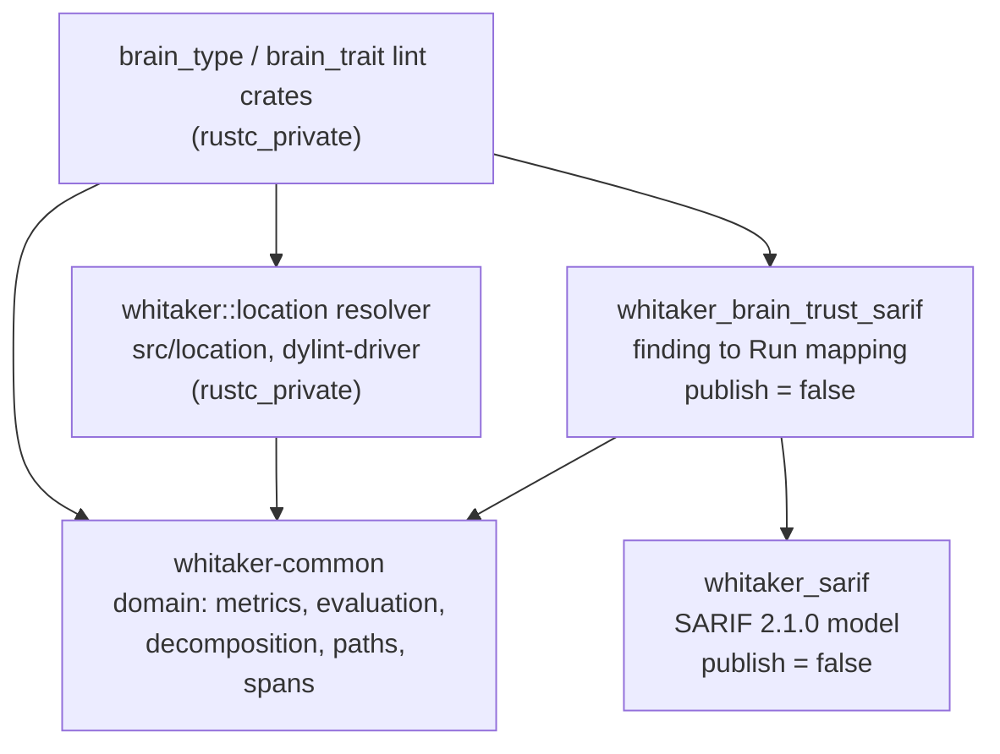

# Record an ADR formalizing the brain trust lint driver interfaces (6.1.3)

This ExecPlan (execution plan) is a living document. The sections
`Constraints`, `Tolerances`, `Risks`, `Progress`, `Surprises & discoveries`,
`Decision log`, `Outcomes & retrospective`, `Conformance basis`, and
`Verification plan` must be kept up to date as work proceeds.

Status: DRAFT

## Purpose / big picture

Whitaker already ships every piece of brain trust analysis except the part that
touches the Rust compiler. `whitaker-common` can score a type's Weighted
Methods Count (WMC), count its cohesion components, aggregate a trait's item
counts, and cluster its methods into decomposition suggestions. What it cannot
do is obtain any of that data from real source code, because nothing yet walks
the compiler's High-level Intermediate Representation (HIR) and feeds the
builders.

Four roadmap items are queued behind that gap. Items 6.2.4 and 6.3.3 create the
`brain_type` and `brain_trait` Dylint lint crates. Item 6.5.1 adds a Static
Analysis Results Interchange Format (SARIF) emitter. Items 6.6.1 to 6.6.3 add
configuration, localization, and user-interface (UI) tests. All four consume
the same seam and none of them owns it. The published execplan for 6.5.1 says
so in as many words: "This plan does not decide that contract. Roadmap item
6.1.3's ADR does" (`docs/execplans/`
`6-5-1-collect-brain-trust-diagnostics-into-sarif-emitter.md:1387`).

This item closes that gap by writing one architectural decision record (ADR).
After this change a contributor who picks up 6.2.4, 6.3.3, or 6.5.1 can read a
single document and know, without guessing: how a `rustc_span::Span` becomes a
repository-root-relative file identifier and a `whitaker_common::span::`
`SourceSpan`; which HIR callbacks populate `TypeMetricsBuilder` and
`TraitMetricsBuilder` and when; how `DecompositionSuggestion` values reach both
the compiler diagnostic and the SARIF result; the exact lint-pass lifecycle for
collecting and finalizing findings; and where the line falls between English
SARIF text and localized diagnostics.

You can observe success without running the tool. Open
`docs/adr-005-brain-trust-lint-driver-interfaces.md`, take any one of the five
questions above, and find a normative answer with a named type, a named
function, and a stated failure mode. Then open the 6.5.1 execplan §"The
contract with the lint crates" and confirm every shape it defers is answered.

### What the approver must decide

Two things in this plan are judgement calls that the maintainer may reasonably
overturn. Both are called out here so they are not buried.

1. **The ADR supersedes the 6.5.1 execplan in five places.** A design review of
   the first draft established that the interface shapes 6.5.1 proposes cannot
   compile: they form a Cargo dependency cycle, and one of the two edges also
   breaks `cargo publish -p whitaker-common`. Repairing that is not optional,
   but *how far* the repair reaches is a choice. This plan takes the narrow
   route: ADR 005 decides the correct shape, lists every supersession under
   "Known risks and limitations", and leaves the 6.5.1 execplan for its own
   implementer to reconcile at that plan's Stage A, which its text already
   provides for (`6-5-1-...md:1387-1390`). The alternative — revising the 6.5.1
   plan on this branch — is recorded in `Decision log` and rejected there.
2. **Two milestones add code to a documentation item.** `EP-M2` (an
   architecture-fitness guard) and `EP-M3` (a doc-comment correction in
   `common/src/span.rs`) are each separable: striking either leaves every other
   milestone coherent and complete. `Milestones and plateaus` records what is
   lost by striking each.

## Constraints

Hard invariants. Violation requires escalation, not a workaround.

- This item **must not** create `crates/brain_type/`, `crates/brain_trait/`, or
  the SARIF mapping crate the ADR specifies. The roadmap wording is explicit:
  the ADR is recorded "before any consumer is implemented"
  (`docs/roadmap.md:288-289`). Writing a consumer here would defeat the purpose
  of the decision record and pre-empt items 6.2.4, 6.3.3, and 6.5.1.
- This item **must not** change any public signature in `whitaker-common`,
  `crates/whitaker_sarif`, the root `whitaker` crate, or any existing lint
  crate. `EP-M3` changes doc-comment example literals only; if a doc change
  turns out to require a signature change, that is an escalation.
- `whitaker-common` must remain free of `rustc_private`
  (`docs/brain-trust-lints-design.md:155-161`).
- `whitaker-common` must remain publishable. It is in the publish set:
  `.github/workflows/release.yml:338` runs `cargo publish -p whitaker-common`,
  and `.github/workflows/ci.yml:160` runs `make publish-check` over it. It
  therefore must not gain a dependency on any `publish = false` crate;
  `crates/whitaker_sarif/Cargo.toml:5` and
  `crates/whitaker_clones_core/Cargo.toml:5` are both `publish = false`. This
  constraint is the reason ADR 005 must supersede the 6.5.1 execplan.
- The ADR must follow `docs/documentation-style-guide.md` §"Architectural
  decision records": filename `adr-NNN-short-description.md`, the required
  Status, Date, and "Context and problem statement" sections, sentence-case
  headings, and captioned tables.
- Prose wraps at 80 columns; fenced code at 120. Every fenced block carries a
  language identifier; non-code blocks are `plaintext`. Illustrative Rust uses
  `rust,ignore`, not `no_run` — see `Decision log`.
- Emphasis uses a single marker per file. `markdownlint` MD049 runs in
  consistent mode, so `_Table 1: ..._` captions fail in any file that also uses
  `*...*` emphasis.
- British English with Oxford `-ize` spelling
  (`docs/documentation-style-guide.md:7-24`). Two gates enforce this: `typos`,
  and a separate `spelling-phrase-check` compound-word list (`Makefile:202`).
- The ADR number is **005**. A scan of every remote branch for `docs/adr-0*`
  files found no competing fifth. If one lands before this branch merges,
  renumber and update `docs/contents.md` in the same commit.
- No new external crate dependency. `EP-M2`'s guard must be written against
  crates already resolvable for the crate that hosts it.
- Gates: `make markdownlint` and `make nixie` must pass at every milestone.
  `make check-fmt`, `make typecheck`, `make lint`, and `make test` must pass at
  the `EP-M2` and `EP-M3` boundaries and at completion.

## Tolerances (exception triggers)

Thresholds that trigger escalation, not quality targets.

- Scope: the expected file set is seven — the new ADR, `docs/contents.md`,
  `docs/roadmap.md`, this plan, one new test file for `EP-M2`, one fixture or
  helper file if `EP-M2` needs it, and `common/src/span.rs` for `EP-M3`. If the
  work requires more than eight tracked files, or touches any file under
  `crates/`, `suite/`, or `src/`, stop and escalate. Note that Stage B's probe
  runs in a throwaway git worktree and therefore modifies no tracked file; if
  the probe cannot be run that way, that is itself an escalation.
- Interface: if the ADR cannot be written without changing an existing public
  signature, stop, record the conflict in `Decision log`, set the status to
  `BLOCKED`, and ask whether the change belongs here or in the consuming item.
- Dependencies: if `EP-M2`'s guard needs a crate not already in the hosting
  crate's dependency closure, stop and escalate rather than adding one.
- Supersession: this plan supersedes the 6.5.1 execplan in five places, each
  recorded in `Decision log` and destined for the ADR's "Known risks and
  limitations". A sixth supersession is an escalation, because at that point
  the honest remedy is to rework the 6.5.1 plan rather than annotate it.
- Iterations: if a gate still fails after three fix attempts, stop and escalate
  with the captured log path.
- Ambiguity: if the design documents support two readings of a metric's subject
  boundary and the choice changes what implementers build, stop and present the
  options. `Open questions` already lists three such readings; each must be
  resolved or explicitly deferred in the ADR before `EP-M1` closes.

## Risks

- Risk: the ADR specifies a `rustc_*` interface that does not exist or does not
  behave as described under the pinned toolchain, `nightly-2026-05-28`.
  Severity: high. Likelihood: medium.
  Mitigation: only interfaces proven to compile on the pinned toolchain, or
  already called from a shipped lint crate, may appear in a normative
  signature. Stage B's probe is the proving step. Note that
  `crates/clippy_utils` is a **stub** carrying only `macros::is_panic`
  (`crates/clippy_utils/src/lib.rs:1-12`), not the upstream crate; nothing in
  the ADR may assume an upstream Clippy helper exists.
- Risk: an implementer follows the ADR and internal compiler errors (ICEs) the
  build. `span_delayed_bug` is not a quiet skip: when a compilation emits no
  real error, `DiagCtxtInner::flush_delayed` prints "no errors encountered even
  though delayed bugs were created" and re-emits every delayed bug as an ICE
  (verified at `rustc_errors/src/lib.rs:1480-1486` in the `rustc-src`
  component). A warn-only lint never emits a real error, so every delayed bug
  it creates becomes an ICE.
  Severity: high. Likelihood: high if unaddressed — the first draft cited a
  delayed-bug call site as the precedent to follow.
  Mitigation: the ADR prohibits the call outright on any data-dependent path,
  and records that `crates/bumpy_road_function/src/driver/mod.rs:224`, `:235`,
  and `segment_builder.rs:164`, `:186` carry the hazard today.
- Risk: findings are emitted where `#[allow]` cannot reach them.
  `LateContext::opt_span_lint` resolves the level at
  `self.last_node_with_lint_attrs` (`rustc_lint/src/context.rs:588`), which in
  `check_crate_post` is the crate root. Deferred emission through the ordinary
  `cx.emit_span_lint` path therefore ignores `#[allow(brain_type)]` on a type
  or `impl`, leaving users an unsuppressable lint.
  Severity: high. Likelihood: high if unaddressed — all eight shipped lints use
  `cx.emit_span_lint`, so it is the obvious thing to copy.
  Mitigation: the ADR requires the subject's `HirId` to be captured and
  emission to go through `TyCtxt::emit_node_span_lint`
  (`rustc_middle/src/ty/context.rs:2495`), which takes an explicit `HirId`.
- Risk: the seam silently stops producing SARIF and nobody notices, because a
  clean report and a broken resolver look identical.
  Severity: high. Likelihood: medium.
  Mitigation: resolution returns a typed reason rather than `Option`, every
  drop is logged, and the run carries an unresolved-subject count even when it
  is zero. Recorded as `VP-5`.
- Risk: whole-crate accumulation exhausts memory on a large crate. Retaining
  `MethodInfo` (two string sets, `common/src/lcom4/mod.rs:45`) plus
  `MethodProfile` (four string sets,
  `common/src/decomposition_advice/profile.rs:94`) for every method of every
  type is six string collections per method held until `check_crate_post`.
  Severity: medium. Likelihood: high on a large crate.
  Mitigation: the ADR mandates two-phase capture — cheap scalars during the
  callbacks, deep capture at finalization only for subjects past the gate.
- Risk: the ADR over-specifies, freezing a detail the first consumer must then
  fight.
  Severity: medium. Likelihood: medium.
  Mitigation: the ADR states contracts — inputs, outputs, ordering, failure
  modes — and names crate and module paths, but leaves internal data structures
  to the consumer. Anything it cannot justify from a precedent or a stated
  requirement goes under "Outstanding decisions".
- Risk: this branch is based on
  `origin/6-5-1-collect-brain-trust-diagnostics-into-sarif-emitter`, which is
  unmerged and which this ADR supersedes in five places.
  Severity: medium. Likelihood: medium.
  Mitigation: the ADR cites the 6.5.1 *roadmap item* and the *decision*, never
  line numbers in that plan. Each supersession is stated as a decision the ADR
  makes, so it reads correctly whether or not the sibling plan is revised.

## Progress

- [x] (2026-08-21) Branch created from
  `origin/6-5-1-collect-brain-trust-diagnostics-into-sarif-emitter` and pushed
  with an upstream tracking ref.
- [x] (2026-08-21) Reconnaissance complete across `whitaker-common`,
  `crates/whitaker_sarif`, the shipped lint crates, the localization plumbing,
  the ADR and ExecPlan house style, and the 6.5.1 deferral list.
- [x] (2026-08-21) External research complete: SARIF 2.1.0 §3.4.3, §3.4.4,
  §3.14.14, and §3.14.27; GitHub code-scanning guidance on repository-relative
  artefact URIs; the `rustc_lint::LateLintPass` callback set.
- [x] (2026-08-21) First draft written and reviewed by a six-lens design
  panel. Fifteen findings folded in, four of them blocking. The panel's
  substantive results are recorded in `Surprises & discoveries` and
  `Decision log`.
- [ ] EP-M0 Plan approved, including the two approver decisions in
  `Purpose / big picture`.
- [ ] EP-M1 `docs/adr-005-brain-trust-lint-driver-interfaces.md` written and
  registered in `docs/contents.md`.
- [ ] EP-M2 Architecture-fitness guard added (separable).
- [ ] EP-M3 `common/src/span.rs` column-convention doc examples corrected
  (separable).
- [ ] EP-M4 Roadmap item 6.1.3 marked done; living sections reconciled.

## Surprises & discoveries

- Observation: the interface shapes the 6.5.1 execplan defers to this ADR
  cannot compile. They form a Cargo dependency cycle.
  Evidence: `whitaker_sarif::span_to_region(span: SourceSpan) -> Region`
  (`6-5-1-...md:1262-1264`) requires `whitaker_sarif` to depend on
  `whitaker-common`; `BrainTrustSubject { file_uri: whitaker_sarif::FileUri,`
  `span: whitaker_common::span::SourceSpan }` in
  `common/src/brain_trust_sarif/finding.rs` (`6-5-1-...md:1315-1320`) requires
  the reverse. Neither edge exists today
  (`crates/whitaker_sarif/Cargo.toml:15-19`, `common/Cargo.toml:15-24`).
  Impact: this is the single most consequential thing the ADR must decide, and
  the 6.5.1 plan decides it two incompatible ways. Resolved in
  `Decision log` and specified in `Interfaces and dependencies`.
- Observation: the common-to-sarif edge would also break the release.
  Evidence: `whitaker-common` is published
  (`.github/workflows/release.yml:338`, `.github/workflows/ci.yml:160`) and has
  no `publish = false`, while `crates/whitaker_sarif/Cargo.toml:5` does.
  `Cargo.toml:50` declares `whitaker_sarif` with a version, so the packaged
  manifest would carry an unresolvable registry requirement. The workspace
  already knows this hazard: `Cargo.toml:51-54` documents keeping
  `whitaker_test_macros` path-only and dev-only for exactly this reason.
  Impact: confirms the edge direction independently of the cycle. The existing
  tree gets this right — `whitaker_sarif`'s only consumer is
  `whitaker_clones_core`, itself `publish = false`
  (`crates/whitaker_clones_core/Cargo.toml:5,21`).
- Observation: emitting a lint from `check_crate_post` silently disables
  `#[allow]` and `#[expect]` on the offending item.
  Evidence: `LateContext::opt_span_lint` resolves the level at
  `self.last_node_with_lint_attrs` (`rustc_lint/src/context.rs:588`, `:597`),
  which at crate-post time is the crate root. All eight shipped lints emit
  through `cx.emit_span_lint`, for example
  `crates/module_max_lines/src/driver.rs:193`.
  Impact: deferred emission is still the right lifecycle, but it requires
  `TyCtxt::emit_node_span_lint` (`rustc_middle/src/ty/context.rs:2495`) and a
  captured `HirId`. Without a normative rule the first implementer copies the
  eight existing call sites and ships an unsuppressable lint.
- Observation: `span_delayed_bug` aborts compilation rather than degrading.
  Evidence: `rustc_errors/src/lib.rs:1480-1486` in the `rustc-src` component —
  when no real error was emitted the delayed bugs are re-emitted as internal
  compiler errors. A warn-only lint never emits a real error.
  Impact: the first draft cited a delayed-bug call site as the precedent for
  routine degradation. It is the opposite: an assertion channel. The ADR
  prohibits it and records the four existing call sites as follow-up work.
- Observation: `LateLintPass::check_crate_post` has no return channel.
  Evidence: the signature returns `()` and rustc owns and drops the pass. The
  only in-tree precedent writes a file directly from `check_crate_post`
  (`crates/rstest_helper_should_be_fixture/src/driver.rs:262`), in append mode
  with no locking and no atomic rename (`:325-328`).
  Impact: "the pass produces a `Run` value and nothing more" is unimplementable
  as stated. The ADR must name the handoff mechanism and its concurrency
  discipline, because `cargo dylint` runs one rustc process per crate *and per
  target*, in parallel.
- Observation: `whitaker_common::span::SourceSpan` documents its columns as
  one-based, but its own examples construct `SourceLocation::new(1, 0)`.
  Evidence: `common/src/span.rs:12` says "one-based line and column numbers";
  `common/src/span.rs:67`, `:96`, `:112`, `:129`, `:135`, and
  `common/src/diagnostics.rs:155` all pass `0`.
  Impact: the ADR is about to cite this type as normative, and rendered
  rustdoc is the contract a consumer reads. `EP-M3` corrects the literals.
- Observation: the SARIF model has no `columnKind` field.
  Evidence: `crates/whitaker_sarif/src/model/run.rs:35-53` lists `tool`,
  `invocations`, `results`, and `artefacts` only. SARIF 2.1.0 §3.14.27 defines
  `columnKind` with values `utf16CodeUnits` and `unicodeCodePoints`.
  Impact: the repository's only SARIF producer counts UTF-16 code units
  (`crates/whitaker_clones_core/src/run0/span.rs:78-79`) but never says so on
  the wire, so consumers must infer it from a contested default. The ADR
  requires the field to be emitted explicitly rather than relying on the
  default.
- Observation: `SarifResult::partial_fingerprints` is a `HashMap`.
  Evidence: `crates/whitaker_sarif/src/model/result.rs:107-108`, serialized in
  iteration order.
  Impact: byte-stable output is a stated goal, and a `HashMap` with more than
  one key defeats it. One key exists today, so it does not bite yet.
- Observation: `crates/clippy_utils` is a local stub, not upstream Clippy.
  Evidence: `crates/clippy_utils/src/lib.rs:1-12` — "Minimal `clippy_utils`
  stub exposing panic detection helpers", providing only `macros::is_panic`.
  Impact: no ADR rule may reach for an upstream Clippy diagnostic helper such
  as `span_lint_hir`. The `rustc_middle` route is the only one available.
- Observation: six files under `common/src/` mention `rustc_` in prose.
  Evidence: `common/src/lcom4/mod.rs:11`, `common/src/lcom4/extract.rs:11`,
  `common/src/decomposition_advice/mod.rs:8`,
  `common/src/brain_trait_metrics/mod.rs:15`,
  `common/src/brain_type_metrics/mod.rs:7`,
  `common/src/brain_type_metrics/cognitive_complexity.rs:7`, plus the genuine
  macro-body references in `common/src/dylint_entry.rs:19-42`.
  Impact: a substring scan is the wrong shape for an architecture guard. It
  contributed to retargeting `EP-M2` — see `Decision log`.
- Observation: the seam is entirely greenfield. Nothing in the tree converts a
  `Span` into a path string, relative or otherwise.
  Evidence: `span_to_filename` is called once, in
  `crates/rstest_helper_should_be_fixture/src/visitor.rs:90`, and its result is
  used only as an in-process deduplication key (`collector.rs:68-74`).
  Impact: there is no existing convention to preserve, so the ADR is free to
  choose the cheapest correct rule.

## Decision log

- Decision: write one ADR covering all five questions rather than five small
  ones.
  Rationale: the roadmap names a single deliverable, the five questions share
  one layering decision, and splitting them would force a reader of 6.2.4 to
  assemble five documents.
  Date/Author: 2026-08-21, planning agent.

- Decision: number the ADR 005.
  Rationale: `adr-001` through `adr-004` exist and no remote branch introduces
  a fifth. The 6.5.1 execplan deliberately declines to hard-code its own number
  and expects 6.1.3's ADR to claim the next free one (`6-5-1-...md:434-437`).
  Date/Author: 2026-08-21, planning agent.

- **Decision: break the dependency cycle by keeping both `whitaker-common` and
  `whitaker_sarif` as dependency-free leaves, and introducing a third crate
  that depends on both.**
  Rationale: three shapes were considered. (i) `whitaker-common` depends on
  `whitaker_sarif` — rejected: it breaks `cargo publish -p whitaker-common`,
  and it makes the pure domain depend on a wire format. (ii) `whitaker_sarif`
  depends on `whitaker-common` — publishable and acyclic, but it drags
  `fluent-templates` and `unic-langid` into the clone detector for no benefit,
  and it still leaves the SARIF mapping module inside `whitaker-common`,
  adjacent to `common/src/i18n/`, where the ADR's English-only rule becomes
  unenforceable by any manifest check. (iii) *Chosen*: neither leaf depends on
  the other; a new `crates/whitaker_brain_trust_sarif` (`publish = false`)
  depends on both and owns the mapping. This mirrors the shape the repository
  already uses for `whitaker_clones_core`, keeps `whitaker-common` publishable,
  keeps `whitaker_sarif` a pure model, and turns the English-only rule into a
  manifest fact. **This supersedes the 6.5.1 execplan's placement of
  `common/src/brain_trust_sarif/`.**
  Date/Author: 2026-08-21, planning agent, after design review.

- **Decision: the repository-relative path newtype lives in `whitaker-common`,
  not in `whitaker_sarif`.**
  Rationale: its invariant — repository-root-relative, forward-slashed, no
  `..`, no drive letter — is a repository-path invariant, not a SARIF one.
  SARIF is one consumer; the localized compiler diagnostic and the fingerprint
  components are others. `whitaker-common` already depends on `camino`
  (`common/Cargo.toml:16`), which is exactly the UTF-8 path vocabulary
  required. **This supersedes the 6.5.1 execplan's placement of `FileUri` in
  `whitaker_sarif::model::location`.**
  Date/Author: 2026-08-21, planning agent, after design review.

- **Decision: `span_to_region` lives in the mapping crate, not in
  `whitaker_sarif`.**
  Rationale: it is the only function in the 6.5.1 shape that forces
  `whitaker_sarif` to know about `whitaker-common`. Moving it into the crate
  that already depends on both leaves `whitaker_sarif` a leaf.
  **This supersedes the 6.5.1 execplan.**
  Date/Author: 2026-08-21, planning agent, after design review.

- **Decision: every Whitaker SARIF run must state `columnKind` explicitly.**
  Rationale: the repository's producer counts UTF-16 code units
  (`crates/whitaker_clones_core/src/run0/span.rs:78-79`) but the model has no
  field to say so (`crates/whitaker_sarif/src/model/run.rs:35-53`). The default
  for an absent `columnKind` is contested in the SARIF issue tracker, so
  relying on it is unsafe regardless of which reading is right. Emitting the
  field removes the question. **This supersedes the 6.5.1 execplan's
  observation that the clone detector "already matches SARIF's default
  `columnKind`".**
  Date/Author: 2026-08-21, planning agent, after design review.

- **Decision: `partialFingerprints` must be an ordered map.**
  Rationale: byte-stable output is a stated goal for continuous-integration
  comparison, and `HashMap` serializes in randomized iteration order
  (`crates/whitaker_sarif/src/model/result.rs:107-108`). One key exists today,
  and the 6.5.1 plan's versioned-key convention invites more. **This
  supersedes the 6.5.1 execplan, which addresses ordering for
  `serde_json::Value` objects but not for the typed map.**
  Date/Author: 2026-08-21, planning agent, after design review.

- Decision: do not revise `docs/execplans/6-5-1-...md` on this branch.
  Rationale: it belongs to an unmerged sibling branch, its Stage A already
  gates on reading and reconciling with this ADR, and its own text states that
  where the two disagree "the ADR wins" (`6-5-1-...md:1387-1390`). Editing a
  sibling's plan from here would create a merge conflict on a document neither
  branch owns. The five supersessions are listed in the ADR so its implementer
  finds them. Rejected alternative: revise both, which is tidier on paper and
  worse in practice.
  Date/Author: 2026-08-21, planning agent.

- Decision: `resolve_subject_location` returns `Result<_, LocationUnavailable>`
  rather than `Option`.
  Rationale: four distinct failure modes collapse into one `None`, and the
  operationally important one — the resolver is misconfigured and *every*
  subject is dropped — is then indistinguishable from a clean crate. Widening
  `Option` to `Result` later breaks every call site; adding a variant to a
  `#[non_exhaustive]` enum does not. The 6.5.1 plan applies exactly this
  reasoning one layer up, keeping `Ok(None)` for "disabled" and
  `Ok(Some(empty))` for "clean" (`6-5-1-...md:1376-1378`).
  Date/Author: 2026-08-21, planning agent, after design review.

- Decision: `resolve_subject_location` lives in the root `whitaker` crate at
  `src/location/mod.rs`, behind the existing `dylint-driver` feature.
  Rationale: that crate is already the home for shared rustc-facing helpers
  (`src/lib.rs:13-25` gates `pub mod hir` the same way), every lint crate
  already depends on it with the right feature, and it is not in the publish
  set. A new module rather than `src/hir/`, because `src/hir/mod.rs` is 374
  lines against the 400-line cap in `AGENTS.md:31`. Rejected: duplication in
  each lint crate, which guarantees the two copies drift; and a new
  `crates/whitaker_lint_support`, which duplicates what `whitaker` plus
  `dylint-driver` already is.
  Date/Author: 2026-08-21, planning agent, after design review.

- Decision: mandate two-phase capture — scalars in the callbacks, deep capture
  at finalization for gated subjects only.
  Rationale: the first draft required single-traversal fan-out to all four
  builders *and* moved the cheap gate to finalization. Together those force
  retention of six string collections per method for every type in the crate,
  and leave the gate guarding only the clustering step — inverting the
  performance rule at `docs/brain-trust-lints-design.md:361-365` that the rule
  cited as its justification. Two-phase capture satisfies both: the gate sees a
  complete method count, and only subjects past it pay for deep analysis. HIR
  is fully available in `check_crate_post`, and `BodyId` is `Copy`, so it can
  be held on a pass struct that is not parameterized by `'tcx`.
  Date/Author: 2026-08-21, planning agent, after design review.

- Decision: order findings by definition path first, location second.
  Rationale: the first draft's key began with the file identifier, which is
  absent for any subject whose location did not resolve — and the ADR requires
  those subjects to be diagnosed anyway. It also collides for two `impl` blocks
  on one line, for macro-generated types sharing an expansion span, and for the
  same subject compiled for the lib and test targets. `def_path_str` is
  globally unique and stable, and the only in-tree precedent already keys on a
  definition path (`crates/rstest_helper_should_be_fixture/src/`
  `collector.rs:62`).
  Date/Author: 2026-08-21, planning agent, after design review.

- Decision: retarget `EP-M2` from the `whitaker-common`-has-no-compiler
  boundary to the mapping-crate-has-no-localization boundary.
  Rationale: the original target is dormant. `whitaker-common` has never had a
  compiler dependency, and acquiring one would break `cargo publish` loudly and
  immediately. The boundary the ADR actually puts at risk is the English-only
  rule, and decision three above moves the mapping into its own crate precisely
  so that rule becomes a manifest fact. A guard on a manifest edge is also
  robust in a way a source substring scan is not: six files under `common/src/`
  mention `rustc_` in prose today, so the original guard would have needed a
  six-entry exception list that nobody would maintain.
  Date/Author: 2026-08-21, planning agent, after design review.

- Decision: the ADR's Rust blocks are `rust,ignore`, not `no_run`.
  Rationale: `no_run` compiles, and a bodiless `pub fn` outside a trait is not
  valid Rust. The style guide's `no_run` guidance
  (`docs/documentation-style-guide.md:409`) is right for runnable examples and
  wrong for signature sketches.
  Date/Author: 2026-08-21, planning agent, after design review.

- Decision: the ADR must not restate metric definitions, thresholds, or
  clustering rules already recorded in `docs/brain-trust-lints-design.md`.
  Rationale: those are settled and shipped. Restating them creates two sources
  of truth that will drift.
  Date/Author: 2026-08-21, planning agent.

- Decision: the ADR carries a real "Options considered" section.
  Rationale: the first draft was almost entirely normative rules — the *what*
  with no *why*. For a document gating six roadmap items, that is the one thing
  an ADR exists to prevent. The section is conditional in the house template
  (`docs/documentation-style-guide.md:386-387`), but the condition is met here.
  Date/Author: 2026-08-21, planning agent, after design review.

## Outcomes & retrospective

To be completed at `EP-M4`. Before setting this plan to `COMPLETE`, reconcile
every discovery against the artefacts named in `Conformance basis`: if drafting
the ADR falsified an assumption in `docs/brain-trust-lints-design.md`, amend
that document; confirm every supersession of the 6.5.1 execplan appears in the
ADR's "Known risks and limitations" and in `Decision log` above.

## Context and orientation

Read this section if you have never opened this repository.

### What Whitaker is

Whitaker is a suite of Rust lints distributed as Dylint libraries. Dylint loads
lint crates from dynamic libraries so they can use the compiler's unstable
internals without forking Clippy. Each lint crate under `crates/` follows one
shape: `src/lib.rs` gates a `driver` module behind a `dylint-driver` Cargo
feature, and `driver.rs` holds the `rustc_lint` implementation. The lint is
declared with `dylint_linting::impl_late_lint!` inside a private `declaration`
module and the constant re-exported
(`crates/module_max_lines/src/driver.rs:39-56`). `suite/` aggregates the
shipped lints into one combined late pass (`suite/src/driver.rs:23-49`).

`whitaker-common` (the `common/` directory) is the shared library. It has no
compiler dependency: its manifest lists no `rustc_*` crate
(`common/Cargo.toml:14-24`), and the only real mention in its source is inside
the body of the `declare_dylint_register_entry!` macro
(`common/src/dylint_entry.rs:19-42`), which expands at the call site. It is
also the only brain-trust-relevant crate that is **published**
(`.github/workflows/release.yml:338`).

The root `whitaker` crate is the shared home for rustc-facing helpers: it gates
`pub mod hir` behind `dylint-driver` (`src/lib.rs:13-25`), depends on
`whitaker-common` unconditionally (`Cargo.toml:91`), and is depended on by
every lint crate with `features = ["dylint-driver"]`.

### What "brain trust" means here

A *brain type* is a type that has grown to hoard behaviour: high total
complexity, at least one enormous method, poor internal cohesion. A *brain
trait* is the trait-shaped analogue. The subject boundaries drive the
lifecycle decision:

- `brain_type`'s unit of analysis is "a nominal type plus all its methods
  defined in the current crate", explicitly including "the type definition and
  all inherent `impl` blocks" *and* "all trait implementation methods for that
  type in the crate" (`docs/brain-trust-lints-design.md:51-56`).
- `brain_trait`'s unit is "a single trait definition"
  (`docs/brain-trust-lints-design.md:62`).

A type's methods are therefore spread over arbitrarily many `impl` items that
the compiler hands to a lint pass one at a time, so its metrics are only
complete once the whole crate has been walked. A trait's items all arrive
together in one `ItemKind::Trait`.

### What already exists in `whitaker-common`

All shipped, tested, and infallible — no `build()` in this list returns a
`Result`.

- `lcom4::MethodInfoBuilder` with `record_field_access(&str, bool)` and
  `record_method_call(&str, bool)`, and `cohesion_components(&[MethodInfo])`
  `-> usize` (`common/src/lcom4/extract.rs:63-160`,
  `common/src/lcom4/mod.rs:307`).
- `brain_type_metrics::CognitiveComplexityBuilder` with
  `record_structural_increment`, `record_nesting_increment`,
  `record_fundamental_increment`, `push_nesting`, and `pop_nesting`
  (`common/src/brain_type_metrics/cognitive_complexity.rs:57-270`). Its
  `build()` panics if the nesting stack is unbalanced, and `pop_nesting` on an
  empty stack panics.
- `brain_type_metrics::ForeignReferenceSet::record_reference(&str, bool)`
  (`common/src/brain_type_metrics/foreign_reach.rs:37-148`).
- `brain_type_metrics::TypeMetricsBuilder::new(name, cc_threshold,`
  `loc_threshold)` with `add_method(name, cc, loc)`, `set_lcom4`,
  `set_foreign_reach`, and `build() -> TypeMetrics`
  (`common/src/brain_type_metrics/mod.rs:283-321`). `add_method` pushes
  unconditionally with no name deduplication.
- `brain_trait_metrics::TraitMetricsBuilder::new(name)` with
  `add_required_method`, `add_default_method(name, cc, is_from_expansion)`,
  `add_associated_type`, `add_associated_const`, and `build() -> TraitMetrics`
  (`common/src/brain_trait_metrics/metrics.rs:137-263`).
- `evaluate_brain_type` and `evaluate_brain_trait`, each returning `Pass`,
  `Warn`, or `Deny` (`common/src/brain_type_metrics/evaluation.rs:250`,
  `common/src/brain_trait_metrics/evaluation.rs:228`).
- `decomposition_advice::suggest_decomposition(&DecompositionContext,`
  `&[MethodProfile]) -> Vec<DecompositionSuggestion>`
  (`common/src/decomposition_advice/suggestion.rs:157`) and
  `format_diagnostic_note` (`common/src/decomposition_advice/note.rs:61`).
- Per-lint English renderers returning `String` and `Option<String>` rather
  than compiler diagnostics
  (`common/src/brain_type_metrics/diagnostic.rs:123-286`).

The only callers of the two metrics builders today are behavioural tests under
`common/tests/`, which feed handwritten strings and integers.

### What already exists for SARIF

`crates/whitaker_sarif` is a compiler-free, `serde`-based model of SARIF 2.1.0
with `publish = false`. It provides `SARIF_SCHEMA` and `SARIF_VERSION`
(`model/log.rs:11-17`), an `ArtefactLocation` with a plain `uri: String` and an
optional `uri_base_id` (`model/location.rs:61-68`), a validating
`RegionBuilder` that rejects a zero line or column
(`builders/location_builder.rs:37-91`), `ResultBuilder`, `RunBuilder`,
`SarifLogBuilder`, rule descriptors `WHK001` to `WHK003` (`src/rules.rs`), and
merge and deduplication helpers (`src/merge.rs:104-145`). Nothing in it
validates that a URI is repository-relative, and it has no `columnKind` field.

The clone detector is the only shipped producer. It emits one-based UTF-16
code-unit columns (`crates/whitaker_clones_core/src/run0/span.rs:69-79`) and
`uri_base_id: None` (`run0/emit.rs:174`).

### What already exists for localization

`.ftl` files live under `common/locales/<locale>/<lint_name>.ftl` for `en-GB`,
`cy`, and `gd`, loaded with `en-GB` as fallback
(`common/src/i18n/locales.rs:31-36`). Each lint calls
`get_localizer_for_lint` in `check_crate`
(`common/src/i18n/helpers.rs:34-41`), then resolves at the emit site with
`safe_resolve_message_set`, which turns a missing Fluent key into a
lint-supplied English fallback (`common/src/i18n/helpers.rs:180-206`).

## Conformance basis

Upstream artefacts, at the revisions present on this branch (base commit
`f03d3e7`):

- `docs/roadmap.md` item 6.1.3 (lines 288-297) — the requirement discharged
  here. Its five questions are `BTD-REQ-01` to `BTD-REQ-05` below.
- `docs/brain-trust-lints-design.md` §"Lint overview", §"Implementation
  approach", and the shipped §"Implementation decisions" subsections — the
  technical design the ADR must not contradict.
- `docs/execplans/6-5-1-collect-brain-trust-diagnostics-into-sarif-emitter.md`
  §"Interfaces and dependencies" — a downstream plan that defers to this ADR
  and which this ADR supersedes in five places.
- `docs/documentation-style-guide.md` §"Architectural decision records" — the
  governing standard for the deliverable's form.
- `docs/whitaker-dylint-suite-design.md` and
  `docs/whitaker-clone-detector-design.md` §"SARIF schema and mapping".
- SARIF 2.1.0 (OASIS, Errata 01) §3.4.3, §3.4.4, §3.14.14, §3.14.27, §3.30.6.

There is no Terms of Reference artefact; the roadmap item is the top of the
chain. Trace links:

```plaintext
roadmap 6.1.3 / BTD-REQ-01 -> ADR-005 §Location resolution  -> EP-M1 -> AC-1
roadmap 6.1.3 / BTD-REQ-02 -> ADR-005 §HIR capture          -> EP-M1 -> AC-1
roadmap 6.1.3 / BTD-REQ-03 -> ADR-005 §Suggestion rendering -> EP-M1 -> AC-1
roadmap 6.1.3 / BTD-REQ-04 -> ADR-005 §Lint-pass lifecycle  -> EP-M1 -> AC-1
roadmap 6.1.3 / BTD-REQ-05 -> ADR-005 §Language boundary    -> EP-M1 -> AC-1
ADR-005 §Language boundary -> EP-M2 -> tests::architecture_boundary
ADR-005 §Location resolution -> EP-M3 -> common/src/span.rs doc examples
roadmap 6.1.3 (completion) -> EP-M4 -> roadmap checkbox 6.1.3
```

Requirement identifiers, quoting `docs/roadmap.md:288-297`:

- `BTD-REQ-01`: "how a `rustc_span::Span` and `TyCtxt` yield a
  repository-root-relative file identifier and a `SourceSpan`".
- `BTD-REQ-02`: "how HIR traversal populates `TypeMetricsBuilder` and
  `TraitMetricsBuilder`".
- `BTD-REQ-03`: "how `DecompositionSuggestion` values reach diagnostic and
  SARIF rendering".
- `BTD-REQ-04`: "the lint-pass lifecycle for collecting and finalizing
  findings".
- `BTD-REQ-05`: "the boundary between English SARIF text and localized
  diagnostics".

## Verification plan

This item's deliverable is a decision record. Most obligations it *creates* are
discharged by the consuming items, and each is named below with the harness the
ADR must mandate, so a future implementer inherits an instruction rather than a
gap. Two obligations are dischargeable here.

### VP-1 — the SARIF mapping crate cannot reach the localization surface

- Obligation: the crate that maps brain trust findings to SARIF does not depend
  on `whitaker-common`, and therefore cannot reach
  `whitaker_common::i18n`. Equivalently: the English-only rule is a manifest
  fact, not a convention.
- Method: parameterized unit test with `rstest`, using `googletest` matchers
  and `pretty_assertions`, asserting over the manifest's dependency tables.
- Rationale: this is a structural property decidable by inspecting one
  manifest. A property test would generate nothing meaningful. The correct
  rigour is a cheap, total check on every `make test`.
- Domain: every dependency table in the mapping crate's manifest —
  `[dependencies]`, `[dev-dependencies]`, `[build-dependencies]`, and any
  `[target.'cfg(...)'.dependencies]` — checking both the key and any
  `package = ` rename.
- Artefact: a test under `common/tests/` or the hosting crate's `tests/`,
  named in Stage D once the ADR fixes the crate name.
- Evidence: `cargo nextest run architecture_boundary`. Red first: assert
  against a manifest fixture that *does* declare the forbidden dependency and
  observe the failure name it.
- Non-vacuity: three checks, all permanent assertions in the test rather than
  one-time manual rituals. First, a fixture manifest declaring
  `whitaker-common = { workspace = true }` must fail. Second, a fixture
  declaring it under a rename (`loc = { package = "whitaker-common" }`) must
  also fail — a key-only scan passes this and is wrong. Third, the test asserts
  a floor: at least one dependency table was found and at least one dependency
  was examined, so a path typo or a restructure cannot make it pass vacuously.
- Status: **deferred to `EP-M2`, and dependent on the ADR naming the crate.**
  Until the crate exists the test runs against fixture manifests only, which is
  honest: it verifies the *rule*, and gains teeth when the crate lands.

### VP-2 — every deferred contract has a normative answer

- Obligation: each of `BTD-REQ-01` to `BTD-REQ-05`, and each shape the 6.5.1
  execplan defers, is answered in ADR-005 by a named type or function, a stated
  input, a stated output, and a stated failure mode.
- Method: structured review checklist, executed at the `EP-M1` boundary.
- Rationale: this is a completeness property of prose; no test decides it. A
  fixed enumeration makes a gap visible as a failed line.
- Domain: the checklist in `Validation and acceptance`, rows C-1 to C-26.
- Artefact: that table, completed in this plan.
- Evidence: every row reads "answered" with a section reference.
- Non-vacuity: the checklist is written *before* the ADR is drafted, from the
  roadmap and the 6.5.1 plan, never derived from the finished ADR. The stage
  sequence enforces it: the checklist is Stage A output, the ADR is Stage C
  output. Rows C-20 to C-26 were added by design review *after* the first
  draft, which is itself evidence the mechanism catches gaps.

### VP-3 — delegated: column conversion preserves SARIF region validity

- Obligation: converting a compiler position to a SARIF region yields
  `startLine >= 1`, `startColumn >= 1` when present, an end position not before
  the start, columns counted in UTF-16 code units, and an `endColumn` that
  denotes the column *following* the region per SARIF §3.30.6.
- Method: property test with `proptest` over generated source text containing
  astral-plane characters, combining characters, tabs, and CRLF line endings.
- Rationale: the domain is unbounded, the failure is silent, and the two
  candidate conventions genuinely differ — the incumbent counts
  `line_slice.encode_utf16().count()` and adds one
  (`crates/whitaker_clones_core/src/run0/span.rs:78-79`), whereas rustc reports
  Unicode scalar positions. Examples will not find the disagreement.
- Domain: bounded-length source strings over an alphabet including at least one
  character outside the Basic Multilingual Plane.
- Artefact: created by the first consuming item that constructs a `Region` from
  a compiler span.
- Evidence: a passing `proptest` run with the regression file committed.
- Non-vacuity: the generator must be classified so at least one case per run
  contains a non-Basic-Multilingual-Plane character; a run whose
  classification shows zero such cases is a failure. Negative control: replace
  `encode_utf16().count()` with `chars().count()` and confirm the property
  fails.
- **Open sub-question for Stage B**: the incumbent producer sets its end
  position to the byte index of the *last* character
  (`crates/whitaker_clones_core/src/run0/span.rs:22-26`), which makes
  `endColumn` the last character's own column rather than one past it. If that
  is an off-by-one against SARIF §3.30.6, the ADR must not ratify it as
  "matches the existing producer". Confirm before drafting.
- Status: **not discharged here, deliberately.**

### VP-4 — delegated: finalization is idempotent and emission is deterministic

- Obligation: a pass that collects across callbacks and finalizes once produces
  the same ordered finding sequence regardless of the compiler's item
  visitation order, and finalizing twice changes nothing.
- Method: property test with `proptest` over permutations of a synthetic item
  stream, plus an `rstest-bdd` behavioural test asserting diagnostic order.
- Rationale: SARIF output must be byte-stable for continuous-integration
  comparison. This is an invariant over orderings.
- Domain: permutations of a fixed multiset of captured subjects.
- Artefact: created by roadmap item 6.2.4 or 6.3.3.
- Evidence: a passing permutation-invariance property.
- Non-vacuity: negative control — key the collector on a `HashMap` and confirm
  the property fails.
- **Correction to the first draft's rationale**: `impl_late_lint!` registers a
  whole-crate sequential pass, not a per-module one, so rustc's visitation
  order may well be stable. The property is still worth having, because the
  real nondeterminism is elsewhere — `HashMap` iteration in
  `partial_fingerprints`, and multi-process interleaving across compilation
  units — but the ADR must state the honest reason.
- Status: **not discharged here, deliberately.**

### VP-5 — delegated: degradation is observable

- Obligation: a run in which every subject failed location resolution is
  distinguishable, from the emitted artefact alone, from a run in which the
  crate was clean.
- Method: behavioural test with `rstest-bdd` over a fixture crate whose sources
  lie outwith the resolver's repository root, asserting that the emitted run
  reports a non-zero unresolved count.
- Rationale: this is the highest-value delegated obligation in the document.
  Every other failure in this seam is loud; this one is silent, and silence
  reads as success. GitHub code scanning treats a rule that stops reporting as
  fixed and closes its alerts.
- Domain: one fixture with all subjects unresolvable, one clean fixture, one
  mixed.
- Artefact: created by roadmap item 6.5.1.
- Evidence: the three fixtures produce three distinguishable artefacts.
- Non-vacuity: the negative control is to drop the counter and confirm the
  all-unresolvable fixture becomes byte-identical to the clean one.
- Status: **not discharged here, deliberately.** Newly added by design review;
  the first draft had no observability obligation at all.

### Axioms

Assumptions the reasoning depends on, not verified here:

- Cargo invokes `rustc` with the workspace root as the working directory for
  workspace members. Stage B tests this against a real `cargo dylint`
  invocation, **not** against the UI-test harness: that harness copies each
  fixture into a temporary directory and compiles there
  (`common/src/test_support/ui.rs:85-94`), so the compiler's working directory
  in a UI run is `/tmp/...` and the experiment could not falsify the claim.
- `SourceMap::span_to_lines` and `span_to_filename` behave as the shipped lint
  crates rely on them behaving
  (`crates/bumpy_road_function/src/driver/segment_builder.rs:223-238`,
  `crates/rstest_helper_should_be_fixture/src/visitor.rs:90-96`).
- `TyCtxt::emit_node_span_lint` resolves the lint level at the supplied
  `HirId`. Read from `rustc_middle/src/ty/context.rs:2495` in the `rustc-src`
  component; Stage B confirms it compiles on the pinned toolchain.
- `serde_json` serializes the `whitaker_sarif` model to conforming SARIF
  2.1.0. This is the clone detector's existing assumption.
- SARIF consumers resolve a relative `artifactLocation.uri` against the
  repository root when `uriBaseId` is absent, as GitHub code scanning
  documents.

## Plan of work

### Stage A — enumerate the contract, before drafting

No files change. Build the `VP-2` checklist from `docs/roadmap.md:288-297` and
the 6.5.1 execplan's deferral list, and write the rows into
`Validation and acceptance` with every status "not answered". The checklist is
the specification for the ADR, so it must not be derived from the ADR.

Stage A ends when the checklist exists and this plan is approved, including the
two decisions in `Purpose / big picture`.

### Stage B — probe the compiler API

Confirm, on `nightly-2026-05-28`, the interfaces and behaviours the ADR will
assert. Run the probe in a **throwaway git worktree** so no tracked file is
ever dirtied and "revert" cannot fail.

The probe must answer six questions:

1. What does `span_to_filename` return for a workspace-local file under a real
   `cargo dylint` invocation — a relative path or an absolute one?
2. What does the compiler report as its working directory, and does stripping
   it from an absolute path yield a repository-relative result?
3. What happens for a path dependency located outwith the workspace? This is
   the case that produces `..` components, which the ADR's normalization rule
   forbids.
4. Does `cx.tcx.emit_node_span_lint(lint, hir_id, span, decorator)` compile,
   and does `#[allow]` on the item suppress a finding emitted from
   `check_crate_post` through it, where `cx.emit_span_lint` does not?
5. Is `span_to_lines` sufficient for both the file and the line indices, or
   does the column conversion need `lookup_char_pos`? State the base of each:
   `span_to_lines` yields a zero-based `line_index`, whereas `lookup_char_pos`
   yields a one-based `Loc::line`, and both yield zero-based `CharPos`
   columns. Conflating them is a guaranteed off-by-one.
6. Is the incumbent producer's `endColumn` inclusive or exclusive against SARIF
   §3.30.6? See `VP-3`'s open sub-question.

Constraints on the probe:

- Do **not** use `dbg!`. The workspace denies `clippy::dbg_macro`
  (`Cargo.toml:117`), and driver stderr is captured and diffed against `.stderr`
  fixtures by `dylint_testing`, so a stray print fails UI tests.
- Use the Makefile's mandatory flags. Building these crates without
  `RUSTFLAGS="-C prefer-dynamic -Z force-unstable-if-unmarked -D warnings"`
  (`Makefile:135`, `:224`) produces link failures or divergent behaviour.
- Probe against a real workspace lint run, plus a scratch workspace containing
  an out-of-tree path dependency for question 3.

Any interface the probe cannot confirm appears in the ADR as a described
behaviour with the call left to the implementer, never as an invented
signature.

Stage B ends when the six answers are written into `Artefacts and notes` and
the worktree is removed.

### Stage C — draft the ADR

Create `docs/adr-005-brain-trust-lint-driver-interfaces.md` following the house
template, including a real "Options considered" section covering the crate-edge
decision, the capture strategy, and the emission lifecycle. Draft the normative
content from `Interfaces and dependencies` below, corrected by Stage B. Add the
layering diagram as Mermaid, with a screen-reader description above and a
caption below. List all five supersessions of the 6.5.1 execplan under "Known
risks and limitations".

Register the ADR in `docs/contents.md` §"Decision records", matching the
existing entry style.

Stage C ends when `make markdownlint` and `make nixie` pass and every checklist
row reads "answered".

### Stage D — add the architecture-fitness guard (separable)

Add the `VP-1` guard. Follow red-green: write it against a fixture manifest
that declares the forbidden dependency and observe the failure; then add the
clean fixture and the renamed-dependency fixture and the non-vacuity floor.

Stage D ends when `make check-fmt`, `make typecheck`, `make lint`, and
`make test` all pass.

### Stage E — correct the column-convention examples (separable)

Change the `0` column literals in `common/src/span.rs:67`, `:96`, `:112`,
`:129`, `:135`, and `common/src/diagnostics.rs:155` to `1`, so the rendered
documentation of a type the ADR cites as normative stops contradicting its own
prose. Doc-comment only: no signature, no behaviour, no public API change.

Stage E ends when `make test` passes, including doctests.

### Stage F — mark the roadmap and reconcile

Flip `docs/roadmap.md` item 6.1.3 to `- [x]`. Reconcile the living sections.
Set the status to `COMPLETE` only after confirming no discovery falsified an
upstream assumption without that artefact being updated.

## Milestones and plateaus

### EP-M1 — the ADR exists and is registered

- Outcome: `docs/adr-005-brain-trust-lint-driver-interfaces.md` answers all
  five requirements and every 6.5.1 deferral, and is listed in
  `docs/contents.md`. A contributor starting 6.2.4 has a complete contract.
- Requirements: `BTD-REQ-01` through `BTD-REQ-05`.
- Changes: `docs/adr-005-brain-trust-lint-driver-interfaces.md` (new),
  `docs/contents.md` (one entry).
- Red artefact: the `VP-2` checklist, written in Stage A with every row reading
  "not answered". Red by construction before drafting.
- Acceptance evidence (`AC-1`): every row reads "answered" with a section
  reference; all five supersessions appear under "Known risks and
  limitations"; `make markdownlint` and `make nixie` pass.
- Conformance check: the ADR contradicts nothing in
  `docs/brain-trust-lints-design.md`; every contradiction with the 6.5.1
  execplan is listed; no public interface, dependency, trust boundary, or
  persisted format changed *by this milestone*.
- Recovery: two documentation files. Revert the commit.
- Remaining gaps: no consumer exists; `VP-3`, `VP-4`, and `VP-5` are delegated.
- Compatibility decision: none required.

### EP-M2 — the language boundary is a manifest fact (separable)

- Outcome: a test fails if the SARIF mapping crate acquires a dependency that
  would let it reach the localization surface.
- Requirements: `BTD-REQ-05`.
- Changes: one test file, plus fixture manifests.
- Red artefact: the guard run against a fixture manifest declaring the
  forbidden dependency, which must fail naming it.
- Acceptance evidence (`AC-2`): the three non-vacuity checks in `VP-1` all
  behave as specified; `make check-fmt`, `make typecheck`, `make lint`, and
  `make test` pass.
- Conformance check: no production code changed; no dependency added; the test
  asserts a rule the ADR states.
- Recovery: delete the file. `EP-M1`, `EP-M3`, and `EP-M4` remain coherent.
- Remaining gaps: until the mapping crate exists the guard runs against fixture
  manifests, verifying the rule rather than the repository. Stated in the
  test's module documentation.
- Compatibility decision: none required; test-only surface.
- **What is lost if struck**: the English-only rule stays a convention rather
  than a checked fact, and `VP-1` becomes an accepted residual gap.

### EP-M3 — the column convention stops contradicting itself (separable)

- Outcome: `whitaker_common::span::SourceLocation`'s rendered examples agree
  with its prose that columns are one-based.
- Requirements: `BTD-REQ-01`.
- Changes: `common/src/span.rs` and `common/src/diagnostics.rs`, doc comments
  only.
- Red artefact: none available — this is a documentation correction with no
  behavioural assertion to fail first. Recorded here rather than omitted, per
  the plan's own red-green discipline. The nearest observable substitute is the
  doctest run, which must continue to pass.
- Acceptance evidence (`AC-3`): `cargo test --doc -p whitaker-common` passes;
  no `SourceLocation::new(_, 0)` remains in either file; `make test` passes.
- Conformance check: no signature changed; `SourceLocation::new` remains an
  infallible `const fn`.
- Recovery: revert the commit.
- Remaining gaps: `SourceLocation` still does not *enforce* the convention. The
  ADR states this and names the single enforcement point.
- Compatibility decision: none required.
- **What is lost if struck**: the ADR cites as normative a public type whose
  rendered documentation contradicts it, and every reader who notices must
  re-derive which is right.

### EP-M4 — roadmap marked and plan reconciled

- Outcome: `docs/roadmap.md` item 6.1.3 reads `- [x]`; the living sections
  reflect what happened; the status is `COMPLETE`.
- Requirements: roadmap item 6.1.3, completion.
- Changes: `docs/roadmap.md` (one checkbox), this plan.
- Acceptance evidence (`AC-4`): `make markdownlint` passes; `Outcomes &
  retrospective` names every upstream artefact amended and every supersession
  accepted.
- Conformance check: no upstream change or deviation remains unrecorded.
- Recovery: revert the commit.
- Remaining gaps: `VP-3`, `VP-4`, and `VP-5` carried forward, named in the ADR.
- Compatibility decision: none required.

## Concrete steps

Run everything from the repository root,
`/home/leynos/.lody/repos/github---leynos---whitaker/worktrees/`
`6c9d4cfb-4d01-455d-836d-d02c9ead16be`.

Confirm the branch:

```bash
git branch --show-current
```

```plaintext
6-1-3-adr-formalizing-the-brain-trust-lint-driver-interfaces
```

Stage B's probe, in a throwaway worktree so the tracked tree is never dirtied:

```bash
git worktree add /tmp/probe-6-1-3 HEAD
# edit and build inside /tmp/probe-6-1-3 only
git worktree remove --force /tmp/probe-6-1-3
```

Documentation gates, after Stage C:

```bash
make markdownlint 2>&1 \
  | tee /tmp/markdownlint-whitaker-$(git branch --show-current).out
make nixie 2>&1 \
  | tee /tmp/nixie-whitaker-$(git branch --show-current).out
```

The focused test, after Stage D:

```bash
cargo nextest run architecture_boundary 2>&1 \
  | tee /tmp/focused-whitaker-$(git branch --show-current).out
```

```plaintext
    Summary [   0.0xxs] 4 tests run: 4 passed, 0 skipped
```

Full gates, sequentially, before each commit that touches code. Delegate to the
`scrutineer` subagent, which captures each gate's log under `/tmp` and returns
a bounded report:

```bash
make check-fmt && make typecheck && make lint && make test
```

Do not run gates in parallel; the build cache is shared.

## Validation and acceptance

### The `VP-2` completeness checklist

Written in Stage A, before the ADR is drafted. Rows C-20 to C-26 were added by
design review of the first draft. Every row must read "answered" with a section
reference before `EP-M1` closes.

| Row | Contract to answer | Source | Status |
| --- | ------------------ | ------ | ------ |
| C-1 | `Span` plus `TyCtxt` to a repository-root-relative file identifier | `BTD-REQ-01` | not answered |
| C-2 | `Span` to a `SourceSpan`, including the column convention and its base | `BTD-REQ-01` | not answered |
| C-3 | Behaviour when a span has no real file (macro, `<anon>`, doctest) | `BTD-REQ-01` | not answered |
| C-4 | Behaviour when a resolved path lies outwith the repository root | `BTD-REQ-01` | not answered |
| C-5 | Which HIR callbacks capture data, and what each captures | `BTD-REQ-02` | not answered |
| C-6 | The dispatch surface a single traversal presents to the four builders | `BTD-REQ-02` | not answered |
| C-7 | How a type's methods are gathered across separate `impl` items | `BTD-REQ-02` | not answered |
| C-8 | Where macro-expansion filtering is decided, and only there | `BTD-REQ-02` | not answered |
| C-9 | When `suggest_decomposition` runs, and on what input | `BTD-REQ-03` | not answered |
| C-10 | How a suggestion reaches the compiler diagnostic | `BTD-REQ-03` | not answered |
| C-11 | How a suggestion reaches a SARIF result | `BTD-REQ-03` | not answered |
| C-12 | The lifecycle: what happens in each callback | `BTD-REQ-04` | not answered |
| C-13 | Finalization: when, once, and with what ordering guarantee | `BTD-REQ-04` | not answered |
| C-14 | Which side owns input and output, and which owns pure data | `BTD-REQ-04` | not answered |
| C-15 | Which strings are localized and which are English-only | `BTD-REQ-05` | not answered |
| C-16 | What a finding carries so both renderers agree | `BTD-REQ-05` | not answered |
| C-17 | Where the repository-relative path newtype lives, and its validation | 6.5.1 deferral | not answered |
| C-18 | Where `span_to_region` lives, and its zero-column policy | 6.5.1 deferral | not answered |
| C-19 | The subject type carried into SARIF mapping | 6.5.1 deferral | not answered |
| C-20 | The crate-edge direction, and why it is publishable | design review | not answered |
| C-21 | The emission API, and how `#[allow]` on the item keeps working | design review | not answered |
| C-22 | The prohibition on `span_delayed_bug`, and what replaces it | design review | not answered |
| C-23 | The artefact handoff out of the pass, and its concurrency discipline | design review | not answered |
| C-24 | `columnKind`, and the bound on clustering input | design review | not answered |
| C-25 | The property-bag key set, its versioning, and omitted-item counts | design review | not answered |
| C-26 | Rule identifier allocation for the two lints | design review | not answered |

*Table 1: The completeness checklist for ADR 005, written before drafting.*

### Behaviour a reviewer can verify

- Open the ADR and search for "outwith the repository". You find a stated rule
  for a span resolving beneath neither the workspace root nor a relatively
  reported path, and that rule distinguishes the compiler diagnostic from the
  SARIF result and says how the drop is counted.
- Search for "delayed". You find an explicit prohibition with the reason.
- Search for "columnKind". You find a normative requirement to emit it.
- Search for "supersede". You find five entries.
- Open `docs/contents.md` and confirm the new ADR appears under
  §"Decision records" in the same style as ADR 004.
- Run `make markdownlint` and `make nixie`. Expect clean exits.
- Run `cargo nextest run architecture_boundary`. Expect all tests to pass, then
  flip the clean fixture manifest to declare the forbidden dependency and
  re-run: expect a failure naming it.

Quality criteria:

- Tests: `make test` passes, including the new guard and the doctests.
- Verification: `VP-1` discharged with all three non-vacuity checks. `VP-2`
  discharged by a fully answered checklist. `VP-3`, `VP-4`, and `VP-5` recorded
  as delegated with their harnesses named in the ADR.
- Lint and typecheck: `make check-fmt`, `make typecheck`, `make lint` clean.
- Documentation: `make markdownlint` and `make nixie` clean.
- Performance: not applicable to the deliverable. The ADR does state the
  performance envelope it imposes on consumers — see `BTD-REQ-02`.
- Security: not applicable.

Quality method: delegate gate runs to the `scrutineer` subagent, which runs
them sequentially and returns log paths. On a failure, read the cited log
rather than re-running the gate.

## Idempotence and recovery

Every step is safe to repeat. The gates are read-only with respect to tracked
files. Stage B runs entirely inside a throwaway git worktree, so the tracked
tree is never dirtied; `git worktree remove --force` is the whole cleanup, and
`git status` in the main tree should be unchanged throughout. Each milestone is
a separate commit, so any one can be reverted without disturbing the others.
Nothing writes outwith the repository except gate logs and the probe worktree
under `/tmp`.

## Artefacts and notes

To be filled during execution. Required entries:

- Stage B's six probe answers with captured output, including the `#[allow]`
  suppression comparison from question 4.
- `VP-1`'s red transcript against the forbidden-dependency fixture.
- `VP-1`'s renamed-dependency transcript.

## Interfaces and dependencies

This section is the draft normative content of ADR 005. Stage C turns it into
the ADR proper, corrected by Stage B. It is recorded here so the plan is
reviewable on its own.

### The layering decision

Screen-reader description: the diagram shows five participants in three tiers.
The top tier holds the two Dylint lint crates and the root `whitaker` crate's
location resolver, all of which use the compiler's internals. The middle tier
holds one adapter crate that maps findings to SARIF. The bottom tier holds two
independent leaf crates that depend on nothing else in the workspace:
`whitaker-common`, the pure domain, and `whitaker_sarif`, the wire-format
model. Arrows point downward only. The two leaves do not depend on each other.



*Figure 1: Dependency direction across the brain trust lint driver seam.*

Two rules, both load-bearing:

1. **Everything that knows about the compiler lives in the top tier, and
   nothing below it may depend on anything above it.**
2. **`whitaker-common` and `whitaker_sarif` are leaves and must not depend on
   each other.** `whitaker-common` is published
   (`.github/workflows/release.yml:338`) and `whitaker_sarif` is
   `publish = false` (`crates/whitaker_sarif/Cargo.toml:5`), so the
   common-to-sarif edge breaks the release; and the sarif-to-common edge, while
   publishable, drags the localization stack into the clone detector and leaves
   the mapping module inside the same crate as `common/src/i18n/`, where the
   English-only rule cannot be checked. Wherever the two must meet, they meet
   in `crates/whitaker_brain_trust_sarif`, which mirrors the shape the
   repository already uses for `whitaker_clones_core`.

Rule 2 supersedes the 6.5.1 execplan in three places, listed under
"Known risks and limitations".

### BTD-REQ-01 — location resolution

The domain has no file identity today: `SourceSpan` holds only start and end
line and column (`common/src/span.rs:50-53`). The ADR adds a sibling type
rather than growing it.

```rust,ignore
// common/src/paths.rs — no rustc_private, built on camino.

/// A validated repository-root-relative path, forward-slashed.
#[derive(Clone, Debug, PartialEq, Eq, PartialOrd, Ord, Hash)]
pub struct RepoRelativePath(Utf8PathBuf);

impl RepoRelativePath {
    /// Validates and normalizes a candidate path.
    ///
    /// # Errors
    ///
    /// Returns an error when the path is absolute, contains a `..` or `.`
    /// component, carries a drive prefix, or is empty.
    pub fn new(candidate: &Utf8Path) -> Result<Self, PathError> { todo!() }

    /// Returns the forward-slashed representation used in diagnostics,
    /// fingerprints, and `artifactLocation.uri`.
    #[must_use]
    pub fn as_str(&self) -> &str { todo!() }
}
```

```rust,ignore
// src/location/mod.rs in the root `whitaker` crate, behind `dylint-driver`.

/// A resolved location for a lint subject.
#[derive(Clone, Debug)]
pub struct SubjectLocation {
    file: whitaker_common::paths::RepoRelativePath,
    span: whitaker_common::span::SourceSpan,
    hir_id: rustc_hir::HirId,
}

/// Why a subject's location could not be resolved.
#[non_exhaustive]
#[derive(Clone, Debug, PartialEq, Eq)]
pub enum LocationUnavailable {
    /// The span has no real backing file.
    NotRealFile,
    /// The source map could not resolve the span.
    Unresolvable,
    /// The path resolved outwith the repository root.
    OutwithRepositoryRoot { path: camino::Utf8PathBuf },
}

/// Resolves a compiler span to a repository-relative location.
pub fn resolve_subject_location(
    cx: &rustc_lint::LateContext<'_>,
    span: rustc_span::Span,
    hir_id: rustc_hir::HirId,
) -> Result<SubjectLocation, LocationUnavailable> { todo!() }
```

Normative rules:

1. **Home.** `RepoRelativePath` lives in `whitaker-common`, whose invariant is a
   repository-path invariant, not a SARIF one. `resolve_subject_location` lives
   in the root `whitaker` crate at `src/location/mod.rs` behind `dylint-driver`
   — the established home for shared rustc-facing helpers
   (`src/lib.rs:13-25`), already depended on by every lint crate with that
   feature, and not in the publish set. A new module rather than `src/hir/`,
   which is 374 lines against the 400-line cap in `AGENTS.md:31`.
2. **Path source.** Obtain the file from the session's `SourceMap`. A path the
   compiler reports as relative is used unchanged; an absolute path has the
   compiler's working directory stripped. Stage B confirms which case occurs
   under Cargo.
3. **Normalization.** Forward slashes on every platform, no leading `./`, no
   leading slash, no `..` component, per SARIF 2.1.0 §3.4.3, which requires a
   relative-path reference under RFC 3986 §4.2. Note that no source-path
   normalization exists in the tree today; the forward-slash intent documented
   at `crates/whitaker_sarif/src/paths.rs:24-25` concerns the *output artefact*
   directory, not source URIs.
4. **Column convention.** Lines and columns are one-based, and columns count
   UTF-16 code units, matching the repository's only existing SARIF producer
   (`crates/whitaker_clones_core/src/run0/span.rs:78-79`) and satisfying
   `RegionBuilder::build`, which rejects a zero column
   (`crates/whitaker_sarif/src/builders/location_builder.rs:91`). The compiler
   reports zero-based `CharPos` columns, and its two line accessors differ:
   `span_to_lines` yields a zero-based `line_index` while `lookup_char_pos`
   yields a one-based `Loc::line`. The ADR states the conversion per accessor.
   `VP-3` is the obligation this creates.
5. **Enforcement point.** `SourceLocation::new` is an infallible `const fn` and
   does not enforce the convention (`common/src/span.rs:31`). The single
   enforcement point is `span_to_region`, which **rejects** a zero line or
   column rather than clamping it. Clamping converts a driver off-by-one into a
   valid-but-wrong region that no gate can catch. Where a column genuinely
   cannot be determined — a span starting mid-grapheme, a tab-indented line
   under an ambiguous width rule — omit `startColumn` entirely, which
   `Region.start_column: Option<usize>` already permits, rather than
   fabricating `1`.
6. **No real file.** Macro expansions, command-line inputs, doctests, and any
   non-real `FileName` yield `Err(NotRealFile)`. The lint still emits its
   compiler diagnostic, because rustc renders such spans correctly; the finding
   is excluded from SARIF and counted.
7. **Outwith the repository.** A path escaping the repository root yields
   `Err(OutwithRepositoryRoot)`, with the same consequence as rule 6.
8. **Never a bug channel.** `resolve_subject_location` must not call
   `span_delayed_bug`, `delayed_bug`, `span_bug`, or `bug` on any
   data-dependent path. On the pinned toolchain a flushed delayed bug becomes
   an internal compiler error when the compilation is otherwise clean
   (`rustc_errors/src/lib.rs:1480-1486`), and a warn-only lint never emits a
   real error, so *every* delayed bug it creates aborts the build. Unresolvable
   input is reported through `log::debug!` and the run's counters. The
   precedent to follow is `crates/module_max_lines/src/driver.rs:86-93`, which
   logs and returns. **Known limitation**: four existing call sites carry this
   hazard today —
   `crates/bumpy_road_function/src/driver/mod.rs:224` and `:235`, and
   `segment_builder.rs:164` and `:186` — recorded as follow-up work.
9. **Observability.** Every drop emits one `log::debug!` naming the subject and
   the reason, matching the discipline in
   `crates/rstest_helper_should_be_fixture/src/collector.rs:140-144`. The
   emitted run carries an unresolved-subject count per reason **even when it is
   zero**, so "clean" is falsifiably different from "resolution broken".
   `VP-5` is the obligation this creates.
10. **`uriBaseId`.** Brain trust results emit `artifactLocation.uri` as the
    repository-relative path with `uriBaseId` absent. SARIF §3.4.4 permits
    this, and GitHub code scanning documents a repository-root-relative path as
    the preferred form. Emitting `%SRCROOT%` would additionally require a
    conforming `originalUriBaseIds` entry whose `uri` ends in a single forward
    slash (§3.14.14), and `Run` has no such field today. **Outstanding
    decision**: the clone detector also emits `uri_base_id: None`
    (`crates/whitaker_clones_core/src/run0/emit.rs:174`) while the model's
    doctests show `%SRCROOT%` (`model/location.rs:183`). A future item should
    settle that across both producers at once.
11. **`columnKind`.** Every Whitaker run must state
    `columnKind: "utf16CodeUnits"` explicitly. `Run` has no such field
    (`crates/whitaker_sarif/src/model/run.rs:35-53`) and must gain one. The
    default for an absent `columnKind` is contested, so relying on it is unsafe
    regardless of which reading is correct. **Supersedes the 6.5.1 execplan**,
    which records the opposite as settled.

### BTD-REQ-02 — HIR capture into the builders

Contract: **two-phase capture. Cheap scalars during the callbacks; deep capture
at finalization, for gated subjects only.**

1. **Callbacks.** `brain_type` captures from `check_item` for
   `ItemKind::Impl`, and from `check_item` for `ItemKind::Struct`, `Enum`, and
   `Union` — the latter is what supplies the subject's *declaration* span and
   `HirId`, without which the diagnostic has nowhere to point. `brain_trait`
   captures from `check_item` for `ItemKind::Trait`. No capture callback emits.
2. **Phase one records scalars only.** Per method: the `DefId`, the name, the
   `BodyId`, the `Span`, and the line count. `BodyId` is `Copy` and carries no
   lifetime, so it can live on a pass struct that is not parameterized by
   `'tcx` — which every shipped driver's is not
   (`crates/bumpy_road_function/src/driver/mod.rs:75`). Phase one must not
   build `MethodInfo`, `MethodProfile`, or any string set.
3. **The gate runs between the phases.** At finalization, evaluate the
   lightweight threshold on the *complete* accumulated method count, then
   re-fetch each surviving subject's bodies through `cx.tcx` and perform the
   deep walk. This satisfies both
   `docs/brain-trust-lints-design.md:361-365` ("deep analysis is only performed
   after lightweight thresholds are crossed") and the requirement that the gate
   see a complete method count. A single-phase fan-out cannot satisfy both: it
   makes the traversal itself the deep analysis, so the gate guards only the
   clustering step, and it retains six string collections per method for every
   type in the crate until crate-post.
4. **Phase two fans out from one walk.** For a gated subject, visit each method
   body once and dispatch to all four sinks —
   `CognitiveComplexityBuilder`, `MethodInfoBuilder`, `MethodProfileBuilder`,
   and `ForeignReferenceSet`. This resolves the divergence between
   `lcom4::MethodInfo` and `decomposition_advice::MethodProfile` at the driver
   without changing either domain type. The ADR names the dispatch surface
   explicitly: a single visitor type owning all four builders, exposing one
   method per HIR event rather than one per sink, so a contributor cannot feed
   three sinks and forget the fourth.
5. **Nesting balance is structural, not disciplinary.**
   `CognitiveComplexityBuilder::build` panics on an unbalanced nesting stack and
   `pop_nesting` panics on an empty one
   (`docs/brain-trust-lints-design.md:257-259`). Because nesting is entered and
   left across separate visitor callbacks, the ADR requires the pairing to be
   enforced by a scope guard whose `Drop` pops, not by matching call sites.
6. **Macro filtering happens once, in the driver.** The driver computes
   `span.from_expansion()` per HIR node and passes the boolean to every builder
   that accepts one. The domain never sees a `Span`. This extends the
   convention recorded for 6.1.2 and 6.2.3
   (`docs/brain-trust-lints-design.md:162-169`, `237-247`). Consequently the
   *resolver* never receives an expanded subject span in the ordinary path;
   rule 6 of `BTD-REQ-01` covers the residual case where a subject's own
   declaration is macro-generated.
7. **Subject keying must be total.** Normalize the self type through
   `tcx.type_of(...)` and require both an `AdtDef` and a local `DefId`. A
   subject that yields neither is skipped, with the stated consequence that
   blanket implementations, implementations on primitives, references, slices,
   tuples, function pointers, and `dyn Trait`, and implementations on foreign
   types, contribute to no brain type. References are peeled before the test,
   so `impl Trait for &Foo` merges into `Foo`. Multiple generic instantiations
   — `impl Foo<u8>` and `impl Foo<String>` — merge into one subject, and the
   ADR must state whether a method appearing in both counts once or twice,
   because `TypeMetricsBuilder::add_method` deduplicates nothing
   (`common/src/brain_type_metrics/mod.rs:295-306`). See `Open questions`.
8. **Bound the clustering input.** `suggest_decomposition` builds a similarity
   edge for every method pair
   (`common/src/decomposition_advice/community.rs:40-68`) and runs label
   propagation for up to twice the node count (`community.rs:77`), so it is
   quadratic in edges and cubic in the worst case — and a warned brain type is
   by definition the dense worst case. The existing caps
   (`common/src/decomposition_advice/note.rs:14-15`) bound the *output*, not
   the input. The ADR fixes a configurable `max_methods_for_advice` above which
   clustering is skipped and the note omitted, with the omission reported. This
   belongs in the ADR precisely because 6.2.4 and 6.3.3 would otherwise invent
   it independently.

### BTD-REQ-03 — decomposition suggestions into both renderers

1. **Computation.** Call `suggest_decomposition` once per gated subject at
   finalization, on the complete method set. Calling it per callback would
   cluster a partial set and produce advice that changes with visitation order.
2. **Diagnostic path.** Render with the shipped `format_decomposition_note` and
   attach the result as a `note`. That renderer is English-only today by an
   explicit earlier decision (`docs/brain-trust-lints-design.md:446-449`);
   moving it behind Fluent belongs to 6.6.2 and does not change this contract.
3. **SARIF path.** A `DecompositionSuggestion` carries a label, an extraction
   kind, method *names*, and a rationale
   (`common/src/decomposition_advice/suggestion.rs:95-118`) — no spans. SARIF
   `relatedLocations` is therefore not merely unattractive but
   *unrepresentable*: `RelatedLocation.physical_location` is mandatory in this
   model (`crates/whitaker_sarif/src/model/location.rs:121-131`). Suggestions
   reach SARIF as structured property-bag data under the `whitaker` key, with
   the same English note text also present in the result message.
4. **One source, two renderings.** Both derive from the same
   `Vec<DecompositionSuggestion>` on the finding. Neither renderer may
   re-cluster or re-order. The display caps of three suggestions and three
   methods each are *presentation* limits; where SARIF inherits them it must
   also emit an omitted-count, mirroring the `brainMethodsOmitted` shape the
   6.5.1 plan already uses for methods, so a machine consumer can tell
   truncation from absence.
5. **The property bag needs a schema statement.** `WhitakerProperties` has no
   version field, no `#[serde(default)]`, and no `deny_unknown_fields`
   (`crates/whitaker_sarif/src/whitaker_properties.rs:35-52`), so every
   existing field is mandatory on read while unknown fields are tolerated.
   Turning it into an internally tagged enum makes the tag mandatory and would
   reject every artefact the shipped detector has already written under
   `target/whitaker/` — which `merge_runs` re-reads
   (`crates/whitaker_sarif/src/merge.rs:104-145`). The ADR requires: one
   versioning convention rather than two, a transitional read rule for the
   absent tag, and a normative statement that consumers ignore unknown keys.
   It also records the `rename_all` trap — an internally tagged enum's
   `rename_all` renames *variants*, not the variants' fields, so each payload
   struct must carry its own.
6. **Outstanding decision**: adding per-method spans to
   `DecompositionSuggestion` would allow true related locations. That is a
   domain-type change for a future item.

### BTD-REQ-04 — the lint-pass lifecycle

| Callback | Responsibility |
| -------- | -------------- |
| `check_crate` | Clear all accumulated state unconditionally, then load configuration, build the `Localizer`, and resolve the SARIF mode. |
| `check_item`, `check_impl_item`, `check_trait_item` | Capture scalars only. Never evaluate, never emit, never build a string set. |
| `check_crate_post` | Finalize once; gate; deep-capture surviving subjects; evaluate; build findings; emit through a `HirId`-aware path in a deterministic order; hand the run to the artefact writer. |

*Table 2: Responsibilities of each lint-pass callback.*

1. **Emission must be `HirId`-aware.** `LateContext::opt_span_lint` resolves
   the level at `self.last_node_with_lint_attrs`
   (`rustc_lint/src/context.rs:588`), which at crate-post time is the crate
   root — so the ordinary `cx.emit_span_lint` path silently ignores
   `#[allow(brain_type)]` and `#[expect(...)]` on the type or `impl`, leaving
   an unsuppressable lint. Deferred emission must therefore capture the
   subject's `HirId` and emit through `TyCtxt::emit_node_span_lint`
   (`rustc_middle/src/ty/context.rs:2495`), which resolves the level at the
   supplied node. The lint crates gain `rustc_middle` under `dylint-driver` for
   this; note that `crates/clippy_utils` is a stub carrying only
   `macros::is_panic` (`crates/clippy_utils/src/lib.rs:1-12`) and provides no
   alternative.
2. **Finalize once, by construction.** The accumulator is consumed by
   finalization and yields a distinct finalized type, so reading unfinalized
   state is unrepresentable rather than merely discouraged. The nearest
   precedent, `CallSiteCollector::finalize`
   (`crates/rstest_helper_should_be_fixture/src/collector.rs:171-181`), is
   idempotent by accident — it is a sort — and its `iter()` is explicitly
   callable beforehand (`:186-192`). The ADR asks for a stronger contract and
   says so rather than claiming to mirror the precedent.
3. **Deterministic order.** Findings are emitted ordered by
   *(definition path, subject name, file identifier, start line, start
   column)*. Definition path leads because it is globally unique and always
   available, whereas the file identifier is absent for any subject whose
   location did not resolve — and those subjects are still diagnosed. A
   location-led key also collides for two `impl` blocks on one line, for
   macro-generated types sharing an expansion span, and for the same subject
   compiled for the lib and the test target. Every accumulator is an ordered
   container so order never depends on hashing. `VP-4` is the obligation this
   creates.
4. **Reset unconditionally.** State is cleared as the first statement of
   `check_crate`, *before and independent of* the configuration path. In the
   closest precedent the reset sits inside the configuration routine
   (`crates/rstest_helper_should_be_fixture/src/driver.rs:187`), so a future
   refactor that caches the parsed configuration would silently drop it.
5. **The artefact handoff must be named.** `check_crate_post` returns `()` and
   rustc drops the pass, so "produce a `Run` and nothing more" is not
   implementable on its own. The ADR specifies: one artefact per *compilation
   unit*, written under `target/whitaker/` following the existing layout
   convention (`crates/whitaker_sarif/src/paths.rs:10-39`), with a name derived
   from the package, crate, and target kind; written to a unique temporary file
   in the same directory and then renamed, never appended. `cargo dylint` runs
   one rustc process per crate *and per target*, concurrently, so an
   unsynchronized append interleaves and corrupts the file — which is what the
   only in-tree precedent does today
   (`crates/rstest_helper_should_be_fixture/src/driver.rs:325-328`). A separate
   merge step reduces the per-unit runs through the shipped `merge_runs` and
   `deduplicate_results`, and that step — not the lint — owns the final
   artefact.
6. **Per-target duplication.** The same source file is compiled for the lib
   target and the test target, and the test target sees `#[cfg(test)]` methods,
   so one subject at one location yields different metrics under an otherwise
   identical key. The ADR states which target's result wins at merge time, or
   keys the subject by target as well.
7. **Incremental builds.** Cargo skips rustc for unchanged crates, so a brain
   trust artefact for an unchanged crate is stale-but-valid. The ADR states
   that explicitly so a continuous-integration recipe can choose between
   accepting it and forcing a rebuild.
8. **Ordered fingerprints.** `SarifResult::partial_fingerprints` must be an
   ordered map. It is a `HashMap` today
   (`crates/whitaker_sarif/src/model/result.rs:107-108`), serialized in
   randomized order, which defeats the byte-stability the merge and comparison
   workflow depends on. **Supersedes the 6.5.1 execplan**, which addresses
   ordering for untyped JSON objects but not for this typed map.
9. **Zero cost when disabled.** With SARIF disabled, no finding is converted
   and no artefact is written. Note that the *analysis* cost is bounded by the
   gate in `BTD-REQ-02` rule 3, not by the SARIF mode; the two are separate
   budgets and the ADR says so.

### BTD-REQ-05 — the language boundary

1. **Findings hold values, not prose.** A finding carries the subject kind and
   name, the disposition, the measured metrics, the resolved location or the
   reason it is absent, and the decomposition suggestions. It carries no
   rendered message. This is what lets a localized diagnostic and an English
   SARIF result stay semantically identical without either being a translation
   of the other.
2. **SARIF is English-only, and that is a manifest fact.** The SARIF mapping
   lives in `crates/whitaker_brain_trust_sarif`, which does **not** depend on
   `whitaker-common`, and therefore cannot reach `whitaker_common::i18n` even
   by accident. Placing the mapping inside `common/src/brain_trust_sarif/`, as
   the 6.5.1 execplan proposes, puts it in the same crate as
   `common/src/i18n/`, where no check can see a violation. **Supersedes the
   6.5.1 execplan.** `VP-1` is the obligation this creates.
3. **Diagnostics are localized.** Compiler diagnostics resolve primary, note,
   and help text through `safe_resolve_message_set`, which falls back to a
   lint-supplied English `DiagnosticMessageSet` when a Fluent key is missing
   (`common/src/i18n/helpers.rs:180-206`). Fluent entries arrive in 6.6.2;
   until then the English fallbacks are the only path, which is a temporary
   state rather than a separate design.
4. **Rule metadata is English-only static data.** `shortDescription`,
   `fullDescription`, and `helpUri` are constants. The ADR ratifies the
   allocation of two new rule identifiers for the brain trust lints alongside
   the existing `WHK001` to `WHK003`, and the namespace convention that governs
   future allocations — this belongs in the ADR rather than an execplan,
   because users write suppressions against these identifiers and 3.6.1 must
   remain free to assign its own selector codes.
5. **Measured values are not translated.** Numbers, type names, method names,
   and extraction kinds appear verbatim in both renderings. Only the connecting
   prose differs.
6. **Consequence to accept.** A localized diagnostic and its SARIF counterpart
   will not be string-equal, and no test should assert that they are. The
   invariant worth asserting, and which 6.6.3's UI tests should assert, is that
   both carry the same measured values.

### Open questions the ADR must resolve or explicitly defer

1. Where does a `brain_type` diagnostic's primary span point when the type is
   declared in one file and implemented across three others? This determines
   the SARIF `physicalLocation` and, via `BTD-REQ-04` rule 1, which `#[allow]`
   site works. Nothing in `docs/brain-trust-lints-design.md:373-384` answers
   it.
2. If a blanket implementation is skipped for `brain_type` per `BTD-REQ-02`
   rule 7, do its default method bodies count toward `brain_trait` for the
   implemented trait? Under rule 1 they do not, so blanket-implementation
   complexity is invisible to both lints. Is that intended?
3. Does a method defined in a trait implementation count once toward a type's
   WMC, or once per generic instantiation?
   `docs/brain-trust-lints-design.md:51-56` reads "once", but
   `TypeMetricsBuilder::add_method` deduplicates nothing. This is an
   `Ambiguity` tolerance trigger and must be answered before `EP-M1` closes.
4. Should `brain_trait` emit from `check_item` instead of deferring, given that
   `ItemKind::Trait` is self-contained? Deferring is what makes `BTD-REQ-04`
   rule 1 necessary for it at all. The ADR must either accept the asymmetry or
   justify uniformity with a stronger argument than shared lifecycle — the two
   lints are separate passes with separate runs, so there is no cross-lint
   ordering to unify.

### Dependencies

This item introduces no dependency. The ADR asserts that the consuming items
will need:

- In the lint crates: `dylint_linting`, `rustc_lint`, `rustc_hir`,
  `rustc_span`, `rustc_session`, and — newly, for `BTD-REQ-04` rule 1 —
  `rustc_middle`, via the workspace proxy crates under `crates/rustc_*`, gated
  behind `dylint-driver` as every existing lint crate does.
- In the root `whitaker` crate: `rustc_middle` added under `dylint-driver` if
  the resolver needs it. No `whitaker_sarif` dependency is required, because
  `SubjectLocation` carries a `RepoRelativePath` rather than a SARIF type.
- In `crates/whitaker_brain_trust_sarif`: `whitaker-common` and
  `whitaker_sarif`, and nothing from the compiler.

Neither `whitaker-common` nor `whitaker_sarif` gains any dependency.

### Signposted documentation and skills

Read before or during the work:

- `AGENTS.md` — gate commands, the 400-line file cap, sequential gate runs.
- `docs/documentation-style-guide.md` §"Architectural decision records" and
  §"Formatting".
- `docs/brain-trust-lints-design.md` — §"Lint overview" for the subject
  boundaries, §"Implementation approach", and the §"Implementation decisions"
  subsections, which record what is already settled.
- `docs/whitaker-clone-detector-design.md` §"SARIF schema and mapping" — the
  conventions the brain trust emitter mirrors.
- `docs/execplans/6-5-1-collect-brain-trust-diagnostics-into-sarif-emitter.md`
  §"Interfaces and dependencies" — the shapes this ADR supersedes.
- `docs/rust-testing-with-rstest-fixtures.md` — fixture conventions, for
  `EP-M2`.

Skills to load: `leta` for symbol navigation, `hexagonal-architecture` for the
layering framing, `arch-decision-records` for ADR discipline, `execplans` for
maintaining this document, and `en-gb-oxendict` for the spelling gate. The
`kani`, `verus`, and `proptest` skills belong to the consuming items that
discharge `VP-3`, `VP-4`, and `VP-5`; they are named here only so those items
inherit the instruction.

### External references

- Static Analysis Results Interchange Format (SARIF) Version 2.1.0 Plus
  Errata 01, OASIS: §3.4.3 `uri`, §3.4.4 `uriBaseId`, §3.14.14
  `originalUriBaseIds`, §3.14.27 `columnKind`, §3.30.6 `endColumn`.
  <https://docs.oasis-open.org/sarif/sarif/v2.1.0/errata01/os/sarif-v2.1.0-errata01-os-complete.html>
- GitHub code scanning SARIF support, §"Source file locations".
  <https://docs.github.com/en/code-security/reference/code-scanning/sarif-files/sarif-support>
- Dylint, Trail of Bits. <https://github.com/trailofbits/dylint>

## Revision note

Revised 2026-08-21 after a six-lens design review of the first draft.

What changed. Four blocking findings reshaped the normative content. The first
draft ratified interface shapes that form a Cargo dependency cycle and break
`cargo publish -p whitaker-common`; the ADR now decides the crate-edge
direction itself and supersedes the 6.5.1 execplan in five places. It specified
emission from `check_crate_post` through the ordinary path, which silently
disables `#[allow]` on the offending item; emission is now `HirId`-aware. It
cited a `span_delayed_bug` call site as the precedent for routine degradation,
which would internal-compiler-error the build; the call is now prohibited. It
required single-traversal fan-out *and* a finalization-time gate, which
together invert the design document's performance rule and retain six string
collections per method for the whole crate; capture is now two-phase. Smaller
corrections: the ordering key now leads with the definition path, resolution
returns a typed reason rather than `Option`, `columnKind` and ordered
fingerprints are now mandated, the artefact handoff and its concurrency
discipline are specified, and subject keying is made total.

Why. The first draft was internally consistent but had not been checked against
the compiler's actual behaviour or the workspace's publish configuration. Four
of the six corrections are things that would have shipped as defects.

Effect on remaining work. `EP-M1` grows: the ADR now needs an "Options
considered" section and seven more checklist rows. `EP-M2` was retargeted from
a dormant boundary to the live one. `EP-M3` is new. Stage B's probe was
rewritten — it previously would have measured a temporary directory rather than
a real Cargo invocation, and so could not have falsified the assumption it
existed to test.
