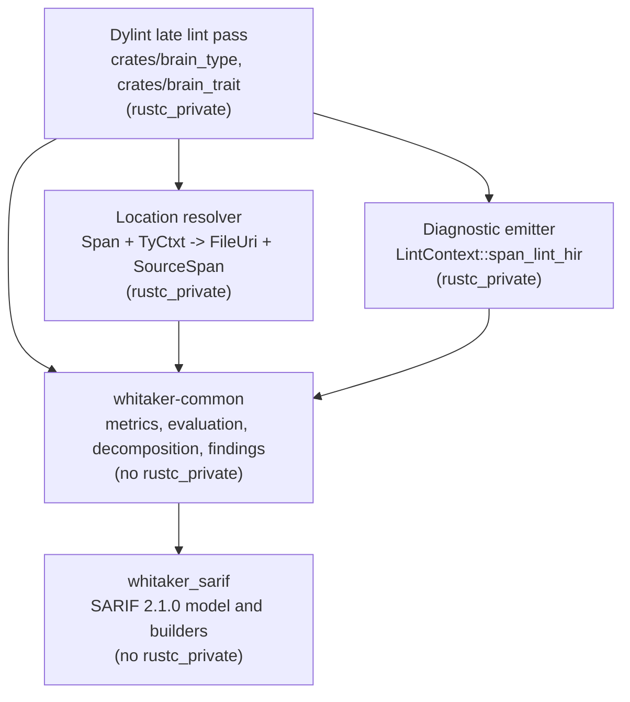

# Record an ADR formalizing the brain trust lint driver interfaces (6.1.3)

This ExecPlan (execution plan) is a living document. The sections
`Constraints`, `Tolerances`, `Risks`, `Progress`, `Surprises & discoveries`,
`Decision log`, `Outcomes & retrospective`, `Conformance basis`, and
`Verification plan` must be kept up to date as work proceeds.

Status: DRAFT

## Purpose / big picture

Whitaker already ships every piece of brain trust analysis except the part that
touches the Rust compiler. `whitaker-common` can score a type's Weighted
Methods Count (WMC), count its cohesion components, aggregate a trait's item
counts, and cluster its methods into decomposition suggestions. What it cannot
do is obtain any of that data from real source code, because nothing yet walks
the compiler's High-level Intermediate Representation (HIR) and feeds the
builders.

Four separate roadmap items are queued behind that gap. Items 6.2.4 and 6.3.3
create the `brain_type` and `brain_trait` Dylint lint crates. Item 6.5.1 adds a
Static Analysis Results Interchange Format (SARIF) emitter for the findings.
Items 6.6.1 to 6.6.3 add configuration, localization, and user-interface (UI)
tests. All four consume the same seam, and none of them owns it. The published
execplan for 6.5.1 says so in as many words: "This plan does not decide that
contract. Roadmap item 6.1.3's ADR does" (`docs/execplans/`
`6-5-1-collect-brain-trust-diagnostics-into-sarif-emitter.md:1387`).

This item closes that gap by writing one architectural decision record (ADR).
After this change a contributor who picks up 6.2.4, 6.3.3, or 6.5.1 can read a
single document and know, without guessing: how a `rustc_span::Span` becomes a
repository-root-relative file identifier and a `whitaker_common::span::`
`SourceSpan`; which HIR callbacks populate `TypeMetricsBuilder` and
`TraitMetricsBuilder` and when; how `DecompositionSuggestion` values reach both
the compiler diagnostic and the SARIF result; the exact lint-pass lifecycle for
collecting and finalizing findings; and where the line falls between English
SARIF text and localized diagnostics.

You can observe success without running the tool. Open
`docs/adr-005-brain-trust-lint-driver-interfaces.md`, take any one of the five
questions above, and find a normative answer with a named type, a named
function, and a stated failure mode. Then open
`docs/execplans/6-5-1-collect-brain-trust-diagnostics-into-sarif-emitter.md`
§"The contract with the lint crates" and confirm every shape it defers is
answered. The plan also adds one small executable guard so the ADR's central
boundary decision cannot rot silently: a test that fails if `whitaker-common`
ever acquires a compiler dependency.

## Constraints

Hard invariants. Violation requires escalation, not a workaround.

- This item **must not** create `crates/brain_type/`, `crates/brain_trait/`, or
  `common/src/brain_trust_sarif/`. The roadmap wording is explicit: the ADR is
  recorded "before any consumer is implemented"
  (`docs/roadmap.md:288-289`). Writing the consumer here would defeat the
  purpose of the decision record and would pre-empt items 6.2.4, 6.3.3, and
  6.5.1.
- This item **must not** modify `whitaker-common`'s public application
  programming interface (API), `crates/whitaker_sarif`'s public API, or any
  existing lint crate. The ADR describes interfaces that will exist; it does
  not build them.
- `whitaker-common` must remain free of `rustc_private`. This is an existing
  invariant (`docs/brain-trust-lints-design.md:155-161`) that the ADR ratifies
  and that milestone `EP-M2` makes mechanically checkable.
- The ADR must follow the house template in
  `docs/documentation-style-guide.md` §"Architectural decision records": the
  filename pattern `adr-NNN-short-description.md`, the required Status, Date,
  and "Context and problem statement" sections, sentence-case headings, and
  captioned tables.
- Prose wraps at 80 columns; fenced code wraps at 120. Every fenced block
  carries a language identifier, and non-code blocks are labelled `plaintext`.
- British English with Oxford `-ize` spelling throughout, per
  `docs/documentation-style-guide.md:7-24`. The spelling gate is part of
  `make markdownlint`.
- The ADR number is **005**. `adr-001` through `adr-004` exist and no other
  branch in `origin` introduces a fifth (verified by scanning every remote
  branch for `docs/adr-0*` files). If a competing ADR 005 lands before this
  branch merges, renumber to the next free value and update
  `docs/contents.md` in the same commit.
- No new external crate dependency. `EP-M2`'s guard must be written against
  crates already available to `whitaker-common`.
- Documentation gates must pass: `make markdownlint` (which depends on the
  spelling chain) and `make nixie` (Mermaid validation, required because the
  ADR carries one diagram). The code gates `make check-fmt`, `make typecheck`,
  `make lint`, and `make test` must pass at the `EP-M2` boundary and at
  completion.

## Tolerances (exception triggers)

Thresholds that trigger escalation, not quality targets.

- Scope: if delivering this item appears to require touching more than six
  tracked files, or any file under `crates/`, `suite/`, or `src/`, stop and
  escalate. The expected file set is four: the new ADR, `docs/contents.md`,
  `docs/roadmap.md`, and this plan, plus the two files `EP-M2` adds under
  `common/tests/`.
- Interface: if writing the ADR reveals that an interface it must specify
  cannot be expressed without first changing an existing public signature in
  `whitaker-common` or `whitaker_sarif`, stop. Record the conflict in
  `Decision log`, set the status to `BLOCKED`, and ask whether the change
  belongs here or in the consuming item.
- Dependencies: if `EP-M2`'s guard cannot be written without adding a crate to
  `common`'s `[dev-dependencies]`, stop and escalate rather than adding one.
- Conflict: if the ADR would contradict a shape already committed to in
  `docs/execplans/6-5-1-collect-brain-trust-diagnostics-into-sarif-emitter.md`
  §"Interfaces and dependencies", that is allowed — the ADR wins by that
  plan's own rule (line 1389) — but each contradiction must be listed
  explicitly in the ADR under "Known risks and limitations" and mirrored into
  this plan's `Decision log`. If more than three such contradictions
  accumulate, stop and escalate, because that is evidence the 6.5.1 plan needs
  reworking rather than annotating.
- Iterations: if a documentation gate still fails after three fix attempts,
  stop and escalate with the captured log path.
- Ambiguity: if the design documents support two readings of a metric's
  subject boundary (for example, whether trait-implementation methods count
  toward a type's WMC) and the choice changes what implementers build, stop and
  present the options rather than picking one silently.

## Risks

- Risk: the ADR specifies a `rustc_span` or `SourceMap` API that does not exist
  under the pinned toolchain, `nightly-2026-05-28`.
  Severity: high. Likelihood: medium.
  Mitigation: `EP-M1` includes a compile probe. Only APIs proven to compile on
  the pinned toolchain, or already called from a shipped lint crate, may appear
  in a normative signature. `SourceMap::span_to_lines` and
  `SourceMap::span_to_filename` are already proven in-tree
  (`crates/bumpy_road_function/src/driver/segment_builder.rs:224`,
  `crates/rstest_helper_should_be_fixture/src/visitor.rs:90`); anything beyond
  those two is unproven until the probe says otherwise.
- Risk: the ADR over-specifies, freezing an implementation detail that the
  first real consumer then has to fight.
  Severity: medium. Likelihood: medium.
  Mitigation: the ADR states *contracts* — inputs, outputs, ordering, and
  failure modes — and names module paths, but leaves internal data structures
  and traversal mechanics to the consumer. Anything the ADR cannot justify from
  an existing precedent or a stated requirement goes under "Outstanding
  decisions" instead of being invented.
- Risk: the ADR under-specifies, and 6.2.4 and 6.3.3 diverge from each other.
  Severity: medium. Likelihood: medium.
  Mitigation: `EP-M1`'s acceptance evidence is a checklist that walks the five
  roadmap questions and the 6.5.1 deferral list item by item. A question with
  no normative answer is a milestone failure, not a stylistic quibble.
- Risk: the column-unit mismatch is missed. SARIF regions in this repository
  already use one-based UTF-16 code units
  (`crates/whitaker_clones_core/src/run0/span.rs:78-79`), while rustc's
  `SourceMap` yields zero-based Unicode scalar positions. A naive conversion is
  silently wrong for any line containing a non-Basic-Multilingual-Plane
  character.
  Severity: medium. Likelihood: high if unaddressed.
  Mitigation: the ADR states the conversion normatively and delegates a named
  property-test obligation to the consuming item. Recorded as `VP-3`.
- Risk: `EP-M2`'s guard is read as scope creep on a documentation item.
  Severity: low. Likelihood: medium.
  Mitigation: `EP-M2` is a separate milestone with its own plateau. Dropping it
  at approval leaves `EP-M1` and `EP-M3` coherent and complete. This is called
  out for the approver in `Decision log`.
- Risk: this branch is based on `origin/`
  `6-5-1-collect-brain-trust-diagnostics-into-sarif-emitter`, which is itself
  unmerged. If that branch is rebased or its execplan is revised, the ADR's
  cross-references drift.
  Severity: low. Likelihood: low.
  Mitigation: the ADR cites the 6.5.1 *roadmap item* and the *decision*, not
  line numbers in that plan. This ExecPlan may cite line numbers because it is
  scoped to this branch.

## Progress

- [x] (2026-08-21) Branch `6-1-3-adr-formalizing-the-brain-trust-lint-driver-`
  `interfaces` created from
  `origin/6-5-1-collect-brain-trust-diagnostics-into-sarif-emitter` and pushed
  with an upstream tracking ref.
- [x] (2026-08-21) Reconnaissance complete: `whitaker-common` brain trust API
  surface, `whitaker_sarif` public API, existing lint-crate conventions,
  localization plumbing, ADR and ExecPlan house style, and the 6.5.1 deferral
  list. Findings folded into `Context and orientation` and
  `Interfaces and dependencies`.
- [x] (2026-08-21) External research complete: SARIF 2.1.0 §3.4.4 and §3.14.14
  on `uriBaseId` and `originalUriBaseIds`, GitHub code-scanning guidance on
  repository-relative artefact URIs, and the `rustc_lint::LateLintPass`
  callback set.
- [ ] EP-M0 Plan approved by the maintainer.
- [ ] EP-M1 `docs/adr-005-brain-trust-lint-driver-interfaces.md` written and
  registered in `docs/contents.md`.
- [ ] EP-M2 Domain-purity guard added under `common/tests/`.
- [ ] EP-M3 Roadmap item 6.1.3 marked done; living sections reconciled.

## Surprises & discoveries

- Observation: `whitaker_common::span::SourceSpan` documents its columns as
  one-based, but its own doctests construct `SourceLocation::new(1, 0)`.
  Evidence: `common/src/span.rs:12` says "one-based line and column numbers";
  `common/src/span.rs:67` and `common/src/diagnostics.rs:155` both pass `0` as
  a column.
  Impact: the type's column convention is genuinely ambiguous today. The ADR
  must pin it, because SARIF `region.startColumn` is one-based and
  `RegionBuilder::build` rejects a zero column
  (`crates/whitaker_sarif/src/builders/location_builder.rs:91`). Recorded as a
  normative decision, not a bug fix; correcting the doctests belongs to
  whichever item first constructs a `SourceSpan` from a real span.
- Observation: `whitaker-common` holds two unrelated method-metadata types
  populated from the same traversal.
  Evidence: `lcom4::MethodInfo` carries `accessed_fields` and
  `called_methods` (`common/src/lcom4/mod.rs:45`);
  `decomposition_advice::MethodProfile` carries `accessed_fields`,
  `signature_types`, `local_types`, and `external_domains`
  (`common/src/decomposition_advice/profile.rs:94`). No conversion exists
  between them.
  Impact: without a decision, 6.2.4 and 6.3.3 would each walk each method body
  more than once, or would walk it once and duplicate the dispatch logic. The
  ADR resolves this with a single-traversal fan-out contract.
- Observation: exactly one shipped lint accumulates state across callbacks and
  flushes it at the end, and it is not yet a diagnostic producer.
  Evidence: `crates/rstest_helper_should_be_fixture/src/driver.rs:226-275`
  implements `check_crate_post` and calls `CallSiteCollector::finalize`
  (`collector.rs:154-181`); a repository-wide grep for `check_crate_post` finds
  no other match. That lint currently only collects and logs.
  Impact: the collect-then-finalize half of the lifecycle has a precedent to
  copy; the finalize-then-emit half does not, and the ADR must decide it
  outright.
- Observation: `%SRCROOT%` is already the repository's `uriBaseId` token, but
  only in documentation examples.
  Evidence: `crates/whitaker_sarif/src/model/location.rs:183` and
  `crates/whitaker_sarif/src/model/run.rs:214` use `Some("%SRCROOT%".into())`
  in doctests, while the only real producer,
  `crates/whitaker_clones_core/src/run0/emit.rs:174`, emits
  `uri_base_id: None`.
  Impact: the ADR should not silently change the shipped emitter's behaviour.
  It records `uriBaseId` handling for brain trust results and flags the
  clone-detector divergence as an outstanding decision rather than resolving it
  here.
- Observation: the ADR seam is entirely greenfield. Nothing in the tree
  converts a `Span` into a path string, relative or otherwise.
  Evidence: `span_to_filename` is called once, in
  `crates/rstest_helper_should_be_fixture/src/visitor.rs:90`, and its
  `FileName` result is used only as an in-process deduplication key
  (`collector.rs:68-74`). No workspace-root lookup exists in any lint driver.
  Impact: there is no existing convention to preserve, so the ADR is free to
  choose the cheapest correct rule rather than matching precedent.

## Decision log

- Decision: write one ADR covering all five questions rather than five small
  ones.
  Rationale: the roadmap item names a single deliverable, the five questions
  share one layering decision, and splitting them would force a reader of 6.2.4
  to assemble five documents. `docs/documentation-style-guide.md:159-178`
  describes an ADR as narrow and stable; "the brain trust lint driver seam" is
  one decision with five faces, not five decisions.
  Date/Author: 2026-08-21, planning agent.

- Decision: number the ADR 005.
  Rationale: `adr-001` through `adr-004` exist; a scan of every remote branch
  for `docs/adr-0*` files found no competing fifth. The 6.5.1 execplan
  deliberately declines to hard-code its own number
  (`docs/execplans/6-5-1-...md:434-437`) and expects 6.1.3's ADR to claim the
  next free one, which this does.
  Date/Author: 2026-08-21, planning agent.

- Decision: include `EP-M2`, a domain-purity guard, in an otherwise
  documentation-only item, and make it separable.
  Rationale: the ADR's load-bearing decision is that `whitaker-common` stays
  compiler-free. That is the one claim in the whole document which can be
  broken accidentally by a future contributor adding a dependency, and the one
  which can be checked mechanically today without a consumer existing. Every
  other decision only becomes testable once 6.2.4 or 6.3.3 lands. `EP-M2` is a
  separate milestone with its own plateau so that an approver who wants a
  strictly documentation-only change can strike it without leaving `EP-M1` or
  `EP-M3` incoherent. **This is the one judgement call in the plan that
  warrants an explicit decision at approval time.**
  Date/Author: 2026-08-21, planning agent.

- Decision: the ADR states contracts and module paths, but does not state
  internal data structures.
  Rationale: over-specification is a named risk. The consuming items need to
  know what they must produce, what ordering guarantees they owe, and what to
  do when a span cannot be resolved. They do not need to be told which
  collection type to hold their work in, beyond the determinism requirement
  that already forces ordered maps.
  Date/Author: 2026-08-21, planning agent.

- Decision: the ADR must not restate the metric definitions, thresholds, or
  clustering rules already recorded in `docs/brain-trust-lints-design.md`.
  Rationale: those are settled and shipped. Restating them creates two sources
  of truth that will drift. The ADR references the design document and
  restricts itself to the seam.
  Date/Author: 2026-08-21, planning agent.

- Decision: record the clone detector's `uri_base_id: None` divergence as an
  outstanding decision rather than resolving it.
  Rationale: changing the shipped clone-detector output is outwith this item's
  scope and would alter a serialized format that consumers may already ingest.
  The ADR fixes the rule for brain trust results and flags the inconsistency
  for a future item to settle deliberately.
  Date/Author: 2026-08-21, planning agent.

## Outcomes & retrospective

To be completed at `EP-M3`. Before setting this plan to `COMPLETE`, reconcile
every discovery against the artefacts named in `Conformance basis`: if drafting
the ADR falsified an assumption in `docs/brain-trust-lints-design.md`, amend
that document; if it contradicted a shape in the 6.5.1 execplan, confirm the
contradiction is listed in the ADR's "Known risks and limitations" and in this
`Decision log`.

## Context and orientation

Read this section if you have never opened this repository.

### What Whitaker is

Whitaker is a suite of Rust lints distributed as Dylint libraries. Dylint loads
lint crates from dynamic libraries so they can use the compiler's unstable
internals without forking Clippy. Each lint crate under `crates/` follows one
shape: `src/lib.rs` gates a `driver` module behind a `dylint-driver` Cargo
feature, and `driver.rs` holds the `rustc_lint` implementation. The lint is
declared with `dylint_linting::impl_late_lint!` inside a private `declaration`
module, and the resulting constant is re-exported
(`crates/module_max_lines/src/driver.rs:39-56`). `suite/` aggregates the shipped
lints into one combined late pass with
`rustc_lint::late_lint_methods!(declare_combined_late_lint_pass, ...)`
(`suite/src/driver.rs:23-49`).

`whitaker-common` (the `common/` directory) is the shared library. It has no
compiler dependency at all: its manifest lists no `rustc_*` crate
(`common/Cargo.toml:14-24`), and the only mention of one anywhere in its source
is inside the body of the `declare_dylint_register_entry!` macro
(`common/src/dylint_entry.rs:19-42`), which expands at the call site in a
driver crate. That separation is deliberate and is stated repeatedly in the
design document: "This keeps the `common` crate free of compiler dependencies
and fully testable without a compilation context"
(`docs/brain-trust-lints-design.md:160-161`).

### What "brain trust" means here

A *brain type* is a type that has grown to hoard behaviour: high total
complexity, at least one enormous method, and poor internal cohesion. A *brain
trait* is the trait-shaped analogue: too many items, and too much complexity
hidden in default method bodies. The subject boundaries matter for this plan:

- `brain_type`'s unit of analysis is "a nominal type plus all its methods
  defined in the current crate", which explicitly includes "the type definition
  and all inherent `impl` blocks" *and* "all trait implementation methods for
  that type in the crate" (`docs/brain-trust-lints-design.md:51-56`).
- `brain_trait`'s unit of analysis is "a single trait definition"
  (`docs/brain-trust-lints-design.md:62`).

That asymmetry drives the lifecycle decision. A type's methods are spread over
arbitrarily many `impl` items which the compiler hands to a lint pass one at a
time, so a type's metrics are only complete once the whole crate has been
walked. A trait's items all arrive together in one `ItemKind::Trait`.

### What already exists in `whitaker-common`

All of the following are shipped, tested, and infallible — no `build()` in this
list returns a `Result`.

- `lcom4::MethodInfoBuilder` with `record_field_access(&str, bool)` and
  `record_method_call(&str, bool)`, and `cohesion_components(&[MethodInfo]) ->`
  `usize` (`common/src/lcom4/extract.rs:63-160`, `common/src/lcom4/mod.rs:307`).
- `brain_type_metrics::CognitiveComplexityBuilder` with
  `record_structural_increment`, `record_nesting_increment`,
  `record_fundamental_increment`, `push_nesting`, and `pop_nesting`
  (`common/src/brain_type_metrics/cognitive_complexity.rs:57-270`). Its
  `build()` panics if the nesting stack is unbalanced.
- `brain_type_metrics::ForeignReferenceSet::record_reference(&str, bool)`
  (`common/src/brain_type_metrics/foreign_reach.rs:37-148`).
- `brain_type_metrics::TypeMetricsBuilder::new(name, cc_threshold,`
  `loc_threshold)` with `add_method(name, cc, loc)`, `set_lcom4(usize)`,
  `set_foreign_reach(usize)`, and `build() -> TypeMetrics`
  (`common/src/brain_type_metrics/mod.rs:283-321`).
- `brain_trait_metrics::TraitMetricsBuilder::new(name)` with
  `add_required_method`, `add_default_method(name, cc, is_from_expansion)`,
  `add_associated_type`, `add_associated_const`, and `build() -> TraitMetrics`
  (`common/src/brain_trait_metrics/metrics.rs:137-263`).
- `evaluate_brain_type(&TypeMetrics, &BrainTypeThresholds) ->`
  `BrainTypeDisposition` and `evaluate_brain_trait(&TraitMetrics,`
  `&BrainTraitThresholds) -> BrainTraitDisposition`, each returning `Pass`,
  `Warn`, or `Deny` (`common/src/brain_type_metrics/evaluation.rs:250`,
  `common/src/brain_trait_metrics/evaluation.rs:228`).
- `decomposition_advice::suggest_decomposition(&DecompositionContext,`
  `&[MethodProfile]) -> Vec<DecompositionSuggestion>`
  (`common/src/decomposition_advice/suggestion.rs:157`) and
  `format_diagnostic_note(&DecompositionContext, &[DecompositionSuggestion])`
  `-> Option<String>` (`common/src/decomposition_advice/note.rs:61`).
- Per-lint English renderers `format_primary_message`, `format_note`,
  `format_decomposition_note`, and `format_help`, which return `String` and
  `Option<String>` rather than compiler diagnostics
  (`common/src/brain_type_metrics/diagnostic.rs:123-286`).

The only callers of the two metrics builders today are behavioural tests under
`common/tests/`, which feed handwritten strings and integers.

### What already exists for SARIF

`crates/whitaker_sarif` is a compiler-free, `serde`-based model of SARIF 2.1.0.
It provides `SARIF_SCHEMA` and `SARIF_VERSION` constants
(`crates/whitaker_sarif/src/model/log.rs:11-17`), an `ArtefactLocation` with a
plain `uri: String` and an optional `uri_base_id`
(`crates/whitaker_sarif/src/model/location.rs:61-68`), a validating
`RegionBuilder` (`builders/location_builder.rs:37-91`), `ResultBuilder`,
`RunBuilder`, `SarifLogBuilder`, rule descriptors `WHK001` to `WHK003`
(`src/rules.rs:13-120`), and merge and deduplication helpers
(`src/merge.rs:104-145`). Nothing in it validates that a URI is
repository-relative, and nothing anywhere converts a compiler path into one.

The clone detector is the only shipped SARIF producer. It emits one-based
UTF-16 code-unit columns (`crates/whitaker_clones_core/src/run0/span.rs:69-79`)
and `uri_base_id: None` (`run0/emit.rs:174`).

### What already exists for localization

`.ftl` files live under `common/locales/<locale>/<lint_name>.ftl` for `en-GB`,
`cy`, and `gd`, loaded by a `static_loader!` with `en-GB` as fallback
(`common/src/i18n/locales.rs:31-36`). Each lint calls
`get_localizer_for_lint(lint_name, configuration_locale)` in `check_crate`
(`common/src/i18n/helpers.rs:34-41`), then resolves messages at the emit site
with `safe_resolve_message_set(...)`, which turns an
`I18nError::MissingMessage` into a hard-coded English `DiagnosticMessageSet`
supplied by the lint (`common/src/i18n/helpers.rs:180-206`).

### What this item is unblocking

The consuming items and what each needs from the ADR are set out in
`Interfaces and dependencies`. In short: 6.2.4 and 6.3.3 need the traversal and
lifecycle contracts; 6.5.1 needs the location contract and the language
boundary; 6.6.2 needs to know which strings are localizable.

## Conformance basis

Upstream artefacts, at the revisions present on this branch (base commit
`f03d3e7`, "Add lint crate tasks and gate 6.5.1 on an interface ADR"):

- `docs/roadmap.md` item 6.1.3 (lines 288-297) — the requirement being
  discharged. Its five enumerated questions are the functional requirements of
  this item and are given identifiers `BTD-REQ-01` to `BTD-REQ-05` below.
- `docs/brain-trust-lints-design.md` §"Implementation approach" (lines 347-372)
  and the shipped §"Implementation decisions" subsections for 6.1.1, 6.1.2,
  6.2.1, 6.2.2, 6.2.3, 6.3.1, 6.3.2, and 6.4.2 — the technical design the ADR
  must not contradict.
- `docs/execplans/6-5-1-collect-brain-trust-diagnostics-into-sarif-emitter.md`
  §"Interfaces and dependencies" (lines 1238-1390) — a downstream plan that
  explicitly defers to this ADR and whose shapes the ADR must ratify or
  supersede.
- `docs/documentation-style-guide.md` §"Architectural decision records" (lines
  355-491) — the governing standard for the deliverable's form.
- `docs/whitaker-dylint-suite-design.md` and
  `docs/whitaker-clone-detector-design.md` §"SARIF schema and mapping" —
  governing conventions for lint packaging and SARIF shape.
- SARIF 2.1.0 (OASIS, Errata 01) §3.4.3 `uri`, §3.4.4 `uriBaseId`, and §3.14.14
  `originalUriBaseIds` — the external standard.

There is no Terms of Reference artefact for this work; the roadmap item is the
top of the chain. Trace links:

```plaintext
roadmap 6.1.3 / BTD-REQ-01 -> ADR-005 §Location resolution     -> EP-M1 -> AC-1
roadmap 6.1.3 / BTD-REQ-02 -> ADR-005 §HIR capture             -> EP-M1 -> AC-1
roadmap 6.1.3 / BTD-REQ-03 -> ADR-005 §Suggestion rendering    -> EP-M1 -> AC-1
roadmap 6.1.3 / BTD-REQ-04 -> ADR-005 §Lint-pass lifecycle     -> EP-M1 -> AC-1
roadmap 6.1.3 / BTD-REQ-05 -> ADR-005 §Language boundary       -> EP-M1 -> AC-1
ADR-005 §Layering (domain purity) -> EP-M2 -> tests::architecture_boundary
roadmap 6.1.3 (completion)        -> EP-M3 -> roadmap checkbox 6.1.3
```

Requirement identifiers, quoting `docs/roadmap.md:288-297`:

- `BTD-REQ-01`: "how a `rustc_span::Span` and `TyCtxt` yield a
  repository-root-relative file identifier and a `SourceSpan`".
- `BTD-REQ-02`: "how HIR traversal populates `TypeMetricsBuilder` and
  `TraitMetricsBuilder`".
- `BTD-REQ-03`: "how `DecompositionSuggestion` values reach diagnostic and
  SARIF rendering".
- `BTD-REQ-04`: "the lint-pass lifecycle for collecting and finalizing
  findings".
- `BTD-REQ-05`: "the boundary between English SARIF text and localized
  diagnostics".

## Verification plan

This item's deliverable is a decision record. It introduces no executable
control flow, so most obligations it *creates* are discharged by the consuming
items rather than here. That is stated explicitly below rather than omitted,
and each delegated obligation carries the harness the ADR must mandate, so a
future implementer inherits a concrete instruction rather than a gap.

One obligation is dischargeable here, and it is the one that matters most: the
ADR's layering decision is only worth writing down if it cannot be broken by
accident.

### VP-1 — `whitaker-common` remains free of compiler dependencies

- Obligation: the `whitaker-common` crate compiles with no `rustc_private`
  feature and no dependency on any `rustc_*`, `clippy_utils`, or
  `dylint_linting` crate, and no module under `common/src/` imports a `rustc_*`
  item, with the single documented exception of the macro body in
  `common/src/dylint_entry.rs`, whose paths resolve at the expansion site.
- Method: parameterized unit test with `rstest`, using `googletest` matchers
  and `pretty_assertions` for failure legibility.
- Rationale: this is a structural property of the repository, decidable by
  inspection of a manifest and a fixed set of source files. A property test
  would generate nothing meaningful; a proof would have no proposition beyond
  the inspection itself. The correct rigour is a cheap, total check that runs
  on every `make test`.
- Domain: `common/Cargo.toml`'s `[dependencies]`, `[dev-dependencies]`, and
  `[features]` tables; every `*.rs` file reachable under `common/src/`.
- Artefact: `common/tests/architecture_boundary.rs`, with the manifest text and
  the exception list as `rstest` fixtures.
- Evidence: `cargo nextest run -p whitaker-common architecture_boundary`. Red
  first: write the test against a deliberately wrong exception list (naming no
  exceptions) and observe it fail on `common/src/dylint_entry.rs`; then narrow
  the exception to that one file and observe it pass.
- Non-vacuity: the test must reject a seeded fault. Add `use rustc_span::Span;`
  to `common/src/span.rs`, run the test, and confirm it fails naming that file;
  separately add `rustc_span = { workspace = true }` to `common/Cargo.toml`,
  run the test, and confirm it fails naming that dependency. Revert both. A
  test that passes with either fault present is enumerating the wrong
  file set or parsing the wrong manifest section, and must be fixed rather than
  accepted. Record both transcripts in `Artefacts and notes`.

### VP-2 — every deferred contract has a normative answer

- Obligation: each of `BTD-REQ-01` to `BTD-REQ-05`, and each shape the 6.5.1
  execplan defers in §"The contract with the lint crates", is answered in
  ADR-005 by a named type or function, a stated input, a stated output, and a
  stated failure mode.
- Method: structured review checklist, executed at the `EP-M1` boundary and
  recorded in `Validation and acceptance`.
- Rationale: this is a completeness property of prose. No test can decide it.
  Stating it as a checklist with a fixed enumeration makes the check
  repeatable and makes a gap visible as a failed line rather than a vague
  sense that the document is thin.
- Domain: the five requirement identifiers, plus `FileUri`,
  `span_to_region`, and `BrainTrustSubject` from the 6.5.1 deferral list.
- Artefact: the checklist table in `Validation and acceptance`, completed in
  this plan.
- Evidence: every row reads "answered" with a section reference. Any row
  reading "not answered" fails `EP-M1`.
- Non-vacuity: the checklist is written *before* the ADR is drafted, from the
  roadmap and the 6.5.1 plan, not derived from the finished ADR afterwards.
  Deriving it from the ADR would guarantee a pass and prove nothing. The
  ordering is enforced by the stage sequence: the checklist is Stage A output;
  the ADR is Stage C output.

### VP-3 — delegated: column conversion preserves SARIF region validity

- Obligation: for every source line and byte offset, the conversion from a
  compiler position to a SARIF region yields `start_line >= 1`,
  `start_column >= 1`, an end position not before the start, and column values
  counted in UTF-16 code units so that they agree with the clone detector's
  existing convention.
- Method: property test with `proptest` over generated source text containing
  astral-plane characters, combining characters, tabs, and CRLF line endings;
  plus a `kani` harness bounding the line and column arithmetic if the
  implementation performs saturating conversions.
- Rationale: the domain is unbounded (any source text), the failure mode is
  silent rather than loud, and the two existing conventions genuinely differ —
  `crates/whitaker_clones_core/src/run0/span.rs:78` counts
  `line_slice.encode_utf16().count()` and adds one, whereas rustc's
  `SourceMap` reports zero-based Unicode scalar positions. Examples alone will
  not find the disagreement.
- Domain: source strings of bounded length over an alphabet that includes at
  least one character outside the Basic Multilingual Plane.
- Artefact: to be created by roadmap item 6.2.4 or 6.5.1, whichever first
  constructs a `Region` from a compiler span. The ADR names the obligation and
  this plan records it as delegated.
- Evidence: discharge condition is a passing `proptest` run in the consuming
  item, with the seeded regression file committed.
- Non-vacuity: the generator must be classified so that at least one generated
  case per run contains a non-Basic-Multilingual-Plane character; a run whose
  classification shows zero such cases is a verification failure. The negative
  control is to replace `encode_utf16().count()` with `chars().count()` and
  confirm the property fails.
- Status in this item: **not discharged, deliberately.** No code here can
  exercise it.

### VP-4 — delegated: finalization is idempotent and emission is deterministic

- Obligation: a lint pass that collects across callbacks and finalizes once
  produces the same ordered sequence of findings regardless of the order in
  which the compiler delivers items, and finalizing twice does not change the
  result or duplicate a finding.
- Method: property test with `proptest` over permutations of a synthetic item
  stream, plus a behavioural test with `rstest-bdd` asserting the observable
  diagnostic order.
- Rationale: SARIF output must be byte-stable for continuous integration
  comparison, and rustc does not guarantee a stable item visitation order
  across compilations. This is precisely an invariant over orderings, which is
  what property testing is for.
- Domain: permutations of a fixed multiset of captured subjects.
- Artefact: to be created by roadmap item 6.2.4 or 6.3.3.
- Evidence: discharge condition is a passing permutation-invariance property in
  the consuming item.
- Non-vacuity: the negative control is to key the collector on a `HashMap` and
  confirm the property fails; the existing precedent already uses ordered
  containers for this reason
  (`crates/rstest_helper_should_be_fixture/src/collector.rs:59-64`).
- Status in this item: **not discharged, deliberately.**

### Axioms

Assumptions this reasoning depends on, not verified here:

- Cargo invokes `rustc` with the workspace root as the working directory, so
  paths the compiler reports for workspace-local files are either already
  workspace-root-relative or absolute beneath that root. `EP-M1`'s probe tests
  this claim on the pinned toolchain before the ADR asserts it.
- `rustc_span::SourceMap::span_to_lines` and `span_to_filename` behave as the
  shipped lint crates already rely on them behaving
  (`crates/bumpy_road_function/src/driver/segment_builder.rs:223-238`,
  `crates/rstest_helper_should_be_fixture/src/visitor.rs:90-96`).
- `serde_json` serializes the `whitaker_sarif` model to conforming SARIF
  2.1.0. This is the clone detector's existing assumption and is outwith this
  item's scope.
- SARIF consumers resolve a relative `artifactLocation.uri` against the
  repository root when `uriBaseId` is absent, as GitHub code scanning
  documents. The ADR relies on this only for the recommendation, not for
  correctness.

## Plan of work

### Stage A — enumerate the contract, before drafting

No files change. Build the `VP-2` checklist by reading `docs/roadmap.md:288-297`
and `docs/execplans/6-5-1-...md:1238-1390` and listing every question and every
deferred shape as a row. Write the rows into `Validation and acceptance` with
every status set to "not answered". This ordering matters: the checklist is the
specification for the ADR, so it must not be derived from the ADR.

Stage A ends when the checklist exists and this plan is approved.

### Stage B — probe the compiler API

Confirm, on `nightly-2026-05-28`, the exact signatures and behaviour the ADR
will assert. Do this without adding a lint crate: extend the existing
`bumpy_road_function` driver temporarily with a `dbg!` of
`cx.tcx.sess.source_map().span_to_filename(span)` and of the session's working
directory, build the crate, run one existing UI fixture, and read the output.
Revert the probe before committing anything.

The probe must answer three questions:

1. What variant and payload does `span_to_filename` return for a workspace-local
   file — is the path relative or absolute?
2. Is a `FileLines`-style result from `span_to_lines` sufficient to obtain both
   the file and the line indices, or does the ADR need `lookup_char_pos` for
   columns as well?
3. What does the compiler report as the working directory, and does stripping
   it from an absolute path yield a repository-relative result?

Any signature the probe cannot confirm must appear in the ADR as a described
behaviour with the API left to the implementer, not as an invented signature.

Stage B ends when the three answers are written into `Artefacts and notes` and
the probe is reverted, leaving a clean tree.

### Stage C — draft the ADR

Create `docs/adr-005-brain-trust-lint-driver-interfaces.md` following the house
template. Draft the normative content from `Interfaces and dependencies` below,
corrected by Stage B's findings. Add the layering diagram as Mermaid, with a
screen-reader description above it and a caption below it.

Register the ADR in `docs/contents.md` §"Decision records", matching the
existing entry style — a linked title followed by a phrase describing what the
record settles.

Stage C ends when `make markdownlint` and `make nixie` pass and every `VP-2`
checklist row reads "answered".

### Stage D — add the domain-purity guard

Add `common/tests/architecture_boundary.rs` per `VP-1`. Follow red-green:
write the assertion with an empty exception list first and observe it fail on
`common/src/dylint_entry.rs`; then narrow the exception and observe it pass.
Then run both seeded faults from `VP-1`'s non-vacuity clause and record the
transcripts.

Stage D ends when `make check-fmt`, `make typecheck`, `make lint`, and
`make test` all pass.

### Stage E — mark the roadmap and reconcile

Flip `docs/roadmap.md` item 6.1.3 from `- [ ]` to `- [x]`. Reconcile this
plan's living sections. Set the status to `COMPLETE` only after confirming that
no discovery falsified an upstream assumption without that artefact being
updated.

## Milestones and plateaus

### EP-M1 — the ADR exists and is registered

- Outcome: `docs/adr-005-brain-trust-lint-driver-interfaces.md` answers all
  five requirements and every 6.5.1 deferral, and is listed in
  `docs/contents.md`. The repository is coherent: a contributor starting 6.2.4
  has a complete contract to build against.
- Requirements: `BTD-REQ-01` through `BTD-REQ-05`.
- Changes: two files added or modified —
  `docs/adr-005-brain-trust-lint-driver-interfaces.md` (new),
  `docs/contents.md` (one entry).
- Red artefact: the `VP-2` checklist, written in Stage A with every row reading
  "not answered". It is red by construction before the ADR is drafted.
- Acceptance evidence (`AC-1`): every checklist row reads "answered" with a
  section reference; `make markdownlint` and `make nixie` pass.
- Conformance check: the ADR contradicts nothing in
  `docs/brain-trust-lints-design.md`; every contradiction with the 6.5.1
  execplan is listed under "Known risks and limitations"; no public interface,
  dependency, trust boundary, or persisted format changed.
- Recovery: the change is two documentation files. Revert the commit.
- Remaining gaps: no consumer exists; `VP-3` and `VP-4` remain delegated.
- Compatibility decision: none required. Nothing is released, nothing is
  consumed, and no persisted format changes.

### EP-M2 — the layering decision is mechanically enforced

- Outcome: a test fails if `whitaker-common` acquires a compiler dependency or
  a `rustc_*` import outside the documented macro exception.
- Requirements: the ADR's layering decision, which underpins `BTD-REQ-02` and
  `BTD-REQ-05`.
- Changes: one file added, `common/tests/architecture_boundary.rs`.
- Red artefact: the same test with an empty exception list, which must fail on
  `common/src/dylint_entry.rs` before the exception is narrowed.
- Acceptance evidence (`AC-2`): `cargo nextest run -p whitaker-common`
  `architecture_boundary` passes; both seeded faults from `VP-1` are shown to
  fail the test; `make check-fmt`, `make typecheck`, `make lint`, and
  `make test` pass.
- Conformance check: no production code changed; no dependency added; the test
  asserts a property the ADR states rather than one it invents.
- Recovery: delete the file. `EP-M1` and `EP-M3` remain complete and coherent
  without it.
- Remaining gaps: the guard covers the manifest and the source tree, not the
  resolved dependency graph. A transitive compiler dependency introduced
  through another workspace crate would not be caught. Stated in the test's
  module documentation.
- Compatibility decision: none required; the file is a test-only surface.
- **Separability**: this milestone may be struck at approval. Doing so leaves
  the item documentation-only and leaves `VP-1` undischarged, which must then
  be recorded here as an accepted residual gap.

### EP-M3 — roadmap marked and plan reconciled

- Outcome: `docs/roadmap.md` item 6.1.3 reads `- [x]`; every living section of
  this plan reflects what actually happened; the status is `COMPLETE`.
- Requirements: roadmap item 6.1.3, completion.
- Changes: `docs/roadmap.md` (one checkbox), this plan.
- Acceptance evidence (`AC-3`): `make markdownlint` passes; the `Outcomes &
  retrospective` section names any upstream artefact amended and any
  contradiction accepted.
- Conformance check: no upstream change or deviation remains unrecorded.
- Recovery: revert the commit.
- Remaining gaps: `VP-3` and `VP-4` are carried forward to the consuming items,
  named in the ADR.
- Compatibility decision: none required.

## Concrete steps

Run everything from the repository root,
`/home/leynos/.lody/repos/github---leynos---whitaker/worktrees/`
`6c9d4cfb-4d01-455d-836d-d02c9ead16be`.

Confirm the branch before starting:

```bash
git branch --show-current
```

```plaintext
6-1-3-adr-formalizing-the-brain-trust-lint-driver-interfaces
```

Stage B's probe, then revert it:

```bash
cargo build -p bumpy_road_function --features dylint-driver
cargo nextest run -p bumpy_road_function --no-capture 2>&1 \
  | tee /tmp/probe-whitaker-$(git branch --show-current).out
git checkout -- crates/bumpy_road_function
```

Documentation gates, after Stage C:

```bash
make markdownlint 2>&1 \
  | tee /tmp/markdownlint-whitaker-$(git branch --show-current).out
make nixie 2>&1 \
  | tee /tmp/nixie-whitaker-$(git branch --show-current).out
```

The focused test, after Stage D:

```bash
cargo nextest run -p whitaker-common architecture_boundary 2>&1 \
  | tee /tmp/focused-whitaker-$(git branch --show-current).out
```

```plaintext
    Summary [   0.0xxs] 4 tests run: 4 passed, 0 skipped
```

Full gates, sequentially, before each commit that touches code. Delegate these
to the `scrutineer` subagent, which captures each gate's log under `/tmp` and
returns a bounded report:

```bash
make check-fmt && make typecheck && make lint && make test
```

Do not run gates in parallel; the build cache is shared and sequential runs are
faster.

## Validation and acceptance

### The `VP-2` completeness checklist

Written in Stage A, before the ADR is drafted. Every row starts as "not
answered" and must read "answered" with a section reference before `EP-M1`
closes.

| Row | Contract to answer | Source | Status |
| --- | ------------------ | ------ | ------ |
| C-1 | `Span` plus `TyCtxt` to a repository-root-relative file identifier | `BTD-REQ-01` | not answered |
| C-2 | `Span` to a `SourceSpan`, including the column convention | `BTD-REQ-01` | not answered |
| C-3 | Behaviour when a span has no real file (macro, `<anon>`, doctest) | `BTD-REQ-01` | not answered |
| C-4 | Behaviour when a resolved path lies outwith the repository root | `BTD-REQ-01` | not answered |
| C-5 | Which HIR callbacks capture data, and what each captures | `BTD-REQ-02` | not answered |
| C-6 | How one traversal feeds all four `common` builders | `BTD-REQ-02` | not answered |
| C-7 | How a type's methods are gathered across separate `impl` items | `BTD-REQ-02` | not answered |
| C-8 | Where macro-expansion filtering is decided | `BTD-REQ-02` | not answered |
| C-9 | When `suggest_decomposition` runs, and on what input | `BTD-REQ-03` | not answered |
| C-10 | How a suggestion reaches the compiler diagnostic | `BTD-REQ-03` | not answered |
| C-11 | How a suggestion reaches a SARIF result | `BTD-REQ-03` | not answered |
| C-12 | The lifecycle: what happens in each callback | `BTD-REQ-04` | not answered |
| C-13 | Finalization: when, once, and with what ordering guarantee | `BTD-REQ-04` | not answered |
| C-14 | Which side owns input and output, and which owns pure data | `BTD-REQ-04` | not answered |
| C-15 | Which strings are localized and which are English-only | `BTD-REQ-05` | not answered |
| C-16 | What a finding carries so both renderers agree | `BTD-REQ-05` | not answered |
| C-17 | Ratify or supersede `FileUri` and its validation | 6.5.1 deferral | not answered |
| C-18 | Ratify or supersede `span_to_region` | 6.5.1 deferral | not answered |
| C-19 | Ratify or supersede `BrainTrustSubject` | 6.5.1 deferral | not answered |

*Table 1: The completeness checklist for ADR 005, written before drafting.*

### Behaviour a reviewer can verify

- Open `docs/adr-005-brain-trust-lint-driver-interfaces.md`. Search for
  "outwith the repository". You find a stated rule for what the lint does when
  a span resolves to a file beneath neither the workspace root nor a path the
  compiler reported relatively, and that rule distinguishes the compiler
  diagnostic from the SARIF result.
- Open the same file and search for "UTF-16". You find the column convention
  stated once, normatively, with the reason.
- Open `docs/contents.md` and confirm the new ADR appears under
  §"Decision records" in the same style as ADR 004.
- Run `make markdownlint`. Expect a clean exit. The spelling gate runs as part
  of it, so British Oxford spelling failures surface here.
- Run `make nixie`. Expect a clean exit, confirming the layering diagram
  parses.
- Run `cargo nextest run -p whitaker-common architecture_boundary`. Expect all
  tests to pass. Then add `use rustc_span::Span;` to the top of
  `common/src/span.rs` and re-run: expect a failure naming that file. Revert.

Quality criteria:

- Tests: `make test` passes, including the new `architecture_boundary` tests.
- Verification: `VP-1` discharged with both seeded faults demonstrated. `VP-2`
  discharged by a fully answered checklist. `VP-3` and `VP-4` recorded as
  delegated, with their harnesses named in the ADR.
- Lint and typecheck: `make check-fmt`, `make typecheck`, and `make lint` exit
  cleanly.
- Documentation: `make markdownlint` and `make nixie` exit cleanly.
- Performance: not applicable; no runtime code ships.
- Security: not applicable.

Quality method: delegate the gate runs to the `scrutineer` subagent, which runs
them sequentially and returns a bounded report with log paths. On a failure,
read the cited log rather than re-running the gate.

## Idempotence and recovery

Every step is safe to repeat. The gates are read-only with respect to tracked
files. The Stage B probe is the only step that dirties the tree, and it is
reverted with `git checkout -- crates/bumpy_road_function`; confirm with
`git status` before committing. Each milestone is a separate commit, so any one
can be reverted without disturbing the others. Nothing writes outwith the
repository except gate logs under `/tmp`.

## Artefacts and notes

To be filled during execution. Required entries:

- Stage B's three probe answers, with the captured output.
- `VP-1`'s red transcript (empty exception list, failing on
  `common/src/dylint_entry.rs`).
- `VP-1`'s two seeded-fault transcripts.

## Interfaces and dependencies

This section is the draft normative content of ADR 005. Stage C turns it into
the ADR proper, corrected by Stage B. It is recorded here so the plan is
reviewable on its own.

### The layering decision

Screen-reader description: the diagram below shows four layers. At the top, a
driving adapter, the Dylint late lint pass, which owns all compiler contact.
Below it, two driven adapters: a location resolver and a diagnostic emitter.
Below those, a pure domain layer, `whitaker-common`, holding metrics,
evaluation, and decomposition. To one side, a serialization kernel,
`whitaker_sarif`. Arrows point inward and downward only: the lint pass depends
on the domain, and the domain depends on nothing above it.



*Figure 1: Dependency direction across the brain trust lint driver seam.*

The rule is one sentence: **everything that knows about the compiler lives
above the line, and nothing below the line may depend on anything above it.**
`EP-M2` enforces the half of that rule which is checkable today.

### BTD-REQ-01 — location resolution

The domain has no file identity today: `SourceSpan` holds only start and end
line and column (`common/src/span.rs:50-53`). The ADR pairs it with a file
identifier rather than growing it, ratifying the shape the 6.5.1 plan proposes.

Contract, to be implemented by 6.2.4 and 6.3.3 in the rustc-facing layer:

```rust
/// A resolved, repository-relative source location for a lint subject.
pub struct SubjectLocation {
    file: whitaker_sarif::FileUri,
    span: whitaker_common::span::SourceSpan,
}

/// Resolves a compiler span to a repository-relative location.
///
/// Returns `None` when the span has no real backing file, or when the
/// resolved path lies outwith the repository root.
pub fn resolve_subject_location(
    cx: &rustc_lint::LateContext<'_>,
    span: rustc_span::Span,
) -> Option<SubjectLocation>;
```

Normative rules:

1. **Path source.** Obtain the file from the session's `SourceMap`, using the
   same call the shipped lints already rely on. A path the compiler reports as
   relative is used unchanged; an absolute path has the compiler's working
   directory stripped from it. Stage B confirms which case occurs under Cargo.
2. **Separator normalization.** The identifier uses forward slashes on every
   platform, with no leading `./`, no leading slash, and no `..` component.
   This matches the intent already documented at
   `crates/whitaker_sarif/src/paths.rs:24-25` and SARIF 2.1.0 §3.4.3, which
   requires a relative-path reference per RFC 3986 §4.2.
3. **Column convention.** Lines and columns are **one-based**, and columns
   count **UTF-16 code units**. This matches the repository's only existing
   SARIF producer (`crates/whitaker_clones_core/src/run0/span.rs:78-79`) and
   satisfies `RegionBuilder::build`, which rejects a zero column
   (`crates/whitaker_sarif/src/builders/location_builder.rs:91`). Because the
   compiler reports zero-based Unicode scalar positions, the conversion is not
   a simple increment; `VP-3` is the obligation this creates.
4. **No real file.** When the span originates from a macro expansion, a
   command-line input, a doctest, or any non-real `FileName`, resolution
   returns `None`. The lint still emits its compiler diagnostic, because rustc
   renders such spans correctly on its own; the finding is simply excluded from
   SARIF.
5. **Outwith the repository.** When the resolved path escapes the repository
   root — a dependency's source, or a generated file under a target directory —
   resolution returns `None`, with the same consequence as rule 4.
6. **Failure is not an error.** Resolution never returns a `Result` and never
   reports a diagnostic of its own. An unresolvable location degrades SARIF
   coverage; it does not fail the lint. This mirrors the existing convention in
   `crates/bumpy_road_function/src/driver/segment_builder.rs:158-166`, where an
   unusable span is skipped with a delayed bug rather than a hard failure.
7. **`uriBaseId`.** Brain trust results emit
   `artifactLocation.uri` as the repository-relative path with `uriBaseId`
   absent. SARIF 2.1.0 §3.4.4 permits this, and GitHub code scanning
   documents that a relative path from the repository root is the preferred
   form. Setting `%SRCROOT%` would additionally require a conforming
   `originalUriBaseIds` entry on the run, whose `uri` must end in a single
   forward slash (§3.14.14); adding one is deferred. **Outstanding decision**:
   the clone detector also emits `uri_base_id: None`
   (`crates/whitaker_clones_core/src/run0/emit.rs:174`) while the model's own
   doctests show `%SRCROOT%`. A future item should settle that inconsistency
   across both producers at once.

### BTD-REQ-02 — HIR traversal into the builders

Contract: **one traversal per method body, fanning out to every builder.**

The domain holds four independent sinks that all need data from the same walk:
`CognitiveComplexityBuilder`, `MethodInfoBuilder` (for cohesion),
`MethodProfileBuilder` (for decomposition), and `ForeignReferenceSet`. The ADR
requires the driver to visit each body once and dispatch to all four, rather
than walking per sink. This resolves the divergence between `lcom4::MethodInfo`
and `decomposition_advice::MethodProfile` at the driver, without changing
either domain type.

Normative rules:

1. **Callbacks.** `brain_type` captures from `check_item` for
   `ItemKind::Impl`, reading the implementing type's `DefId` as the subject
   key, and from `check_impl_item` for each method. `brain_trait` captures from
   `check_item` for `ItemKind::Trait`, reading the trait's items directly.
   Neither lint emits from a capture callback.
2. **Subject accumulation.** A type's methods are spread over arbitrarily many
   `impl` items, both inherent and trait implementations, all of which count
   toward its metrics (`docs/brain-trust-lints-design.md:51-56`). Captured
   state is therefore keyed by the subject's `DefId` and accumulated across the
   whole crate. A trait is self-contained, but is accumulated the same way so
   both lints share one lifecycle and one ordering guarantee.
3. **Macro filtering is the driver's job.** The driver computes
   `span.from_expansion()` once per HIR node and passes the boolean to every
   builder that accepts one. The domain never sees a `Span`. This extends the
   convention already recorded for 6.1.2 and 6.2.3
   (`docs/brain-trust-lints-design.md:162-169`, `237-247`).
4. **Cheap gate first.** Deep analysis runs only after a lightweight threshold
   is crossed, per `docs/brain-trust-lints-design.md:361-365`. The ADR requires
   the gate to be evaluated at finalization on the accumulated method count,
   not per callback, because a per-callback gate would see only a fraction of a
   type's methods and would decide wrongly.
5. **Builder failure is the driver's responsibility.** Every `common` builder
   is infallible, and `CognitiveComplexityBuilder::build` panics on an
   unbalanced nesting stack
   (`docs/brain-trust-lints-design.md:257-259`). The driver must therefore
   guarantee balanced `push_nesting` and `pop_nesting` calls structurally, and
   must resolve every name it passes before calling in. The domain provides no
   error channel and will not gain one.

### BTD-REQ-03 — decomposition suggestions into both renderers

Contract: suggestions are computed once, at finalization, from the complete
method set, and are then rendered twice from the same values.

1. **Computation.** Call `suggest_decomposition(&DecompositionContext,`
   `&[MethodProfile])` once per subject at finalization. Calling it per
   callback would cluster a partial method set and produce advice that changes
   as the compiler's visitation order changes.
2. **Diagnostic path.** Render with the shipped
   `format_decomposition_note(&diagnostic, &suggestions)` and attach the result
   as a `note` on the compiler diagnostic. That renderer is English-only today
   by an explicit earlier decision
   (`docs/brain-trust-lints-design.md:446-449`); moving it behind Fluent
   belongs to 6.6.2 and does not change this contract.
3. **SARIF path.** A `DecompositionSuggestion` carries a label, an extraction
   kind, method *names*, and a rationale
   (`common/src/decomposition_advice/suggestion.rs:95-118`). It carries no
   spans. The ADR therefore requires suggestions to reach SARIF as **structured
   property-bag data** under the `whitaker` properties key, not as
   `relatedLocations`, with the same English note text also present in the
   result message for human readers. **Outstanding decision**: adding per-method
   spans to `DecompositionSuggestion` would allow true related locations. That
   is a domain-type change and belongs to a future item, not to this ADR.
4. **One source, two renderings.** Both renderings derive from the same
   `Vec<DecompositionSuggestion>` value on the finding. Neither renderer may
   re-cluster, re-order, or re-cap. The caps are already fixed at three
   suggestions and three methods each
   (`common/src/decomposition_advice/note.rs:14-15`).

### BTD-REQ-04 — the lint-pass lifecycle

Contract, per callback:

| Callback | Responsibility |
| -------- | -------------- |
| `check_crate` | Load configuration, build the `Localizer`, resolve the SARIF mode, and reset all accumulated state. |
| `check_item`, `check_impl_item`, `check_trait_item` | Capture only. Never evaluate, never emit, never allocate a finding. |
| `check_crate_post` | Finalize once, then evaluate, build findings, emit diagnostics in a deterministic order, and hand the findings to the SARIF sink. |

*Table 2: Responsibilities of each lint-pass callback.*

Normative rules:

1. **Finalize once.** Finalization is idempotent and one-shot, mirroring
   `CallSiteCollector::finalize`
   (`crates/rstest_helper_should_be_fixture/src/collector.rs:154-181`), the
   only existing precedent for this pattern in the repository. Reading
   accumulated state before finalization is a programming error.
2. **Deterministic order.** Findings are emitted ordered by the tuple
   *(file identifier, start line, start column, rule identifier, subject
   name)*. Every accumulator is an ordered container so the order does not
   depend on hashing. `VP-4` is the obligation this creates.
3. **Reset in `check_crate`.** State is cleared at the start of every crate so
   a pass instance reused across crates cannot leak findings between them.
   Every shipped lint already reloads configuration and the localizer here
   (`crates/module_max_lines/src/driver.rs:74-78`).
4. **No input or output in the pass.** The pass produces a
   `whitaker_sarif::Run` value and nothing more. Writing it to disk is a
   separate concern owned by 6.5.1, whose `emit_brain_trust_run` returns
   `Ok(None)` when SARIF is disabled and `Ok(Some(run))` with an empty results
   array when it is enabled and clean. The pass must not open a file.
5. **Zero cost when disabled.** When the SARIF mode is disabled, no finding is
   converted and no location is resolved beyond what the diagnostic itself
   needs, per `docs/brain-trust-lints-design.md:641`.

### BTD-REQ-05 — the language boundary

Contract: **a finding carries structured, locale-free data; text is produced by
two renderers that never share a string.**

1. **Findings hold values, not prose.** A finding carries the subject kind and
   name, the disposition, the measured metrics, the resolved location, and the
   decomposition suggestions. It does not carry a rendered message. This is
   what allows a localized diagnostic and an English SARIF result to remain
   semantically identical without either being a translation of the other.
2. **SARIF is English-only.** Neither `whitaker_sarif` nor any brain trust
   SARIF mapping module may depend on `whitaker_common::i18n`. This ratifies
   the constraint already written into the 6.5.1 plan and the roadmap's
   requirement that SARIF stay "English-only for tool ingestion"
   (`docs/roadmap.md:370`). Rule metadata — `shortDescription`,
   `fullDescription`, and `helpUri` — is likewise English-only static data.
3. **Diagnostics are localized.** Compiler diagnostics resolve their primary,
   note, and help text through `safe_resolve_message_set`, which falls back to
   a lint-supplied English `DiagnosticMessageSet` when a Fluent key is missing
   (`common/src/i18n/helpers.rs:180-206`). Fluent entries arrive in 6.6.2;
   until then the English fallbacks are the only path, which is a temporary
   state, not a separate design.
4. **The measured values are not translated.** Numbers, type names, method
   names, and extraction kinds appear verbatim in both renderings. Only the
   connecting prose differs.
5. **Consequence to accept.** A localized diagnostic and its SARIF counterpart
   will not be string-equal, and no test should assert that they are. The
   invariant that *is* worth asserting, and which 6.6.3's UI tests should
   assert, is that both carry the same measured values.

### Dependencies

No new dependency is introduced by this item. The ADR asserts that the
consuming items will need, and only need:

- `dylint_linting`, `rustc_lint`, `rustc_hir`, `rustc_span`, `rustc_middle`,
  and `rustc_session` in the lint crates, via the workspace proxy crates under
  `crates/rustc_*`, gated behind the `dylint-driver` feature as every existing
  lint crate does.
- `whitaker-common` and `whitaker_sarif`, neither of which gains a compiler
  dependency.

### Signposted documentation and skills

Read before or during the work:

- `AGENTS.md` — gate commands, the 400-line file cap, and the rule that gates
  run sequentially.
- `docs/documentation-style-guide.md` §"Architectural decision records" — the
  ADR template, and §"Formatting" for the 80-column wrap and table captions.
- `docs/brain-trust-lints-design.md` — especially §"Lint overview" for the
  subject boundaries, §"Implementation approach", and every
  §"Implementation decisions" subsection, which record what is already settled.
- `docs/whitaker-dylint-suite-design.md` — lint packaging and the suite
  aggregation model.
- `docs/whitaker-clone-detector-design.md` §"SARIF schema and mapping" — the
  conventions the brain trust emitter mirrors.
- `docs/execplans/6-5-1-collect-brain-trust-diagnostics-into-sarif-emitter.md`
  §"Interfaces and dependencies" — the shapes this ADR ratifies or supersedes.
- `docs/developers-guide.md` — the `register_lints` entry-point convention and
  the UI-fixture re-baselining runbook.
- `docs/rust-testing-with-rstest-fixtures.md` and
  `docs/rstest-bdd-users-guide.md` — fixture and behavioural-test conventions,
  needed for `EP-M2` and for the delegated obligations.
- `docs/rust-doctest-dry-guide.md` — doctest conventions, relevant because the
  ADR's illustrative Rust blocks use `no_run` per the style guide.
- `docs/complexity-antipatterns-and-refactoring-strategies.md` — background on
  the smell the lints detect.

Skills to load:

- `leta` for symbol navigation across `common/` and `crates/`.
- `hexagonal-architecture` for the ports-and-adapters framing used in
  §"The layering decision".
- `arch-decision-records` for ADR authoring discipline.
- `execplans` for maintaining this document.
- `kani` and `verus` for the delegated obligations `VP-3` and `VP-4`, which the
  consuming items discharge.
- `rust-unit-testing` and `proptest` for `EP-M2` and the delegated property
  tests.
- `en-gb-oxendict` for the spelling gate.
- `firecrawl` for any further external standards lookup.

### External references

- Static Analysis Results Interchange Format (SARIF) Version 2.1.0 Plus
  Errata 01, OASIS: §3.4.3 `uri`, §3.4.4 `uriBaseId`, §3.14.14
  `originalUriBaseIds`.
  <https://docs.oasis-open.org/sarif/sarif/v2.1.0/errata01/os/sarif-v2.1.0-errata01-os-complete.html>
- GitHub code scanning SARIF support, §"Source file locations", which
  recommends a relative path from the repository root.
  <https://docs.github.com/en/code-security/reference/code-scanning/sarif-files/sarif-support>
- Dylint, Trail of Bits. <https://github.com/trailofbits/dylint>
