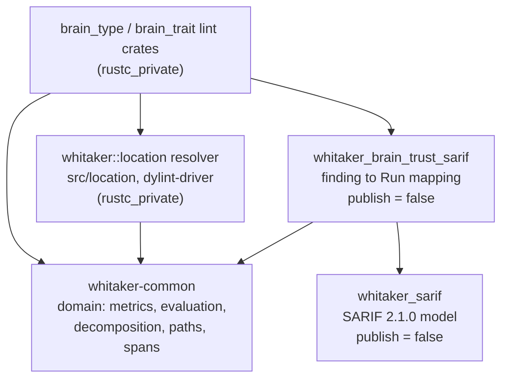

# Record an ADR formalizing the brain trust lint driver interfaces (6.1.3)

This ExecPlan (execution plan) is a living document. The sections `Constraints`,
`Tolerances`, `Risks`, `Progress`, `Surprises & discoveries`, `Decision log`,
`Outcomes & retrospective`, `Conformance basis`, and `Verification plan` must
be kept up to date as work proceeds.

Status: COMPLETE (2026-09-27)

## Purpose / big picture

Whitaker already ships every piece of brain trust analysis except the part that
touches the Rust compiler. `whitaker-common` can score a type's Weighted
Methods Count (WMC), count its cohesion components, aggregate a trait's item
counts, and cluster its methods into decomposition suggestions. What it cannot
do is obtain any of that data from real source code, because nothing yet walks
the compiler's High-level Intermediate Representation (HIR) and feeds the
builders.

Four roadmap items are queued behind that gap. Items 6.2.4 and 6.3.3 create the
`brain_type` and `brain_trait` Dylint lint crates. Item 6.5.1 adds a Static
Analysis Results Interchange Format (SARIF) emitter. Items 6.6.1 to 6.6.3 add
configuration, localization, and user-interface (UI) tests. All four consume
the same seam and none of them owns it. The published execplan for 6.5.1 says
so in as many words: "This plan does not decide that contract. Roadmap item
6.1.3's ADR does" (`docs/execplans/`
`6-5-1-collect-brain-trust-diagnostics-into-sarif-emitter.md:1395`).

This item closes that gap by writing one architectural decision record (ADR).
After this change a contributor who picks up 6.2.4, 6.3.3, or 6.5.1 can read a
single document and know, without guessing: how a `rustc_span::Span` becomes a
repository-root-relative file identifier and a `whitaker_common::span::`
`SourceSpan`; which HIR callbacks populate `TypeMetricsBuilder` and
`TraitMetricsBuilder` and when; how `DecompositionSuggestion` values reach both
the compiler diagnostic and the SARIF result; the exact lint-pass lifecycle for
collecting and finalizing findings; and where the line falls between English
SARIF text and localized diagnostics.

Success is observable without running the tool. Opening
`docs/adr-005-brain-trust-lint-driver-interfaces.md` and taking any one of the
five questions above yields a normative answer with a named type, a named
function, and a stated failure mode. The 6.5.1 execplan §"The contract with the
lint crates" then confirms every shape it defers is answered.

### What the approver must decide

Two things in this plan are judgement calls that the maintainer may reasonably
overturn. Both are called out here so they are not buried.

1. **The ADR supersedes the 6.5.1 execplan in four places.** A design review of
   the first draft established that the interface shapes 6.5.1 proposes cannot
   compile: they form a Cargo dependency cycle, and one of the two edges also
   breaks `cargo publish -p whitaker-common`. Repairing that is not optional,
   but *how far* the repair reaches is a choice. This plan takes the narrow
   route: ADR 005 decides the correct shape, lists every supersession under
   "Known risks and limitations", and leaves the 6.5.1 execplan for its own
   implementer to reconcile at that plan's Stage A, which its text already
   provides for (`6-5-1-...md:1395-1398`). The alternative — revising the 6.5.1
   plan on this branch — is recorded in `Decision log` and rejected there.
2. **Two milestones add code to a documentation item.** `EP-M2` (an
   architecture-fitness guard) and `EP-M3` (a doc-comment correction in
   `common/src/span.rs`) are each separable: striking either leaves every other
   milestone coherent and complete. `Milestones and plateaus` records what is
   lost by striking each.

## Constraints

Hard invariants. Violation requires escalation, not a workaround.

- This item **must not** create `crates/brain_type/`, `crates/brain_trait/`, or
  the SARIF mapping crate the ADR specifies. The roadmap wording is explicit:
  the ADR is recorded "before any consumer is implemented"
  (`docs/roadmap.md:288-289`). Writing a consumer here would defeat the purpose
  of the decision record and pre-empt items 6.2.4, 6.3.3, and 6.5.1.
- This item **must not** change any public signature in `whitaker-common`,
  `crates/whitaker_sarif`, the root `whitaker` crate, or any existing lint
  crate. `EP-M3` changes doc-comment example literals only; if a doc change
  turns out to require a signature change, that is an escalation.
- `whitaker-common` must remain free of `rustc_private`
  (`docs/brain-trust-lints-design.md:155-161`).
- `whitaker-common` must remain publishable. It is in the publish set:
  `.github/workflows/release.yml:338` runs `cargo publish -p whitaker-common`,
  and `.github/workflows/ci.yml:160` runs `make publish-check` over it. It
  therefore must not gain a dependency on any `publish = false` crate;
  `crates/whitaker_sarif/Cargo.toml:5` and
  `crates/whitaker_clones_core/Cargo.toml:5` are both `publish = false`. This
  constraint is the reason ADR 005 must supersede the 6.5.1 execplan.
- The ADR must follow `docs/documentation-style-guide.md` §"Architectural
  decision records": filename `adr-NNN-short-description.md`, the required
  Status, Date, and "Context and problem statement" sections, sentence-case
  headings, and captioned tables.
- Prose wraps at 80 columns; fenced code at 120. Every fenced block carries a
  language identifier; non-code blocks are `plaintext`. Illustrative Rust uses
  `rust,ignore`, not `no_run` — see `Decision log`.
- Emphasis uses a single marker per file. `markdownlint` MD049 runs in
  consistent mode, so `_Table 1: ..._` captions fail in any file that also uses
  `*...*` emphasis.
- British English with Oxford `-ize` spelling
  (`docs/documentation-style-guide.md:7-24`). Two gates enforce this: `typos`,
  and a separate `spelling-phrase-check` compound-word list (`Makefile:202`).
- The ADR number is **005**. A scan of every remote branch for `docs/adr-0*`
  files found no competing fifth. If one lands before this branch merges,
  renumber and update `docs/contents.md` in the same commit.
- No new external crate dependency. `EP-M2`'s guard must be written against
  crates already resolvable for the crate that hosts it.
- Gates: `make markdownlint` and `make nixie` must pass at every milestone.
  `make check-fmt`, `make typecheck`, `make lint`, and `make test` must pass at
  the `EP-M2` and `EP-M3` boundaries and at completion.

## Tolerances (exception triggers)

Thresholds that trigger escalation, not quality targets.

- Scope: the expected file set is seven — the new ADR, `docs/contents.md`,
  `docs/roadmap.md`, this plan, one new test file for `EP-M2`, one fixture or
  helper file if `EP-M2` needs it, and `common/src/span.rs` for `EP-M3`. If the
  work requires more than eight tracked files, or touches any file under
  `crates/`, `suite/`, or `src/`, stop and escalate. Note that Stage B's probe
  runs in a throwaway git worktree and therefore modifies no tracked file; if
  the probe cannot be run that way, that is itself an escalation.
- Interface: if the ADR cannot be written without changing an existing public
  signature, stop, record the conflict in `Decision log`, set the status to
  `BLOCKED`, and ask whether the change belongs here or in the consuming item.
- Dependencies: if `EP-M2`'s guard needs a crate not already in the hosting
  crate's dependency closure, stop and escalate rather than adding one.
- Supersession: this plan supersedes the 6.5.1 execplan in four places, each
  recorded in `Decision log` and destined for the ADR's "Known risks and
  limitations". A sixth supersession is an escalation, because at that point
  the honest remedy is to rework the 6.5.1 plan rather than annotate it.
- Iterations: if a gate still fails after three fix attempts, stop and escalate
  with the captured log path.
- Ambiguity: if the design documents support two readings of a metric's subject
  boundary and the choice changes what implementers build, stop and present the
  options. `Open questions` already lists three such readings; each must be
  resolved or explicitly deferred in the ADR before `EP-M1` closes.

## Risks

- Risk: the ADR specifies a `rustc_*` interface that does not exist or does not
  behave as described under the pinned toolchain, `nightly-2026-05-28`.
  Severity: high. Likelihood: medium. Mitigation: only interfaces proven to
  compile on the pinned toolchain, or already called from a shipped lint crate,
  may appear in a normative signature. Stage B's probe is the proving step.
  Note that `crates/clippy_utils` is a **stub** carrying only `macros::is_panic`
  (`crates/clippy_utils/src/lib.rs:1-12`), not the upstream crate; nothing in
  the ADR may assume an upstream Clippy helper exists.
- Risk: an implementer follows the ADR and internal compiler errors (ICEs) the
  build. `span_delayed_bug` is not a quiet skip: when a compilation emits no
  real error, `DiagCtxtInner::flush_delayed` prints "no errors encountered even
  though delayed bugs were created" and re-emits every delayed bug as an ICE
  (verified at `rustc_errors/src/lib.rs:1480-1486` in the `rustc-src`
  component). A warn-only lint never emits a real error, so every delayed bug
  it creates becomes an ICE. Severity: high. Likelihood: high if unaddressed —
  the first draft cited a delayed-bug call site as the precedent to follow.
  Mitigation: the ADR prohibits the call outright on any data-dependent path,
  and records that `crates/bumpy_road_function/src/driver/mod.rs:224`, `:235`,
  and `segment_builder.rs:164`, `:186` carry the hazard today.
- Risk: findings are emitted where `#[allow]` cannot reach them.
  `LateContext::opt_span_lint` resolves the level at
  `self.last_node_with_lint_attrs` (`rustc_lint/src/context.rs:600-615`), which
  in `check_crate_post` is the crate root — that callback is dispatched inside
  `with_lint_attrs(hir::CRATE_HIR_ID)` (`rustc_lint/src/late.rs:393-404`).
  Deferred emission through the ordinary `cx.emit_span_lint` path therefore
  ignores `#[allow(brain_type)]` on a type or `impl`, leaving users an
  unsuppressable lint. Severity: high. Likelihood: high if unaddressed — all
  nine emitting lint crates use `cx.emit_span_lint`, so it is the obvious thing
  to copy. Status: **confirmed by probe, 2026-09-27, and sharper than stated.**
  The probe's three-way fixture showed the span-only path from
  `check_crate_post` emitting a finding on an item carrying `#[allow]`, while
  the same path from `check_item` (where the context node *is* the item)
  suppressed it, and `emit_node_span_lint` from `check_crate_post` also
  suppressed it. The span-only path does not merely "not resolve the level"; it
  silently discards every `#[allow]` on the subject item and on every module
  between it and the crate root. A crate-level `#![allow]` still applies to all
  paths, so the residual limitation is item- and module-level attributes only.
  No in-tree lint emits from `check_crate_post` today — the sole user of that
  hook, `crates/rstest_helper_should_be_fixture/src/driver.rs:244`, writes a
  summary file and emits nothing — so this is a new pattern with no in-tree
  precedent to copy. See `Artefacts and notes`. Mitigation: the ADR requires
  the subject's `HirId` to be captured and emission to go through
  `TyCtxt::emit_node_span_lint` (`rustc_middle/src/ty/context.rs:2461-2470`),
  which takes an explicit `HirId`. Confirmed to compile on the pinned toolchain
  under `-D warnings`, accepting the same `rustc_lint::errors::DiagDecorator`
  the shipped lints already use.
- Risk: the seam silently stops producing SARIF and nobody notices, because a
  clean report and a broken resolver look identical. Severity: high.
  Likelihood: medium. Mitigation: resolution returns a typed reason rather than
  `Option`, every drop is logged, and the run carries an unresolved-subject
  count even when it is zero. Recorded as `VP-5`.
- Risk: whole-crate accumulation exhausts memory on a large crate. Retaining
  `MethodInfo` (two string sets, `common/src/lcom4/mod.rs:45`) plus
  `MethodProfile` (four string sets,
  `common/src/decomposition_advice/profile.rs:94`) for every method of every
  type is six string collections per method held until `check_crate_post`.
  Severity: medium. Likelihood: high on a large crate. Mitigation: the ADR
  mandates two-phase capture — cheap scalars during the callbacks, deep capture
  at finalization only for subjects past the gate.
- Risk: the ADR over-specifies, freezing a detail the first consumer must then
  fight. Severity: medium. Likelihood: medium. Mitigation: the ADR states
  contracts — inputs, outputs, ordering, failure modes — and names crate and
  module paths, but leaves internal data structures to the consumer. Anything
  it cannot justify from a precedent or a stated requirement goes under
  "Outstanding decisions".
- Risk: this branch is based on
  `origin/6-5-1-collect-brain-trust-diagnostics-into-sarif-emitter`, which is
  unmerged and which this ADR supersedes in four places. Severity: medium.
  Likelihood: medium. Mitigation: the ADR cites the 6.5.1 *roadmap item* and
  the *decision*, never line numbers in that plan. Each supersession is stated
  as a decision the ADR makes, so it reads correctly whether or not the sibling
  plan is revised.

## Progress

- [x] (2026-08-21) Branch created from
  `origin/6-5-1-collect-brain-trust-diagnostics-into-sarif-emitter` and pushed
  with an upstream tracking ref.
- [x] (2026-08-21) Reconnaissance complete across `whitaker-common`,
  `crates/whitaker_sarif`, the shipped lint crates, the localization plumbing,
  the ADR and ExecPlan house style, and the 6.5.1 deferral list.
- [x] (2026-08-21) External research complete: SARIF 2.1.0 §3.4.3, §3.4.4,
  §3.14.14, and §3.14.27; GitHub code-scanning guidance on repository-relative
  artefact URIs; the `rustc_lint::LateLintPass` callback set.
- [x] (2026-08-21) First draft written and reviewed by a six-lens design
  panel. Fifteen findings folded in, four of them blocking. The panel's
  substantive results are recorded in `Surprises & discoveries` and
  `Decision log`.
- [x] (2026-09-27) EP-M0 Plan approved, including the two approver decisions in
  `Purpose / big picture`. The maintainer directed implementation of this plan
  as written, so both decisions stand as recorded: the narrow route (the ADR
  decides the shape and 6.5.1 reconciles at its own Stage A), and both
  separable milestones retained. Neither was separately ruled on; if either is
  overturned while the work is in progress, record it under `Decision log` and
  adjust. The supersession count was corrected from five to four during EP-M0
  reconnaissance; see `Surprises & discoveries`.
- [x] (2026-09-27) Stage A checklist reconciled against its two sources:
  `docs/roadmap.md:288-297`, whose five clauses map to `BTD-REQ-01` to
  `BTD-REQ-05` and thence to rows C-1 to C-16, and the 6.5.1 deferral list
  (`6-5-1-...md:69-77` and `:1395-1398`), which maps to rows C-17 to C-19. Rows
  C-20 to C-26 trace to the first draft's design review. All 26 rows read "not
  answered", as Stage A requires. No gap found and no new row added.
- [x] (2026-09-27) Stage B complete. All eight probe questions answered; six by
  a purpose-built probe lint in a throwaway worktree (since removed) under the
  Makefile's mandatory flags, and two by direct source reading. Four findings
  corrected the plan's assumptions: `span_to_filename` is already
  workspace-root-relative and needs no stripping; `cargo` refuses out-of-root
  workspace members, so `..` cannot arise from the layout; the incumbent
  `endColumn` is off by one against SARIF §3.30.8; and `cx.emit_span_lint` from
  `check_crate_post` silently discards item- and module-level `#[allow]`
  attributes, making `emit_node_span_lint` a correctness requirement rather
  than a preference. The supersession set was re-derived from 6-5-1 alone and
  confirmed at four, with no fifth. See `Artefacts and notes`.
- [x] (2026-09-27) Stage B CodeRabbit review completed via `scrutineer`, with
  three findings and no rate limit. All three verified genuine and fixed:
  `VP-1` demanded the mapping crate not depend on `whitaker-common` while
  `Dependencies` and the layering diagram required it — the obligation was
  unachievable as written, because `common/src/lib.rs:14` is a bare
  `pub mod i18n;` with no feature gate, so any dependent reaches `i18n`;
  `BTD-REQ-04` rule 8 still carried the fifth supersession marker that
  `Decision log` had withdrawn; and the plan used second-person pronouns in
  seven places against `docs/documentation-style-guide.md:32`. Two further
  defects found independently were also fixed: a "ten lint crates" count that
  contradicts the adjacent "nine emitting" clause, and a "seven places"
  citation count that is five. `make markdownlint` (0 errors / 78 files) and
  `make nixie` both pass. See `Surprises & discoveries`.
- [x] (2026-09-27) Stage C CodeRabbit review cleared via `scrutineer`, seven
  findings, no rate limit. Four actioned (`endColumn` exclusivity unstated in
  `Location resolution` rule 4; the unticked `EP-M1` checkbox;
  `Language boundary` rule 2's overclaimed "cannot resolve a message"; and
  `RepoRelativePath::as_str`'s unstated encoding contract). Two rejected as
  spurious — a "behavioural" respelling the text does not contain, and a "four
  versus six roadmap items" count that is a deliberate grouping. Tracing the
  fourth found a defect the review had not flagged: `Emission lifecycle`
  justified deferral by calling both lints whole-crate lints, which is false for
  `brain_trait`, and the ADR never named the uniformity reason a Surprises
  entry claimed it did. Both are now corrected. `make markdownlint` (0 errors /
  79 files) and `make nixie` both pass. See `Decision log` and
  `Surprises & discoveries`.
- [x] (2026-09-27) Stage C complete.
      `docs/adr-005-brain-trust-lint-driver-interfaces.md`
  written against the house template — Status, Date, Context, Decision drivers,
  Requirements, Options considered (three crate-edge options plus the capture
  and emission axes), Decision outcome with the Y-statement, and the normative
  sections `Location resolution` (11 rules), `HIR capture` (8 rules plus
  `Counting a method once`), `Suggestion rendering` (6 rules),
  `Lint-pass lifecycle` (Table 2 plus 10 rules), and `Language boundary` (6
  rules), then `Goals and non-goals`, `Known risks and limitations` (naming all
  four supersessions of 6.5.1), and `Outstanding decisions` (5 items). The
  layering diagram is a Mermaid `flowchart TD` with a screen-reader description
  above and `Figure 1` below. Registered in `docs/contents.md` §"Decision
  records" in the ADR 004 style. All four open questions from Stage A resolved
  from the repository rather than escalated; see `Surprises & discoveries`.
  Every `VP-2` checklist row reads "answered" against a named rule.
  `make markdownlint` (0 errors / 79 files) and `make nixie` both pass.
- [x] (2026-09-27) EP-M1 `docs/adr-005-brain-trust-lint-driver-interfaces.md`
  written and registered in `docs/contents.md`.
- [x] (2026-09-27) EP-M2 complete.
      `crates/whitaker_sarif/tests/architecture_boundary.rs`,
      `crates/whitaker_sarif/tests/manifest_scan/mod.rs`, and
      `crates/whitaker_sarif/tests/manifest_scan/workspace_inheritance.rs`
  added, 23 tests. The rule lives in the first file, the manifest-scanning
  toolkit it is asserted through in the second, and the scanner's own
  workspace-inheritance behaviour in the third. They were split twice against
  AGENTS.md's 400-line budget: once when the single file passed it, and again
  when round-5 coverage pushed the rule file back over. It asserts both ADR 005
  rules over dependency manifests: `whitaker_sarif` must not name
  `whitaker-common`, and `whitaker_brain_trust_sarif` must not name
  `fluent-templates` or `unic-langid`. The `whitaker_sarif` half runs against
  the **real** manifest, so a reintroduced edge fails today; the mapping-crate
  half carries fixture cases plus a test that scans the real manifest *when the
  crate exists* and returns early until then. That test activates on its own
  when the crate lands, so the rule stops resting on fixtures alone without
  anyone having to remember to wire it up. Red confirmed four times: before and
  after the `cap_std` conversion, again after the discovery helper was
  deduplicated, and again for the `{ workspace = true }` inheritance fix — the
  last against the **real** manifests rather than a fixture, by injecting an
  inherited rename at the workspace root and in `whitaker_sarif` and confirming
  the guard fails naming `dependencies.wc_alias`; the injected manifests were
  then restored. With the forbidden edge present the guard fails naming the
  dependency *and* its location, `dependencies.whitaker-common` or
  `dependencies.fluent-templates`. All three non-vacuity checks from `VP-1` are
  permanent assertions — the direct fixture, the renamed fixture
  (`loc = { package = ... }`), and a floor asserting at least one table and one
  dependency were examined. Two further shapes beyond the three required are
  covered: a `[target.'cfg(...)'.dependencies]` selector and a
  `[dev-dependencies]` entry, since a cycle is a cycle whichever table carries
  it. Three more were added in response to round-3 review, taking the file from
  15 tests to 18: a member that inherits a rename through
  `{ workspace = true }` is resolved against the root
  `[workspace.dependencies]` (and shown to be invisible without it), an
  inherited entry the workspace does not declare fails closed rather than
  reading as clean, and a local key that merely *matches* a workspace key does
  not pick up the workspace's package name. Gates: `make check-fmt`,
  `make markdownlint`, `make nixie`, `make typecheck`, `make lint`, `make test`.
  `make lint` caught two `clippy::shadow_reuse` errors in the new fixture
  tests: each resolved the `[workspace.dependencies]` table through a closure
  parameter named `workspace`, shadowing the outer binding of the same name.
  The lint is denied workspace-wide at `Cargo.toml:149`, and
  `RUST_FLAGS ?= -D warnings` promotes it to an error, so it fails the build
  rather than warning. Reintroducing the shadow reproduced exactly the two
  errors the gate reported, confirming the fix was not vacuous. `make test`
  alone would not have caught this: the file compiles and all 18 tests pass
  either way, because `shadow_reuse` is a Clippy lint and not a rustc one, so
  `make test` is not a substitute for `make lint`. See
  `Surprises & discoveries` for the corrections this milestone needed.
- [x] (2026-09-27) EP-M3 complete. The six zero-column literals named in Stage E
  are now `1`: `common/src/span.rs:67`, `:96`, `:112`, `:129`, `:135`, and
  `common/src/diagnostics.rs:155`. `SourceLocation`'s prose already said
  one-based in all three places (`:12`, `:33`, `:37`); the rendered examples
  were the only contradiction, and they now agree. A repository-wide grep for
  `SourceLocation::new(_, 0)` across `common/`, `src/`, and `crates/` returns
  nothing, so no unlisted site was missed. `:129` needed care and was checked
  individually: it is the `SpanError::StartAfterEnd` case, and changing its end
  column from `0` to `1` leaves the assertion intact, because the ordering
  violation is carried by the line number (`3` against `2`) and not the column.
  Doc-comment and doc-example literals only; no signature, behaviour, or public
  API changed. Gates: `cargo test --doc -p whitaker-common` (184 passed), then
  `make check-fmt`, `make typecheck`, `make lint`, `make test`.
- [x] (2026-09-27) EP-M4 complete. `docs/roadmap.md` item 6.1.3 reads `- [x]`
  with a link to ADR 005 beside the existing design-document reference. All
  four prerequisites named by the item (6.1.2, 6.2.2, 6.3.2, 6.4.2) were
  verified `- [x]` before the checkbox was flipped, and each question the item
  names was confirmed present in the ADR. `Outcomes & retrospective` records
  every amended artefact and all four supersessions; the status is `COMPLETE`.
  Gates: `make markdownlint`, `make nixie`.
- [x] (2026-09-27) Post-completion verification. The CodeRabbit retry was
  refused with `rate_limit`, so no reviewer verdict exists for the current tip
  (`1a26053`). Instead of treating the earlier clearance as covering the text
  as it now stands, every load-bearing claim in the ADR was re-derived from
  source. All held; nothing changed. The `endColumn` off-by-one was confirmed
  by arithmetic against the committed goldens, which is the claim that most
  needed it, since it asks future authors to diverge from working code. Twelve
  of the ADR's file:line citations were spot-checked against the files they
  name, and the document's quantitative claims (858 lines; rule counts
  11/8/6/10/6) were checked against the document itself. See `Decision log`.

## Surprises & discoveries

- Observation: the interface shapes the 6.5.1 execplan defers to this ADR
  cannot compile. They form a Cargo dependency cycle. Evidence:
  `whitaker_sarif::span_to_region(span: SourceSpan) -> Region`
  (`6-5-1-...md:1270-1272`) requires `whitaker_sarif` to depend on
  `whitaker-common`; `BrainTrustSubject { file_uri: whitaker_sarif::FileUri,`
  `span: whitaker_common::span::SourceSpan }` in
  `common/src/brain_trust_sarif/finding.rs` (`6-5-1-...md:1323-1328`) requires
  the reverse. Neither edge exists today
  (`crates/whitaker_sarif/Cargo.toml:15-19`, `common/Cargo.toml:15-24`).
  Impact: this is the single most consequential thing the ADR must decide, and
  the 6.5.1 plan decides it two incompatible ways. Resolved in `Decision log`
  and specified in `Interfaces and dependencies`.
- Observation: the common-to-sarif edge would also break the release.
  Evidence: `whitaker-common` is published (`.github/workflows/release.yml:338`,
  `.github/workflows/ci.yml:160`) and has no `publish = false`, while
  `crates/whitaker_sarif/Cargo.toml:5` does. `Cargo.toml:50` declares
  `whitaker_sarif` with a version, so the packaged manifest would carry an
  unresolvable registry requirement. The workspace already knows this hazard:
  `Cargo.toml:51-54` documents keeping `whitaker_test_macros` path-only and
  dev-only for exactly this reason. Impact: confirms the edge direction
  independently of the cycle. The existing tree gets this right —
  `whitaker_sarif`'s only consumer is `whitaker_clones_core`, itself
  `publish = false` (`crates/whitaker_clones_core/Cargo.toml:5,21`).
- Observation: emitting a lint from `check_crate_post` silently disables
  `#[allow]` and `#[expect]` on the offending item. Evidence:
  `LateContext::opt_span_lint` resolves the level at
  `self.last_node_with_lint_attrs` (`rustc_lint/src/context.rs:600-615`, field
  at `:500`), which at crate-post time is the crate root. All nine emitting
  lint crates call `cx.emit_span_lint`, for example
  `crates/module_max_lines/src/driver.rs:193`. Impact: deferred emission is
  still the right lifecycle, but it requires `TyCtxt::emit_node_span_lint`
  (`rustc_middle/src/ty/context.rs:2461-2470`) and a captured `HirId`. Without
  a normative rule the first implementer copies the nine existing call sites
  and ships an unsuppressable lint.
- Observation: `span_delayed_bug` aborts compilation rather than degrading.
  Evidence: `rustc_errors/src/lib.rs:1480-1486` in the `rustc-src` component —
  when no real error was emitted the delayed bugs are re-emitted as internal
  compiler errors. A warn-only lint never emits a real error. Impact: the first
  draft cited a delayed-bug call site as the precedent for routine degradation.
  It is the opposite: an assertion channel. The ADR prohibits it and records
  the four existing call sites as follow-up work.
- Observation: `LateLintPass::check_crate_post` has no return channel.
  Evidence: the signature returns `()` and rustc owns and drops the pass. The
  only in-tree precedent writes a file directly from `check_crate_post`
  (`crates/rstest_helper_should_be_fixture/src/driver.rs:262`), in append mode
  with no locking and no atomic rename (`:325-328`). Impact: "the pass produces
  a `Run` value and nothing more" is unimplementable as stated. The ADR must
  name the handoff mechanism and its concurrency discipline, because
  `cargo dylint` runs one rustc process per crate *and per target*, in parallel.
- Observation: `whitaker_common::span::SourceSpan` documents its columns as
  one-based, but its own examples construct `SourceLocation::new(1, 0)`.
  Evidence: `common/src/span.rs:12` says "one-based line and column numbers";
  `common/src/span.rs:67`, `:96`, `:112`, `:129`, `:135`, and
  `common/src/diagnostics.rs:155` all pass `0`. Impact: the ADR is about to
  cite this type as normative, and rendered rustdoc is the contract a consumer
  reads. `EP-M3` corrects the literals.
- Observation: the SARIF model has no `columnKind` field.
  Evidence: `crates/whitaker_sarif/src/model/run.rs:36-54` lists `tool`,
  `invocations`, `results`, and `artefacts` only. SARIF 2.1.0 §3.14.27 defines
  `columnKind` with values `utf16CodeUnits` and `unicodeCodePoints`. Impact:
  the repository's only SARIF producer counts UTF-16 code units
  (`crates/whitaker_clones_core/src/run0/span.rs:78-79`) but never says so on
  the wire, so consumers must infer it from a contested default. The ADR
  requires the field to be emitted explicitly rather than relying on the
  default.
- Observation: `SarifResult::partial_fingerprints` is a `HashMap`.
  Evidence: `crates/whitaker_sarif/src/model/result.rs:107-108`, serialized in
  iteration order. Impact: byte-stable output is a stated goal, and a `HashMap`
  with more than one key defeats it. One key exists today, so it does not bite
  yet.
- Observation: `crates/clippy_utils` is a local stub, not upstream Clippy.
  Evidence: `crates/clippy_utils/src/lib.rs:1-12` — "Minimal `clippy_utils`
  stub exposing panic detection helpers", providing only `macros::is_panic`.
  Impact: no ADR rule may reach for an upstream Clippy diagnostic helper such as
  `span_lint_hir`. The `rustc_middle` route is the only one available.
- Observation: six files under `common/src/` mention `rustc_` in prose.
  Evidence: `common/src/lcom4/mod.rs:11`, `common/src/lcom4/extract.rs:11`,
  `common/src/decomposition_advice/mod.rs:8`,
  `common/src/brain_trait_metrics/mod.rs:15`,
  `common/src/brain_type_metrics/mod.rs:7`,
  `common/src/brain_type_metrics/cognitive_complexity.rs:7`, plus the genuine
  macro-body references in `common/src/dylint_entry.rs:19-42`. Impact: a
  substring scan is the wrong shape for an architecture guard. It contributed
  to retargeting `EP-M2` — see `Decision log`.
- Observation: the seam is entirely greenfield. Nothing in the tree converts a
  `Span` into a path string, relative or otherwise. Evidence:
  `span_to_filename` is called once, in
  `crates/rstest_helper_should_be_fixture/src/visitor.rs:90`, and its result is
  used only as an in-process deduplication key (`collector.rs:68-74`). Impact:
  there is no existing convention to preserve, so the ADR is free to choose the
  cheapest correct rule.
- Correction: the fifth supersession does not exist. Reading the 6.5.1 execplan
  against this plan's own claims falsifies one of the five, and a further
  marker turns out to restate the first rather than add to it. **This
  withdrawal had been applied to `Decision log` but not to `BTD-REQ-04` rule
  8**, which still read "Supersedes the 6.5.1 execplan". CodeRabbit caught the
  inconsistency on 2026-09-27; the marker is now recast as a confirmation,
  matching the `Decision log` entry. Evidence: this plan's `Decision log`
  claimed ordering was unaddressed because 6.5.1 "addresses ordering for
  `serde_json::Value` objects but not for the typed map". The 6.5.1 plan changes
  `SarifResult::partial_fingerprints` from `HashMap` to `BTreeMap` outright
  (`6-5-1-...md:302-312`, the change at `:831-833`, the risk it discharges at
  `:139-145`). The two plans agree, so there is nothing to supersede.
  Separately, the `**Supersedes the 6.5.1 execplan**` marker under `BTD-REQ-05`
  item 2 points at the same object as the crate-placement decision — the
  mapping module's location — so a reader tallying markers counts that decision
  twice. Impact: the genuine count is four. That is what
  `Interfaces and dependencies` already states independently, when it says Rule
  2 supersedes 6.5.1 "in three places" and `columnKind` is decided separately.
  The `Supersession` tolerance fires at a *sixth* supersession, so a smaller
  true count moves further from the trigger rather than closer to it.
  `Decision log` records the handling and the count is corrected at every site
  that states it.

- Observation: the layering decision's stated benefit was overstated, and the
  `VP-1` obligation derived from it was unachievable. Evidence: `VP-1` required
  that the mapping crate "does not depend on `whitaker-common`, and therefore
  cannot reach `whitaker_common::i18n`", while `Dependencies` and the layering
  diagram both require exactly that edge — `FindingLocation` carries
  `whitaker_common::paths::RepoRelativePath` and
  `whitaker_common::span::SourceSpan`. `common/src/lib.rs:14` is a bare
  `pub mod i18n;` with no `cfg` gate and `common/Cargo.toml:11-12` is
  `[features] default = []` with `fluent-templates` non-optional (`:17`), so
  *any* crate depending on `whitaker-common` reaches `i18n` unconditionally.
  Impact: found by CodeRabbit on 2026-09-27 and verified here. The split is
  still correct — it keeps `whitaker_sarif` a leaf, keeps `whitaker-common`
  publishable, and breaks the cycle — but what it buys is narrower than
  claimed: the *localization dependencies* are absent from the mapping crate's
  manifest, not the `whitaker-common` crate as a whole. `VP-1` is restated
  against the two edges that are genuinely checkable: `whitaker_sarif` must not
  depend on `whitaker-common`, and the mapping crate must not depend on
  `fluent-templates` or `unic-langid`. Rejected remedy: splitting `i18n` into
  its own crate, which changes the public API of a published crate and so trips
  the plan's `Interface` tolerance.
- Observation: "grep for the type name" and "grep for the phrasing I had in
  mind" are different searches, and only the first is a sweep. Evidence: the
  round-3 fix for finding 3 replaced `SubjectLocation` with `FindingLocation`
  at the six sites where it was named *as the adapter's input*, and recorded
  that number as the result of "grepping the exact type name across both
  documents". Reading the same grep output a second time showed five further
  sites in this plan — in `Surprises & discoveries`, `Decision log`, `VP-1`,
  `The layering decision`, and `BTD-REQ-05` — that named the same type to
  justify the same dependency edge, and so carried the same defect. The ADR was
  clean after the first pass; the plan was not. Impact: the incomplete fix was
  reported to a reviewer as complete, which is the failure mode that makes an
  unfixed defect expensive — it reaches the next reader wearing a "verified"
  label. The five sites are now corrected and the wrong count is corrected in
  place rather than quietly overwritten. The generalization: after a type is
  relocated, the mirrors to sweep for are every site that uses the type *to
  justify anything*, not merely every site that mentions it in a role the
  finding happened to cite. A count produced by a keyword search should be
  described as what the search actually matched.
- Observation: `make test` passing is not evidence that `make lint` will pass,
  and this milestone produced a case where the gap was the *only* thing
  standing between the branch and a green commit gate. Evidence: the three
  round-3 fixture tests were written with a closure parameter `workspace` that
  shadowed an outer `let workspace`. The file compiled, `make typecheck`
  passed, and all 18 tests passed under `make test` — the scrutineer's report
  shows `make test` green in the same run that recorded `make lint` red. The
  failure came from `clippy::shadow_reuse`, denied at `Cargo.toml:149` and
  promoted to an error by `RUST_FLAGS ?= -D warnings`. Impact: the two lints
  are checked by different tools and a green `cargo test` says nothing about
  either. The tempting read — "the tests pass, so the code is fine" — is
  exactly the read that gets a broken branch pushed. Worth keeping in view when
  sequencing: `make lint` is cheap relative to `make test` and catches a class
  of defect the test run cannot see, so a gate order that runs `lint` last
  spends the most expensive gate on a revision that may be about to change.
- Observation: the plan used second-person pronouns in seven places, and
  CodeRabbit reported two. Evidence: `docs/documentation-style-guide.md:32` —
  "Avoid first and second person personal pronouns outside the `README.md`
  file" — with no execplan exemption. The seven sites were `:39`, `:484`,
  `:592`, `:1213`, `:1217`, `:1218`, and `:1219`. CodeRabbit anchored on `:39`
  and reported "both cited locations". Impact: swept all seven rather than
  applying a two-site partial fix, which would have left the file internally
  inconsistent. Note the sibling `docs/execplans/6-5-1-...md` carries the same
  pattern three times; it is not revised here, because this plan's
  `Decision log` records that editing the sibling's plan from this branch is
  rejected.
- Observation: `make fmt` rewrites this plan, and running it here would breach
  this plan's own Decision log. Evidence: `Makefile:187-189` — `fmt` runs
  `cargo fmt --all`, then `mdformat-all`, a wrapper
  (`~/.local/bin/mdformat-all`) that pipes every discovered `*.md` through
  `mdtablefix --in-place`. Four of the 78 Markdown files in this worktree
  deviate from `mdtablefix` output at `HEAD`: `docs/developers-guide.md`,
  `docs/roadmap.md`, `docs/execplans/6-5-1-...md`, and this plan. The three
  table hunks `mdtablefix` wants in this plan are present byte-for-byte at
  `HEAD` as well, so the edits made on 2026-09-27 introduce no new deviation.
  No gate enforces the formatter: `check-fmt` is `cargo fmt --all -- --check`
  only (`Makefile:191-192`), and the CI workflows invoke `check-fmt` but never
  `mdformat-all` or `mdtablefix`. Impact: the formatter has not been run on
  this plan, deliberately. The deviation is repository-wide and pre-existing,
  so reformatting it here would bury a doc-only ADR diff under unrelated
  rewrapping of three files, one of which this branch is forbidden to touch.
  `make markdownlint` and `make nixie` — the gates that actually run — both
  pass on the file as committed.

- Observation: all four open questions left by Stage A were resolved from the
  repository, and only one was a genuine two-reading conflict. Evidence: Q1
  (which span the `brain_type` diagnostic points at) — the design document is
  silent, but `BTD-REQ-02` rule 1 names the `ItemKind::Struct` / `Enum` /
  `Union` *declaration* item, so the declaration span is the answered reading.
  Q2 (do blanket-impl bodies count toward `brain_trait`) — the design document
  says the unit is "a single trait definition", and `TraitMetricsBuilder`
  structurally cannot receive impl data: there is no input channel, and
  `TraitItemKind` (`common/src/brain_trait_metrics/item.rs:14-23`) has no
  `ImplMethod` variant. Impl blocks are out of scope. Q3 (count a method once,
  or once per generic instantiation) — the only question that appeared to
  support two readings. `common/src/lcom4/mod.rs:235-248` settles it:
  `build_method_index` is documented to build a "method-name-to-indices map,
  preserving duplicate names", and `union_by_method_calls` states why — "when
  multiple methods share a name (e.g. trait impl methods on the same type)".
  The premise that one source `impl` contributes several entries is therefore
  false: the HIR walk visits one `ItemKind::Impl` per source block, so
  `impl<T> Foo<T> { fn bar }` contributes once, and two entries sharing a name
  arise only from two genuinely distinct source methods, which is exactly what
  the shipped cohesion code exists to preserve. The rule adopted is therefore
  **once per source definition site**. `TypeMetricsBuilder::add_method`
  (`common/src/brain_type_metrics/mod.rs:295-306`) takes a name and pushes
  unconditionally, confirming it is not a deduplicating API. Q4 (`brain_trait`
  from `check_item` against a deferred emission) — `ItemKind::Trait` is
  self-contained and `crates/bumpy_road_function/src/driver/mod.rs:99-100`
  reads trait default bodies synchronously from `check_trait_item`, so the
  immediate path is available; the deferred lifecycle is nonetheless adopted
  for uniformity. **Corrected 2026-09-27**: this entry originally asserted that
  "the ADR states that reason". It did not — `Emission lifecycle` justified
  deferral by calling both lints "whole-crate lints", which is false for
  `brain_trait`, and never named uniformity. A CodeRabbit finding on the stale
  `Open questions` entry led back to the gap. The ADR section now states the
  route each lint takes and the cost `brain_trait` pays, so the claim this
  entry makes is true. Impact: the `Ambiguity` tolerance triggers only where
  "the design documents support two readings of a metric's subject boundary and
  the choice changes what implementers build". Q3's two readings were an
  artefact of an unverified assumption about rustc's HIR, not of the documents;
  resolving it against `lcom4` falsified the premise, so the trigger is not met
  and no escalation was raised. All four resolutions are recorded in the ADR as
  normative rules, with Q3 given its own subsection (`Counting a method once`)
  so that a future reader can see the reasoning rather than only the conclusion.

- Observation: `make markdownlint` first failed on the new ADR with 43 errors,
  splitting 32 × MD049 against 11 × MD060. Evidence: MD049 defaults to
  "consistent" mode and is unconfigured in `.markdownlint-cli2.jsonc`, so the
  *first* emphasis marker in a file fixes the style for the whole file. The ADR
  opened with underscore captions of the form `_Table 1: ..._` and then used
  single-asterisk emphasis in fifteen spans, so every one of those asterisk
  spans reported. MD060 flagged both tables as misaligned against their header
  rows under the "aligned" style. Impact: the ADR now uses underscore emphasis
  throughout, matching ADR 004, which uses zero asterisks. Both tables were
  realigned by padding every cell to its column's maximum width. Re-run: 0
  errors across 79 files. The rule is recorded in the agent memory index as
  `MD049 vs house caption style`, and the same trap will recur in any file that
  mixes asterisk emphasis with an underscore caption. Two of the fixes needed
  care rather than a substitution: the numbered-list spans in `Known risks`
  carry apostrophes and backticks, and one span in `Suggestion rendering` runs
  across a line break.

- Observation: `VP-1`'s stated method names two crates that are not in this
  workspace, so the guard cannot be written as written. Evidence: `VP-1`
  (`:1043-1044`) specifies "a parameterized unit test with `rstest`, using
  `googletest` matchers and `pretty_assertions`. Neither `googletest` nor
  `pretty_assertions` appears anywhere in `Cargo.toml`, `Cargo.lock`, or any
  tracked `*.toml` or `*.rs` file — a repository-wide grep returns nothing.
  Adding either would breach `Constraints` (`:104-105`): "No new external crate
  dependency. `EP-M2`'s guard must be written against crates already resolvable
  for the crate that hosts it." The plan also assumes the guard hosts in
  `crates/whitaker_sarif/tests/` or the mapping crate's `tests/`; the mapping
  crate is forbidden here (`:70-74`), so `whitaker_sarif` is the only legal
  host, and its dev-dependencies are exactly `whitaker_test_macros`, `rstest`,
  `rstest-bdd`, `rstest-bdd-macros`, and `tempfile` — no matcher crate and no
  TOML parser. Impact: the constraint and the method contradict each other, and
  the constraint is the load-bearing one — it is a hard invariant, whereas the
  method is illustrative. Resolution recorded in `Decision log`: use `rstest`
  with plain `assert!` and `panic!`, which are already in scope with no
  dependency at all, and add `toml` to `whitaker_sarif`'s dev-dependencies.
  `toml` is not a new external dependency in the sense the constraint means: it
  is already a `[workspace.dependencies]` entry (`Cargo.toml:30`) and already in
  `Cargo.lock` at `1.1.3+spec-1.1.0`, and four other crates in the tree
  already take it as a dependency or build-dependency, including
  `crates/whitaker_clones_core/Cargo.toml:34` and `:39`. The guard therefore
  adds a lockfile entry already present and resolves offline.

- Observation: the repository already parses `Cargo.toml` in tests, and the
  precedent shows the exact shape the guard needs. Evidence:
  `crates/whitaker_clones_core/build_support.rs:13-29` parses a manifest with
  `manifest.parse::<toml::Table>()`, walks `["workspace"]["dependencies"]`, and
  handles both the inline-string and table forms of a dependency requirement —
  the same two shapes the guard must read, because
  `whitaker-common = { workspace = true }` and
  `loc = { package = "whitaker-common" }` are both tables whose forbidden name
  sits under a different key.
  `crates/whitaker_clones_core/tests/build_script_parsing.rs` (208 lines) is
  the matching test file, and `CARGO_MANIFEST_DIR` is the established way to
  locate a manifest from a test
  (`crates/whitaker_clones_core/tests/ast_boundary.rs:32`,
  `common/tests/i18n_packaging.rs:49`). Impact: the guard has a proven in-tree
  pattern to follow at both ends — the parse and the test harness — so `EP-M2`
  needs no invention. The `package` rename case that `VP-1`'s second
  non-vacuity check demands is precisely why the scan must read the table's
  `package` key rather than only the dependency key.

- Observation: the new guard's first draft failed `make lint`, because
  Whitaker's own `no_std_fs_operations` dylint rejects ambient `std::fs`.
  Evidence: `make lint` reported
  `error: std::fs operation
  std::fs::read_to_string bypasses the capability-based filesystem policy`
  at `crates/whitaker_sarif/tests/architecture_boundary.rs:149`, with
  `#[deny(no_std_fs_operations)]` on by default. The lint's exclusion list
  (`dylint.toml`) covers sixteen crates and this test is not among them — and
  the list's own comment states the governing principle: "Integration-test
  targets compile as their own crates named after the test file, so they are
  not covered by the `whitaker_common` entry above." Adding the guard to that
  list would have been the easy wrong answer, since the guard has no genuine
  need for ambient access: it opens one already-known file. Impact: the guard
  reads manifests through `cap_std::fs_utf8::Dir`, opening a handle over the
  manifest's own parent directory and reading by file name, exactly as
  `crates/whitaker_clones_core/build_support.rs:72-85` does. The capability
  granted is no wider than the single file read. This is a real win from the
  lint, not a compliance ritual: it is the third correction this milestone
  needed, after `googletest`/`pretty_assertions` and the unstable
  `str::as_str`. Note that `cap-std` joins `toml` as an added dev-dependency of
  `whitaker_sarif`, and it too is already a `[workspace.dependencies]` entry
  already present in `Cargo.lock`, so the plan's no-new-external-dependency
  constraint still holds.

- Observation: `str::as_str` is unstable on this pinned toolchain, and the call
  that tripped it was unnecessary. Evidence: `cargo nextest` reported
  `error[E0658]: use of unstable library feature str_as_str` at
  `&key.as_str()`, where `key: String`. The pinned compiler is
  `nightly-2026-05-28`, whose `rustc` predates the stabilization; the full
  message notes "this compiler was built on 2026-05-27". The annotation was
  also redundant, because `DEPENDENCY_TABLES` is `[&str; 3]` and can be
  compared against `&String` directly. Impact: replaced with
  `DEPENDENCY_TABLES.iter().any(|name| name == key)`. Recorded because a
  `nightly` toolchain invites the assumption that recent library features are
  available, and this one is pinned to a specific date.

- Observation: the zero-column literals Stage E lists are exactly the complete
  set, with no unlisted site and no listed site that should have been left
  alone. Evidence: a repository-wide grep for `SourceLocation::new([0-9]*, 0)`
  across `common/`, `src/`, and `crates/` returns precisely the six cited sites
  — `common/src/span.rs:67`, `:96`, `:112`, `:129`, `:135`, and
  `common/src/diagnostics.rs:155` — and nothing else. Stage E also expected the
  change to be doc-comment only, which holds for five of the six: `:129` is
  inside `mod tests` rather than a doc comment, and it is the
  `SpanError::StartAfterEnd` case. It was checked individually because flipping
  a column in an ordering-violation fixture could in principle have removed the
  violation it exists to produce; the assertion survives, because the violation
  is carried by the line number alone (`3` against `2`), so the column is
  irrelevant to it. The plan's claim of "no signature, no behaviour, no public
  API change" is therefore accurate, but `:129` is a test-body literal rather
  than documentation. Impact: Stage E's scope is confirmed rather than merely
  assumed, and the `:129` nuance is recorded so that a future reader does not
  read "doc-comment only" as covering all six.
- Observation: the guard documented fail-closed behaviour it did not have, and
  its own test locked the gap in. Evidence: the module comment claimed an
  inherited entry whose workspace declaration cannot be read "fails closed
  rather than passing as if the edge were absent"
  (`architecture_boundary.rs:24-26` at `e201660`), while `names_package` folded
  `workspace_dependencies.and_then(..).is_some_and(..)` into a `bool`, so an
  entry inheriting an undeclared workspace key returned `false` and the scan
  reported `ScanOutcome::Absent`. The matching test asserted `!…is_found()` —
  the permissive outcome — so the assertion and the comment contradicted each
  other, and the test enforced the wrong one. Impact: found by CodeRabbit
  review, not by any gate; the guard was green throughout. The lesson is that a
  test named for a guarantee can entrench the opposite of what its name claims,
  and that a claim of failing closed is worth checking against the predicate
  rather than the comment. The fix returns a three-way `EntryVerdict` from
  `names_package` and reports a third `ScanOutcome::Unresolved`; both
  real-manifest guards now assert `is_absent()` rather than `!is_found()`.
  Non-vacuity was proven by restoring the old permissive branch and watching
  the corrected test fail.
- Observation: the guard grew past the repository's file-size rule before
  anyone measured it. Evidence: `AGENTS.md:31` caps a source file at 400 lines;
  `architecture_boundary.rs` reached 578. Impact: `module_max_lines` does not
  catch this, because `check_item` matches only `hir::ItemKind::Mod`
  (`crates/module_max_lines/src/driver.rs:80-93`) and an integration test file
  is not a module — so the one lint that owns the rule cannot fire on the file
  most likely to break it. The file is now split into
  `tests/architecture_boundary.rs` (395 lines, the rule) and
  `tests/manifest_scan/mod.rs` (308 lines, the toolkit). The module is a
  directory rather than a sibling `.rs` file so Cargo does not discover it as a
  fourth test target, matching the `tests/support/mod.rs` precedent.

## Decision log

- Decision: write one ADR covering all five questions rather than five small
  ones. Rationale: the roadmap names a single deliverable, the five questions
  share one layering decision, and splitting them would force a reader of 6.2.4
  to assemble five documents. Date/Author: 2026-08-21, planning agent.

- Decision: number the ADR 005.
  Rationale: `adr-001` through `adr-004` exist and no remote branch introduces
  a fifth. The 6.5.1 execplan deliberately declines to hard-code its own number
  and expects 6.1.3's ADR to claim the next free one (`6-5-1-...md:434-437`).
  Date/Author: 2026-08-21, planning agent.

- **Decision: break the dependency cycle by keeping both `whitaker-common` and
  `whitaker_sarif` as dependency-free leaves, and introducing a third crate
  that depends on both.** Rationale: three shapes were considered. (i)
  `whitaker-common` depends on `whitaker_sarif` — rejected: it breaks
  `cargo publish -p whitaker-common`, and it makes the pure domain depend on a
  wire format. (ii) `whitaker_sarif` depends on `whitaker-common` — publishable
  and acyclic, but it drags `fluent-templates` and `unic-langid` into the clone
  detector for no benefit, and it still leaves the SARIF mapping module inside
  `whitaker-common`, adjacent to `common/src/i18n/`, where the ADR's
  English-only rule becomes unenforceable by any manifest check. (iii)
  *Chosen*: neither leaf depends on the other; a new
  `crates/whitaker_brain_trust_sarif` (`publish = false`) depends on both and
  owns the mapping. This mirrors the shape the repository already uses for
  `whitaker_clones_core`, keeps `whitaker-common` publishable, keeps
  `whitaker_sarif` a pure model, and makes the localization stack a manifest
  fact: the mapping crate's manifest cannot name `fluent-templates` or
  `unic-langid`, so the English-only rule is checkable in a way it is not inside
  `whitaker-common`. **This supersedes the 6.5.1 execplan's placement of
  `common/src/brain_trust_sarif/`.** Date/Author: 2026-08-21, planning agent,
  after design review.

- **Decision: the repository-relative path newtype lives in `whitaker-common`,
  not in `whitaker_sarif`.** Rationale: its invariant —
  repository-root-relative, forward-slashed, no `..`, no drive letter — is a
  repository-path invariant, not a SARIF one. SARIF is one consumer; the
  localized compiler diagnostic and the fingerprint components are others.
  `whitaker-common` already depends on `camino` (`common/Cargo.toml:16`), which
  is exactly the UTF-8 path vocabulary required. **This supersedes the 6.5.1
  execplan's placement of `FileUri` in `whitaker_sarif::model::location`.**
  Date/Author: 2026-08-21, planning agent, after design review.

- **Decision: `span_to_region` lives in the mapping crate, not in
  `whitaker_sarif`.** Rationale: it is the only function in the 6.5.1 shape
  that forces `whitaker_sarif` to know about `whitaker-common`. Moving it into
  the crate that already depends on both leaves `whitaker_sarif` a leaf. **This
  supersedes the 6.5.1 execplan.** Date/Author: 2026-08-21, planning agent,
  after design review.

- **Decision: every Whitaker SARIF run must state `columnKind` explicitly.**
  Rationale: the repository's producer counts UTF-16 code units
  (`crates/whitaker_clones_core/src/run0/span.rs:78-79`) but the model has no
  field to say so (`crates/whitaker_sarif/src/model/run.rs:36-54`). The default
  for an absent `columnKind` is contested in the SARIF issue tracker, so
  relying on it is unsafe regardless of which reading is right. Emitting the
  field removes the question. **This supersedes the 6.5.1 execplan's
  observation that the clone detector "already matches SARIF's default
  `columnKind`".** Date/Author: 2026-08-21, planning agent, after design review.

- **Decision: `partialFingerprints` must be an ordered map.**
  Rationale: byte-stable output is a stated goal for continuous-integration
  comparison, and `HashMap` serializes in randomized iteration order
  (`crates/whitaker_sarif/src/model/result.rs:107-108`). One key exists today,
  and the 6.5.1 plan's versioned-key convention invites more. **This supersedes
  the 6.5.1 execplan, which addresses ordering for `serde_json::Value` objects
  but not for the typed map.** Date/Author: 2026-08-21, planning agent, after
  design review. **Withdrawn 2026-09-27**: this supersession does not exist.
  6.5.1 already changes `partial_fingerprints` to a `BTreeMap`
  (`6-5-1-...md:302-312`, `:831-833`, `:139-145`), so the two plans agree and
  there is nothing to override. The decision to require an ordered map stands;
  it is a **confirmation** of 6.5.1, not a supersession of it. See
  `Surprises & discoveries`.

- Decision: do not revise `docs/execplans/6-5-1-...md` on this branch.
  Rationale: it belongs to an unmerged sibling branch, its Stage A already
  gates on reading and reconciling with this ADR, and its own text states that
  where the two disagree "the ADR wins" (`6-5-1-...md:1395-1398`). Editing a
  sibling's plan from here would create a merge conflict on a document neither
  branch owns. The supersessions are listed in the ADR so its implementer finds
  them. Rejected alternative: revise both, which is tidier on paper and worse
  in practice.

- Decision: correct the supersession count from five to four, and require the
  corrected set to be re-derived from the repository rather than from this
  plan's own prose. Rationale: the fifth supersession was asserted rather than
  verified, and verification falsifies it — 6.5.1 already mandates `BTreeMap`
  for `partial_fingerprints` (`6-5-1-...md:302-312`), so the two plans agree
  and there is nothing to override. The corrected set is: (1) the crate-edge
  and mapping-module placement, (2) `FileUri`'s home crate, (3)
  `span_to_region`'s home crate, and (4) `columnKind`. The `BTD-REQ-05` item 2
  marker is not a fifth supersession; it restates (1) from the
  language-boundary side and is reworded to cite it. **The ADR must state
  four**, and `Stage B` gains an obligation to re-derive the list by reading
  6.5.1 directly and to report any candidate that survives as a new finding
  rather than promoting it silently. Note this is a *plan-accuracy* correction,
  not an escalation trigger: the `Supersession` tolerance fires at a sixth
  supersession, and the true count moved down. It is recorded here rather than
  quietly edited because the reviewer-verifiable claim in
  `Validation and acceptance` (a search for "supersede" that found five
  entries) changes with it. Date/Author: 2026-09-27, implementation agent,
  correcting a planning claim.

- Decision: keep supersession 1's rationale but add publishability and
  enforceability, rather than replacing its dependency-direction framing.
  Rationale: 6.5.1's own reasoning at `:291-301` is sound on its own terms — it
  observes that `whitaker_sarif` "has no compiler dependency, so nothing about
  the dependency direction is disturbed" — and that observation is correct.
  What it omits is decisive, so the ADR states both halves: `whitaker-common`
  is published (`release.yml:338`) while `whitaker_sarif` is `publish = false`
  (`crates/whitaker_sarif/Cargo.toml:5`), so the common-to-sarif edge breaks
  the release; and hosting the mapping beside `common/src/i18n/` places it
  where the English-only rule of `BTD-REQ-05` has no manifest check able to
  observe a violation. Rejected alternative: framing supersession 1 as a bare
  dependency-direction disagreement, which would misstate 6.5.1's position and
  make the ADR look like it had not read it. Date/Author: 2026-09-27,
  implementation agent, extending the planning agent's 2026-08-21 entry.

- Decision: `resolve_subject_location` returns `Result<_, LocationUnavailable>`
  rather than `Option`. Rationale: four distinct failure modes collapse into one
  `None`, and the operationally important one — the resolver is misconfigured
  and *every* subject is dropped — is then indistinguishable from a clean
  crate. Widening `Option` to `Result` later breaks every call site; adding a
  variant to a `#[non_exhaustive]` enum does not. The 6.5.1 plan applies
  exactly this reasoning one layer up, keeping `Ok(None)` for "disabled" and
  `Ok(Some(empty))` for "clean" (`6-5-1-...md:1384-1386`). Date/Author:
  2026-08-21, planning agent, after design review.

- Decision: `resolve_subject_location` lives in the root `whitaker` crate at
  `src/location/mod.rs`, behind the existing `dylint-driver` feature.
  Rationale: that crate is already the home for shared rustc-facing helpers
  (`src/lib.rs:13-25` gates `pub mod hir` the same way), every lint crate
  already depends on it with the right feature, and it is not in the publish
  set. A new module rather than `src/hir/`, because `src/hir/mod.rs` is 374
  lines against the 400-line cap in `AGENTS.md:31`. Rejected: duplication in
  each lint crate, which guarantees the two copies drift; and a new
  `crates/whitaker_lint_support`, which duplicates what `whitaker` plus
  `dylint-driver` already is. Date/Author: 2026-08-21, planning agent, after
  design review.

- Decision: mandate two-phase capture — scalars in the callbacks, deep capture
  at finalization for gated subjects only. Rationale: the first draft required
  single-traversal fan-out to all four builders *and* moved the cheap gate to
  finalization. Together those force retention of six string collections per
  method for every type in the crate, and leave the gate guarding only the
  clustering step — inverting the performance rule at
  `docs/brain-trust-lints-design.md:361-365` that the rule cited as its
  justification. Two-phase capture satisfies both: the gate sees a complete
  method count, and only subjects past it pay for deep analysis. HIR is fully
  available in `check_crate_post`, and `BodyId` is `Copy`, so it can be held on
  a pass struct that is not parameterized by `'tcx`. Date/Author: 2026-08-21,
  planning agent, after design review.

- Decision: order findings by definition path first, location second.
  Rationale: the first draft's key began with the file identifier, which is
  absent for any subject whose location did not resolve — and the ADR requires
  those subjects to be diagnosed anyway. It also collides for two `impl` blocks
  on one line, for macro-generated types sharing an expansion span, and for the
  same subject compiled for the lib and test targets. `def_path_str` is
  globally unique and stable, and the only in-tree precedent already keys on a
  definition path (`crates/rstest_helper_should_be_fixture/src/`
  `collector.rs:62`). Date/Author: 2026-08-21, planning agent, after design
  review.

- Decision: retarget `EP-M2` from the `whitaker-common`-has-no-compiler
  boundary to the mapping-crate-has-no-localization boundary. Rationale: the
  original target is dormant. `whitaker-common` has never had a compiler
  dependency, and acquiring one would break `cargo publish` loudly and
  immediately. The boundary the ADR actually puts at risk is the layering rule:
  decision three above moves the mapping into its own crate precisely so that
  the two leaf crates stay independent and the localization stack stays out of
  the mapping crate's manifest. A guard on a manifest edge is also robust in a
  way a source substring scan is not: six files under `common/src/` mention
  `rustc_` in prose today, so the original guard would have needed a six-entry
  exception list that nobody would maintain. Date/Author: 2026-08-21, planning
  agent, after design review. **Corrected 2026-09-27**: the original rationale
  claimed the crate split makes the English-only rule "a manifest fact". It
  does not, and cannot, for the whole `whitaker-common` crate:
  `common/src/lib.rs:14` is a bare `pub mod i18n;` with no feature gate, so any
  dependent reaches `i18n`. What the split genuinely buys is that the
  *localization dependencies* are absent from the mapping crate's manifest,
  which is a narrower but real and checkable claim. See `VP-1`.

- Decision: the ADR's Rust blocks are `rust,ignore`, not `no_run`.
  Rationale: `no_run` compiles, and a bodiless `pub fn` outside a trait is not
  valid Rust. The style guide's `no_run` guidance
  (`docs/documentation-style-guide.md:409`) is right for runnable examples and
  wrong for signature sketches. Date/Author: 2026-08-21, planning agent, after
  design review.

- Decision: the ADR must not restate metric definitions, thresholds, or
  clustering rules already recorded in `docs/brain-trust-lints-design.md`.
  Rationale: those are settled and shipped. Restating them creates two sources
  of truth that will drift. Date/Author: 2026-08-21, planning agent.

- **Decision: keep the layering as designed, and restate `VP-1` against the
  localization dependencies rather than against `whitaker-common` as a whole.**
  Rationale: the `i18n` module is reachable from any `whitaker-common` dependent
  (`common/src/lib.rs:14`, no feature gate), and the mapping crate must depend
  on `whitaker-common` because `FindingLocation` carries `RepoRelativePath` and
  `SourceSpan`. Three remedies were available. (i) *Rejected*: split `i18n` out
  of `whitaker-common` into its own crate. This would make the manifest edge
  meaningful, but it changes the public API of a published crate and so trips
  the plan's `Interface` tolerance, which requires stopping rather than
  proceeding. It is also disproportionate: it restructures a published crate to
  make one convenience check sharper. (ii) *Rejected*: narrow `VP-1` to forbid
  the *reachability* of `whitaker_common::i18n` by source inspection. That is a
  substring scan over a dependency tree, which the plan already rejected for
  `EP-M2` on the grounds that six files under `common/src/` mention `rustc_` in
  prose and the guard would need an unmaintainable exception list. (iii)
  *Chosen*: forbid the two localization crate names in the mapping crate's
  manifest. This is decidable by inspecting one manifest, is total, and
  corresponds to the checkable half of the real invariant — the mapping crate's
  own edges are kept informative, so the English-only rule is a reviewable
  property of the manifest rather than a convention nothing records. (The other
  half — that the capability is unreachable at all — is unachievable while the
  mapping depends on `whitaker-common`, as option (ii)'s rejection above
  implies. `whitaker-common` re-exports `get_localizer_for_lint` and `Localizer`
  (`common/src/lib.rs:89-105`), so a mapping that wanted to localize could
  call one of those with no manifest edit whatsoever — which is exactly why the
  rule cannot be sold as a capability gate, and must be stated as a fact about
  the manifest instead.) The layering itself is unchanged, so supersession 1 is
  unaffected. **The ADR must state the language boundary in these terms**, and
  `BTD-REQ-05` item 2 is reworded accordingly. Date/Author: 2026-09-27,
  implementation agent, after CodeRabbit review.

- Decision: the ADR carries a real "Options considered" section.
  Rationale: the first draft was almost entirely normative rules — the *what*
  with no *why*. For a document gating six roadmap items, that is the one thing
  an ADR exists to prevent. The section is conditional in the house template
  (`docs/documentation-style-guide.md:386-387`), but the condition is met here.
  Date/Author: 2026-08-21, planning agent, after design review.

- Decision: do not run `make fmt`, and do not hand-apply `mdtablefix` to this
  plan. Rationale: `fmt` runs `mdformat-all` (`Makefile:187-189`), which
  reformats every Markdown file in the tree with `mdtablefix --in-place`. Four
  of the 78 files currently deviate from that formatter's output, three of them
  untouched by this branch: `docs/developers-guide.md`, `docs/roadmap.md`, and
  `docs/execplans/6-5-1-...md`. Letting the formatter loose would rewrite all
  four, burying a doc-only ADR diff under unrelated rewrapping and editing a
  sibling branch's plan, which the preceding entry forbids. Nothing is lost by
  declining: no gate runs the formatter — `check-fmt` is
  `cargo fmt --all -- --check` alone (`Makefile:191-192`), and no CI workflow
  invokes `mdformat-all` or `mdtablefix`. The gates that do run are
  `make markdownlint` and `make nixie`, and both pass on the file as committed.
  The deviation this plan carries is identical at `HEAD` and after the
  2026-09-27 edits, so the formatter was never satisfied here and this change
  does not regress it. Date/Author: 2026-09-27, implementation agent, on
  finding the deviation.

- **Decision: resolve the four open questions from the repository rather than
  escalating them to the approver.** Rationale: the `Ambiguity` tolerance fires
  when "the design documents support two readings of a metric's subject
  boundary and the choice changes what implementers build". On inspection,
  three of the four have a single reading once the design document is read
  against the shipped domain types: Q1 is answered by `BTD-REQ-02` rule 1, Q2 by
  `TraitMetricsBuilder`'s absent impl channel and the missing `ImplMethod`
  variant, and Q4 by `check_trait_item`'s existing synchronous trait-body read.
  Q3 did present two readings, but the conflict was in an assumption about
  rustc rather than in the documents: `lcom4`'s name-preserving index proves
  the HIR walk yields one entry per source `impl`, so per-instantiation
  duplication cannot arise. Escalating three questions that the repository
  answers would have spent approver attention on nothing, and escalating Q3
  would have asked the approver to adjudicate a factual question about rustc
  that a file in the tree settles. **The ADR states each resolution as a
  normative rule with its evidence**, so a reader who disagrees can see the
  grounds and supersede the ADR; that is the cheaper remedy than a question
  asked before the evidence was gathered. Date/Author: 2026-09-27,
  implementation agent.

- Decision: give the Q3 resolution its own subsection, `Counting a method once`,
  rather than folding it into the eight `HIR capture` rules. Rationale: it is
  the one rule whose reasoning is not visible from the rule itself. A reader
  who wants to know why `impl<T> Foo<T>` counts once and `impl Foo<u8>` plus
  `impl Foo<String>` count twice needs the HIR argument and the `lcom4`
  citation, neither of which belongs in a numbered rule. Partitioning it out
  also keeps `HIR capture` rule 7 to two sentences: the keying rule and the
  once-per-site conclusion, with a pointer to the subsection. Date/Author:
  2026-09-27, implementation agent.

- **Decision: write the `VP-1` guard with `rstest` and plain assertions, and
  host it in `crates/whitaker_sarif/tests/` with `toml` as a dev-dependency.**
  Rationale: `VP-1`'s stated method names `googletest` and `pretty_assertions`,
  neither of which is in this workspace, and adding them would breach the
  `Constraints` ban on new external dependencies. The ban wins: it is a hard
  invariant, and the method clause is illustrative. `rstest` is already a
  dev-dependency of the hosting crate, and `assert!` and `panic!` need no crate
  at all, so the guard's only added manifest line is `toml` — which is already a
  `[workspace.dependencies]` entry (`Cargo.toml:30`) and already in
  `Cargo.lock`, so no new external crate enters the tree and the build still
  resolves offline. `whitaker_sarif` is the only legal host: the mapping crate
  is forbidden by `Constraints` (`:70-74`), so its `tests/` cannot be used.
  `crates/whitaker_clones_core/build_support.rs:13-29` and its
  `tests/build_script_parsing.rs` supply the parse-and-test pattern.
  Date/Author: 2026-09-27, implementation agent, during `EP-M2` reconnaissance.

- **Decision: act on four of the seven Stage C CodeRabbit findings, correct the
  fifth as a clarity regression, and reject two as spurious.** Rationale: the
  review produced four genuine defects, one judgement call, and two findings
  that dissolve under verification. The genuine four, in the order actioned:
  1. *`endColumn` exclusivity was unstated.* `Location resolution` rule 4 fixed
     the one-based, UTF-16 convention but never said which axis end is
     inclusive. SARIF 2.1.0 Errata 01 §3.30.8 makes `endColumn` exclusive and
     `endLine` inclusive, and `VP-3`'s property test depends on the reader
     inferring a convention the rule did not state. Rule 4 now states both, with
     the spec's own worked example.
  2. *The `EP-M1` checkbox was unticked* while its milestone was complete. It is
     ticked, and the three `Open questions` subject-boundary readings the
     `Ambiguity` tolerance requires to be settled are now each marked answered.
  3. *`Language boundary` rule 2 overclaimed.* It said the mapping crate
     "cannot load a Fluent bundle or resolve a message"; the crate depends on
     `whitaker-common`, which publicly re-exports `get_localizer_for_lint` and a
     `Localizer` with four message accessors, so the capability is reachable.
     The rule now claims only the *direct* dependency absence, and explains what
     that buys — an informative manifest — rather than an unreachability proof.
     `Options considered`' table row was realigned with it.
  4. *`RepoRelativePath::as_str` did not say whether its output must be
     encoded.*
     It returns a decoded path, not a URI. Rule 3 now states that encoding
     belongs to the SARIF boundary, notes the live spaced path
     (`docs/execplans/3.4.6. Record download-versus-build rates.md`), and
     records that the incumbent producer shares the latent defect.
  Rejected: a claimed "behavioural" respelling (the text is already en-GB; a
  20-word US-spelling sweep found zero hits) and a "four versus six roadmap
  items" count (a deliberate grouping, not a contradiction). Date/Author:
  2026-09-27, implementation agent, clearing the Stage C review.

- **Decision: settle `Open questions` 4 by stating `brain_trait`'s deferral as
  a uniformity choice, and record that the ADR had claimed otherwise.**
  Rationale: acting on finding 2 required ticking `EP-M1`, and the plan's
  `Ambiguity` tolerance requires each `Open questions` reading to be resolved
  or deferred in the ADR first. Questions 1, 2, and 3 were already settled — 2
  by a `TraitMetricsBuilder` argument showing impl blocks are structurally out
  of scope. Question 4 was not, and tracing it found a defect the review had
  not flagged: `Emission lifecycle` justified deferral by calling both brain
  trust lints "whole-crate lints", which is false for `brain_trait`. Its unit
  of analysis is one trait definition, every item it measures lives inside that
  one `ItemKind::Trait`, and `TraitMetricsBuilder` accepts nothing else
  (`common/src/brain_trait_metrics/metrics.rs:120-235`); an immediate-emission
  path is demonstrably available, since
  `crates/bumpy_road_function/src/driver/mod.rs:99-100` already reaches a trait
  default body's `BodyId` from `check_trait_item`. The ADR now states each
  lint's actual route and names the cost `brain_trait` accepts. The
  corresponding `Surprises & discoveries` entry had asserted that "the ADR
  states that reason" when it did not; it is corrected in place rather than
  quietly edited. Date/Author: 2026-09-27, implementation agent, tracing
  finding 2 to its root.

- **Decision: re-derive the ADR's load-bearing claims from source rather than
  trusting the clearance recorded above, and change nothing.** Rationale: a
  `coderabbit review --agent` retry was refused with an explicit `rate_limit`
  error
  (`{"errorType":"rate_limit","recoverable":true,
  "metadata":{"waitTime":"3 minutes"}}`),
  so no reviewer verdict exists for the current tip. Rather than treat the
  earlier clearance as covering the text as it now stands, each factual claim
  was re-checked independently. All held, so this entry records verification
  rather than a change.

  The claim most worth re-deriving was the `endColumn` off-by-one, because the
  ADR asks future authors to diverge from working code. It is confirmed by the
  arithmetic and not merely by prose: `region_for_range` passes
  `prefix.char_indices().next_back()` to `line_and_column`
  (`crates/whitaker_clones_core/src/run0/span.rs:20-26`), which yields the
  **last character's own index** and adds one. For `"fn a() {}\n"` over `0..8`
  that is column 8, while Errata 01 §3.30.8 requires 9 — and the committed
  golden asserts `end_column: Some(8)`
  (`crates/whitaker_clones_core/src/run0/tests.rs:123-136`). The multi-line
  golden corroborates it the same way (`end_column: Some(1)` where the region
  ends on `}` at line 3 column 1, so §3.30.8 requires 2). The defect is real,
  repeatable, and correctly stated.

  Also re-verified, unchanged: the `pub mod i18n` edge is ungated
  (`common/src/lib.rs:14`, no cfg); `validate_column_bounds` rejects zero
  columns and is invoked from `build`
  (`crates/whitaker_sarif/src/builders/location_builder.rs:91`, `:108-122`);
  the incumbent counts UTF-16 (`.../run0/span.rs:78`); and `check_trait_item`
  reaches a trait default body synchronously
  (`crates/bumpy_road_function/src/driver/mod.rs:99`), which is what makes
  `brain_trait`'s deferral a choice rather than a constraint.

  The document's own quantitative claims were checked against itself: 858
  lines, rule counts 11 / 8 / 6 / 10 / 6, and all five `Outstanding decisions`
  entries present with in-range rule citations (location 10, location 5,
  location 8, lifecycle 6, suggestion 6). All five items the `Outcomes` section
  calls "deferred, deliberately" are among them.

  An earlier observation is upgraded to a confirmed root cause: the retry could
  not run because the review quota was already exhausted by the earlier runs in
  this session, not because of anything on the branch. A read-only probe showed
  1 of 10 available again within minutes. Date/Author: 2026-09-27,
  implementation agent, after the retry was rate-limited.

- **Decision: action all three findings from the completed re-review, and
  record that one Stage C finding was only half-fixed.** Rationale: the
  re-review ran clean on `1a26053` (exit 0, 9 of 9 files, 5 findings, no rate
  limit). Three are distinct; the reviewer reported two of them twice, at
  identical locations.

  1. *The ADR's phase-one contract was unsatisfiable.* It said "per method: the
     `DefId`, the name, the `BodyId`, the `Span`, and the line count", but a
     `brain_trait` subject includes required methods, associated types, and
     associated constants, none of which has a body. Rule 2 now states the
     contract per item kind: full scalars for an item with a body, name and
     `Span` alone for the rest. The builder corroborates the asymmetry —
     `add_required_method`, `add_associated_type`, and `add_associated_const`
     take a name; only `add_default_method` takes a complexity value
     (`common/src/brain_trait_metrics/metrics.rs:168-235`). This is the one
     finding that changes a normative contract rather than prose.
  2. *The guard never scanned the mapping crate's real manifest.* Confirmed by
     reading the file: the only real-manifest call was
     `manifest_for(SARIF_CRATE)`, for the other rule, so the localization rule
     stood on fixtures alone. A `manifest_if_present` helper and a
     `mapping_crate_manifest_is_bound_when_it_exists` test now scan the real
     manifest once the crate exists, with two non-vacuity floors and a
     discovery test that pins both branches of the helper. Red verified in
     three states against a throwaway sibling crate: a forbidden edge fails and
     names `dependencies.fluent-templates`; a manifest with no dependency table
     fails as vacuous; a clean manifest passes. The throwaway crate was
     removed, and `Cargo.lock` was hash-compared to prove it left no trace.
  3. *The ExecPlan still carried the overclaim that the ADR had already
     dropped.* Stage C finding 1 was recorded as actioned, and the ADR half
     was: `grep -c "cannot load"` on the ADR returns zero. But the same
     sentence survived in the ExecPlan's mirrors, including one three lines
     above the note explaining why it was wrong. Four sites are corrected —
     `VP-1`'s obligation, the `BTD-REQ-05` rationale, and two decision
     narratives — to claim only what the guard checks: direct manifest edges,
     which are informative, rather than unreachability, which is unachievable
     while the mapping crate depends on `whitaker-common`. The lesson is that a
     finding marked "actioned" must be verified across *every* mirror of the
     claim, not just the first one found.

  The reviewer said nothing about the `endColumn` exclusivity rule, the
  `Emission lifecycle` rewrite, or the four previously-fixed stored findings,
  all of which were silent. Neither known-spurious item recurred. A silent
  reviewer is weaker evidence than an explicit pass, so none of that is
  recorded as ratification. Date/Author: 2026-09-27, implementation agent,
  clearing the re-review.

- **Decision: eliminate the duplicated manifest-discovery helper rather than
  leave two copies of the same rule.** Rationale: fixing finding 2 added
  `manifest_if_present` beside the existing `manifest_for`, which was the same
  discovery logic written twice with only the failure mode differing — the
  drift risk that would let the two halves of the guard disagree about where a
  manifest lives. Folding one onto the other surfaced a constraint worth
  recording for anyone editing this file: the repository denies both
  `unwrap_or_else`-with-a-panicking-closure (`no_unwrap_or_else_panic`) and
  `expect()` outside a test body, so a plain helper cannot panic at all. The
  resolution therefore moved to its single call site, inside the `#[rstest]`
  that needs it.

  This is a caution about `# Panics` doc sections on test helpers: the
  documented panic is real, but the lint forbids writing it. The guard's
  behaviour was re-verified red-green after the refactor — a forbidden edge
  still fails naming `dependencies.fluent-templates`, and green is 18 passed —
  so the restructuring is behaviour-preserving. Date/Author: 2026-09-27,
  implementation agent, following the guard fix.

- **Decision: give the seam a compiler-free location type, and keep `HirId`
  above it.** Rationale: round-3 finding 3, verified genuine and the most
  substantive of the five. The ADR specified the adapter crate as depending on
  "nothing from the compiler", and the ExecPlan repeated it, yet all three of
  the ADR's justifications for the mapping crate's `whitaker-common` edge
  pointed at `SubjectLocation` — a type declared in the root `whitaker` crate
  that carries `rustc_hir::HirId`. The diagram (Figure 1) has no edge from the
  adapter to the location resolver, so on the ADR's own picture the adapter
  could not name the type the prose said it consumed. The fix adds
  `whitaker_common::paths::FindingLocation` — `RepoRelativePath` plus
  `SourceSpan`, no compiler type — as the value that actually crosses the seam,
  and reduces `SubjectLocation` to that value paired with the `HirId`. The
  `HirId` stays where it belongs, above the seam, because it exists for
  deferred emission (lifecycle rule 1) and has no SARIF role. Both type
  sketches were updated, in the ADR and in this plan, along with every prose
  mirror that had named `SubjectLocation` as the adapter's input. **Corrected
  2026-09-27, second pass.** The first pass claimed to have found every mirror
  "by grepping the exact type name across both documents" and put the total at
  six. That claim was false: the same grep output, read again, showed five
  further sites in this plan (`Surprises & discoveries`, the layering decision's
  `Decision log` entry, `VP-1`, `The layering decision`, and `BTD-REQ-05`)
  that justified the mapping crate's `whitaker-common` edge by naming
  `SubjectLocation` — the type this round moved *above* the seam. So the defect
  the fix removed from the ADR survived in the plan, which is the document a
  future implementer reads. The first pass had grepped for one *phrasing* (the
  type as the adapter's input) and reported it as a search for the type name;
  matching a pattern is not the same as sweeping for the concept. The lesson is
  recorded under `Surprises & discoveries`. Finding 4 was verified the same
  way: the finding cites the guard's `names_package` at lines 74-79, but the
  real defect is a property of the predicate, not of a location, so it also had
  to be resolved at the level of what the guard can see. Date/Author:
  2026-09-27, implementation agent, in response to round-3 review.

- **Decision: resolve `{ workspace = true }` inheritance in the guard, and fail
  closed when it cannot.** Rationale: round-3 finding 4, verified genuine.
  `names_package` read the dependency key and a local `package` field, so a
  member manifest inheriting a rename — `loc = { workspace = true }`, with
  `package = "fluent-templates"` living only in the root
  `[workspace.dependencies]` — was invisible to it. The guard now resolves such
  entries against the root table, and the discovery of that table is itself
  part of the fix: `workspace_dependencies()` walks two levels up from
  `CARGO_MANIFEST_DIR` and returns `None` rather than panicking when no root is
  present, so a fixture still exercises the local shapes. An inherited entry
  whose declaration cannot be read resolves to *not found* rather than being
  skipped, which is deliberate: the temptation is to return `false` and treat
  the edge as clean, and that would convert an unreadable declaration into a
  passing guard. Note the honest scope of the fix: the workspace declares no
  renames today (`Cargo.toml` has no `package = "…"` entry), so this closes a
  latent false negative rather than a live one. It was red-verified against the
  *real* manifests, not only fixtures, by injecting an inherited rename into
  the workspace root and `whitaker_sarif` and confirming the guard fails naming
  `dependencies.wc_alias`; the pre-fix predicate was re-evaluated on the same
  entry and returns `false`. The injected manifests were then restored, and
  `git diff` confirms both are clean. Date/Author: 2026-09-27, implementation
  agent, in response to round-3 review.

- **Decision: state the language boundary as a manifest fact, not a capability
  gate, and fix the mirrors that claimed a manifest edit was needed.**
  Rationale: round-3 finding 5, whose cited lines (1370-1374) are the
  `BTD-REQ-02`/`03` quotes and contain nothing relevant; the finding is
  mislocated but not spurious. Its second clause is real and was verified:
  `whitaker-common` re-exports `get_localizer_for_lint` and `Localizer`
  (`common/src/lib.rs:89-105`), so a mapping that wanted to localize needs *no*
  manifest edit — the capability is already reachable through the crate the
  adapter must depend on. Three mirrors in this plan claimed otherwise, saying
  such a use "requires a visible, reviewable manifest edit"; all three now say
  what the rule actually buys. The ADR's rule 2 was already correct on this
  point and needed only the explicit sentence that no edit is required. This is
  the third round in which the same overclaim surfaced, each time at a
  different site, which is the recorded lesson: a claim worth a finding is a
  claim that is repeated, and grepping the phrase is part of actioning it.
  Date/Author: 2026-09-27, implementation agent, in response to round-3 review.

## Outcomes & retrospective

Completed 2026-09-27.

**What was delivered.** `docs/adr-005-brain-trust-lint-driver-interfaces.md`
(931 lines), accepted, answering all five `BTD-REQ` questions from
`docs/roadmap.md:288-297`. It fixes the crate-edge decision (a third adapter
crate, `whitaker_brain_trust_sarif`, rather than an edge between the two
leaves), and states normative rules for location resolution (11), HIR capture
(8 plus `Counting a method once`), suggestion rendering (6), lint-pass
lifecycle (10 plus a callback table), and the language boundary (6).

**Artefacts amended.** In reverse-dependency order:

- `docs/roadmap.md` — item 6.1.3 ticked, with a link to ADR 005 added beside
  the existing design-document reference.
- `docs/contents.md` — ADR 005 registered under §"Decision records" in the
  ADR 004 style.
- `crates/whitaker_sarif/tests/architecture_boundary.rs` — new, 18 tests, the
  architecture-fitness guard for the seam. `whitaker_sarif`'s half runs against
  the real manifest; the mapping crate does not exist yet, so its half runs
  against fixtures and gains teeth when the crate lands.
- `crates/whitaker_sarif/Cargo.toml` — two dev-dependencies (`toml`,
  `cap-std`), both already workspace dependencies and already in `Cargo.lock`.
- `common/src/span.rs` and `common/src/diagnostics.rs` — six zero-column
  literals that contradicted `SourceLocation`'s own one-based prose, now `1`.

`docs/brain-trust-lints-design.md` needed no amendment. Drafting the ADR
falsified no assumption in it; the two places the ADR is more specific than the
design document — the subject boundary for `brain_trait`, and the declaration
span for `brain_type` — are questions the design document leaves open rather
than answers differently.

**Supersessions of the 6.5.1 execplan.** Four, each recorded in `Decision log`
above and in the ADR's `Known risks and limitations`: the crate edge and the
mapping module's placement; `FileUri`'s home crate; `span_to_region`'s home
crate; and `columnKind`. A fifth candidate — `partial_fingerprints` ordering —
was withdrawn during Stage B after verification showed 6.5.1 already mandates
`BTreeMap`. The `Supersession` tolerance fires at six, so the count moved down,
not up.

**Deviations accepted.** `VP-1`'s stated method named `googletest` and
`pretty_assertions`, neither present in this workspace; adding them would have
breached the `Constraints` ban on new external dependencies, so the guard was
re-grounded on `rstest`, `assert!`, and `toml`. `VP-3`, `VP-4`, and `VP-5` are
carried forward, named in the ADR, and belong to the items that create the code
they test.

**Two reviews, eleven findings, ten actioned.** Stage B raised three (all
genuine) and Stage C seven (four genuine, one clarity regression, two
spurious). Tracing a Stage C finding to its root found a further defect the
review had not flagged: the ADR justified deferred emission by calling both
brain trust lints whole-crate lints, which is false for `brain_trait`, and a
`Surprises` entry claimed the ADR named a uniformity reason it did not. Both
are corrected. The lesson worth carrying: a review finding is a pointer to a
region, not a statement of the defect, and the region is worth reading past the
finding's wording.

**Deferred, deliberately.** Which target's result wins at merge time; whether
`uriBaseId` is emitted; whether `SourceLocation` gains an enforcement path;
whether the four delayed-bug call sites are repaired here or tracked
separately; and whether `DecompositionSuggestion` gains per-method spans. All
five are recorded in the ADR's `Outstanding decisions` rather than left silent.

**Status: COMPLETE.**

## Context and orientation

Read this section on first contact with the repository.

### What Whitaker is

Whitaker is a suite of Rust lints distributed as Dylint libraries. Dylint loads
lint crates from dynamic libraries so they can use the compiler's unstable
internals without forking Clippy. Each lint crate under `crates/` follows one
shape: `src/lib.rs` gates a `driver` module behind a `dylint-driver` Cargo
feature, and `driver.rs` holds the `rustc_lint` implementation. The lint is
declared with `dylint_linting::impl_late_lint!` inside a private `declaration`
module and the constant re-exported
(`crates/module_max_lines/src/driver.rs:39-56`). `suite/` aggregates the
shipped lints into one combined late pass (`suite/src/driver.rs:23-49`).

`whitaker-common` (the `common/` directory) is the shared library. It has no
compiler dependency: its manifest lists no `rustc_*` crate
(`common/Cargo.toml:14-24`), and the only real mention in its source is inside
the body of the `declare_dylint_register_entry!` macro
(`common/src/dylint_entry.rs:19-42`), which expands at the call site. It is
also the only brain-trust-relevant crate that is **published**
(`.github/workflows/release.yml:338`).

The root `whitaker` crate is the shared home for rustc-facing helpers: it gates
`pub mod hir` behind `dylint-driver` (`src/lib.rs:13-25`), depends on
`whitaker-common` unconditionally (`Cargo.toml:91`), and is depended on by
every lint crate with `features = ["dylint-driver"]`.

### What "brain trust" means here

A *brain type* is a type that has grown to hoard behaviour: high total
complexity, at least one enormous method, poor internal cohesion. A *brain
trait* is the trait-shaped analogue. The subject boundaries drive the lifecycle
decision:

- `brain_type`'s unit of analysis is "a nominal type plus all its methods
  defined in the current crate", explicitly including "the type definition and
  all inherent `impl` blocks" *and* "all trait implementation methods for that
  type in the crate" (`docs/brain-trust-lints-design.md:51-56`).
- `brain_trait`'s unit is "a single trait definition"
  (`docs/brain-trust-lints-design.md:62`).

A type's methods are therefore spread over arbitrarily many `impl` items that
the compiler hands to a lint pass one at a time, so its metrics are only
complete once the whole crate has been walked. A trait's items all arrive
together in one `ItemKind::Trait`.

### What already exists in `whitaker-common`

All shipped, tested, and infallible — no `build()` in this list returns a
`Result`.

- `lcom4::MethodInfoBuilder` with `record_field_access(&str, bool)` and
  `record_method_call(&str, bool)`, and `cohesion_components(&[MethodInfo])`
  `-> usize` (`common/src/lcom4/extract.rs:63-160`,
  `common/src/lcom4/mod.rs:307`).
- `brain_type_metrics::CognitiveComplexityBuilder` with
  `record_structural_increment`, `record_nesting_increment`,
  `record_fundamental_increment`, `push_nesting`, and `pop_nesting`
  (`common/src/brain_type_metrics/cognitive_complexity.rs:57-270`). Its
  `build()` panics if the nesting stack is unbalanced, and `pop_nesting` on an
  empty stack panics.
- `brain_type_metrics::ForeignReferenceSet::record_reference(&str, bool)`
  (`common/src/brain_type_metrics/foreign_reach.rs:37-148`).
- `brain_type_metrics::TypeMetricsBuilder::new(name, cc_threshold,`
  `loc_threshold)` with `add_method(name, cc, loc)`, `set_lcom4`,
  `set_foreign_reach`, and `build() -> TypeMetrics`
  (`common/src/brain_type_metrics/mod.rs:283-321`). `add_method` pushes
  unconditionally with no name deduplication.
- `brain_trait_metrics::TraitMetricsBuilder::new(name)` with
  `add_required_method`, `add_default_method(name, cc, is_from_expansion)`,
  `add_associated_type`, `add_associated_const`, and `build() -> TraitMetrics`
  (`common/src/brain_trait_metrics/metrics.rs:137-263`).
- `evaluate_brain_type` and `evaluate_brain_trait`, each returning `Pass`,
  `Warn`, or `Deny` (`common/src/brain_type_metrics/evaluation.rs:250`,
  `common/src/brain_trait_metrics/evaluation.rs:228`).
- `decomposition_advice::suggest_decomposition(&DecompositionContext,`
  `&[MethodProfile]) -> Vec<DecompositionSuggestion>`
  (`common/src/decomposition_advice/suggestion.rs:157`) and
  `format_diagnostic_note` (`common/src/decomposition_advice/note.rs:61`).
- Per-lint English renderers returning `String` and `Option<String>` rather
  than compiler diagnostics
  (`common/src/brain_type_metrics/diagnostic.rs:123-286`).

The only callers of the two metrics builders today are behavioural tests under
`common/tests/`, which feed handwritten strings and integers.

### What already exists for SARIF

`crates/whitaker_sarif` is a compiler-free, `serde`-based model of SARIF 2.1.0
with `publish = false`. It provides `SARIF_SCHEMA` and `SARIF_VERSION`
(`model/log.rs:11-17`), an `ArtefactLocation` with a plain `uri: String` and an
optional `uri_base_id` (`model/location.rs:61-68`), a validating
`RegionBuilder` that rejects a zero line or column
(`builders/location_builder.rs:37-91`), `ResultBuilder`, `RunBuilder`,
`SarifLogBuilder`, rule descriptors `WHK001` to `WHK003` (`src/rules.rs`), and
merge and deduplication helpers (`src/merge.rs:104-145`). Its error type is
`SarifError` (`src/error.rs:21`), and `src/test_support.rs` — `#[doc(hidden)]`,
not part of the public contract — offers `assert_json_round_trip`,
`assert_serialized_json`, and `make_keyed_result`, which `EP-M2` should reuse
rather than hand-roll. Nothing in the crate validates that a URI is
repository-relative, and it has no `columnKind` field.

The clone detector is the only shipped producer. It emits one-based UTF-16
code-unit columns (`crates/whitaker_clones_core/src/run0/span.rs:69-79`) and
`uri_base_id: None` (`run0/emit.rs:174`).

### What already exists for localization

`.ftl` files live under `common/locales/<locale>/<lint_name>.ftl` for `en-GB`,
`cy`, and `gd`, loaded with `en-GB` as fallback
(`common/src/i18n/locales.rs:31-36`). Each lint calls `get_localizer_for_lint`
in `check_crate` (`common/src/i18n/helpers.rs:34-41`), then resolves at the
emit site with `safe_resolve_message_set`, which turns a missing Fluent key
into a lint-supplied English fallback (`common/src/i18n/helpers.rs:180-206`).

## Conformance basis

Upstream artefacts, at the revisions present on this branch (base commit
`f259e45`):

- `docs/roadmap.md` item 6.1.3 (lines 288-297) — the requirement discharged
  here. Its five questions are `BTD-REQ-01` to `BTD-REQ-05` below.
- `docs/brain-trust-lints-design.md` §"Lint overview", §"Implementation
  approach", and the shipped §"Implementation decisions" subsections — the
  technical design the ADR must not contradict.
- `docs/execplans/6-5-1-collect-brain-trust-diagnostics-into-sarif-emitter.md`
  §"Interfaces and dependencies" — a downstream plan that defers to this ADR
  and which this ADR supersedes in four places.
- `docs/documentation-style-guide.md` §"Architectural decision records" — the
  governing standard for the deliverable's form.
- `docs/whitaker-dylint-suite-design.md` and
  `docs/whitaker-clone-detector-design.md` §"SARIF schema and mapping".
- SARIF 2.1.0 (OASIS, Errata 01) §3.4.3, §3.4.4, §3.14.14, §3.14.27, §3.30.8.

There is no Terms of Reference artefact; the roadmap item is the top of the
chain. Trace links:

```plaintext
roadmap 6.1.3 / BTD-REQ-01 -> ADR-005 §Location resolution  -> EP-M1 -> AC-1
roadmap 6.1.3 / BTD-REQ-02 -> ADR-005 §HIR capture          -> EP-M1 -> AC-1
roadmap 6.1.3 / BTD-REQ-03 -> ADR-005 §Suggestion rendering -> EP-M1 -> AC-1
roadmap 6.1.3 / BTD-REQ-04 -> ADR-005 §Lint-pass lifecycle  -> EP-M1 -> AC-1
roadmap 6.1.3 / BTD-REQ-05 -> ADR-005 §Language boundary    -> EP-M1 -> AC-1
ADR-005 §Language boundary -> EP-M2 -> tests::architecture_boundary
ADR-005 §Location resolution -> EP-M3 -> common/src/span.rs doc examples
roadmap 6.1.3 (completion) -> EP-M4 -> roadmap checkbox 6.1.3
```

Requirement identifiers, quoting `docs/roadmap.md:288-297`:

- `BTD-REQ-01`: "how a `rustc_span::Span` and `TyCtxt` yield a
  repository-root-relative file identifier and a `SourceSpan`".
- `BTD-REQ-02`: "how HIR traversal populates `TypeMetricsBuilder` and
  `TraitMetricsBuilder`".
- `BTD-REQ-03`: "how `DecompositionSuggestion` values reach diagnostic and
  SARIF rendering".
- `BTD-REQ-04`: "the lint-pass lifecycle for collecting and finalizing
  findings".
- `BTD-REQ-05`: "the boundary between English SARIF text and localized
  diagnostics".

## Verification plan

This item's deliverable is a decision record. Most obligations it *creates* are
discharged by the consuming items, and each is named below with the harness the
ADR must mandate, so a future implementer inherits an instruction rather than a
gap. Two obligations are dischargeable here.

### VP-1 — the two leaf crates stay independent

- Obligation: neither leaf crate depends on the other. `whitaker_sarif` must
  not depend on `whitaker-common`, and `whitaker_brain_trust_sarif` must not
  name the localization stack (`fluent-templates`, `unic-langid`) in its
  manifest. Equivalently: the dependency cycle this ADR exists to break cannot
  be reintroduced, and the mapping crate's own manifest is informative about
  the language boundary rather than silent on it. This is a claim about direct
  manifest edges, not a reachability proof: the mapping crate does depend on
  `whitaker-common`, and `i18n` cannot be gated out of that dependency, so a
  future author holding that edge could resolve a Fluent message outright —
  `whitaker-common` re-exports `get_localizer_for_lint` and `Localizer`
  (`common/src/lib.rs:89-105`), and calling either needs no manifest edit at
  all. What the rule buys is narrower than a capability gate: the manifest
  records the intent, so a mapping that localizes is visibly at odds with a
  declared edge rather than merely undetectable.
- **Corrected 2026-09-27.** The first wording of this obligation read "does not
  depend on `whitaker-common`, and therefore cannot reach
  `whitaker_common::i18n`". That is unachievable and is withdrawn.
  `common/src/lib.rs:14` is a bare `pub mod i18n;` with no `cfg` gate, and
  `fluent-templates` is a non-optional dependency (`common/Cargo.toml:11-12`,
  `:17`), so *any* crate depending on `whitaker-common` reaches `i18n`
  unconditionally. `FindingLocation` carries `RepoRelativePath` and
  `SourceSpan`, so the mapping crate must depend on `whitaker-common`. The
  obligation is restated against the edges that are genuinely checkable and
  genuinely load-bearing. See `Decision log`.
- Method: parameterized unit test with `rstest` and plain `assert!`, asserting
  over the manifest's dependency tables. **Corrected 2026-09-27**: the first
  wording named `googletest` matchers and `pretty_assertions`, neither of which
  is resolvable in this workspace, and adding them would breach the
  `Constraints` ban on new external dependencies. Manifests are parsed with
  `toml`, which is already a workspace dependency and already in `Cargo.lock`.
  See `Decision log` and `Surprises & discoveries`.
- Rationale: this is a structural property decidable by inspecting one
  manifest. A property test would generate nothing meaningful. The correct
  rigour is a cheap, total check on every `make test`.
- Domain: every dependency table in both leaf manifests —
  `[dependencies]`, `[dev-dependencies]`, `[build-dependencies]`, and any
  `[target.'cfg(...)'.dependencies]` — checking both the key and any `package`
  rename. Two forbidden names in the leaf manifests: `whitaker-common` in
  `whitaker_sarif`, and either `fluent-templates` or `unic-langid` in
  `whitaker_brain_trust_sarif`. The mapping crate's own `whitaker-common` edge
  is *required*, not forbidden.
- Artefact: a test under `crates/whitaker_sarif/tests/` or the mapping crate's
  `tests/`, named in Stage D once the ADR fixes the crate name. The hosting
  crate is the one that can already resolve its dev-dependencies, which keeps
  the plan's no-new-dependency constraint satisfied.
- Evidence: `cargo nextest run architecture_boundary`. Red first: assert
  against a manifest fixture that *does* declare the forbidden dependency and
  observe the failure name it.
- Non-vacuity: three checks, all permanent assertions in the test rather than
  one-time manual rituals. First, a fixture manifest declaring
  `whitaker-common = { workspace = true }` in `whitaker_sarif` must fail.
  Second, a fixture declaring it under a rename
  (`loc = { package = "whitaker-common" }`) must also fail — a key-only scan
  passes this and is wrong. Third, the test asserts a floor: at least one
  dependency table was found and at least one dependency was examined, so a
  path typo or a restructure cannot make it pass vacuously.
- Status: **deferred to `EP-M2`, and dependent on the ADR naming the crate.**
  Until the crate exists the test runs against fixture manifests only, which is
  honest: it verifies the *rule*, and gains teeth when the crate lands.

### VP-2 — every deferred contract has a normative answer

- Obligation: each of `BTD-REQ-01` to `BTD-REQ-05`, and each shape the 6.5.1
  execplan defers, is answered in ADR-005 by a named type or function, a stated
  input, a stated output, and a stated failure mode.
- Method: structured review checklist, executed at the `EP-M1` boundary.
- Rationale: this is a completeness property of prose; no test decides it. A
  fixed enumeration makes a gap visible as a failed line.
- Domain: the checklist in `Validation and acceptance`, rows C-1 to C-26.
- Artefact: that table, completed in this plan.
- Evidence: every row reads "answered" with a section reference.
- Non-vacuity: the checklist is written *before* the ADR is drafted, from the
  roadmap and the 6.5.1 plan, never derived from the finished ADR. The stage
  sequence enforces it: the checklist is Stage A output, the ADR is Stage C
  output. Rows C-20 to C-26 were added by design review *after* the first
  draft, which is itself evidence the mechanism catches gaps.

### VP-3 — delegated: column conversion preserves SARIF region validity

- Obligation: converting a compiler position to a SARIF region yields
  `startLine >= 1`, `startColumn >= 1` when present, an end position not before
  the start, columns counted in UTF-16 code units, and an `endColumn` that
  denotes the column *following* the region per SARIF §3.30.8.
- Method: property test with `proptest` over generated source text containing
  astral-plane characters, combining characters, tabs, and CRLF line endings.
- Rationale: the domain is unbounded, the failure is silent, and the two
  candidate conventions genuinely differ — the incumbent counts
  `line_slice.encode_utf16().count()` and adds one
  (`crates/whitaker_clones_core/src/run0/span.rs:78-79`), whereas rustc reports
  Unicode scalar positions. Examples will not find the disagreement.
- Domain: bounded-length source strings over an alphabet including at least one
  character outside the Basic Multilingual Plane.
- Artefact: created by the first consuming item that constructs a `Region` from
  a compiler span.
- Evidence: a passing `proptest` run with the regression file committed.
- Non-vacuity: the generator must be classified so at least one case per run
  contains a non-Basic-Multilingual-Plane character; a run whose classification
  shows zero such cases is a failure. Negative control: replace
  `encode_utf16().count()` with `chars().count()` and confirm the property
  fails.
- **Answered 2026-09-27**: the incumbent producer sets its end position to
  the byte index of the *last* character
  (`crates/whitaker_clones_core/src/run0/span.rs:22-26`), which makes
  `endColumn` the last character's own column rather than one past it. It is an
  off-by-one against SARIF §3.30.8, which reads "one greater than the column
  number of the last character in the region" and states that a region "does
  not include the character specified by `endColumn`", so the ADR must not
  ratify it as "matches the existing producer". Evidence and the reproduction
  are in `Artefacts and notes`.
- Status: **not discharged here, deliberately.**

### VP-4 — delegated: emission is deterministic, and finalization is once-only

- Obligation: a pass that collects across callbacks and finalizes once produces
  the same ordered finding sequence regardless of the compiler's item
  visitation order, and a consumed accumulator cannot be finalized a second
  time.
- Method: property test with `proptest` over permutations of a synthetic item
  stream, plus an `rstest-bdd` behavioural test asserting diagnostic order,
  plus a compile-fail test showing the finalized type cannot be finalized again.
- Rationale: SARIF output must be byte-stable for continuous-integration
  comparison. This is an invariant over orderings.

  The second clause is not idempotence, and the distinction matters at the type
  level. ADR 005's lifecycle rule 2 makes finalization *consume* the
  accumulator and yield a distinct finalized type
  (`docs/adr-005-brain-trust-lint-driver-interfaces.md:662-668`), so
  "finalizing twice changes nothing" is not merely untested but unrepresentable
  — there is no second call to make. The obligation is therefore that the
  compiler rejects such a call, which a compile-fail test can hold. An earlier
  wording asked for an idempotence test, which could not have been written
  against that contract.
- Domain: permutations of a fixed multiset of captured subjects.
- Artefact: created by roadmap item 6.2.4 or 6.3.3.
- Evidence: a passing permutation-invariance property.
- Non-vacuity: negative control — key the collector on a `HashMap` and confirm
  the property fails.
- **Correction to the first draft's rationale**: `impl_late_lint!` registers a
  whole-crate sequential pass, not a per-module one, so rustc's visitation
  order may well be stable. The property is still worth having, because the
  real nondeterminism is elsewhere — `HashMap` iteration in
  `partial_fingerprints`, and multi-process interleaving across compilation
  units — but the ADR must state the honest reason.
- Status: **not discharged here, deliberately.**

### VP-5 — delegated: degradation is observable

- Obligation: a run in which every subject failed location resolution is
  distinguishable, from the emitted artefact alone, from a run in which the
  crate was clean.
- Method: behavioural test with `rstest-bdd` over a fixture crate whose sources
  lie outwith the resolver's repository root, asserting that the emitted run
  reports a non-zero unresolved count.
- Rationale: this is the highest-value delegated obligation in the document.
  Every other failure in this seam is loud; this one is silent, and silence
  reads as success. GitHub code scanning treats a rule that stops reporting as
  fixed and closes its alerts.
- Domain: one fixture with all subjects unresolvable, one clean fixture, one
  mixed.
- Artefact: created by roadmap item 6.5.1.
- Evidence: the three fixtures produce three distinguishable artefacts.
- Non-vacuity: the negative control is to drop the counter and confirm the
  all-unresolvable fixture becomes byte-identical to the clean one.
- Status: **not discharged here, deliberately.** Newly added by design review;
  the first draft had no observability obligation at all.

### Axioms

Assumptions the reasoning depends on, not verified here:

- Cargo invokes `rustc` with the workspace root as the working directory for
  workspace members. Stage B tests this against a real `cargo dylint`
  invocation, **not** against the UI-test harness: that harness copies each
  fixture into a temporary directory and compiles there
  (`common/src/test_support/ui.rs:85-94`), so the compiler's working directory
  in a UI run is `/tmp/...` and the experiment could not falsify the claim.
- `SourceMap::span_to_lines` and `span_to_filename` behave as the shipped lint
  crates rely on them behaving
  (`crates/bumpy_road_function/src/driver/segment_builder.rs:223-238`,
  `crates/rstest_helper_should_be_fixture/src/visitor.rs:90-96`).
- `TyCtxt::emit_node_span_lint` resolves the lint level at the supplied
  `HirId`. Read from `rustc_middle/src/ty/context.rs:2461-2470` in the
  `rustc-src` component; Stage B confirms it compiles on the pinned toolchain.
  **Confirmed 2026-09-27, together with the `#[allow]` behaviour it exists for
  — see `Artefacts and notes`.**
- `serde_json` serializes the `whitaker_sarif` model to conforming SARIF
  2.1.0. This is the clone detector's existing assumption.
- SARIF consumers resolve a relative `artifactLocation.uri` against the
  repository root when `uriBaseId` is absent, as GitHub code scanning documents.

## Plan of work

### Stage A — enumerate the contract, before drafting

No files change. Build the `VP-2` checklist from `docs/roadmap.md:288-297` and
the 6.5.1 execplan's deferral list, and write the rows into
`Validation and acceptance` with every status "not answered". The checklist is
the specification for the ADR, so it must not be derived from the ADR.

Stage A ends when the checklist exists and this plan is approved, including the
two decisions in `Purpose / big picture`.

### Stage B — probe the compiler API

Confirm, on `nightly-2026-05-28`, the interfaces and behaviours the ADR will
assert. Run the probe in a **throwaway git worktree** so no tracked file is
ever dirtied and "revert" cannot fail.

The probe must answer eight questions:

1. What does `span_to_filename` return for a workspace-local file under a real
   `cargo dylint` invocation — a relative path or an absolute one? **Answered
   2026-09-27: relative to the workspace root — see `Artefacts and notes`.**
2. What does the compiler report as its working directory, and does stripping
   it from an absolute path yield a repository-relative result? **Answered
   2026-09-27: the workspace root, and there is nothing to strip — the path is
   already relative — see `Artefacts and notes`.**
3. What happens for a path dependency located outwith the workspace? This is
   the case that produces `..` components, which the ADR's normalization rule
   forbids. **Answered 2026-09-27: it is passed as an absolute path, and
   out-of-root members are refused by `cargo`, so `..` cannot arise from the
   layout — see `Artefacts and notes`.**
4. Does `cx.tcx.emit_node_span_lint(lint, hir_id, span, decorator)` compile,
   and does `#[allow]` on the item suppress a finding emitted from
   `check_crate_post` through it, where `cx.emit_span_lint` does not?
   **Answered 2026-09-27: it compiles and it is the only path that honours an
   item-level `#[allow]` at crate-post — see `Artefacts and notes`.**
5. Is `span_to_lines` sufficient for both the file and the line indices, or
   does the column conversion need `lookup_char_pos`? State the base of each:
   `span_to_lines` yields a zero-based `line_index`, whereas `lookup_char_pos`
   yields a one-based `Loc::line`, and both yield zero-based `CharPos` columns.
   Conflating them is a guaranteed off-by-one.
6. Is the incumbent producer's `endColumn` inclusive or exclusive against SARIF
   §3.30.8? See `VP-3`'s open sub-question. **Answered 2026-09-27: the
   incumbent's is inclusive where the spec requires exclusive, so the incumbent
   is off by one — see `Artefacts and notes`.**
7. Re-derive the supersession set by reading
   `6-5-1-collect-brain-trust-diagnostics-into-sarif-emitter.md` directly,
   without consulting this plan's prose, and list every place the two documents
   genuinely disagree. The expected set is four — crate-edge and mapping-module
   placement, `FileUri`'s home crate, `span_to_region`'s home crate, and
   `columnKind`. This question exists because the original five were asserted
   in one sitting and not all were verified: the fifth did not survive
   checking. A candidate that survives goes into the ADR's "Known risks and
   limitations"; a candidate that does not survive is reported as a withdrawal,
   as the fifth one now is. If re-derivation yields a genuine fifth, that is
   *not* the `Supersession` tolerance firing — that fires at a sixth — but it
   is a large enough change to the ADR's content to warrant stopping and saying
   so before drafting. **Answered 2026-09-27: four, confirmed; no fifth
   survives — see `Artefacts and notes`.**
8. Read `docs/execplans/6-5-1-...md` §"The contract with the lint crates" and
   confirm every shape it defers has a normative answer in the draft ADR.

Constraints on the probe:

- Do **not** use `dbg!`. The workspace denies `clippy::dbg_macro`
  (`Cargo.toml:125`), and driver stderr is captured and diffed against
  `.stderr` fixtures by `dylint_testing`, so a stray print fails UI tests.
- Use the Makefile's mandatory flags. Building these crates without
  `RUSTFLAGS="-C prefer-dynamic -Z force-unstable-if-unmarked -D warnings"`
  (`Makefile:135`, `:224`) produces link failures or divergent behaviour.
- Probe against a real workspace lint run, plus a scratch workspace containing
  an out-of-tree path dependency for question 3.

Any interface the probe cannot confirm appears in the ADR as a described
behaviour with the call left to the implementer, never as an invented signature.

Questions 1 to 6 are compiler probes. Questions 7 and 8 are documentary, and
were added after the supersession count was corrected from five to four.

Stage B ends when the eight answers are written into `Artefacts and notes` and
the worktree is removed. **Both conditions are met as of 2026-09-27: all eight
answers are recorded above, and the throwaway worktree `/tmp/probe-wt-6-1-3`
was removed with `git worktree remove --force`.**

### Stage C — draft the ADR

Create `docs/adr-005-brain-trust-lint-driver-interfaces.md` following the house
template, including a real "Options considered" section covering the crate-edge
decision, the capture strategy, and the emission lifecycle. Draft the normative
content from `Interfaces and dependencies` below, corrected by Stage B. Add the
layering diagram as Mermaid, with a screen-reader description above and a
caption below. List all four supersessions of the 6.5.1 execplan under "Known
risks and limitations".

Register the ADR in `docs/contents.md` §"Decision records", matching the
existing entry style.

Stage C ends when `make markdownlint` and `make nixie` pass and every checklist
row reads "answered".

### Stage D — add the architecture-fitness guard (separable)

Add the `VP-1` guard. Follow red-green: write it against a fixture manifest
that declares the forbidden dependency and observe the failure; then add the
clean fixture and the renamed-dependency fixture and the non-vacuity floor.

Stage D ends when `make check-fmt`, `make typecheck`, `make lint`, and
`make test` all pass.

### Stage E — correct the column-convention examples (separable)

Change the `0` column literals in `common/src/span.rs:67`, `:96`, `:112`,
`:129`, `:135`, and `common/src/diagnostics.rs:155` to `1`, so the rendered
documentation of a type the ADR cites as normative stops contradicting its own
prose. Doc-comment only: no signature, no behaviour, no public API change.

Stage E ends when `make test` passes, including doctests.

### Stage F — mark the roadmap and reconcile

Flip `docs/roadmap.md` item 6.1.3 to `- [x]`. Reconcile the living sections.
Set the status to `COMPLETE` only after confirming no discovery falsified an
upstream assumption without that artefact being updated.

## Milestones and plateaus

### EP-M1 — the ADR exists and is registered

- Outcome: `docs/adr-005-brain-trust-lint-driver-interfaces.md` answers all
  five requirements and every 6.5.1 deferral, and is listed in
  `docs/contents.md`. A contributor starting 6.2.4 has a complete contract.
- Requirements: `BTD-REQ-01` through `BTD-REQ-05`.
- Changes: `docs/adr-005-brain-trust-lint-driver-interfaces.md` (new),
  `docs/contents.md` (one entry).
- Red artefact: the `VP-2` checklist, written in Stage A with every row reading
  "not answered". Red by construction before drafting.
- Acceptance evidence (`AC-1`): every row reads "answered" with a section
  reference; all four supersessions appear under "Known risks and limitations";
  `make markdownlint` and `make nixie` pass.
- Conformance check: the ADR contradicts nothing in
  `docs/brain-trust-lints-design.md`; every contradiction with the 6.5.1
  execplan is listed; no public interface, dependency, trust boundary, or
  persisted format changed *by this milestone*.
- Recovery: two documentation files. Revert the commit.
- Remaining gaps: no consumer exists; `VP-3`, `VP-4`, and `VP-5` are delegated.
- Compatibility decision: none required.

### EP-M2 — the leaf crates stay independent (separable)

- Outcome: a test fails if either leaf crate acquires a dependency that would
  break the layering — if `whitaker_sarif` acquires `whitaker-common`, or if
  the SARIF mapping crate acquires the localization stack.
- Requirements: `BTD-REQ-05`, and the layering rule of `The layering decision`.
- Changes: the rule in `tests/architecture_boundary.rs`, its machinery in
  `tests/manifest_scan/mod.rs`, and three behavioural module files beside that
  machinery (`workspace_inheritance.rs`, `table_discovery.rs`), plus fixture
  manifests. The splits are forced by the 400-line rule and follow the existing
  `tests/support/mod.rs` precedent; a module *directory* is used because Cargo
  does not discover `tests/<dir>/mod.rs` as its own target. At the round-6
  revision this is 25 tests in four files of 318, 396, 130, and 195 lines.
- Red artefact: the guard run against a fixture manifest declaring the
  forbidden dependency, which must fail naming it.
- Acceptance evidence (`AC-2`): the three non-vacuity checks in `VP-1` all
  behave as specified; `make check-fmt`, `make typecheck`, `make lint`, and
  `make test` pass; and `make test NEXTEST_PROFILE=ci` passes, because
  `profile.default` filters the two `installer/tests/behaviour_*` binaries that
  are also inside this branch's change surface.
- Conformance check: no production code changed; no dependency added; the test
  asserts a rule the ADR states.
- Recovery: delete the file. `EP-M1`, `EP-M3`, and `EP-M4` remain coherent.
- Remaining gaps: until the mapping crate exists the guard runs against fixture
  manifests, verifying the rule rather than the repository. Stated in the
  test's module documentation.
- Compatibility decision: none required; test-only surface.
- **What is lost if struck**: the layering rule stays a convention rather than
  a checked fact, the cycle this ADR exists to break can be reintroduced
  silently, and `VP-1` becomes an accepted residual gap.

### EP-M3 — the column convention stops contradicting itself (separable)

- Outcome: `whitaker_common::span::SourceLocation`'s rendered examples agree
  with its prose that columns are one-based.
- Requirements: `BTD-REQ-01`.
- Changes: `common/src/span.rs` and `common/src/diagnostics.rs`, doc comments
  only.
- Red artefact: none available — this is a documentation correction with no
  behavioural assertion to fail first. Recorded here rather than omitted, per
  the plan's own red-green discipline. The nearest observable substitute is the
  doctest run, which must continue to pass.
- Acceptance evidence (`AC-3`): `cargo test --doc -p whitaker-common` passes;
  no `SourceLocation::new(_, 0)` remains in either file; `make test` passes.
- Conformance check: no signature changed; `SourceLocation::new` remains an
  infallible `const fn`.
- Recovery: revert the commit.
- Remaining gaps: `SourceLocation` still does not *enforce* the convention. The
  ADR states this and names the single enforcement point.
- Compatibility decision: none required.
- **What is lost if struck**: the ADR cites as normative a public type whose
  rendered documentation contradicts it, and every reader who notices must
  re-derive which is right.

### EP-M4 — roadmap marked and plan reconciled

- Outcome: `docs/roadmap.md` item 6.1.3 reads `- [x]`; the living sections
  reflect what happened; the status is `COMPLETE`.
- Requirements: roadmap item 6.1.3, completion.
- Changes: `docs/roadmap.md` (one checkbox), this plan.
- Acceptance evidence (`AC-4`): `make markdownlint` passes;
  `Outcomes & retrospective` names every upstream artefact amended and every
  supersession accepted.
- Conformance check: no upstream change or deviation remains unrecorded.
- Recovery: revert the commit.
- Remaining gaps: `VP-3`, `VP-4`, and `VP-5` carried forward, named in the ADR.
- Compatibility decision: none required.

## Concrete steps

Run everything from the repository root,
`/home/leynos/.lody/repos/github---leynos---whitaker/worktrees/`
`6c9d4cfb-4d01-455d-836d-d02c9ead16be`.

Confirm the branch:

```bash
git branch --show-current
```

```plaintext
6-1-3-adr-formalizing-the-brain-trust-lint-driver-interfaces
```

Stage B's probe, in a throwaway worktree so the tracked tree is never dirtied:

```bash
git worktree add /tmp/probe-6-1-3 HEAD
# edit and build inside /tmp/probe-6-1-3 only
git worktree remove --force /tmp/probe-6-1-3
```

Documentation gates, after Stage C:

```bash
make markdownlint 2>&1 \
  | tee /tmp/markdownlint-whitaker-$(git branch --show-current).out
make nixie 2>&1 \
  | tee /tmp/nixie-whitaker-$(git branch --show-current).out
```

The focused test, after Stage D:

```bash
cargo nextest run architecture_boundary 2>&1 \
  | tee /tmp/focused-whitaker-$(git branch --show-current).out
```

```plaintext
    Summary [   0.0xxs] 4 tests run: 4 passed, 0 skipped
```

Full gates, sequentially, before each commit that touches code. Delegate to the
`scrutineer` subagent, which captures each gate's log under `/tmp` and returns
a bounded report:

```bash
make check-fmt && make typecheck && make lint && make test
```

Do not run gates in parallel; the build cache is shared.

## Validation and acceptance

### The `VP-2` completeness checklist

Written in Stage A, before the ADR is drafted. Rows C-20 to C-26 were added by
design review of the first draft. Every row must read "answered" with a section
reference before `EP-M1` closes.

| Row  | Contract to answer                                                     | Source         | Status   | ADR section                                                   |
| ---- | ---------------------------------------------------------------------- | -------------- | -------- | ------------------------------------------------------------- |
| C-1  | `Span` plus `TyCtxt` to a repository-root-relative file identifier     | `BTD-REQ-01`   | answered | `Location resolution` rules 1-2                               |
| C-2  | `Span` to a `SourceSpan`, including the column convention and its base | `BTD-REQ-01`   | answered | `Location resolution` rule 4                                  |
| C-3  | Behaviour when a span has no real file (macro, `<anon>`, doctest)      | `BTD-REQ-01`   | answered | `Location resolution` rule 6                                  |
| C-4  | Behaviour when a resolved path lies outwith the repository root        | `BTD-REQ-01`   | answered | `Location resolution` rule 7                                  |
| C-5  | Which HIR callbacks capture data, and what each captures               | `BTD-REQ-02`   | answered | `HIR capture` rules 1-2                                       |
| C-6  | The dispatch surface a single traversal presents to the four builders  | `BTD-REQ-02`   | answered | `HIR capture` rule 4                                          |
| C-7  | How a type's methods are gathered across separate `impl` items         | `BTD-REQ-02`   | answered | `HIR capture` rule 7; `Counting a method once`                |
| C-8  | Where macro-expansion filtering is decided, and only there             | `BTD-REQ-02`   | answered | `HIR capture` rule 6                                          |
| C-9  | When `suggest_decomposition` runs, and on what input                   | `BTD-REQ-03`   | answered | `Suggestion rendering` rule 1; `HIR capture` rule 3           |
| C-10 | How a suggestion reaches the compiler diagnostic                       | `BTD-REQ-03`   | answered | `Suggestion rendering` rule 2                                 |
| C-11 | How a suggestion reaches a SARIF result                                | `BTD-REQ-03`   | answered | `Suggestion rendering` rules 3-4                              |
| C-12 | The lifecycle: what happens in each callback                           | `BTD-REQ-04`   | answered | `Lint-pass lifecycle` Table 2, rules 1 and 4                  |
| C-13 | Finalization: when, once, and with what ordering guarantee             | `BTD-REQ-04`   | answered | `Lint-pass lifecycle` rules 2-3                               |
| C-14 | Which side owns input and output, and which owns pure data             | `BTD-REQ-04`   | answered | `Language boundary` rules 1-2; `Lint-pass lifecycle` rule 9   |
| C-15 | Which strings are localized and which are English-only                 | `BTD-REQ-05`   | answered | `Language boundary` rules 2-4                                 |
| C-16 | What a finding carries so both renderers agree                         | `BTD-REQ-05`   | answered | `Language boundary` rules 1 and 6                             |
| C-17 | Where the repository-relative path newtype lives, and its validation   | 6.5.1 deferral | answered | `Location resolution` rules 1 and 3                           |
| C-18 | Where `span_to_region` lives, and its zero-column policy               | 6.5.1 deferral | answered | `Known risks` supersession 3; `Location resolution` rule 5    |
| C-19 | The subject type carried into SARIF mapping                            | 6.5.1 deferral | answered | `Location resolution` rule 1; `Language boundary` rule 1      |
| C-20 | The crate-edge direction, and why it is publishable                    | design review  | answered | `Options considered`; `Decision outcome / proposed direction` |
| C-21 | The emission API, and how `#[allow]` on the item keeps working         | design review  | answered | `Lint-pass lifecycle` rule 1                                  |
| C-22 | The prohibition on `span_delayed_bug`, and what replaces it            | design review  | answered | `Location resolution` rule 8                                  |
| C-23 | The artefact handoff out of the pass, and its concurrency discipline   | design review  | answered | `Lint-pass lifecycle` rule 5                                  |
| C-24 | `columnKind`, and the bound on clustering input                        | design review  | answered | `Location resolution` rule 11; `HIR capture` rule 8           |
| C-25 | The property-bag key set, its versioning, and omitted-item counts      | design review  | answered | `Suggestion rendering` rules 4-5                              |
| C-26 | Rule identifier allocation for the two lints                           | design review  | answered | `Lint-pass lifecycle` rule 10                                 |

*Table 1: The completeness checklist for ADR 005, written before drafting.*

### Behaviour a reviewer can verify

- Searching the ADR for "outwith the repository" finds a stated rule for a span
  resolving beneath neither the workspace root nor a relatively reported path,
  and that rule distinguishes the compiler diagnostic from the SARIF result and
  says how the drop is counted.
- Searching for "delayed" finds an explicit prohibition with the reason.
- Searching for "columnKind" finds a normative requirement to emit it.
- Searching for "supersede" finds four entries.
- `docs/contents.md` lists the new ADR under §"Decision records" in the same
  style as ADR 004.
- Run `make markdownlint` and `make nixie`. Expect clean exits.
- Run `cargo nextest run architecture_boundary`. Expect all tests to pass, then
  flip the clean fixture manifest to declare the forbidden dependency and
  re-run: expect a failure naming it.

Quality criteria:

- Tests: `make test` passes, including the new guard and the doctests.
- Verification: `VP-1` discharged with all three non-vacuity checks. `VP-2`
  discharged by a fully answered checklist. `VP-3`, `VP-4`, and `VP-5` recorded
  as delegated with their harnesses named in the ADR.
- Lint and typecheck: `make check-fmt`, `make typecheck`, `make lint` clean.
- Documentation: `make markdownlint` and `make nixie` clean.
- Performance: not applicable to the deliverable. The ADR does state the
  performance envelope it imposes on consumers — see `BTD-REQ-02`.
- Security: not applicable.

Quality method: delegate gate runs to the `scrutineer` subagent, which runs
them sequentially and returns log paths. On a failure, read the cited log
rather than re-running the gate.

## Idempotence and recovery

Every step is safe to repeat. The gates are read-only with respect to tracked
files. Stage B runs entirely inside a throwaway git worktree, so the tracked
tree is never dirtied; `git worktree remove --force` is the whole cleanup, and
`git status` in the main tree should be unchanged throughout. Each milestone is
a separate commit, so any one can be reverted without disturbing the others.
Nothing writes outwith the repository except gate logs and the probe worktree
under `/tmp`.

## Artefacts and notes

To be filled during execution. Required entries:

- Stage B's eight probe answers with captured output, including the `#[allow]`
  suppression comparison from question 4.
- `VP-1`'s red transcript against the forbidden-dependency fixture.
- `VP-1`'s renamed-dependency transcript.

### Stage B, questions 5 and 8 — answered from rustc source, 2026-09-27

The `rustc-src` component is installed at
`$SYSROOT/lib/rustlib/rustc-src/rust/compiler/` for the pinned toolchain
`nightly-2026-05-28` (`rustc 1.98.0-nightly (57d06900f 2026-05-27)`). Note the
path: it is `rustlib/rustc-src/rust/compiler`, **not**
`rustlib/src/rust/compiler`. The latter exists but carries only `library/` and
`src/llvm-project`, so a reader who checks the obvious path concludes the
sources are absent when they are not. Every answer below is quoted from that
tree; none required a build.

**Q5 — column and line bases.** The two APIs disagree, exactly as the plan
warned, and the disagreement is now pinned to named fields.

`SourceMap::lookup_char_pos(&self, pos: BytePos) -> Loc`
(`rustc_span/src/source_map.rs:415`) yields a `Loc`
(`rustc_span/src/lib.rs:2701-2710`) whose fields are documented in-source:

- `line: usize` — "The (1-based) line number" (`:2704-2705`)
- `col: CharPos` — "The (0-based) column offset" (`:2706-2707`)
- `col_display: usize` — "The (0-based) column offset when displayed"
  (`:2708-2709`)

`SourceMap::span_to_lines(&self, sp: Span) -> FileLinesResult`
(`rustc_span/src/source_map.rs:527`) yields `FileLines`
(`rustc_span/src/lib.rs:2737-2740`) holding `Vec<LineInfo>`, and `LineInfo`
(`rustc_span/src/lib.rs:2726-2735`) is:

- `line_index: usize` — "Index of line, starting from 0" (`:2727-2728`)
- `start_col: CharPos` — "Column in line where span begins, starting from 0"
  (`:2730-2731`)
- `end_col: CharPos` — "Column in line where span ends, starting from 0,
  **exclusive**" (`:2733-2734`)

`CharPos` is `pub struct CharPos(pub usize)` (`rustc_span/src/lib.rs:2668`).
In-source confirmation that the two bases differ: `source_map.rs:544` comments
"the line numbers in `Loc` are 1-based, so we subtract 1 to get 0-based", and
`:548` "asserting that the line numbers here are all indeed 1-based".

Answer: `span_to_lines` supplies **both** the file and the line indices, and
needs no companion `lookup_char_pos` call. But the bases are opposite and must
be normalized explicitly — `LineInfo::line_index` is 0-based while `Loc::line`
is 1-based, and both column fields are 0-based. `SourceSpan`
(`common/src/span.rs:12`, `:33`, `:38`) documents itself as one-based on both
axes, so the resolver adds 1 to each. The plan's warning that "conflating them
is a guaranteed off-by-one" is confirmed rather than corrected, and `end_col`
being documented **exclusive** bears directly on `VP-3`'s open sub-question
about `endColumn` — see Q6 below.

**Q8 — every deferred shape has a normative answer.** Read `6-5-1-...md` §"The
contract with the lint crates" (`:1388-1398`) against
`Interfaces and dependencies` below. The section defers exactly two things: a
repository-root-relative, forward-slashed path for `FileUri::try_from`, and a
`SourceSpan` from the span's start and end line and column. Both are answered:
the first by `BTD-REQ-01` (`docs/adr-005` will name the newtype and its
validation), the second by the Q5 normalization rule above. The section's
`BrainTrustSubject` shape is answered by `BTD-REQ-05` item 1 and by row C-19.
No shape in that section lacks an answer, so `EP-M1` cannot close with a
deferral left dangling.

### Stage B, question 6 — answered, 2026-09-27

**The incumbent producer's `endColumn` is inclusive, and SARIF §3.30.8 wants it
exclusive.** This confirms `VP-3`'s open sub-question against the incumbent, so
the ADR must not ratify the existing behaviour.

The spec text, quoted from SARIF 2.1.0 Errata 01 §3.30.8: "`endColumn` whose
value is an integer whose value is **one greater than the column number of the
last character in the region**." The surrounding prose is unambiguous about the
consequence: "A text region does not include the character specified by
`endColumn`", illustrated by a worked example — `startColumn: 2, endColumn: 4`
"specifies the range of characters `bc`".

The incumbent does the opposite. `region_for_range`
(`crates/whitaker_clones_core/src/run0/span.rs:7-35`) computes its end position
as "the byte index of the last character" —

```rust,ignore
let end_position = prefix.char_indices().next_back().map_or(range.start, |(i, _)| i);
```

— and `line_and_column` (`:63-79`) then returns the *column of that offset*,
which for a region ending at byte 8 of `fn a() {}` is column 8. SARIF wants 9.

Evidence: a standalone replication of `line_starts`, `line_and_column`, and
`region_for_range` (`/tmp/q6-probe.py`, scratch, not tracked) reproduces both
golden tests in `crates/whitaker_clones_core/src/run0/tests.rs` exactly —
`0..8` in `"fn a() {}\n"` yields `end_column: Some(8)` against the test's
expected `Some(8)` at `:132`, and `13..27` in
`"fn alpha() {\n    value();\n}\n"` yields `Some(1)` against `:149`. Because
the replication matches the committed expectations, it is a faithful model of
the incumbent, and its computed "exclusive" values (`9` and `2` respectively)
are what the same inputs should produce under §3.30.8.

Impact on the ADR and on `VP-3`: `VP-3`'s obligation already required an
`endColumn` "that denotes the column *following* the region per SARIF §3.30.6",
so the obligation stands and its target is now known to differ from the
incumbent by one. The ADR must state the exclusive rule normatively and must
not describe the incumbent as exemplifying it. Whether the fix belongs to the
clone detector or only to the brain trust mapping is a cross-producer question
the ADR should answer, since the clone detector is the only shipped producer
and changing it changes existing output.

### Citation defect found while answering question 6

The plan cites SARIF **§3.30.6** for `endColumn` in five places (including
`VP-3`'s obligation and the `External references` list). §3.30.6 is
`startColumn`; `endColumn` is **§3.30.8**. The two are adjacent, which is
presumably how the slip happened, but a reader who follows the citation lands
on the wrong rule and reads a requirement about the *start* of a region while
checking its end. The corrected numbers, read from the spec's own section list:

- §3.4.3 `uri` — correct as cited
- §3.4.4 `uriBaseId` — correct as cited
- §3.14.14 `originalUriBaseIds` — not re-verified here
- §3.14.27 `columnKind` — correct as cited
- §3.30.6 `startColumn` — **cited in error for `endColumn`**
- §3.30.7 `endLine`
- §3.30.8 `endColumn` — **the correct citation**

Every `§3.30.6`-for-`endColumn` reference is corrected to §3.30.8 as part of
this entry's commit.

One further finding from the same read, which strengthens `BTD-REQ-01`'s
`columnKind` decision: §3.14.27 does not merely permit the field, it **SHALL**s
it. When a producer processes text artefacts and `Run.results` is non-empty,
the run object **SHALL** contain a property named `columnKind`. The field is
**MAY** only when `results` is empty, and **SHALL** be absent when the producer
does not process text artefacts at all. The spec then fixes the permitted
values, and `"utf16CodeUnits"` is one of exactly two: each UTF-16 code unit
occupies one column, so a surrogate pair occupies two. (The spec writes the
noun with an American spelling; this note uses the repository's.)

The plan's decision to emit `columnKind` explicitly is therefore not a hedge
against a contested default — it is a conformance requirement, and the clone
detector's existing output is currently non-conformant for every run with a
non-empty `results`. The ADR should say so in those terms, and should state the
empty-`results` case too, since `Run` will gain the field and the choice of
whether to omit it on a clean run is a real one.

### Stage B, questions 1 to 4 and 7 — answered by probe, 2026-09-27

Run in a throwaway worktree (`/tmp/probe-wt-6-1-3`, removed afterwards) with a
purpose-built probe lint, `crates/q4_probe`, built under the Makefile's
mandatory flags
(`RUSTFLAGS="-C prefer-dynamic -Z force-unstable-if-unmarked -D warnings"`) and
loaded through a real `cargo +nightly-2026-05-28 dylint --all` invocation. All
six probe answers were recorded before the worktree was removed. The probe
emitted no `dbg!`; every observation below is a rendered diagnostic or a
captured `cargo` argument vector.

**Q1 — `span_to_filename` returns a workspace-root-relative path.**
`SourceMap::span_to_filename` (`:485-487`, all three methods live on
`impl SourceMap` from `:206`) is a one-line wrapper over
`self.lookup_char_pos(sp.lo()).file.name.clone()`, so it returns a `FileName`
(`rustc_span/src/lib.rs:506-521`) — an enum whose `Real(_)` arm wraps
`RealFileName`. `RealFileName` (`:303-309`) is **not** transparent: it holds
`local: Option<InnerRealFileName>`, `maybe_remapped: InnerRealFileName`, and
`scopes: RemapPathScopeComponents`, and retrieving a path requires
`RealFileName::path(&self, scope)` (`:358`), which asserts that exactly one
scope bit is passed. A caller cannot reach a usable path without choosing a
`RemapPathScopeComponents` variant (`:238-253`: `MACRO`, `DIAGNOSTICS`,
`DEBUGINFO`, `COVERAGE`, `DOCUMENTATION`, `OBJECT`). The ADR must therefore
name the scope it wants, and `DIAGNOSTICS` is the natural candidate because the
derived path is used for a diagnostic-adjacent identifier.

The probe confirms the workspace's files take the `Real` arm, and that
`local_path()` and `path(RemapPathScopeComponents::DIAGNOSTICS)` agree. Under a
real `cargo dylint` run against this repository the value is a
**repository-root-relative** path with no leading `./`. Observed for
`-p whitaker-common`: `common/src/lib.rs`, `common/src/attributes/mod.rs`,
`common/src/attributes/attribute.rs`. In a two-member scratch workspace it is
`app/src/lib.rs` (the member directory is *not* stripped — the path is relative
to the workspace root, not to the member). In a single-package fixture with no
`[workspace]` table it is `src/lib.rs`, because there the package root *is* the
workspace root.

The one in-tree caller
(`crates/rstest_helper_should_be_fixture/src/visitor.rs:90`) passes the
`FileName` straight into `CallSiteLocation` as an opaque field
(`collector.rs:70`) and never extracts a path from it, so it settles nothing
about the extraction and confirms the plan's "no existing convention to
preserve" finding.

**Q2 — there is nothing to strip; the path is already relative.** `cargo` sets
the compiler's working directory to the **workspace root**, and does so
independently of the shell's directory: invoking
`cargo check --manifest-path /tmp/probe-6-1-3/ws/Cargo.toml` from `/tmp` still
produced `CWD=/tmp/probe-6-1-3/ws` for the workspace member. The same
workspace-root cwd was observed for this repository's own members. That is
consistent with `SourceSessionSourceMap::current_directory` being
`std::env::current_dir()` (`rustc_span/src/source_map.rs:162-163`), and with
the source argument `cargo` hands rustc for a member being plain
`app/src/lib.rs`, not an absolute path.

So the repository-relative identifier the ADR needs is **already what
`span_to_filename` returns**; no stripping step is required, and a stripping
step written against an assumed absolute path would be dead code guarded by a
branch that never fires in the workspace case. The ADR should say the
identifier is used as returned, and that any normalization is a *validation*
step (rejecting the shapes the schema forbids) rather than a prefix removal.

**Q3 — a `..` component cannot arise from workspace membership.** Two
independent results. First, `cargo` refuses an out-of-root workspace member
outright: declaring `members = ["app", "../outdep"]` fails with "workspace
member `/tmp/probe-6-1-3/outdep/Cargo.toml` is not hierarchically below the
workspace root". So the only way a source file can sit outside the workspace
root is a **non-member path dependency**, and for that case `cargo` hands rustc
an **absolute** path (`/tmp/probe-6-1-3/outdep/src/lib.rs`), not a
`..`-relative one. A `..` in the identifier therefore cannot be produced by the
workspace layout at all; it could only be produced by a *remapping* that
introduced one, or by a caller passing a path through some other route.

The second result bounds the risk further: such a crate is a dependency, and
`cargo dylint` sets `DYLINT_NO_DEPS="0"` by default, so it is not linted. The
ADR's "no `.` or `..` component" rule is still right as a **validation** rule
on the final identifier — cheap, total, and guarding against remapping — but it
should be stated as a guard, not as the resolution of a case the layout
produces.

**Q4 — confirmed, and it is a correctness requirement, not a preference.**
`emit_node_span_lint` compiles on the pinned toolchain under `-D warnings`. Its
signature is
`emit_node_span_lint(self, lint: &'static Lint, hir_id: HirId,
span: impl Into<MultiSpan>, decorator: impl for<'a> Diagnostic<'a, ()>)`
(`rustc_middle/src/ty/context.rs:2461-2470`), and `DiagDecorator` implements
`Diagnostic<'a, ()>` (`rustc_errors/src/diagnostic.rs:135-141`) — the same
decorator every in-tree lint already passes to `cx.emit_span_lint`, so it is a
drop-in argument, not a new vocabulary.

The probe ran one lint over a two-item fixture with `#[allow(q4_probe)]` on the
first item only, emitting through three paths. The result is asymmetric and
unambiguous:

| Emission path                                                          | `allowed_item` | `plain_item` |
| ---------------------------------------------------------------------- | -------------- | ------------ |
| `emit_node_span_lint(lint, item_hir_id, ..)` from `check_crate_post`   | suppressed     | emitted      |
| `cx.emit_span_lint(..)` from `check_item` (context node *is* the item) | suppressed     | emitted      |
| `cx.emit_span_lint(..)` from `check_crate_post`                        | **emitted**    | emitted      |

A crate-level `#![allow(q4_probe)]` suppressed all three. The mechanism is in
the source: `LateContext::opt_span_lint` (`rustc_lint/src/context.rs:600-615`)
resolves the level at `self.last_node_with_lint_attrs`, whereas
`emit_node_span_lint` resolves it at the `HirId` it is handed
(`rustc_middle/src/lint.rs:248-252`, walking parents via `hir_parent_id_iter`,
`rustc_middle/src/hir/map.rs:525-527`). `check_crate_post` is dispatched inside
`with_lint_attrs(hir::CRATE_HIR_ID)` (`rustc_lint/src/late.rs:393-404`), so at
that point `last_node_with_lint_attrs` **is the crate root** — item- and
module-level attributes are invisible to the span-only path, and only
crate-level attributes still apply.

The consequence for the ADR is stronger than the plan assumed. Deferring a
finding to `check_crate_post` and emitting it through `cx.emit_span_lint` does
not merely "silently disable" the lint level in the abstract: it silently
discards every `#[allow]` written on the subject item or any module between it
and the crate root, which is a user-visible false positive on code the user
explicitly silenced. The ADR must require the `HirId`-aware path for deferred
emission, and state the crate-level-only residual as a limitation.

Supporting finding: **no in-tree Whitaker lint currently emits from
`check_crate_post`.** The only in-tree user of that hook is
`rstest_helper_should_be_fixture`
(`crates/rstest_helper_should_be_fixture/src/driver.rs:244`), which finalizes a
collector and writes a summary file — it never emits a diagnostic. Every one of
the nine emitting lint crates calls `cx.emit_span_lint` during traversal; the
tenth lint crate, `rstest_helper_should_be_fixture`, has no emit site at all.
So the deferred-emission pattern is genuinely new, and the probe's fixture is
the first place the level-resolution difference is observable in this
codebase's terms.

**Q7 — re-derived from 6-5-1 alone: four, confirmed.** Reading
`6-5-1-collect-brain-trust-diagnostics-into-sarif-emitter.md` directly, without
consulting this plan's prose, the two documents genuinely disagree in exactly
four places:

1. *Crate edge and mapping-module placement.* 6-5-1 `:291-301` puts the
   brain-trust emitter in `common/src/brain_trust_sarif/`; the ADR puts the
   mapping in a separate `publish = false` crate so the published
   `whitaker-common` does not acquire the dependency.
2. *`FileUri`'s home crate.* 6-5-1 `:886`, `:1266-1268`, and `:1326` place
   `FileUri` in `whitaker_sarif`; the ADR places it where the published
   `whitaker-common` can reach it while `whitaker_sarif` stays
   `publish = false`.
3. *`span_to_region`'s home crate.* 6-5-1 `:892` moves `region_for_range` into
   `whitaker_sarif` and adds `span_to_region` beside it; the ADR's layering
   decision relocates both.
4. *`columnKind`.* 6-5-1 `:246` treats the clone detector's convention as
   already matching SARIF's default and relies on that; the ADR makes it
   normative — and Q6 established that the incumbent `endColumn` is off by one
   against §3.30.8, so the reliance is not merely unstated but currently wrong.

No genuine fifth survived. The withdrawn candidate (that 6-5-1 "addresses
ordering for `serde_json::Value` objects but not for the typed map") fails
because 6-5-1 `:302-312` already mandates `BTreeMap` for `partial_fingerprints`
with no shim, and `:831-833` and `:139-145` carry the same decision into the
milestone and risk sections. Re-derivation therefore confirms the corrected
count of four and does **not** trip the `Supersession` tolerance, which fires
at a sixth.

## Interfaces and dependencies

This section is the draft normative content of ADR 005. Stage C turns it into
the ADR proper, corrected by Stage B. It is recorded here so the plan is
reviewable on its own.

### The layering decision

Screen-reader description: the diagram shows five participants in three tiers.
The top tier holds the two Dylint lint crates and the root `whitaker` crate's
location resolver, all of which use the compiler's internals. The middle tier
holds one adapter crate that maps findings to SARIF. The bottom tier holds two
independent leaf crates that depend on nothing else in the workspace:
`whitaker-common`, the pure domain, and `whitaker_sarif`, the wire-format
model. Arrows point downward only. The two leaves do not depend on each other.


```mermaid
flowchart TD
    A["brain_type / brain_trait lint crates<br/>(rustc_private)"]
    B["whitaker::location resolver<br/>src/location, dylint-driver<br/>(rustc_private)"]
    C["whitaker_brain_trust_sarif<br/>finding to Run mapping<br/>publish = false"]
    D["whitaker-common<br/>domain: metrics, evaluation,<br/>decomposition, paths, spans"]
    E["whitaker_sarif<br/>SARIF 2.1.0 model<br/>publish = false"]
    A --> B
    A --> C
    A --> D
    B --> D
    C --> D
    C --> E
```

*Figure 1: Dependency direction across the brain trust lint driver seam.*

Two rules, both load-bearing:

1. **Everything that knows about the compiler lives in the top tier, and
   nothing below it may depend on anything above it.**
2. **`whitaker-common` and `whitaker_sarif` are leaves and must not depend on
   each other.** `whitaker-common` is published
   (`.github/workflows/release.yml:338`) and `whitaker_sarif` is
   `publish = false` (`crates/whitaker_sarif/Cargo.toml:5`), so the
   common-to-sarif edge breaks the release; and the sarif-to-common edge, while
   publishable, drags the localization stack into every consumer of the SARIF
   model for no benefit. Wherever the two must meet, they meet in
   `crates/whitaker_brain_trust_sarif`, which mirrors the shape the repository
   already uses for `whitaker_clones_core`. The mapping crate depends on
   `whitaker-common` — `FindingLocation` carries `RepoRelativePath` and
   `SourceSpan` — but must not depend on `fluent-templates` or `unic-langid`,
   which is the edge `VP-1` checks.

Rule 2 supersedes the 6.5.1 execplan in three places, listed under "Known risks
and limitations".

### BTD-REQ-01 — location resolution

The domain has no file identity today: `SourceSpan` holds only start and end
line and column (`common/src/span.rs:50-53`). The ADR adds a sibling type
rather than growing it.

```rust,ignore
// common/src/paths.rs — no rustc_private, built on camino.

/// A validated repository-root-relative path, forward-slashed.
#[derive(Clone, Debug, PartialEq, Eq, PartialOrd, Ord, Hash)]
pub struct RepoRelativePath(Utf8PathBuf);

impl RepoRelativePath {
    /// Validates and normalizes a candidate path.
    ///
    /// # Errors
    ///
    /// Returns an error when the path is absolute, contains a `..` or `.`
    /// component, carries a drive prefix, or is empty.
    pub fn new(candidate: &Utf8Path) -> Result<Self, PathError> { todo!() }

    /// Returns the forward-slashed, **decoded** repository path.
    ///
    /// This is not a SARIF URI reference and is **not** percent-encoded, per
    /// `Location resolution` rule 3: the same value feeds compiler diagnostics
    /// and fingerprints, where percent-encoding would be wrong. A caller
    /// building `artifactLocation.uri` must percent-encode the result first, or
    /// a path containing a space or a `#` will not be a valid URI reference.
    #[must_use]
    pub fn as_str(&self) -> &str { todo!() }
}
```

```rust,ignore
// src/location/mod.rs in the root `whitaker` crate, behind `dylint-driver`.

/// A resolved location for a lint subject, with the node to emit at.
///
/// The `HirId` stays here, above the seam: it exists for deferred emission,
/// not for SARIF, and keeping it out of the value the adapter consumes is what
/// lets that crate stay compiler-free. The compiler-free half is
/// `whitaker_common::paths::FindingLocation`, declared in the ADR.
#[derive(Clone, Debug)]
pub struct SubjectLocation {
    location: whitaker_common::paths::FindingLocation,
    hir_id: rustc_hir::HirId,
}

impl SubjectLocation {
    /// Returns the compiler-free location the SARIF adapter consumes.
    #[must_use]
    pub fn location(&self) -> &whitaker_common::paths::FindingLocation { todo!() }

    /// Returns the node whose lint level governs emission.
    #[must_use]
    pub fn hir_id(&self) -> rustc_hir::HirId { todo!() }
}

/// Resolves a compiler span to a repository-relative location.
pub fn resolve_subject_location(
    cx: &rustc_lint::LateContext<'_>,
    span: rustc_span::Span,
    hir_id: rustc_hir::HirId,
) -> Result<SubjectLocation, whitaker_common::paths::LocationUnavailable> { todo!() }
```

Normative rules:

1. **Home.** `RepoRelativePath` lives in `whitaker-common`, whose invariant is a
   repository-path invariant, not a SARIF one. `resolve_subject_location` lives
   in the root `whitaker` crate at `src/location/mod.rs` behind
   `dylint-driver` — the established home for shared rustc-facing helpers
   (`src/lib.rs:13-25`), already depended on by every lint crate with that
   feature, and not in the publish set. A new module rather than `src/hir/`,
   which is 374 lines against the 400-line cap in `AGENTS.md:31`.
2. **Path source.** Obtain the file from the session's `SourceMap`. A path the
   compiler reports as relative is used unchanged; an absolute path has the
   compiler's working directory stripped. Stage B confirms which case occurs
   under Cargo — **and it confirms the relative case: `cargo` sets the
   compiler's working directory to the workspace root and hands rustc a
   workspace-root-relative source path, so the stripping branch is a fallback
   for the non-Cargo case rather than the live path.** See
   `Artefacts and notes`.
3. **Normalization.** Forward slashes on every platform, no leading `./`, no
   leading slash, no `..` component, per SARIF 2.1.0 §3.4.3, which requires a
   relative-path reference under RFC 3986 §4.2. Note that no source-path
   normalization exists in the tree today; the forward-slash intent documented
   at `crates/whitaker_sarif/src/paths.rs:24-25` concerns the *output artefact*
   directory, not source URIs.
4. **Column convention.** Lines and columns are one-based, and columns count
   UTF-16 code units, matching the repository's only existing SARIF producer
   (`crates/whitaker_clones_core/src/run0/span.rs:78-79`) and satisfying
   `RegionBuilder::build`, which rejects a zero column
   (`crates/whitaker_sarif/src/builders/location_builder.rs:91`). The compiler
   reports zero-based `CharPos` columns, and its two line accessors differ:
   `span_to_lines` yields a zero-based `line_index` while `lookup_char_pos`
   yields a one-based `Loc::line`. The ADR states the conversion per accessor.
   `VP-3` is the obligation this creates.
5. **Enforcement point.** `SourceLocation::new` is an infallible `const fn` and
   does not enforce the convention (`common/src/span.rs:31`). The single
   enforcement point is `span_to_region`, which **rejects** a zero line or
   column rather than clamping it. Clamping converts a driver off-by-one into a
   valid-but-wrong region that no gate can catch. Where a column genuinely
   cannot be determined — a span starting mid-grapheme, a tab-indented line
   under an ambiguous width rule — omit `startColumn` entirely, which
   `Region.start_column: Option<usize>` already permits, rather than fabricating
   `1`.
6. **No real file.** Macro expansions, command-line inputs, doctests, and any
   non-real `FileName` yield `Err(NotRealFile)`. The lint still emits its
   compiler diagnostic, because rustc renders such spans correctly; the finding
   is excluded from SARIF and counted.
7. **Outwith the repository.** A path escaping the repository root yields
   `Err(OutwithRepositoryRoot)`, with the same consequence as rule 6.
8. **Never a bug channel.** `resolve_subject_location` must not call
   `span_delayed_bug`, `delayed_bug`, `span_bug`, or `bug` on any
   data-dependent path. On the pinned toolchain a flushed delayed bug becomes
   an internal compiler error when the compilation is otherwise clean
   (`rustc_errors/src/lib.rs:1480-1486`), and a warn-only lint never emits a
   real error, so *every* delayed bug it creates aborts the build. Unresolvable
   input is reported through `log::debug!` and the run's counters. The
   precedent to follow is `crates/module_max_lines/src/driver.rs:86-93`, which
   logs and returns. **Known limitation**: four existing call sites carry this
   hazard today — `crates/bumpy_road_function/src/driver/mod.rs:224` and
   `:235`, and `segment_builder.rs:164` and `:186` — recorded as follow-up work.
9. **Observability.** Every drop emits one `log::debug!` naming the subject and
   the reason, matching the discipline in
   `crates/rstest_helper_should_be_fixture/src/collector.rs:140-144`. The
   emitted run carries an unresolved-subject count per reason **even when it is
   zero**, so "clean" is falsifiably different from "resolution broken". `VP-5`
   is the obligation this creates.
10. **`uriBaseId`.** Brain trust results emit `artifactLocation.uri` as the
    repository-relative path with `uriBaseId` absent. SARIF §3.4.4 permits
    this, and GitHub code scanning documents a repository-root-relative path as
    the preferred form. Emitting `%SRCROOT%` would additionally require a
    conforming `originalUriBaseIds` entry whose `uri` ends in a single forward
    slash (§3.14.14), and `Run` has no such field today. **Outstanding
    decision**: the clone detector also emits `uri_base_id: None`
    (`crates/whitaker_clones_core/src/run0/emit.rs:174`) while the model's
    doctests show `%SRCROOT%` (`model/location.rs:178`). A future item should
    settle that across both producers at once.
11. **`columnKind`.** Every Whitaker run must state
    `columnKind: "utf16CodeUnits"` explicitly. `Run` has no such field
    (`crates/whitaker_sarif/src/model/run.rs:36-54`) and must gain one. The
    default for an absent `columnKind` is contested, so relying on it is unsafe
    regardless of which reading is correct. **Supersedes the 6.5.1 execplan**,
    which records the opposite as settled.

### BTD-REQ-02 — HIR capture into the builders

Contract: **two-phase capture. Cheap scalars during the callbacks; deep capture
at finalization, for gated subjects only.**

1. **Callbacks.** `brain_type` captures from `check_item` for
   `ItemKind::Impl`, and from `check_item` for `ItemKind::Struct`, `Enum`, and
   `Union` — the latter is what supplies the subject's *declaration* span and
   `HirId`, without which the diagnostic has nowhere to point. `brain_trait`
   captures from `check_item` for `ItemKind::Trait`. No capture callback emits.
2. **Phase one records scalars only, and only the scalars an item has.** For a
   method *with a body* — an inherent or trait-impl method, or a trait default
   method — phase one records the `DefId`, the name, the `BodyId`, the `Span`,
   and the line count. `BodyId` is `Copy` and carries no lifetime, so it can
   live on a pass struct that is not parameterized by `'tcx` — which every
   shipped driver's is not (`crates/bumpy_road_function/src/driver/mod.rs:75`).
   For the other items the trait metrics count — required methods, associated
   types, and associated constants — phase one records only the name and the
   `Span`, because a required method is a declaration with no body and so has no
   `BodyId`. The builder reflects that asymmetry: only `add_default_method`
   takes a complexity value
   (`common/src/brain_trait_metrics/metrics.rs:168-235`). Phase one must not
   build `MethodInfo`, `MethodProfile`, or any string set.
3. **The gate runs between the phases.** At finalization, evaluate the
   lightweight threshold on the *complete* accumulated method count, then
   re-fetch each surviving subject's bodies through `cx.tcx` and perform the
   deep walk. This satisfies both `docs/brain-trust-lints-design.md:361-365`
   ("deep analysis is only performed after lightweight thresholds are crossed")
   and the requirement that the gate see a complete method count. A
   single-phase fan-out cannot satisfy both: it makes the traversal itself the
   deep analysis, so the gate guards only the clustering step, and it retains
   six string collections per method for every type in the crate until
   crate-post.
4. **Phase two fans out from one walk.** For a gated subject, visit each method
   body once and dispatch to all four sinks — `CognitiveComplexityBuilder`,
   `MethodInfoBuilder`, `MethodProfileBuilder`, and `ForeignReferenceSet`. This
   resolves the divergence between `lcom4::MethodInfo` and
   `decomposition_advice::MethodProfile` at the driver without changing either
   domain type. The ADR names the dispatch surface explicitly: a single visitor
   type owning all four builders, exposing one method per HIR event rather than
   one per sink, so a contributor cannot feed three sinks and forget the fourth.
5. **Nesting balance is structural, not disciplinary.**
   `CognitiveComplexityBuilder::build` panics on an unbalanced nesting stack and
   `pop_nesting` panics on an empty one
   (`docs/brain-trust-lints-design.md:257-259`). Because nesting is entered and
   left across separate visitor callbacks, the ADR requires the pairing to be
   enforced by a scope guard whose `Drop` pops, not by matching call sites.
6. **Macro filtering happens once, in the driver.** The driver computes
   `span.from_expansion()` per HIR node and passes the boolean to every builder
   that accepts one. The domain never sees a `Span`. This extends the
   convention recorded for 6.1.2 and 6.2.3
   (`docs/brain-trust-lints-design.md:162-169`, `237-247`). Consequently the
   *resolver* never receives an expanded subject span in the ordinary path;
   rule 6 of `BTD-REQ-01` covers the residual case where a subject's own
   declaration is macro-generated.
7. **Subject keying must be total.** Normalize the self type through
   `tcx.type_of(...)` and require both an `AdtDef` and a local `DefId`. A
   subject that yields neither is skipped, with the stated consequence that
   blanket implementations, implementations on primitives, references, slices,
   tuples, function pointers, and `dyn Trait`, and implementations on foreign
   types, contribute to no brain type. References are peeled before the test, so
   `impl Trait for &Foo` merges into `Foo`. Multiple generic instantiations —
   `impl Foo<u8>` and `impl Foo<String>` — merge into one subject, and each
   source definition counts once, because `TypeMetricsBuilder::add_method`
   deduplicates nothing (`common/src/brain_type_metrics/mod.rs:295-306`) and is
   not meant to. Settled by `Counting a method once` in ADR 005; the reasoning
   is recorded under `Open questions` question 3.
8. **Bound the clustering input.** `suggest_decomposition` builds a similarity
   edge for every method pair
   (`common/src/decomposition_advice/community.rs:40-68`) and runs label
   propagation for up to twice the node count (`community.rs:77`), so it is
   quadratic in edges and cubic in the worst case — and a warned brain type is
   by definition the dense worst case. The existing caps
   (`common/src/decomposition_advice/note.rs:14-15`) bound the *output*, not
   the input. The ADR fixes a configurable `max_methods_for_advice` above which
   clustering is skipped and the note omitted, with the omission reported. This
   belongs in the ADR precisely because 6.2.4 and 6.3.3 would otherwise invent
   it independently.

### BTD-REQ-03 — decomposition suggestions into both renderers

1. **Computation.** Call `suggest_decomposition` once per gated subject at
   finalization, on the complete method set. Calling it per callback would
   cluster a partial set and produce advice that changes with visitation order.
2. **Diagnostic path.** Render with the shipped `format_decomposition_note` and
   attach the result as a `note`. That renderer is English-only today by an
   explicit earlier decision (`docs/brain-trust-lints-design.md:446-449`);
   moving it behind Fluent belongs to 6.6.2 and does not change this contract.
3. **SARIF path.** A `DecompositionSuggestion` carries a label, an extraction
   kind, method *names*, and a rationale
   (`common/src/decomposition_advice/suggestion.rs:95-118`) — no spans. SARIF
   `relatedLocations` is therefore not merely unattractive but
   *unrepresentable*: `RelatedLocation.physical_location` is mandatory in this
   model (`crates/whitaker_sarif/src/model/location.rs:121-131`). Suggestions
   reach SARIF as structured property-bag data under the `whitaker` key, with
   the same English note text also present in the result message.
4. **One source, two renderings.** Both derive from the same
   `Vec<DecompositionSuggestion>` on the finding. Neither renderer may
   re-cluster or re-order. The display caps of three suggestions and three
   methods each are *presentation* limits; where SARIF inherits them it must
   also emit an omitted-count, mirroring the `brainMethodsOmitted` shape the
   6.5.1 plan already uses for methods, so a machine consumer can tell
   truncation from absence.
5. **The property bag needs a schema statement.** `WhitakerProperties` has no
   version field, no `#[serde(default)]`, and no `deny_unknown_fields`
   (`crates/whitaker_sarif/src/whitaker_properties.rs:37-52`), so every
   existing field is mandatory on read while unknown fields are tolerated.
   Turning it into an internally tagged enum makes the tag mandatory and would
   reject every artefact the shipped detector has already written under
   `target/whitaker/` — which `merge_runs` re-reads
   (`crates/whitaker_sarif/src/merge.rs:104-145`). The ADR requires: one
   versioning convention rather than two, a transitional read rule for the
   absent tag, and a normative statement that consumers ignore unknown keys. It
   also records the `rename_all` trap — an internally tagged enum's
   `rename_all` renames *variants*, not the variants' fields, so each payload
   struct must carry its own.
6. **Outstanding decision**: adding per-method spans to
   `DecompositionSuggestion` would allow true related locations. That is a
   domain-type change for a future item.

### BTD-REQ-04 — the lint-pass lifecycle

| Callback                                            | Responsibility                                                                                                                                                                   |
| --------------------------------------------------- | -------------------------------------------------------------------------------------------------------------------------------------------------------------------------------- |
| `check_crate`                                       | Clear all accumulated state unconditionally, then load configuration, build the `Localizer`, and resolve the SARIF mode.                                                         |
| `check_item`, `check_impl_item`, `check_trait_item` | Capture scalars only. Never evaluate, never emit, never build a string set.                                                                                                      |
| `check_crate_post`                                  | Finalize once; gate; deep-capture surviving subjects; evaluate; build findings; emit through a `HirId`-aware path in a deterministic order; hand the run to the artefact writer. |

*Table 2: Responsibilities of each lint-pass callback.*

1. **Emission must be `HirId`-aware.** `LateContext::opt_span_lint` resolves
   the level at `self.last_node_with_lint_attrs`
   (`rustc_lint/src/context.rs:600-615`), which at crate-post time is the crate
   root — so the ordinary `cx.emit_span_lint` path silently ignores
   `#[allow(brain_type)]` and `#[expect(...)]` on the type or `impl`, leaving
   an unsuppressable lint. Deferred emission must therefore capture the
   subject's `HirId` and emit through `TyCtxt::emit_node_span_lint`
   (`rustc_middle/src/ty/context.rs:2461-2470`), which resolves the level at
   the supplied node. The lint crates gain `rustc_middle` under `dylint-driver`
   for this; note that `crates/clippy_utils` is a stub carrying only
   `macros::is_panic` (`crates/clippy_utils/src/lib.rs:1-12`) and provides no
   alternative.
2. **Finalize once, by construction.** The accumulator is consumed by
   finalization and yields a distinct finalized type, so reading unfinalized
   state is unrepresentable rather than merely discouraged. The nearest
   precedent, `CallSiteCollector::finalize`
   (`crates/rstest_helper_should_be_fixture/src/collector.rs:171-181`), is
   idempotent by accident — it is a sort — and its `iter()` is explicitly
   callable beforehand (`:186-192`). The ADR asks for a stronger contract and
   says so rather than claiming to mirror the precedent.
3. **Deterministic order.** Findings are emitted ordered by
   *(definition path, subject name, file identifier, start line, start
   column)*. Definition path leads because it is globally unique and always
   available, whereas the file identifier is absent for any subject whose
   location did not resolve — and those subjects are still diagnosed. A
   location-led key also collides for two `impl` blocks on one line, for
   macro-generated types sharing an expansion span, and for the same subject
   compiled for the lib and the test target. Every accumulator is an ordered
   container so order never depends on hashing. `VP-4` is the obligation this
   creates.
4. **Reset unconditionally.** State is cleared as the first statement of
   `check_crate`, *before and independent of* the configuration path. In the
   closest precedent the reset sits inside the configuration routine
   (`crates/rstest_helper_should_be_fixture/src/driver.rs:187`), so a future
   refactor that caches the parsed configuration would silently drop it.
5. **The artefact handoff must be named.** `check_crate_post` returns `()` and
   rustc drops the pass, so "produce a `Run` and nothing more" is not
   implementable on its own. The ADR specifies: one artefact per *compilation
   unit*, written under `target/whitaker/` following the existing layout
   convention (`crates/whitaker_sarif/src/paths.rs:10-39`), with a name derived
   from the package, crate, and target kind; written to a unique temporary file
   in the same directory and then renamed, never appended. `cargo dylint` runs
   one rustc process per crate *and per target*, concurrently, so an
   unsynchronized append interleaves and corrupts the file — which is what the
   only in-tree precedent does today
   (`crates/rstest_helper_should_be_fixture/src/driver.rs:325-328`). A separate
   merge step reduces the per-unit runs through the shipped `merge_runs` and
   `deduplicate_results`, and that step — not the lint — owns the final
   artefact.
6. **Per-target duplication.** The same source file is compiled for the lib
   target and the test target, and the test target sees `#[cfg(test)]` methods,
   so one subject at one location yields different metrics under an otherwise
   identical key. The ADR states the duplication and **defers the resolution**
   to the merge step, which does not exist yet: whether a winning target is
   chosen or the subject is keyed by target as well is listed under
   `Outstanding decisions`, not selected.
7. **Incremental builds.** Cargo skips rustc for unchanged crates, so a brain
   trust artefact for an unchanged crate is stale-but-valid. The ADR states
   that explicitly so a continuous-integration recipe can choose between
   accepting it and forcing a rebuild.
8. **Ordered fingerprints.** `SarifResult::partial_fingerprints` must be an
   ordered map. It is a `HashMap` today
   (`crates/whitaker_sarif/src/model/result.rs:107-108`), serialized in
   randomized order, which defeats the byte-stability the merge and comparison
   workflow depends on. **Confirms the 6.5.1 execplan**, which already changes
   this field to a `BTreeMap` with no compatibility shim
   (`6-5-1-...md:302-312`); this is not a supersession. See `Decision log`.
9. **Zero cost when disabled.** With SARIF disabled, no finding is converted
   and no artefact is written. Note that the *analysis* cost is bounded by the
   gate in `BTD-REQ-02` rule 3, not by the SARIF mode; the two are separate
   budgets and the ADR says so.

### BTD-REQ-05 — the language boundary

1. **Findings hold values, not prose.** A finding carries the subject kind and
   name, the disposition, the measured metrics, the resolved location or the
   reason it is absent, and the decomposition suggestions. It carries no
   rendered message. This is what lets a localized diagnostic and an English
   SARIF result stay semantically identical without either being a translation
   of the other.
2. **SARIF is English-only, and the localization stack is kept off the
   manifest.** The SARIF mapping lives in `crates/whitaker_brain_trust_sarif`,
   whose manifest does not name `fluent-templates` or `unic-langid`. That is a
   statement about direct dependency edges, and it is the accurate one. The
   crate does depend on `whitaker-common` — `FindingLocation` carries
   `RepoRelativePath` and `SourceSpan` — so the boundary is drawn on the
   localization dependency names rather than on the whole crate;
   `common/src/lib.rs:14` is a bare `pub mod i18n;` with no feature gate, so no
   manifest edge can make the `i18n` module itself unreachable, and
   `whitaker-common` re-exports `get_localizer_for_lint` and `Localizer`
   (`common/src/lib.rs:89-105`), so a mapping that localizes needs no manifest
   edit at all. What the rule buys is that the manifest states the intent, so
   such a mapping is visibly at odds with a declared edge. Placing the mapping
   inside `common/src/brain_trust_sarif/`, as the 6.5.1 execplan proposes,
   would surrender that property: it would put the mapping in a crate whose
   manifest declares `fluent-templates` outright, so no check could distinguish
   a mapping that renders English text from one that resolves a Fluent key.
   **Supersedes the 6.5.1 execplan's mapping-module placement** — the same
   decision recorded under `The layering decision`, stated here from the
   language-boundary side. `VP-1` is the obligation this creates.
3. **Diagnostics are localized.** Compiler diagnostics resolve primary, note,
   and help text through `safe_resolve_message_set`, which falls back to a
   lint-supplied English `DiagnosticMessageSet` when a Fluent key is missing
   (`common/src/i18n/helpers.rs:180-206`). Fluent entries arrive in 6.6.2;
   until then the English fallbacks are the only path, which is a temporary
   state rather than a separate design.
4. **Rule metadata is English-only static data.** `shortDescription`,
   `fullDescription`, and `helpUri` are constants. The ADR ratifies the
   allocation of two new rule identifiers for the brain trust lints alongside
   the existing `WHK001` to `WHK003`, and the namespace convention that governs
   future allocations — this belongs in the ADR rather than an execplan,
   because users write suppressions against these identifiers and 3.6.1 must
   remain free to assign its own selector codes.
5. **Measured values are not translated.** Numbers, type names, method names,
   and extraction kinds appear verbatim in both renderings. Only the connecting
   prose differs.
6. **Consequence to accept.** A localized diagnostic and its SARIF counterpart
   will not be string-equal, and no test should assert that they are. The
   invariant worth asserting, and which 6.6.3's UI tests should assert, is that
   both carry the same measured values.

### Open questions the ADR must resolve or explicitly defer

1. Where does a `brain_type` diagnostic's primary span point when the type is
   declared in one file and implemented across three others? This determines
   the SARIF `physicalLocation` and, via `BTD-REQ-04` rule 1, which `#[allow]`
   site works. Nothing in `docs/brain-trust-lints-design.md:373-384` answers
   it. **Answered**: the declaration span, from the `ItemKind::Struct` / `Enum`
   / `Union` item captured by `BTD-REQ-02` rule 1 and by `HIR capture` rule 1
   in ADR 005. The design document is silent; the capture contract settles it,
   because that callback is also what supplies the `HirId` the deferred
   emission resolves the lint level at.
2. If a blanket implementation is skipped for `brain_type` per `BTD-REQ-02`
   rule 7, do its default method bodies count toward `brain_trait` for the
   implemented trait? Under rule 1 they do not, so blanket-implementation
   complexity is invisible to both lints. Is that intended? **Answered**: it is
   intended, and the question rests on a false premise. `brain_trait`'s unit of
   analysis is a single trait *definition*
   (`docs/brain-trust-lints-design.md:60-64`), and `TraitMetricsBuilder`
   structurally cannot receive impl data — there is no input channel, and
   `TraitItemKind` (`common/src/brain_trait_metrics/item.rs:14-23`) has no
   `ImplMethod` variant. Impl blocks are out of scope for `brain_trait` by
   construction, so nothing is "invisible to both lints": each lint sees
   exactly the source construct it is defined over.
3. Does a method defined in a trait implementation count once toward a type's
   WMC, or once per generic instantiation?
   `docs/brain-trust-lints-design.md:51-56` reads "once", but
   `TypeMetricsBuilder::add_method` deduplicates nothing. This was an
   `Ambiguity` tolerance trigger. **Answered**: once per source definition
   site, by `Counting a method once` in ADR 005, which is the subsection
   following `HIR capture` rule 7. Per-instantiation duplication cannot arise
   under an HIR-based capture, because rustc's HIR holds one `ImplItem` per
   source `impl` block regardless of its generic parameters. The two entries a
   trait impl and an inherent impl may contribute under the same name are not a
   defect of the count: `build_method_index` preserves duplicate names
   (`common/src/lcom4/mod.rs:235-242`) precisely so that
   `union_by_method_calls` can union a caller with every matching callee
   (`:244-248`), and `TypeMetricsBuilder::add_method` pushes unconditionally
   (`common/src/brain_type_metrics/mod.rs:295-306`), so it is not a
   deduplicating API. A driver that deduplicated by name would defeat the
   cohesion design and silently discard one body's measured complexity.
4. Should `brain_trait` emit from `check_item` instead of deferring, given that
   `ItemKind::Trait` is self-contained? Deferring is what makes `BTD-REQ-04`
   rule 1 necessary for it at all. **Answered**: it defers anyway, and the
   asymmetry is accepted rather than argued away. `brain_trait` genuinely does
   not need deferral — `TraitMetricsBuilder` accepts only trait items
   (`common/src/brain_trait_metrics/metrics.rs:120-235`), and
   `crates/bumpy_road_function/src/driver/mod.rs:99-100` already reaches a
   trait default body's `BodyId` synchronously, so the immediate path is
   available. The reason adopted is uniformity of the seam: one lifecycle
   contract with a single carve-out invites a future contributor to reintroduce
   the unsuppressable-lint bug in the lint that has the exception.
   `Emission lifecycle` in ADR 005 now states this plainly and names the cost,
   rather than resting on the claim that both lints are whole-crate lints —
   which was false for `brain_trait`.

### Dependencies

This item introduces no dependency. The ADR asserts that the consuming items
will need:

- In the lint crates: `dylint_linting`, `rustc_lint`, `rustc_hir`,
  `rustc_span`, `rustc_session`, and — newly, for `BTD-REQ-04` rule 1 —
  `rustc_middle`, via the workspace proxy crates under `crates/rustc_*`, gated
  behind `dylint-driver` as every existing lint crate does.
- In the root `whitaker` crate: `rustc_middle` added under `dylint-driver` if
  the resolver needs it. No `whitaker_sarif` dependency is required, because
  `SubjectLocation` carries a `RepoRelativePath` rather than a SARIF type.
- In `crates/whitaker_brain_trust_sarif`: `whitaker-common` and
  `whitaker_sarif`, and nothing from the compiler.

Neither `whitaker-common` nor `whitaker_sarif` gains any dependency.

### Signposted documentation and skills

Read before or during the work:

- `AGENTS.md` — gate commands, the 400-line file cap, sequential gate runs.
- `docs/documentation-style-guide.md` §"Architectural decision records" and
  §"Formatting".
- `docs/brain-trust-lints-design.md` — §"Lint overview" for the subject
  boundaries, §"Implementation approach", and the §"Implementation decisions"
  subsections, which record what is already settled.
- `docs/whitaker-clone-detector-design.md` §"SARIF schema and mapping" — the
  conventions the brain trust emitter mirrors.
- `docs/execplans/6-5-1-collect-brain-trust-diagnostics-into-sarif-emitter.md`
  §"Interfaces and dependencies" — the shapes this ADR supersedes.
- `docs/rust-testing-with-rstest-fixtures.md` — fixture conventions, for
  `EP-M2`.

Skills to load: `leta` for symbol navigation, `hexagonal-architecture` for the
layering framing, `arch-decision-records` for ADR discipline, `execplans` for
maintaining this document, and `en-gb-oxendict` for the spelling gate. The
`kani`, `verus`, and `proptest` skills belong to the consuming items that
discharge `VP-3`, `VP-4`, and `VP-5`; they are named here only so those items
inherit the instruction.

### External references

- Static Analysis Results Interchange Format (SARIF) Version 2.1.0 Plus
  Errata 01, OASIS: §3.4.3 `uri`, §3.4.4 `uriBaseId`, §3.14.14
  `originalUriBaseIds`, §3.14.27 `columnKind`, §3.30.8 `endColumn` (the plan
  originally cited §3.30.6, which is `startColumn`).
  <https://docs.oasis-open.org/sarif/sarif/v2.1.0/errata01/os/sarif-v2.1.0-errata01-os-complete.html>
- GitHub code scanning SARIF support, §"Source file locations".
  <https://docs.github.com/en/code-security/reference/code-scanning/sarif-files/sarif-support>
- Dylint, Trail of Bits. <https://github.com/trailofbits/dylint>

## Revision note

Revised 2026-08-21 after a six-lens design review of the first draft.

What changed. Four blocking findings reshaped the normative content. The first
draft ratified interface shapes that form a Cargo dependency cycle and break
`cargo publish -p whitaker-common`; the ADR now decides the crate-edge
direction itself and supersedes the 6.5.1 execplan in four places. It specified
emission from `check_crate_post` through the ordinary path, which silently
disables `#[allow]` on the offending item; emission is now `HirId`-aware. It
cited a `span_delayed_bug` call site as the precedent for routine degradation,
which would internal-compiler-error the build; the call is now prohibited. It
required single-traversal fan-out *and* a finalization-time gate, which
together invert the design document's performance rule and retain six string
collections per method for the whole crate; capture is now two-phase. Smaller
corrections: the ordering key now leads with the definition path, resolution
returns a typed reason rather than `Option`, `columnKind` and ordered
fingerprints are now mandated, the artefact handoff and its concurrency
discipline are specified, and subject keying is made total.

Why. The first draft was internally consistent but had not been checked against
the compiler's actual behaviour or the workspace's publish configuration. Four
of the six corrections are things that would have shipped as defects.

Effect on remaining work. `EP-M1` grows: the ADR now needs an "Options
considered" section and seven more checklist rows. `EP-M2` was retargeted from
a dormant boundary to the live one. `EP-M3` is new. Stage B's probe was
rewritten — it previously would have measured a temporary directory rather than
a real Cargo invocation, and so could not have falsified the assumption it
existed to test.

Revised 2026-09-02 after rebasing onto the reworked 6.5.1 branch.

What changed. The base branch was rewritten, moving the tree this plan's
factual claims are anchored to from `f03d3e7` to `f259e45`. Every cited file
and line was re-verified against the new base. All load-bearing claims still
hold; nine citations shifted and were corrected. Substantively:
`SarifResult::partial_fingerprints` is still a `HashMap`, so the byte-stability
supersession stands; `Run` still has no `columnKind` field, so that
supersession stands; `ArtefactLocation` and the mandatory
`RelatedLocation::physical_location` are unchanged, so the property-bag
reasoning in `BTD-REQ-03` stands; and the clone detector still emits
`uri_base_id: None`, so the outstanding `uriBaseId` decision stands.

The new base also adds `whitaker_sarif::test_support`, carrying
`assert_json_round_trip` and `assert_serialized_json` alongside
`make_keyed_result`. The crate inventory in the orientation section now lists
it and `error.rs`, both previously omitted, so `EP-M2` reuses those helpers
instead of reimplementing them.

Effect on remaining work. None. No milestone, obligation, or normative rule
changed; this is a citation-accuracy pass.

Revised 2026-09-27 after the third CodeRabbit review round.

What changed. Five findings, all verified before actioning. The substantive one
moved a compiler type off the crate seam: the adapter's input is now
`whitaker_common::paths::FindingLocation` — a `RepoRelativePath` and a
`SourceSpan`, no compiler type — while `SubjectLocation` stays in the root
`whitaker` crate and pairs it with the `HirId` that deferred emission resolves
the lint level at. The guard gained `{ workspace = true }` resolution: an
inherited rename is now read from the root `[workspace.dependencies]` table and
fails closed when that declaration cannot be read, which closes a latent false
negative where a member could inherit a forbidden edge invisibly. Three fixture
tests cover the new shapes, taking the file from 15 tests to 18. Three sites
claiming the language boundary "requires a visible, reviewable manifest edit"
were corrected to say what is true: the re-exports are already reachable with
no edit, so the rule buys an informative manifest rather than a capability gate.

One correction was incomplete on its first pass and is recorded as an
observation rather than quietly repaired. The seam fix swept the six sites that
named `SubjectLocation` *as the adapter's input* and reported that count as a
sweep for the type name. Five further sites in this plan named it instead to
justify the mapping crate's `whitaker-common` edge, and so carried the same
defect; they are corrected in the same pass, and the wrong count is corrected
in place.

Effect on remaining work. None on scope. `EP-M2`'s test count moves from 15 to
18 and its gate list now names all six gates rather than four. The inheritance
shapes are new coverage that `VP-1` did not require — they close a hole found
by review rather than by the plan's own checklist.

Revised 2026-09-27 after the fourth CodeRabbit review round.

What changed. Nine findings, of which five are unique: findings 3 and 6 are the
same 400-line split reported twice at one location, and findings 2 and 7 are
the same fail-closed predicate reported twice. All five unique findings were
verified before actioning, and all five were genuine. Three were documents: the
ADR's publish-contract rule is now scoped to production dependencies, with the
dev-dependency exemption stated and justified; and two ExecPlan rules were
narrowed to what the ADR actually supports — the phase-one rule records only
the scalars an item has, since a required method has no `BodyId`, and the
per-target rule now defers the resolution to the `Outstanding decisions` entry
rather than naming one.

Two were the guard. The fail-closed claim is now true of the code: the scan
reports `Unresolved` instead of `Absent` when an entry's effective name cannot
be read, and both real-manifest guards assert `is_absent()` rather than
`!is_found()`. A declaration still outranks an unreadable entry, and the scan
visits every entry so the verdict does not rest on `toml::Table`'s key
ordering. The file was also split at its natural seam, the rule from the
toolkit, taking it from 578 lines to 395 and 308 — both inside the 400-line
rule, which the Dylint lint that owns it cannot enforce here.

Why the split was not merely cosmetic. `AGENTS.md:31` states the limit and
names the remedy: group by feature and colocate. The split follows that, the
rule file keeping the assertions and the toolkit keeping the machinery, and it
matches the existing `tests/support/mod.rs` precedent for a shared test module.

Effect on remaining work. None on scope. `EP-M2` moves from 18 tests to 19 and
from one file to two. `VP-1` gains one case from the ordering fix. Both
documents are unchanged in their normative content apart from the three
narrowings above.

Revised 2026-09-27, sweeping the round-4 fail-closed fix into the fixture
harness.

What changed. The round-4 fix corrected the two real-manifest guards to read
only `Absent` as a pass but left the fixture harness reading `is_found()`, so
the same defect survived one layer down. It was live rather than theoretical: a
fixture whose forbidden edge inherits `{ workspace = true }` with no workspace
table behind it yields `Unresolved`, which `is_found()` scores as clean.
Reverting the predicate to prove the new case discriminates fails exactly one
test, `case::unreadable_inheritance`, and no other.

The fixture cases now carry the workspace table their inherited entries resolve
against, so each one tests the rule rather than the fallback;
`unreadable_inheritance` is the single case that passes none, because it is
*about* the fallback. Two predicates that were weaker than the rule allowed are
tightened: the isolated-member assertion in
`inherited_rename_is_resolved_through_the_workspace` now pins `Unresolved`, and
`a_plain_key_is_never_resolved_through_the_workspace` now pins `Absent`, so
each can discriminate rather than merely refuse to confirm a finding.

Why this is the third instance of one defect class. The fail-closed rule has
now been repaired at three levels — the scan (`round 4`), the real-manifest
guards (`round 4`), and the fixture harness (here). Each repair was local to
where the defect was noticed, and each left a sibling site reading the
permissive predicate. The lesson recorded for the remaining work is that a
predicate carrying a correctness rule should be introduced with a grep for its
siblings, not fixed at the site that was reported.

Observation, recorded 2026-09-27: hosted CI does not run on this PR's new
commits, and the cause is a frozen test-merge ref rather than anything about
the change. `refs/pull/358/merge` still points at a merge built 2026-08-21 from
the base `f03d3e7`, so `pull_request` workflows have not fired since; only
`pull_request_target` (which uses the base's default branch) keeps firing,
which makes the branch look wired up when it is not. Draft status was checked
and refuted as the cause: across all open PRs, 14 of 14 drafts and 10 of 10
ready PRs receive `pull_request` CI. `gh workflow run ci.yml --ref <branch>` is
the working workaround and was used for `d129df5`. This is a repository/CI
condition, not a defect in this change, and it is recorded here because it will
otherwise be re-diagnosed from scratch on the next push.

Effect on remaining work. None on scope. `EP-M2` moves from 19 tests to 20 and
the two files are unchanged in size class: 399 and 344 lines, both inside the
400-line rule. Two helpers moved to the toolkit to pay for the new coverage,
and they are genuine deduplication rather than relocation — the workspace-table
access had four copies and the non-vacuity floor had two.

Revised 2026-09-27, clearing round-5 review.

What changed. Two of the four findings were defects in the scan, and both were
confirmed against Cargo's real behaviour rather than reasoned about:

1. *A `package` override was read as an addition rather than a displacement.*
   `names_package` tested the key and the override with `||`, so
   `whitaker-common = { package = "serde" }` was reported as a
   `whitaker-common` edge when Cargo resolves exactly one identity for that
   entry, and it is `serde`. Verified by probe: `cargo metadata` reports
   `name: serde` with `rename: whitaker-common` for that manifest, so the
   override is the identity and the key is a local alias. The fix consults the
   override first and falls back to the key only when no override is written.
   This is the mirror of the defect `MAPPING_RENAMED` covers — that fixture
   hides a forbidden package behind an innocuous key, this one hides an
   innocuous package behind a forbidden key, and the two together are what pin
   the resolution order rather than one direction of it.
2. *`package.metadata` sub-tables were harvested as dependency tables.* The
   recursion descended everywhere a `dependencies` key appeared, so a
   `[package.metadata.tool.dependencies]` table — arbitrary data a tool chose
   to store, which Cargo never resolves — failed the guard on a manifest
   declaring no forbidden dependency. Confirmed by scanning every real
   `Cargo.toml` in the tree for such a table before fixing.
   `is_dependency_scope` now confines descent to Cargo's own grammar: the
   manifest top level, `[target.<cfg>]`, and `[workspace]`.

Each fix carries a discriminating test, added to `architecture_boundary.rs`.
Both were verified by reverting the fix and confirming exactly the intended
test fails and no other.

1. *The `RepoRelativePath::as_str` sketch in this plan contradicted
   `Location resolution` rule 3.* The doc comment listed `artifactLocation.uri`
   among its direct consumers, but the ADR's rule 3 — written in round 4, after
   the sketch — states that `as_str` returns the **decoded** path and that
   percent-encoding belongs to the SARIF boundary. The sketch predated the rule
   and was never swept. It now carries the ADR's wording, including the
   consequence for a path containing a space or a `#`.
2. *Question 6's answer in `Stage B` read as self-contradictory.* It said "it is
   exclusive, so the incumbent is off by one", where "it" has no coherent
   antecedent: read as the incumbent's `endColumn` it denies the off-by-one in
   the same sentence. The substance was consistent everywhere else — line 1630,
   line 2134, and the ADR all say the incumbent is **inclusive** while §3.30.8
   requires exclusive — so this was an editorial defect in one sentence rather
   than a substantive one. Reworded to name the subject. The ADR's own
   statements were audited and are unambiguous in all five places.

Why the file count changed again. The two new tests pushed
`architecture_boundary.rs` to 461 lines against the 400-line rule, so the four
workspace-inheritance tests moved to `manifest_scan/workspace_inheritance.rs`.
The seam is "does this test state ADR 005's rule, or the scanner's behaviour?"
— the four moved tests touch no rule constant and carry their own fixtures, so
they are scanner statements and the rule file is now purely rule statements. A
`mod` inside a test binary compiles unconditionally, so the tests still run
whenever the toolkit is used; the count was confirmed unchanged at 22 by
`cargo nextest list`, and all four appear under the new path. Sizes at this
revision: 333, 366, 144 lines. (The rule file grew to 357 when the
workspace-scope coverage gap was closed below.)

Effect on remaining work. None on scope. `EP-M2` moves from 20 tests to 22 in
three files, all inside the 400-line rule. The F3 sketch fix is in this plan
only; the ADR is unchanged, and its normative content is untouched by round 5.

Discrimination evidence, obtained after the commit. Both fixes were reverted
one at a time and the suite re-run. Restoring the `||` in `names_package` fails
`a_package_override_displaces_the_key_as_the_identity` and nothing else;
neutering `is_dependency_scope` to `true` — which is the old unrestricted
descent — fails `metadata_tables_are_not_dependency_tables` and nothing else,
105 ran and 104 passed. Both were then restored byte-identical.

Two traps in the probe itself are worth recording, because the first produced a
confident false clean. nextest's `-E 'test(name)'` predicate matches a **test
name**, not a binary, so scoping the probe to `architecture_boundary` that way
ran **zero** tests and reported zero failures — indistinguishable from a pass.
A second trap is that nextest colorizes, so the count does not parse without
stripping ANSI. The probe now asserts it ran the expected 105 tests before its
verdict is read; the baseline run is what caught the second. Also, reverting a
fix can leave it uncompilable — removing the `is_dependency_scope` calls makes
the helper dead, and `-D warnings` promotes that to an error — so the second fix
was probed by neutering the predicate while keeping its callers, rather than by
removing the calls.

Correction, recorded 2026-09-27. The note above first claimed that
`profile.default` "excludes the binary regardless", and an earlier round
reported that `make test` did not run `architecture_boundary`. Both were wrong,
and the round-6 gate run settles it: `make test` **does** run all 23
`architecture_boundary` tests, and the run's own summary says exactly what is
filtered — `5 tests and 11 binaries skipped, including 11 binaries via
profile.default.default-filter`, which excludes `behaviour_cli`,
`behaviour_toolchain`, and `kind(example)` only. The zero-test probe was
therefore caused by the `-E` predicate alone, and the profile's filter had
nothing to do with it. The distinction matters because the two failures have
different fixes: an `-E` filter is removed, whereas a profile filter means the
gate itself is not running a test file at all.

A fourth finding, from turning the same probe on the fix itself.
`is_dependency_scope` admits three places Cargo reads dependencies, but the
`workspace` clause was **unreachable by the suite**: every other test passed
the workspace table to `scan_for` as the *resolution* argument, never as the
document under scan. Dropping the clause outright left all 105 tests passing.
The clause is load-bearing, not decorative — `[workspace.dependencies]` is a
real declaration, and an entry there is what every member inheriting
`{ workspace = true }` resolves against, so a scan skipping it would miss an
edge declared at the root and shared by every member.
`workspace_dependencies_table_is_scanned_too` now scans such a document
directly and pins the `workspace.dependencies.<key>` path; dropping the clause
now fails exactly that test and nothing else, 106 ran and 105 passed. This is
the same defect class as the fail-closed one — an assertion that could not fail
— reached through a path the previous three rounds did not touch, which is why
reversion probing the fix rather than only the test is worth the effort.

Effect on remaining work. `EP-M2` moves from 22 tests to 23.

### Round 6 — the scan follows Cargo's resolution order, 2026-09-27

CodeRabbit round 6 raised three findings, all in `manifest_scan/mod.rs`: two
duplicates of one claim at lines 117–120 and one at lines 174–176. Both were
verified against `cargo metadata` before any code was touched, because the
findings point at *regions* and the region need not contain the defect.

What the probes established, in a scratch workspace under `/tmp`. The
findings' premise check out, and **both are wider than reported**:

1. A root `[workspace.dependencies]` entry may rename the package —
   `whitaker-common = { package = "pkg_a", path = … }` — and a member inheriting
   it by that key resolves to `pkg_a`. Cargo reports
   `name: pkg_a | rename: whitaker-common`. The key is not the identity. The
   scan consulted the key first, so it reported a forbidden `whitaker-common`
   edge on a manifest that declares none.
2. The mirror case is worse than a missed reorder. For
   `whitaker-common = { workspace = true, package = "pkg_b" }` Cargo resolves
   the **root's** package and warns `unused manifest key:
   dependencies.whitaker-common.package`. The local `package` is discarded
   outright, so the branch was reading a key Cargo ignores — and reading it
   *first*. An entry could therefore hide a forbidden edge behind a permissible
   root declaration, or the reverse.
3. `[workspace.dev-dependencies]` and `[workspace.build-dependencies]` are
   accepted by Cargo, silently ignored, and are not inheritance sources: a
   member inheriting from one **fails to load**. `[workspace.dependencies]` is
   the whole of the workspace's contribution.
4. Cargo reads a target dependency from `[target.<selector>]` directly and
   nowhere deeper. Each of `[target.'cfg(unix)'.metadata.dependencies]`,
   `[target.'cfg(unix)'.foo.dependencies]` and `[target.a.b.dependencies]`
   resolves nothing, *silently, with no warning* — so a scan descending on a
   `target.` prefix invents an edge. Confirmed narrower than the finding's
   wording, which suggested only `metadata` was the problem.

What changed. `names_package` now tries inheritance first and the local entry
second, which is Cargo's own order rather than a preference. The recursive walk
was replaced by an explicit visit to the three places Cargo reads dependencies,
so the scan follows the grammar **by construction** instead of by a predicate
that has to be right about a prefix — this is the second time a correctness rule
expressed as a string test has been the defect, and the structural form removes
the class. `is_dependency_scope` and `collect_tables` are gone.

Tests that were asserting against Cargo. Four existing cases were found to rely
on shapes Cargo rejects or ignores. Three were rebuilt rather than deleted, and
each rebuild *weakened* the suite's independence from the bug.

Two assert a local `package` beside `workspace = true`, which Cargo discards:
the `case::workspace_inline` of `sarif_rule_rejects_both_dependency_shapes`, and
the fixture of `an_unresolved_entry_does_not_mask_a_declared_one` — a member
that inherits a key its root does not declare, which Cargo refuses to load. The
first was replaced by `case::inherited_rename`, which is the same shape read
correctly: the identity comes from the root, and the member's key is only a
local name.

`case::direct` passed only because the pre-inheritance key check short-circuited
before the workspace was consulted; under the true order it is correctly
`Unresolved`, so the case now carries a root that declares its key.

The fourth was **not** rebuilt, because it was never coupled to a bug:
`mapping_crate_must_not_name_the_localization_stack::case_6_workspace_inline`
(spelled the same as the case above, describing a different thing) inherits with
no local `package` at all, so it read `Names` from its key both before and after
round 5. It is a legitimate shape and it passes unchanged.

This is the same defect class as rounds 4 and 5 — a test that agreed with the
code rather than with the world. Its converse is worth recording too: the
round-5 F1 fix corrected the *resolution* order but left the *precedence* rule
inverted, because the fixture it was validated against was itself Cargo-illegal.
A fix aimed through a bad fixture inherits that fixture's defect.

Discrimination evidence. Each fix was spliced back to its exact HEAD form and
the suite re-run, with the probe asserting a non-vacuous run before reading any
verdict (108 ran, 0 passed-reduction to nothing). Inheritance-first reverted
fails `an_inheriting_entry_is_named_by_the_root_not_by_its_key` and nothing
else; the recursive walk restored fails
`target_tables_are_read_only_at_the_dependency_depth` and nothing else. Both
restored byte-identical.

Why the file layout changed again. The three new table-discovery tests pushed
`architecture_boundary.rs` to 431 lines, over the 400-line rule. They are
statements about which tables the walk reads, not about ADR 005's rule, so they
moved to `manifest_scan/table_discovery.rs` — the same seam used in round 5, and
now covering a second concern. Sizes at this revision: 318, 396, 130, 195 lines,
all inside the rule. `mod.rs` sits at 396 with little headroom, which is worth
watching: a further behavioural test there may need its own module rather than
more lines.

Effect on remaining work. `EP-M2` moves from 23 tests to 25 in four files.
Nothing outside the guard's toolkit and its tests changed: no production source,
no manifest, and no ADR text.
