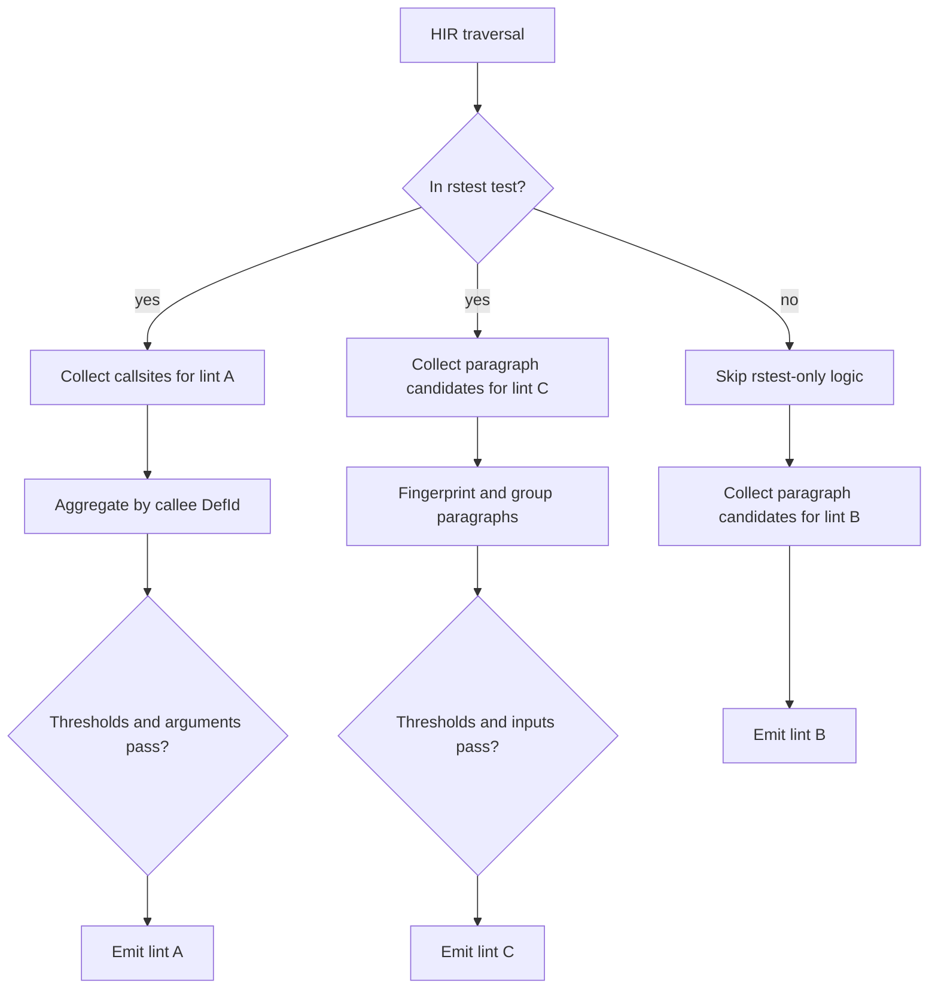
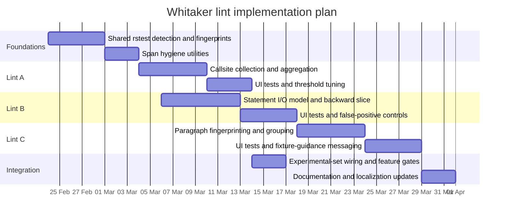

# Designing Whitaker Dylint lints for `rstest` fixtures and test hygiene

## Executive summary

Whitaker already has the core structure needed for sophisticated and
configurable lints:

- Per-lint crates under `crates/*`.
- A suite aggregator library.
- User Interface (UI) fixtures (`ui/pass_*.rs`, `ui/fail_*.rs`, and
  `ui/fail_*.stderr`).
- A documented split between standard and experimental lint sets.

This document proposes three experimental lints for `rstest`-based tests:

- Lint A, `RSTEST_HELPER_SHOULD_BE_FIXTURE`: identifies repeated helper calls
  in `#[rstest]` tests where arguments are absent, fixture-backed, or stable
  constants, and recommends fixture extraction.
- Lint B, `SINGLE_BINDING_PARAGRAPH`: identifies contiguous statement
  paragraphs that compute a single binding and are suitable for extraction.
- Lint C, `RSTEST_PARAGRAPH_SHOULD_BE_FIXTURE`: identifies repeated,
  assertion-free setup paragraphs across `#[rstest]` tests and recommends
  fixture extraction.

All three lints are designed as late lints, with conservative span handling,
local analysis boundaries, and deterministic output suitable for UI testing.

## Integration constraints

Whitaker uses Dylint's dynamic-library model, so each lint should live in an
independent crate with explicit configuration. The following constraints guide
implementation:

- Implement as late lints so High-level Intermediate Representation (HIR) and
  type checking information are available.
- Recover user-editable spans where possible to avoid flagging macro-only glue.
- Keep first release in the experimental lint set and promote only after
  tuning against real repositories.

## Lint A: call-site fixture extraction

### Intent

This lint detects helper functions repeatedly called inside `#[rstest]` tests
where call arguments suggest fixture semantics. It then recommends converting
that helper into a `#[fixture]` and injecting it as a test parameter.

- Crate name: `rstest_helper_should_be_fixture`
- Lint name: `RSTEST_HELPER_SHOULD_BE_FIXTURE`

### Trigger conditions for lint A

The lint emits only when all conditions hold:

- Callsite is within a function recognized as an `#[rstest]` test.
- Callee resolves to a local function or associated-function definition.
- Distinct test count is at least `min_distinct_tests`.
- Total call count is at least `min_calls`.
- Every argument list satisfies one of:
  - no arguments,
  - fixture locals only,
  - constants only with identical fingerprints, or
  - fixture locals plus constants with positional constant matches.

### `#[rstest]` test detection

Detection should be conservative:

- Match function attributes `rstest` and `rstest::rstest`.
- Support optional, config-gated fallback through expansion trace metadata when
  attributes are not directly available.

### Fixture-local classification

For each function parameter:

- Mark as non-fixture when annotated with provider-oriented attributes such as
  `case`, `values`, `files`, `future`, or `context`.
- Otherwise, mark as fixture-local for this lint.

Version one should accept only simple identifier bindings for fixture-local
classification and defer destructuring support to a later refinement.

### Argument fingerprint model

```rust
#[derive(Clone, Debug, PartialEq, Eq, Hash)]
enum ArgAtom {
    FixtureLocal { name: String },
    ConstLit { text: String },
    ConstPath { def_path: String },
    Unsupported,
}

#[derive(Clone, Debug, PartialEq, Eq, Hash)]
struct ArgFingerprint {
    atoms: Vec<ArgAtom>,
}
```

Fingerprint rules:

- `FixtureLocal`: path expression resolving to a recognized fixture parameter.
- `ConstLit`: literal expression captured as source text.
- `ConstPath`: path expression resolving to `const`, associated `const`, or
  `static`, keyed by a stable definition path.
- `Unsupported`: any other expression shape.

### Diagnostic strategy

Use `span_lint_hir_and_then` with the best user-editable span. Primary text
should identify fixture semantics, with notes for counts and fingerprint
consistency.

Example diagnostic wording:

- Primary: `Helper 'make_db' behaves like a fixture in rstest tests.`
- Note: `Found 4 calls across 3 tests with stable fixture/constant arguments.`
- Help: `Convert to #[fixture] and inject as a test parameter.`

### Configuration example for lint A

```toml
[rstest_helper_should_be_fixture]
min_calls = 2
min_distinct_tests = 2
require_identical_fixture_arg_names = false
provider_param_attributes = ["case", "values", "files", "future", "context"]
use_source_callee_fallback = false
```

## Lint B: single-binding paragraph detection

### Intent for lint B

This lint identifies contiguous statement paragraphs in a single block that
compute one output binding and can be extracted to reduce test or helper noise.
It is intentionally narrower than clone detection.

- Crate name: `single_binding_paragraph`
- Lint name: `SINGLE_BINDING_PARAGRAPH`

### Formal rule

Given statements `S[0..n)`, a paragraph candidate is an inclusive range
`[k..=i]` where:

- `S[i]` is `let out = <expr>;` with a simple binding pattern.
- Length is between `min_len` and `max_len` (defaults: 3 and 8).
- The range contains no control-flow constructs and no macro-only spans.
- Intermediate locals defined in `[k..i)` are not used in `(i+1)..n`.
- External input count does not exceed `max_inputs`.

### Backward-slice algorithm

For each sink binding `S[i]`:

1. Initialize `needed` to local uses inside the sink expression.
2. Walk backward from `i - 1` while contiguity is preserved.
3. Include statement `S[j]` when it defines or mutates an item in `needed`.
4. Update `needed` with statement uses and remove newly satisfied definitions.
5. Stop at the first non-contributing statement.

This preserves deterministic behaviour and keeps complexity bounded to local
block analysis.

### Statement I/O model

```rust
#[derive(Clone, Debug, Default)]
struct StmtIO {
    defs: std::collections::BTreeSet<rustc_hir::HirId>,
    uses: std::collections::BTreeSet<rustc_hir::HirId>,
    muts: std::collections::BTreeSet<rustc_hir::HirId>,
    has_control_flow: bool,
    has_macro_only_span: bool,
    has_closure: bool,
}
```

`BTreeSet` keeps iteration order stable for deterministic diagnostics and UI
outputs.

### Configuration example for lint B

```toml
[single_binding_paragraph]
min_len = 3
max_len = 8
max_inputs = 3
treat_mutating_method_calls_as_defs = true
reject_closures = true
reject_async = true
skip_external_macro_expansions = true
```

## Lint C: repeated fixture paragraph detection

### Intent for lint C

This lint bridges paragraph extraction and fixture extraction for tests. It
identifies repeated setup paragraphs across `#[rstest]` tests when the
paragraphs are assertion-free and input-compatible with fixture extraction.

- Crate name: `rstest_paragraph_should_be_fixture`
- Lint name: `RSTEST_PARAGRAPH_SHOULD_BE_FIXTURE`

### Trigger conditions for lint C

The lint emits for paragraph groups that satisfy all conditions:

- Candidates pass lint B structural constraints.
- Paragraph contains no assertions.
- Paragraph inputs are fixtures and/or stable constants.
- Input fingerprints match across occurrences.
- Distinct test count meets `min_distinct_tests`.

### Assertion detection

Use combined matching:

- macro names such as `assert`, `assert_eq`, `assert_ne`, and `debug_assert`,
- optionally configured project-specific assertion helpers.

### Paragraph fingerprint model

```rust
#[derive(Clone, Debug, PartialEq, Eq, Hash)]
struct ParagraphFingerprint {
    shapes: Vec<StmtShape>,
}

#[derive(Clone, Debug, PartialEq, Eq, Hash)]
enum StmtShape {
    Let { init: ExprShape },
    MutCall { receiver: Option<LocalSlot>, callee: CalleeShape },
}

#[derive(Clone, Debug, PartialEq, Eq, Hash)]
enum ExprShape {
    Call { callee: CalleeShape, argc: usize },
    MethodCall { method: String, argc: usize },
    Path,
    Lit,
    Other,
}

#[derive(Clone, Debug, PartialEq, Eq, Hash)]
enum CalleeShape {
    DefPath(String),
    Unknown,
}
```

Local identifiers should be normalized to deterministic slots by
first-appearance order. Deep Abstract Syntax Tree (AST) canonicalization is
intentionally out of scope.

### Implementation decisions for 8.1.3

Roadmap item 8.1.3 implements the shared fingerprint model layer in
`common::rstest`. The argument models live in
`common/src/rstest/argument_fingerprint.rs`, and the paragraph models live in
`common/src/rstest/paragraph_fingerprint.rs`. The public API is re-exported
from both `whitaker_common::rstest` and the crate root so later lint crates can
construct fingerprints without depending on compiler-private types.

Argument fingerprints are represented by `ArgFingerprint` and `ArgAtom`.
`ArgAtom::Unsupported` remains an explicit atom in the positional sequence
rather than being dropped, so later lint passes can distinguish an unsupported
argument from a shorter, groupable argument list.

Paragraph fingerprints are represented by `ParagraphFingerprint`, `StmtShape`,
`ExprShape`, `CalleeShape`, and `LocalSlot`. Local-name normalization is
builder-driven through `ParagraphNormalizer`, which assigns `LocalSlot` values
by first appearance order within a paragraph. This means two paragraphs with
the same statement structure and renamed locals compare equal when those locals
appear in the same order.

The draft design used a `u16` slot ordinal. The implementation uses a `u32`
ordinal to avoid a panic or fallible constructor in the normalizer while
preserving deterministic equality and ordering semantics.

### Emission strategy

Collect candidates during block/body checks, then emit during
`check_crate_post` after cross-test grouping completes. Support both modes:

- emit at each occurrence, or
- emit once per group with location notes.

### Configuration example for lint C

```toml
[rstest_paragraph_should_be_fixture]
min_distinct_tests = 2
min_len = 3
max_len = 8
max_inputs = 2
assertion_macros = ["assert", "assert_eq", "assert_ne", "debug_assert"]
require_fixture_or_constant_inputs = true
require_identical_input_fingerprint = true
emit_once_per_group = false
```

## Comparison and rollout guidance

| Lint                                 | Primary target                                 | Precision (expected) | Compute cost  | Key configuration                                      | Complexity |
| ------------------------------------ | ---------------------------------------------- | -------------------: | ------------: | ------------------------------------------------------ | ---------: |
| `RSTEST_HELPER_SHOULD_BE_FIXTURE`    | Repeated helper calls in `#[rstest]` tests     | High                 | Medium        | `min_calls`, `min_distinct_tests`, argument strictness | Medium     |
| `SINGLE_BINDING_PARAGRAPH`           | Contiguous single-output paragraphs            | Medium               | Low to medium | `min_len`, `max_len`, `max_inputs`, mutation policy    | Medium     |
| `RSTEST_PARAGRAPH_SHOULD_BE_FIXTURE` | Repeated setup paragraphs in `#[rstest]` tests | High                 | Medium        | `min_distinct_tests`, assertion set, input strictness  | High       |

_Table 1: Comparison of target scope, cost, and implementation complexity._

For screen readers: The following flowchart summarizes lint data flow from HIR
traversal to per-lint diagnostics.



_Figure 1: High-level analysis and emission flow for the three proposed lints._

For screen readers: The following Gantt chart outlines a staged implementation
sequence from shared helpers through integration.



_Figure 2: Proposed phased implementation timeline for lints A, B, and C._

## Non-goals and boundaries

The following work is intentionally excluded from this design:

- whole-program dependence graphs,
- Mid-level Intermediate Representation (MIR) or Static Single Assignment
  (SSA) transformations,
- general-purpose clone detection, and
- aggressive canonicalization aimed at maximal recall.

These constraints keep runtime cost predictable, diagnostics explainable, and
false-positive control practical for iterative promotion from experimental to
standard lints.

## Implementation decisions (8.1.1)

- Shared `rstest` detection now lives in `common::rstest` rather than being
  folded into the broader `common::context` or `common::attributes` helpers.
  The generic helpers still answer "test-like" questions for wider lint logic,
  while `common::rstest` keeps the stricter semantics that later fixture
  hygiene lints need.
- Strict test detection matches only `rstest` and `rstest::rstest`. Strict
  fixture detection matches only `fixture` and `rstest::fixture`. This avoids
  the broader `case` and `rstest::case` handling that remains useful in the
  generic context helpers.
- Provider-parameter detection defaults to bare and namespaced forms of
  `case`, `values`, `files`, `future`, and `context`. Parameters with those
  attributes are classified as provider-driven rather than fixture-local.
- Expansion-trace fallback is modelled as a pure `ExpansionTrace` value owned
  by `common`. Callers may pass it into `is_rstest_test_with` and
  `is_rstest_fixture_with`, but fallback remains disabled unless
  `RstestDetectionOptions` enables it explicitly.
- Version one continues to classify only simple identifier bindings as
  fixture-local. Unsupported or destructured bindings are reported as
  unsupported and excluded from `fixture_local_names` so later lints do not
  overstate fixture semantics.
- `common/Cargo.toml` now describes the current `rstest-bdd` 0.5.x workspace
  pin rather than the stale 0.2.x comment. That was documentation hygiene, not
  a behavioural change.

## Implementation decisions (8.1.2)

- Shared user-editable span recovery is now split between a pure
  `whitaker_common::rstest` policy and a thin `whitaker::hir` adapter. The
  common layer owns the ordered-frame policy, while the compiler-aware layer
  converts `rustc_span::Span` call-site chains into those frames.
- The recovery result is explicit rather than boolean. Callers now receive
  `UserEditableSpan::{Direct, Recovered, MacroOnly}` so lint drivers can
  distinguish "emit on the original span", "emit on a recovered invocation
  site", and "skip because every frame is synthetic glue".
- The `rustc` adapter walks `source_callsite()` frames until one of four
  conditions holds: the current span is dummy, the current frame is already
  user-editable, the next call-site is dummy, or `source_callsite()` stops
  making progress by returning the same span again.
- `function_attrs_follow_docs` is the first adopter. It now uses recovered
  user-editable spans for attribute ordering and item-bound checks, while
  dropping attributes whose recovery result is `MacroOnly` so compiler- or
  macro-generated glue does not participate in comparisons.
- The shared policy is covered twice: unit tests in `common::rstest::tests`
  exercise the frame-selection algorithm directly, and `rstest-bdd` 0.5.x
  scenarios in `common/tests/rstest_span_recovery_behaviour.rs` describe the
  direct, recovered, first-match, and macro-only outcomes in user terms.

## Implementation decisions (8.2.1)

- `rstest_helper_should_be_fixture` now exists as an experimental Dylint crate.
  The first implementation declares `RSTEST_HELPER_SHOULD_BE_FIXTURE`, loads
  and normalizes the Lint A configuration defaults, and builds the shared
  `RstestDetectionOptions` policy.
- The lint is intentionally diagnostic-silent in 8.2.1. Call-site collection,
  aggregation, and user-facing suggestions remain assigned to 8.2.2 through
  8.2.4, so this bootstrap does not claim analysis behaviour it does not yet
  implement.
- The suite exposes the lint only through the experimental feature
  `experimental-rstest-helper-should-be-fixture`. The installer derives that
  feature from `EXPERIMENTAL_LINT_CRATES` when `--experimental` is enabled.

## Implementation decisions (8.2.2)

- The lint now walks strict `#[rstest]` test bodies in `check_fn` and passively
  collects local helper calls. It remains diagnostic-silent; threshold
  evaluation, helper grouping, and `span_lint_hir_and_then` emission stay
  assigned to 8.2.3 and 8.2.4.
- The HIR-to-`ArgAtom` adapter lives inside
  `crates/rstest_helper_should_be_fixture/src/collector.rs` for this milestone.
  That keeps compiler-private HIR logic out of `whitaker_common::rstest`, while
  avoiding a shared adapter surface before another lint needs it.
- Collected records are keyed by the callee definition path string rather than
  raw `DefId` because the pinned rustc `DefId` does not implement ordering. The
  raw `DefId` is still stored on each record so later diagnostics can use
  compiler identity when they aggregate and emit.
- Collection is intentionally conservative. It records only local functions and
  associated functions, drops call sites whose spans cannot recover to
  user-editable source, and lowers uncertain argument expressions to
  `ArgAtom::Unsupported`.
- `const`, associated `const`, and `static` paths all use
  `ArgAtom::ConstPath` in this version. That keeps the fingerprint model stable
  for 8.2.2; any distinction between immutable constants and statics can be
  evaluated when 8.2.3 defines threshold semantics.
