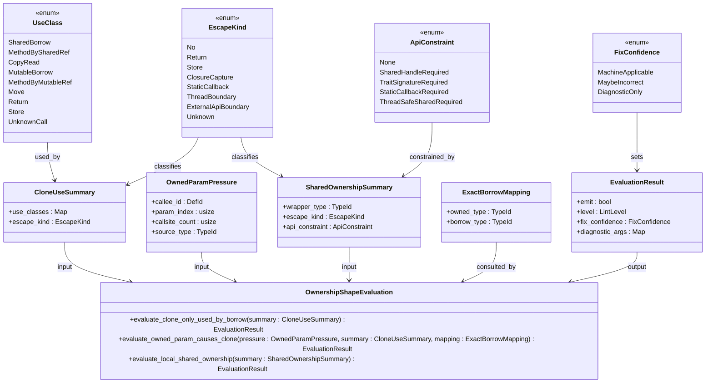
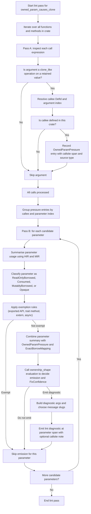

# Ownership shape lints design for value clones and local shared ownership

Status: Proposed Scope: ownership-shape lints for Phase 9. Primary audience:
Whitaker contributors and lint implementers. Review tags:

- "[type:docstyle]"

Precedent documents:

- "[Whitaker Dylint suite design](whitaker-dylint-suite-design.md)"
- "[Brain trust lints design](brain-trust-lints-design.md)"
- "[Roadmap](roadmap.md)"

## 1. Purpose and scope

This document proposes the next core-lint phase for Whitaker: an
ownership-shape suite aimed at value clones and local shared-ownership patterns
that arise when surrounding code does not appear to require ownership transfer
or shared indirection.

The phase is intentionally descriptive rather than moralizing. It does **not**
attempt to infer developer intent or accuse code of "skirting the borrow
checker". It reports observable, mechanically defensible phenomena:

- a cloned value that is only ever immutably borrowed before it is dropped;
- a by-value parameter in a local function or method whose shape induces clones
  at call sites even though the callee only reads the value; and
- a locally created shared-ownership or interior-mutability wrapper that does
  not escape and whose access pattern looks expressible with an ordinary local
  and borrows.

This phase concerns **value clones**, not Whitaker's separate **code clone
detector** pipeline.

## 2. At a glance

For readers skimming the design, the three proposed lints differ mainly in what
signal they treat as strongest evidence:

- `clone_only_used_by_borrow`: starts from a concrete clone expression and
  asks whether every observed use is read-only borrowing or copy-like access.
- `owned_param_causes_clone`: starts from repeated call-site clone pressure and
  asks whether a same-crate by-value parameter is only read by the callee.
- `local_shared_ownership`: starts from a locally created shared-ownership or
  interior-mutability wrapper and asks whether it ever escapes or serves a real
  API-imposed boundary.

In short, the first lint is clone-centric, the second is signature-centric, and
the third is wrapper-centric.

## 3. Why this phase belongs in Whitaker

Whitaker's original core suite established its house style around readable
structure, explicit documentation, bounded control-flow complexity, and panic
avoidance. The project already ships shared Dylint infrastructure, per-lint
`cdylib` crates, localized diagnostics, and UI-test harness helpers, and its
roadmap has expanded into deeper maintainability analyses such as Bumpy Road,
brain-type and brain-trait lints, the code-clone detector pipeline, and
upcoming `rstest` hygiene work.[^1][^2][^3]

That leaves a conspicuous Rust-specific gap: **ownership shape**. In Rust,
otherwise straightforward code often acquires unnecessary clones, `Rc` or
`Arc`, or interior-mutable wrappers because a signature, local control-flow
shape, or callback boundary makes borrowing awkward. Left unexamined, these
patterns can:

- obscure the semantic distinction between "borrowing for observation" and
  "taking ownership";
- add allocation or reference-count churn; and
- harden APIs around ownership when a borrow-based shape would remain more
  flexible.

Whitaker should address that gap, but it should do so with a false-positive
budget that matches the rest of the suite.

## 4. Product motivation and positioning

Whitaker should not duplicate existing Clippy coverage. Clippy already detects
several local ownership smells, including `redundant_clone`,
`unnecessary_to_owned`, `needless_pass_by_value`, `clone_on_ref_ptr`,
`rc_buffer`, `redundant_allocation`, and
`arc_with_non_send_sync`.[^4][^5][^6][^7][^8][^9][^10]

Whitaker's contribution should therefore be narrower and more structural:

1. connect a clone at the call site to the signature that caused it;
2. distinguish local ownership inflation from external API obligations; and
3. surface diagnostics that explain *why* the current ownership shape is
   heavier than the observed behaviour requires.

This is especially important for Rust code that is exploratory,
machine-generated, newly ported from other languages, or authored by
contributors who have not yet internalized borrow-oriented API design.

## 5. Non-goals

This phase will not:

- infer motive or report that a developer is "working around" or "skirting" the
  borrow checker;
- forbid `Rc`, `Arc`, `Cell`, `RefCell`, `Mutex`, or `RwLock` in general;
- attempt whole-program alias analysis or cross-crate ownership proofs;
- require breaking changes to exported APIs by default;
- warn on ownership shapes that are imposed by external trait signatures,
  callback contracts, thread or task boundaries, or framework APIs;
- supersede Clippy's purely local syntactic lints; or
- auto-rewrite non-trivial smart-pointer refactors.

## 6. Design principles

### 6.1. Report shape, not intent

Lint names, messages, and documentation should describe the ownership
phenomenon rather than speculate about why the code was written that way.

### 6.2. Prefer high-confidence facts over broad coverage

A smaller suite with reliable findings is more valuable than an accusatory lint
that fires on every `Rc<RefCell<_>>` in a GUI, browser, async, or
callback-heavy codebase.

### 6.3. Treat API boundaries as first-class evidence

Rust code often uses clones or wrappers because an API *requires* a particular
ownership or lifetime shape. That is not noise around the design. It is the
design. The lints must detect these boundaries and suppress or downgrade
diagnostics accordingly.

### 6.4. Reuse Whitaker's existing infrastructure

The suite should follow Whitaker's existing design patterns: one lint per
crate, shared diagnostics and localization helpers in `common`, deterministic
data structures, UI coverage, and configurable rollout from experimental to
standard.[^2][^11][^12]

### 6.5. Start with local, crate-contained analysis

The first release should stay within one crate and avoid speculative
cross-crate reasoning. Local or private functions, local bodies, and resolved
external API boundaries provide enough signal for a valuable first phase.

## 7. Phase title and roadmap placement

This work should land in the roadmap as **Phase 9. Ownership shape lints**. The
current roadmap already extends through Phase 8, so Phase 9 fits the sequence
cleanly.[^3]

## 8. Lint suite overview

The phase should ship three lints:

### 8.1. Metadata for `clone_only_used_by_borrow`

Warn when a cloned value is only ever immutably borrowed before drop, and the
original value appears borrowable across the same region.

This is the highest-confidence lint in the phase and the likeliest candidate
for stable, warn-by-default status after validation.

### 8.2. Metadata for `owned_param_causes_clone`

Warn on local, same-crate functions or methods whose by-value parameter shape
induces actual clones at call sites even though the callee only reads the
argument.

This lint complements rather than replaces Clippy's `needless_pass_by_value`:
it requires *observed clone pressure* at local call sites, which makes the
diagnosis more concrete and more actionably Whitaker-like.

### 8.3. Metadata for `local_shared_ownership`

Flag locally created `Rc`, `Arc`, or interior-mutability wrappers that do not
escape and whose observed use-pattern does not appear to require shared
ownership or runtime borrow mediation.

This lint should start as experimental and feature-gated.

## 9. Suggested lint metadata

### 9.1. `clone_only_used_by_borrow`

- Kind: `ownership`
- Default level: `warn`
- Rollout target: standard suite after false-positive validation

### 9.2. `owned_param_causes_clone`

- Kind: `ownership`
- Default level: `warn`
- Rollout target: experimental first, standard once public-API and generic
  suppression rules settle

### 9.3. `local_shared_ownership`

- Kind: `ownership`
- Default level: `allow` or experimental `warn`
- Rollout target: experimental only in the first phase

The `ownership` label is a documentation and selection category. It need not
imply a new compiler lint group on day one.

## 10. Worked exception model: Servo-style code must stay quiet

The Servo `servo-shot` example is a useful calibration case because, at a
glance, it contains exactly the kinds of patterns an overzealous ownership lint
would attack: `Rc` handles, `.clone()` on `Rc`, `Cell` fields, and an
`Rc<Cell<bool>>` captured by a callback.[^13]

A closer look shows that most of this shape is **API-induced rather than
incidental**:

- `WebViewBuilder::new` takes `Rc<dyn RenderingContext>`.
- `.delegate(...)` takes `Rc<dyn WebViewDelegate>`.
- `evaluate_javascript` and `take_screenshot` take `FnOnce(...) + 'static`
  callbacks.
- `WebViewDelegate` notification methods use `&self`.
- `WebView` itself is a handle backed by `Rc<RefCell<_>>`.

Those are precisely the kinds of external constraints that the lint suite must
classify as suppressing evidence.[^14][^15][^16][^17]

Concretely, the following shapes should not trigger:

- `rendering_context.clone()` and `delegate.clone()` passed into Servo builder
  APIs that require `Rc<...>`;
- `Rc<Cell<bool>>` used only to bridge a `'static` callback contract; and
- `Cell<bool>` or `Cell<usize>` stored in a delegate whose trait methods only
  expose `&self`.

This case should ship as a regression fixture in the UI suite.

## 11. Shared implementation approach

### 11.1. Architectural fit

Whitaker already establishes the right implementation pattern:

- lint crates are separate `cdylib`s;
- shared diagnostics and localization live in `common`;
- human-facing strings go through Fluent bundles with stable message slugs; and
- lint logic can rely on late passes with type information, while more
  specialized flow-sensitive checks may use the Rust compiler's Mid-level
  Intermediate Representation (MIR) where necessary.[^18][^19][^20]

This phase should follow the same split used by the brain-trust work:

- **pure, compiler-independent models and evaluation logic** in `common`; and
- **High-level Intermediate Representation (HIR) and MIR walkers plus
  rustc-private integration** in the lint crates.[^11]

### 11.2. Proposed crate and module layout

```text
common/
└── src/
    └── ownership_shape/
        ├── mod.rs
        ├── model.rs
        ├── diagnostics.rs
        ├── evaluation.rs
        ├── path_kinds.rs
        └── exact_borrow_mappings.rs

crates/
├── clone_only_used_by_borrow/
├── owned_param_causes_clone/
└── local_shared_ownership/
```

### 11.3. Proposed shared domain model

```rust
pub enum UseClass {
    SharedBorrow,
    MethodBySharedRef,
    CopyRead,
    MutableBorrow,
    MethodByMutableRef,
    Move,
    Return,
    Store,
    UnknownCall,
}

pub enum EscapeKind {
    No,
    Return,
    Store,
    ClosureCapture,
    StaticCallback,
    ThreadBoundary,
    ExternalApiBoundary,
    Unknown,
}

pub enum ApiConstraint {
    None,
    SharedHandleRequired,
    TraitSignatureRequired,
    StaticCallbackRequired,
    ThreadSafeSharedRequired,
}

pub enum FixConfidence {
    MachineApplicable,
    MaybeIncorrect,
    DiagnosticOnly,
}
```

The shared module should also define small, deterministic summaries such as
`CloneUseSummary`, `OwnedParamPressure`, and `SharedOwnershipSummary`. As with
Whitaker's brain-trust helpers, prefer `BTreeMap` and `BTreeSet` for
deterministic iteration and snapshot stability.[^11]

For screen readers: The following class diagram shows the shared ownership
shape enums, summary records, and evaluation entry points. It highlights how
use and escape classifications feed summary objects, which are then consumed by
the central evaluation logic to produce an `EvaluationResult`.

<!-- markdownlint-disable MD013 -->

<!-- markdownlint-enable MD013 -->

*Figure: Shared ownership-shape model showing the core enums, summaries, and
evaluation entry points used across the proposed lint suite.*

### 11.4. Resolution strategy

The lints should resolve functions, methods, and wrapper constructors by
**resolved `DefId` paths**, not by source text snippets. Whitaker already uses
`tcx.def_path_str(def_id)` plus a simple path parser in `no_std_fs_operations`;
the ownership suite should adopt the same technique for `Clone`, `ToOwned`,
`Rc`, `Arc`, `Cell`, `RefCell`, `Mutex`, and `RwLock` classifiers.[^21]

### 11.5. High-level Intermediate Representation (HIR) prefilter, Mid-level Intermediate Representation (MIR) confirmation

The suite should use a two-stage approach:

1. **HIR prefilter** to cheaply find candidate clone expressions, candidate
   wrapper constructors, local call-site clone pressure, and syntactic origins
   such as "simple place expression" versus "arbitrary temporary".
2. **MIR confirmation** to classify uses and escapes conservatively enough
   that diagnostics remain credible.

This matches the problem domain. Late lints run after analysis with full type
information, and Rust's lint infrastructure explicitly supports both late
passes and MIR-based checks for cases where flow-sensitive facts
matter.[^20][^22]

## 12. Lint 1: `clone_only_used_by_borrow`

### 12.1. `clone_only_used_by_borrow` intent

Detect clones whose resulting value is only observed through immutable borrows
or `&self` method calls before being dropped.

### 12.2. `clone_only_used_by_borrow` detection model

A candidate arises from one of the following operations:

- `.clone()` on an owned or shared handle;
- `Clone::clone(&x)`;
- `.to_owned()`;
- `ToOwned::to_owned(&x)`.

The lint then asks four questions:

1. What local or temporary receives the cloned value?
2. How is that local used?
3. Does the cloned value escape via move, return, storage, or unknown call?
4. Can the original value plausibly be borrowed across the same region without
   conflicting mutable uses?

The lint fires only when:

- every observed use is `SharedBorrow`, `MethodBySharedRef`, or `CopyRead`;
- no use is `Move`, `MutableBorrow`, `MethodByMutableRef`, `Return`, `Store`,
  or `UnknownCall`; and
- the original receiver is a simple place whose borrow would not overlap a move
  or mutable borrow before the clone's last use.

### 12.3. Examples

Positive:

```rust
let tmp = path.clone();
render(&tmp);
log::debug!("{}", tmp.display());
```

Suggested shape:

```rust
render(&path);
log::debug!("{}", path.display());
```

Positive, direct call-site form:

```rust
foo(&name.clone());
```

Suggested shape:

```rust
foo(&name);
```

Negative:

```rust
let tmp = name.clone();
cache.insert(tmp);
```

Negative:

```rust
let tmp = s.clone();
consume(tmp);
s.push('!');
```

### 12.4. `clone_only_used_by_borrow` diagnostics

Primary message:

> value cloned here but only immutably borrowed before drop

Notes:

- identify the receiver type where helpful;
- explain that no ownership-taking use was observed; and
- suppress the message entirely if the replacement borrow would overlap a
  mutable use of the original.

### 12.5. Suggestion policy

Machine-applicable suggestions should be limited to:

- same-expression cases such as `foo(&x.clone())`; and
- simple `let tmp = x.clone(); ...` bindings where every use of `tmp` rewrites
  directly to `x`.

More complex cases should remain diagnostic-only.

### 12.6. `clone_only_used_by_borrow` false-positive controls

Suppress when:

- the receiver is not a simple local or field place;
- the clone result feeds an unknown function by value;
- the original is moved or mutably borrowed before the last clone use;
- the candidate is from a macro expansion; or
- the clone exists to satisfy an explicit API shape that will be handled by
  `owned_param_causes_clone` instead.

## 13. Lint 2: `owned_param_causes_clone`

### 13.1. `owned_param_causes_clone` intent

Detect local, same-crate functions or methods whose by-value parameter shapes
are creating clone pressure in real call sites even though the callee only
needs read access.

This lint is the suite's main product differentiator. It turns "this parameter
could be a reference" into "this parameter is *currently causing callers to
allocate or clone*".

### 13.2. `owned_param_causes_clone` detection model

The lint runs in two passes.

#### 13.2.1. Pass A: collect clone-pressure evidence at call sites

Record a candidate when all of the following hold:

- a call argument is a clone-like operation (`clone`, `to_owned`);
- the source value remains live and is later used by the caller; and
- the callee resolves to a function or method defined in the current crate.

Each candidate stores:

- callee `DefId`;
- argument index;
- clone expression span;
- source type;
- source place kind; and
- whether the call occurs in a macro expansion.

#### 13.2.2. Pass B: summarize callee parameter usage

For each candidate callee parameter, classify the parameter as one of:

- `ReadOnlyBorrowed`: only shared borrows, `&self` methods, or copy reads;
- `Consumed`: moved, returned, stored, or passed by value to another call;
- `MutablyBorrowed`: any `&mut` use or `&mut self` method;
- `Opaque`: analysis inconclusive.

The lint fires when:

- a by-value parameter has at least one clone-pressure call site;
- the parameter is `ReadOnlyBorrowed`; and
- the callee is not exempt.

### 13.3. Exemptions

Suppress by default when the callee is:

- publicly exported;
- a trait method declaration;
- a trait-impl method whose signature is fixed by the trait;
- `extern` or FFI-facing; or
- `async` in the initial release.

The exported-API suppression mirrors Clippy's existing
`avoid-breaking-exported-api` pattern for several ownership-related
lints.[^6][^9]

### 13.4. Exact borrow mappings

For the first release, support machine-guided rewrite hints only for exact,
common owned-to-borrow mappings:

- `String -> &str`
- `Vec<T> -> &[T]`
- `PathBuf -> &Path`
- `OsString -> &OsStr`

For other concrete types, emit a generic "consider borrowing this parameter
instead of taking ownership" help message without a machine-applicable
signature rewrite.

For screen readers: The following flow diagram shows the two-pass
`owned_param_causes_clone` analysis. The lint first scans call expressions to
record clone pressure for local callees, then groups those candidates by
parameter, summarizes each parameter's observed use, applies exemptions, and
emits a diagnostic only when the evaluation still indicates read-only clone
pressure.

<!-- markdownlint-disable MD013 -->

<!-- markdownlint-enable MD013 -->

*Figure: `owned_param_causes_clone` flow from call-site clone-pressure
collection through parameter summarization, exemption handling, evaluation, and
diagnostic emission.*

### 13.5. Diagnostics

Primary span: parameter binding or function signature.

Primary message:

> parameter `{name}` takes ownership, and local callers clone to satisfy it

Notes:

- include the number of local clone-pressure call sites;
- identify the observed use-class as read-only; and
- where possible, suggest the exact borrow mapping.

A secondary call-site note may be emitted at one representative clone span.

### 13.6. Example

```rust
fn normalise(name: String) -> usize {
    name.trim().len()
}

let a = normalise(user.name.clone());
let b = normalise(admin.name.clone());
```

Suggested direction:

```rust
fn normalise(name: &str) -> usize {
    name.trim().len()
}
```

### 13.7. False-positive controls

Suppress when:

- the parameter is moved, returned, stored, or mutably borrowed;
- the callee is exported or trait-constrained, unless configuration opts in;
- call-site evidence arises only in macro expansions;
- generic or async transformations would require non-trivial lifetime
  introduction; or
- the clone source is itself a temporary, so the evidence does not actually
  show retained ownership pressure.

## 14. Lint 3: `local_shared_ownership`

### 14.1. Intent

Detect non-escaping shared-ownership or runtime-borrow wrappers whose observed
use-pattern looks local and sequential.

### 14.2. Scope

The first release should restrict itself to wrappers created in the current
body via:

- `Rc::new(...)`
- `Arc::new(...)`
- `Cell::new(...)`
- `RefCell::new(...)`
- `Mutex::new(...)`
- `RwLock::new(...)`

Nested forms such as `Rc<RefCell<T>>` and `Arc<Mutex<T>>` should be recognized
explicitly.

### 14.3. Detection model

A candidate wrapper is linted only when all of the following are true:

- the wrapper originates from a local constructor call in the current body;
- it does not return, store, or otherwise escape the body;
- it is not captured by a `'static` callback, async task, thread spawn, or
  other long-lived boundary;
- it is not passed to an external API that requires the wrapper shape; and
- the observed operations are limited to local, sequential `get`, `set`,
  `borrow`, `borrow_mut`, `lock`, `read`, or `write` patterns.

### 14.4. Diagnostic classes

The lint should distinguish three families:

1. **Local interior mutability only**

   - example: `Cell<bool>`, `RefCell<Vec<T>>`
   - likely advice: "plain local plus `&mut` may be simpler"

2. **Local shared handle only**

   - example: `Rc<T>`, `Arc<T>` with no meaningful sharing
   - likely advice: "ordinary local ownership appears sufficient"

3. **Local shared mutable wrapper**

   - example: `Rc<RefCell<T>>`, `Arc<Mutex<T>>`
   - likely advice: "non-escaping shared mutable wrapper appears heavier than
     the local usage requires"

### 14.5. `local_shared_ownership` suggestion policy

This lint should remain **diagnostic-only** in the first release.

A machine-applicable rewrite from `Rc<RefCell<T>>` to `let mut x = T` is too
risky. The lint should instead point to the constructor span, summarize the
evidence, and suggest a manual review.

### 14.6. Servo-style exemptions

Suppress when the wrapper exists because:

- a callback requires `FnOnce + 'static` or equivalent;
- an external builder or framework requires `Rc` or `Arc` or trait-object
  handles; or
- a trait callback surface uses `&self`, making `Cell` or `RefCell` a
  legitimate local state carrier.

That suppresses the Servo `Rc<Cell<bool>>` callback bridge and `Cell`-backed
delegate state described above.[^13][^14][^16][^17]

### 14.7. `local_shared_ownership` false-positive controls

Suppress when:

- a clone of `Rc` or `Arc` actually crosses a closure, async, thread, or
  external boundary;
- `Weak` handles are involved;
- multiple strong-handle aliases are observed in ways the analysis cannot
  confidently classify;
- the wrapper constructor is from a macro expansion; or
- the inner type is itself a framework handle type and the wrapper appears to
  be part of that framework's ownership contract.

## 15. Common helper requirements

### 15.1. `common::ownership_shape::path_kinds`

Resolved-path classifiers for:

- clone-like operations (`Clone::clone`, `ToOwned::to_owned`);
- shared-ownership constructors (`Rc::new`, `Arc::new`);
- interior-mutability constructors (`Cell::new`, `RefCell::new`, `Mutex::new`,
  `RwLock::new`);
- wrapper operation methods (`borrow`, `borrow_mut`, `get`, `set`, `lock`,
  `read`, `write`); and
- callback, async, and task APIs that impose `'static` or thread-safe shared
  state.

### 15.2. `common::ownership_shape::exact_borrow_mappings`

A pure mapping table used by `owned_param_causes_clone`.

### 15.3. `common::ownership_shape::evaluation`

Pure decision functions that accept summaries and return:

- whether to emit;
- emission level;
- fix confidence; and
- the diagnostic argument map needed for Fluent.

This mirrors Whitaker's existing preference for pure evaluation helpers in
`common` and thin lint-driver crates.[^11]

## 16. Diagnostics and localization

Whitaker already localizes diagnostics through Fluent bundles, uses stable
slugs, and routes messages, notes, labels, and help text through shared
helpers. The ownership suite should do the same.[^19]

Suggested lint slugs:

- `clone_only_used_by_borrow.primary`
- `clone_only_used_by_borrow.note`
- `clone_only_used_by_borrow.help`
- `owned_param_causes_clone.primary`
- `owned_param_causes_clone.note`
- `owned_param_causes_clone.help`
- `local_shared_ownership.primary`
- `local_shared_ownership.note`
- `local_shared_ownership.help`

Diagnostic arguments should include concrete facts such as:

- `{ variable }`
- `{ callee }`
- `{ parameter }`
- `{ wrapper }`
- `{ callsite_count }`
- `{ use_summary }`
- `{ exact_borrow_type }`

As elsewhere in Whitaker, missing translations should degrade to deterministic
English rather than panic.[^19]

## 17. Configuration

Whitaker's longer-term roadmap is moving toward a unified command-line
interface (CLI) and `whitaker.toml` configuration surface while retaining
compatibility with `dylint.toml` during migration.[^23] This phase should
follow that direction:

- define the canonical schema in `whitaker.toml` form; and
- provide a compatibility loader from current Dylint configuration until the
  unified config work lands.

Suggested configuration surface:

```toml
[clone_only_used_by_borrow]
enabled = true
include_to_owned = true
emit_machine_suggestions = true

[owned_param_causes_clone]
enabled = true
min_local_callsites = 1
avoid_breaking_exported_api = true
ignore_async_fns = true
representative_callsite_note = true

[local_shared_ownership]
enabled = false
ignore_static_callback_captures = true
ignore_trait_signature_constraints = true
ignore_external_api_boundaries = true
```

## 18. Testing strategy

### 18.1. Unit tests

Pure tests in `common` should cover:

- path classification;
- exact borrow mappings;
- summary evaluation logic;
- escape-kind reduction; and
- diagnostic argument shaping.

### 18.2. Behaviour tests

Use Whitaker's existing `rstest-bdd` pattern for:

- configuration precedence;
- localization fallback;
- public-API suppression;
- callback-boundary suppression; and
- representative machine-suggestion cases.[^2][^19]

### 18.3. UI tests

Each lint crate should ship pass or fail fixtures.

#### 18.3.1. UI tests for `clone_only_used_by_borrow`

Positive fixtures:

- direct `&x.clone()` call;
- local binding only borrowed;
- `to_owned()` borrowed-only case.

Negative fixtures:

- moved clone;
- mutable original conflict;
- unknown by-value call;
- macro expansion.

#### 18.3.2. UI tests for `owned_param_causes_clone`

Positive fixtures:

- private function taking `String` but only reading it;
- private method taking `Vec<T>` but only reading it.

Negative fixtures:

- parameter consumed or returned;
- exported function;
- trait method;
- async function;
- source temporary rather than retained local.

#### 18.3.3. UI tests for `local_shared_ownership`

Positive fixtures:

- local `Cell<bool>` that never crosses a boundary;
- local `Rc<RefCell<Vec<_>>>` with purely sequential access.

Negative fixtures:

- `Rc<Cell<bool>>` captured by `'static` callback;
- `Arc<Mutex<T>>` sent to a thread;
- `Rc<dyn Trait>` required by external API;
- Servo-style legitimate builder and callback usage.

## 19. Rollout plan

### 19.1. Release 1

- ship `clone_only_used_by_borrow` as experimental `warn`;
- ship `owned_param_causes_clone` as experimental `warn` with exported-API
  suppression enabled; and
- ship `local_shared_ownership` as experimental and feature-gated, off by
  default.

### 19.2. Promotion criteria

Promote `clone_only_used_by_borrow` when:

- machine-applicable suggestions compile in UI fixtures;
- false positives remain low across representative internal repositories; and
- no known framework regression fixtures fail.

Promote `owned_param_causes_clone` when:

- exported-API and trait-signature suppression rules are stable;
- the lint demonstrates more value than noise relative to Clippy's
  `needless_pass_by_value`; and
- at least one representative large codebase shows actionable findings without
  suppression churn.

Keep `local_shared_ownership` experimental until:

- callback-boundary suppression is robust;
- Servo-style and GUI-style fixtures remain quiet; and
- the lint demonstrates clear signal on non-framework, non-async code.

This mirrors the roadmap precedent for feature-gated experimental sets and
explicit promotion criteria.[^12]

## 20. Open questions

1. Which MIR query offers the best compromise between source-span fidelity and
   post-borrow-check accuracy for external Dylint lints in Whitaker's pinned
   toolchain?
2. Should `owned_param_causes_clone` remain fully crate-local, or should a
   future version emit softer notes for exported APIs when clone pressure is
   visible in the same crate?
3. Should the exact borrow-mapping table remain intentionally small, or grow to
   cover additional buffer, path, or smart-handle types?
4. Does `local_shared_ownership` warrant a separate "callback bridge"
   exemption classifier shared with future async or UI lints?
5. Should Whitaker eventually expose an `ownership` rule selection group in the
   planned unified CLI?

## 21. Decision summary

Whitaker should add a neutral, ownership-shape phase rather than a moralizing
"borrow-checker workaround" lint. The suite should begin with one
high-confidence clone-use lint, one call-site-to-callee ownership-pressure
lint, and one experimental local-wrapper lint. The design should reuse
Whitaker's current Dylint, localization, diagnostics, and pure-helper
architecture, while treating framework and callback boundaries as suppressing
evidence rather than anomalies.

## 22. References

[^1]: Whitaker README, current lint inventory and project
    framing. <https://github.com/leynos/whitaker>
[^2]: Whitaker suite design, shared helpers, localization, UI
    harness, and existing core-lint architecture.
    <https://raw.githubusercontent.com/leynos/whitaker/main/docs/whitaker-dylint-suite-design.md>
[^3]: Whitaker roadmap, current phase sequence through Phase 8
    and related delivered work.
    <https://raw.githubusercontent.com/leynos/whitaker/main/docs/roadmap.md>
[^4]: Clippy `redundant_clone`.
    <https://rust-lang.github.io/rust-clippy/master/index.html#redundant_clone>
[^5]: Clippy `unnecessary_to_owned`.
    <https://rust-lang.github.io/rust-clippy/master/index.html#unnecessary_to_owned>
[^6]: Clippy `needless_pass_by_value`.
    <https://rust-lang.github.io/rust-clippy/master/index.html#needless_pass_by_value>
[^7]: Clippy `clone_on_ref_ptr`.
    <https://rust-lang.github.io/rust-clippy/master/index.html#clone_on_ref_ptr>
[^8]: Clippy `rc_buffer`.
    <https://rust-lang.github.io/rust-clippy/master/index.html#rc_buffer>
[^9]: Clippy `redundant_allocation`.
    <https://rust-lang.github.io/rust-clippy/master/index.html#redundant_allocation>
[^10]: Clippy `arc_with_non_send_sync`.
    <https://rust-lang.github.io/rust-clippy/master/index.html#arc_with_non_send_sync>
[^11]: Whitaker brain-trust lints design, pure-helper pattern
    and deterministic data structures in `common`.
    <https://raw.githubusercontent.com/leynos/whitaker/main/docs/brain-trust-lints-design.md>
[^12]: Whitaker roadmap, experimental-set and
    promotion-criteria precedent in Phase 8.
    <https://raw.githubusercontent.com/leynos/whitaker/main/docs/roadmap.md>
[^13]: `servo-shot` example source.
    <https://raw.githubusercontent.com/simonw/research/main/servo-crate-exploration/servo-shot/src/main.rs>
[^14]: Servo `WebViewBuilder` docs,
    `Rc<dyn RenderingContext>` and `Rc<dyn WebViewDelegate>` API shape.
    <https://doc.servo.org/servo/webview/struct.WebViewBuilder.html>
[^15]: Servo `WebView` docs, handle backed by
    `Rc<RefCell<WebViewInner>>`.
    <https://doc.servo.org/servo/struct.WebView.html>
[^16]: Servo `WebViewDelegate` docs, callback surface uses
    `&self`.
    <https://doc.servo.org/servo/webview_delegate/trait.WebViewDelegate.html>
[^17]: Servo `WebView` docs, `'static` callback requirements for
    `evaluate_javascript` and `take_screenshot`.
    <https://doc.servo.org/servo/struct.WebView.html>
[^18]: Whitaker suite design, per-lint crate scaffolding and
    suite wiring.
    <https://raw.githubusercontent.com/leynos/whitaker/main/docs/whitaker-dylint-suite-design.md>
[^19]: Whitaker suite design, localization and diagnostic structure.
    <https://raw.githubusercontent.com/leynos/whitaker/main/docs/whitaker-dylint-suite-design.md>
[^20]: Rust compiler development guide, lint timing and late or MIR
    lint infrastructure.
    <https://rustc-dev-guide.rust-lang.org/diagnostics.html>
[^21]: Whitaker suite design,
    `no_std_fs_operations` implementation using `tcx.def_path_str(def_id)` and
    parsed path segments.
    <https://raw.githubusercontent.com/leynos/whitaker/main/docs/whitaker-dylint-suite-design.md>
[^22]: Rust compiler development guide, MIR overview and passes.
    <https://rustc-dev-guide.rust-lang.org/mir/index.html>
[^23]: Whitaker roadmap, unified CLI / `whitaker.toml`
    direction with compatibility period.
    <https://raw.githubusercontent.com/leynos/whitaker/main/docs/roadmap.md>
