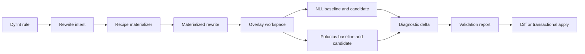

# RFC 0003: Compiler-validated rewrite checking

## Preamble

- **RFC number:** 0003
- **Status:** Proposed
- **Created:** 2026-08-30
- **Scope:** Compiler-based validation of candidate Rust source rewrites.
- **Related RFCs:** RFC 0004 and RFC 0005.
- **Precedence documents:** `docs/whitaker-cli-design.md`,
  `docs/ownership-shape-lints-design.md`, and any later accepted Architecture
  Decision Records (ADRs).

## 1. Summary

This RFC proposes a reusable rewrite checker for Whitaker. The checker accepts a
materialized source rewrite, constructs an isolated overlay workspace, and
compiles the unchanged and rewritten source under equivalent Cargo
configurations. It can run the candidate with both the ordinary non-lexical
lifetime (NLL) analysis and Polonius Alpha, using the same Rust compiler.

The checker classifies a candidate as:

- accepted by both NLL and Polonius;
- accepted only by Polonius;
- rejected by Polonius;
- accepted by NLL but rejected by Polonius;
- stale; or
- inconclusive because the toolchain or build could not be reproduced.

The checker does not mutate the working tree. It also does not claim semantic
equivalence merely because a rewrite compiles. Recipe-specific reasoning and
test validation remain separate responsibilities of the rewriter proposed by
RFC 0005.

The design deliberately reuses three planned Whitaker capabilities:

- the unified `whitaker` command-line interface (CLI);
- Phase 9 ownership-shape analysis; and
- Phase 11 overlay workspaces and per-target Cargo replay.

## 2. Problem

Green Continuous Integration (CI) proves that the checked-in source compiles.
It does not prove that the source expresses ownership directly.

Rust code, especially code produced by agents, may contain defensive ownership
workarounds introduced after an NLL borrow-check error:

- values cloned only to avoid an overlapping borrow;
- collection entries removed and reinserted;
- fields replaced with `Default::default()` and restored later;
- identifiers staged in temporary vectors before a mutation pass;
- read and write passes duplicated;
- owned snapshots retained only to read data while the original is mutated;
- lexical blocks or helper functions introduced solely to shorten a borrow.

A conventional lint can recognize these shapes. It cannot reliably determine
whether a proposed direct formulation:

1. still compiles under NLL;
2. compiles only under Polonius;
3. violates a real aliasing restriction; or
4. fails for a reason unrelated to borrowing.

The useful question is therefore counterfactual:

> Does a concrete rewrite compile under the configured checker, and does
> Polonius accept a rewrite that NLL rejects?

Answering that question requires a second compilation of rewritten source.
Running two borrow analyses inside a normal Dylint pass would couple Whitaker to
unstable `rustc_borrowck` internals and would still leave multi-file rewrites,
Cargo target selection, feature selection, build scripts, and path dependencies
unmodelled.

Whitaker needs an external compiler oracle with a stable input and output model.

## 3. Current state

Whitaker's ownership-shape design already proposes High-level Intermediate
Representation (HIR) prefiltering followed by Mid-level Intermediate
Representation (MIR) confirmation. It also distinguishes machine-applicable,
possibly incorrect, and diagnostic-only fixes.

The planned Phase 11 workspace analysis already proposes:

- temporary overlay workspaces;
- minimal text edits that never touch the working tree;
- `cargo metadata --format-version 1`;
- per-target `cargo check --message-format=json`; and
- diagnostic collection and classification.

The planned unified CLI makes `whitaker check` the product surface and already
owns Cargo invocation, target configuration, installation, output, and exit
status handling.

Cargo provides stable, versioned JSON for workspace metadata and build
messages. `RUSTC_WORKSPACE_WRAPPER` can wrap compiler invocations for workspace
members while preserving separate artifact hashes. These facilities provide a
sufficiently stable boundary for the checker.[^1][^2]

Polonius Alpha is a location-sensitive borrow analysis intended to accept NLL
problem case 3, conditional mutable borrows, and lending-iterator patterns. The
Rust project currently treats it as a superset of NLL, while retaining known
stabilization and soundness work.[^3]

## 4. Goals and non-goals

### 4.1. Goals

- Validate concrete, multi-file Rust rewrites without mutating the working tree.
- Compare NLL and Polonius with the same compiler, target, features, and Cargo
  resolution.
- Reuse one checker for existing ownership lints, the lints proposed by RFC
  0004, and future refactoring rules.
- Produce deterministic human-readable and JSON reports.
- Preserve pre-existing diagnostics through baseline-to-candidate comparison.
- Select the smallest sound Cargo target scope and escalate when a rewrite
  changes a signature or shared module.
- Cache baseline and candidate results without allowing one borrow-checker mode
  to contaminate another.
- Treat compiler acceptance as evidence of type and borrow correctness, not as a
  proof of behavioural equivalence.
- Remain usable when Polonius is unavailable by reporting the unavailable
  profile explicitly.

### 4.2. Non-goals

- Reimplement NLL or Polonius in Whitaker.
- Parse arbitrary compiler prose to infer developer intent.
- Prove semantic equivalence, panic equivalence, drop-order equivalence, or
  performance equivalence.
- Execute a complete test suite for every candidate by default.
- Rewrite source code. RFC 0005 owns materialization and application.
- Support legacy Datalog Polonius as a fallback for Polonius Alpha.
- Guarantee sandboxing of Cargo build scripts or procedural macros.

## 5. Terminology and invariants

### 5.1. Terminology

A **rewrite intent** is a semantic proposal emitted by a lint. It identifies a
recipe, source anchors, and evidence, but need not contain final text.

A **materialized rewrite** is a closed set of concrete UTF-8 text edits against
specific file contents.

A **checker profile** is one compiler configuration relevant to validation,
such as ordinary NLL or Polonius Alpha.

A **baseline run** compiles the unchanged overlay under one profile.

A **candidate run** compiles the overlay after applying one materialized
rewrite.

A **diagnostic delta** is the set of candidate diagnostics absent from the
corresponding baseline.

### 5.2. Invariants

The checker must preserve the following invariants:

1. NLL and Polonius runs use the same `rustc` binary.
2. A rewrite is checked only when every edited file matches its recorded
   content digest.
3. The source checkout is never modified.
4. Baseline diagnostics are not attributed to the rewrite.
5. Paths in reports are normalized back to workspace-relative paths.
6. Polonius-only acceptance requires an explicit Polonius Alpha profile. The
   checker must never silently substitute legacy Polonius.
7. A successful compile is reported as compiler validation, not semantic
   equivalence.
8. The report records the exact toolchain, target, feature set, Cargo arguments,
   and checker flags.
9. A candidate accepted by NLL but rejected by Polonius is preserved as a
   possible compiler regression rather than silently discarded.
10. Build configuration is immutable for the duration of a validation session.

## 6. Proposed architecture

The following pipeline description serves as assistive text for Figure 1. A
Dylint rule emits a rewrite intent. RFC 0005 materializes that intent into text
edits. The checker copies the relevant workspace into an overlay, runs baseline
and candidate compilations, compares diagnostics, and returns a validation
report. RFC 0005 may then display or apply the candidate.



_Figure 1: Rewrite discovery, materialization, compiler validation, and optional
application._

### 6.1. Crate boundaries

The implementation should introduce two support crates.

```text
crates/
├── whitaker_rewrite_model/
│   ├── candidate.rs
│   ├── edit.rs
│   ├── invocation.rs
│   ├── report.rs
│   └── schema.rs
└── whitaker_rewrite_check/
    ├── baseline.rs
    ├── cache.rs
    ├── cargo.rs
    ├── diagnostics.rs
    ├── overlay.rs
    ├── profiles.rs
    ├── scope.rs
    └── session.rs
```

`whitaker_rewrite_model` must remain free of `rustc_private` dependencies. Lint
crates, the root CLI, and the rewrite engine can depend on it without importing
Cargo orchestration.

`whitaker_rewrite_check` owns overlay creation and compiler execution. It
should expose a library API so Phase 11 workspace analysis and RFC 0005 can
share the same implementation.

The root `whitaker` crate owns CLI parsing, configuration merging,
localization, and rendering.

### 6.2. Materialized rewrite model

The model should use whole-file digests plus byte ranges. Byte ranges alone are
unsafe after an intervening edit, while whole-file digests make stale plans
unambiguous.

```rust,no_run
pub struct MaterializedRewrite {
    pub schema_version: u16,
    pub id: RewriteId,
    pub rule: RuleId,
    pub summary_key: MessageKey,
    pub impact: ImpactScope,
    pub files: Vec<FileEditSet>,
    pub discovery: DiscoveryContext,
}

pub struct FileEditSet {
    pub path: WorkspaceRelativePath,
    pub base_sha256: Sha256Digest,
    pub edits: Vec<TextEdit>,
}

pub struct TextEdit {
    pub start_byte: u64,
    pub end_byte: u64,
    pub replacement: String,
}

pub enum ImpactScope {
    BodyLocal,
    ItemLocal,
    PackageTargets,
    ReverseWorkspaceDependencies,
    Workspace,
}
```

Edits within one file must be non-overlapping and sorted by their original byte
range. Application proceeds from the end of the file towards the beginning so
earlier offsets remain valid.

`DiscoveryContext` should record:

- package and target identity;
- active features;
- target triple;
- target toolchain;
- originating lint and lint-bundle version;
- the source span and enclosing item fingerprint; and
- any Cargo arguments forwarded by the user.

### 6.3. Validation request and result model

```rust,no_run
pub struct RewriteCheckRequest {
    pub rewrite: MaterializedRewrite,
    pub invocation: CargoInvocation,
    pub profiles: Vec<BorrowCheckerProfile>,
    pub gates: ValidationGates,
}

pub enum BorrowCheckerProfile {
    Nll,
    PoloniusNext,
}

pub enum RewriteAcceptance {
    NllAndPolonius,
    PoloniusOnly,
    RejectedByPolonius,
    PoloniusRegression,
    Stale,
    Inconclusive,
}

pub struct RewriteCheckReport {
    pub rewrite_id: RewriteId,
    pub acceptance: RewriteAcceptance,
    pub baseline: Vec<CompilationReport>,
    pub candidate: Vec<CompilationReport>,
    pub diagnostic_delta: Vec<NormalizedDiagnostic>,
    pub invocation_fingerprint: InvocationFingerprint,
}
```

The serialized JSON envelope must carry a schema version. Unknown fields must
be ignored where safe. Unknown enum variants must cause a clear compatibility
error rather than being mapped to another meaning.

### 6.4. Toolchain resolution and capability probing

The checker must use the target workspace's effective toolchain, not the
toolchain used to build the Whitaker binary.

Resolution should follow this order:

1. an explicit `--toolchain` supplied to Whitaker;
2. the workspace's `rust-toolchain.toml` or `rust-toolchain`;
3. a directory override reported by `rustup`;
4. the caller's ordinary `cargo` and `rustc`.

The resolved compiler identity must include `rustc -vV` output and the Cargo
version.

Polonius support must be capability-probed once per compiler identity. The
probe should compile a tiny, known NLL problem case with the configured
Polonius Alpha arguments. Merely finding a flag name in `rustc -Z help` does not
prove that the desired behaviour is available.

The initial `PoloniusNext` adapter should append:

```plaintext
-Zpolonius=next
```

The flag must live behind the profile adapter. A future stable preview or
feature gate should require changing one adapter rather than every caller.

If the probe fails, the profile result is `Unavailable`. The checker must not
fall back to `-Zpolonius=legacy`.

### 6.5. Compiler wrapping

The checker should inject profile-specific arguments with a small
`RUSTC_WORKSPACE_WRAPPER`. This confines Polonius to workspace members and
allows dependency artifacts to be reused.

The wrapper must preserve existing wrappers:

- an existing `RUSTC_WRAPPER`, such as `sccache`, remains in Cargo's outer
  wrapper position;
- an existing `RUSTC_WORKSPACE_WRAPPER` is invoked as an inner wrapper by
  Whitaker's wrapper; and
- user `RUSTFLAGS` and encoded flags remain unchanged.

Whitaker must record the composed wrapper chain in verbose diagnostics.

Using `RUSTFLAGS` globally is a supported fallback, but not the default,
because it rebuilds dependencies and can accidentally change build scripts or
procedural macros.

### 6.6. Overlay construction

The overlay engine should be shared with Phase 11.

The engine should:

1. call `cargo metadata --format-version 1`;
2. identify workspace members and local path dependencies needed by the selected
   targets;
3. create a temporary workspace under
   `target/whitaker/rewrite/<session-id>/overlay`;
4. copy manifests, lockfiles, Cargo configuration, toolchain files, sources,
   and required local assets;
5. omit `.git/`, ordinary `target/` directories, and unrelated generated
   artefacts;
6. apply concrete edits only inside the overlay; and
7. assign a separate target directory under the validation session.

Source files must not be symlinked or hard-linked to the working tree. Build
scripts occasionally write into package directories despite Cargo guidance.
A symlink or writable hard link would therefore violate the no-mutation
invariant. Copy-on-write reflinks may be used when the platform guarantees
write isolation; otherwise ordinary copies are required.

The overlay should preserve relative path relationships between workspace
members and local path dependencies. Absolute paths in reports must be mapped
back to the original workspace.

### 6.7. Cargo invocation and target scope

The checker should derive a minimal sound scope from `ImpactScope`.

| Impact scope | Initial Cargo scope |
| --- | --- |
| `BodyLocal` | Discovering package and target |
| `ItemLocal` | All targets in the discovering package that can compile the item |
| `PackageTargets` | All selected targets in the package |
| `ReverseWorkspaceDependencies` | Package plus affected reverse workspace dependencies |
| `Workspace` | All selected workspace members |

_Table 1: Initial Cargo scope selected from rewrite impact._

A body-local rewrite discovered in a library target should normally begin with:

```bash
cargo check -p <package> --lib --message-format=json
```

A private signature rewrite should compile every target in the package. A
public or cross-crate signature rewrite should include reverse workspace
dependencies. Rewrites touching workspace manifests, generated code,
procedural macros, or shared include files should escalate to the workspace.

The checker must preserve:

- `--features`, `--all-features`, and `--no-default-features`;
- `--target`;
- profile selection;
- `--manifest-path`;
- `--locked`, `--frozen`, or `--offline`;
- selected packages and targets; and
- relevant configuration passed after `--`.

A report is valid only for the recorded configuration. It must not imply that
untested feature combinations or target triples were checked.

### 6.8. Baseline and candidate runs

Each validation session should create one cached baseline per invocation
fingerprint and checker profile.

The baseline run compiles the unmodified overlay. The candidate run starts from
the same overlay snapshot with exactly one rewrite group applied.

Baseline compilation serves three purposes:

- it prevents pre-existing failures from being blamed on a rewrite;
- it detects non-reproducible feature or target selection; and
- it supports repositories that already contain Polonius-only code.

For an NLL-green repository, the baseline is expected to succeed. The design
must nevertheless compare diagnostic deltas rather than assuming success.

### 6.9. Diagnostic normalization

Cargo's JSON stream should be parsed line by line. Non-JSON output from build
scripts and procedural macros should be retained as unstructured log records
but must not crash the parser.

A normalized diagnostic key should contain:

```rust,no_run
pub struct DiagnosticKey {
    pub package_id: PackageId,
    pub target_name: String,
    pub target_kind: Vec<String>,
    pub level: DiagnosticLevel,
    pub code: Option<String>,
    pub primary_file: Option<WorkspaceRelativePath>,
    pub primary_start: Option<LineColumn>,
    pub primary_end: Option<LineColumn>,
    pub message_fingerprint: Option<MessageFingerprint>,
}
```

The compiler error code and primary span should dominate matching. A normalized
message fingerprint is a fallback for diagnostics without codes. Rendered prose
must not be the sole identity because wording can change between toolchains.

Overlay paths, temporary target paths, and session identifiers must be removed
before comparison or serialization.

### 6.10. Classification algorithm

The checker should classify one candidate as follows.

```text
if source digests do not match:
    Stale
else if a required baseline cannot be reproduced:
    Inconclusive
else if candidate Polonius run has new errors:
    RejectedByPolonius
else if candidate NLL run succeeds and candidate Polonius run succeeds:
    NllAndPolonius
else if candidate NLL run has new errors and candidate Polonius run succeeds:
    PoloniusOnly
else if candidate NLL run succeeds and candidate Polonius run has new errors:
    PoloniusRegression
else:
    Inconclusive
```

`PoloniusOnly` requires that every candidate error counted against NLL is absent
from the Polonius candidate. The report should include the NLL diagnostic codes
and spans, but it need not maintain a hard-coded list of borrow-check error
codes.

`PoloniusRegression` should produce a high-visibility diagnostic and preserve
the overlay and command log for reporting upstream.

### 6.11. Additional validation gates

Compiler checking is the mandatory gate. Callers may request additional gates:

```rust,no_run
pub struct ValidationGates {
    pub check: bool,
    pub compile_tests: TestScope,
    pub run_tests: TestScope,
    pub clippy: GateMode,
    pub rustfmt_check: GateMode,
}
```

The rewrite checker itself should default to `cargo check` only. RFC 0005 may
request affected tests or workspace quality gates before applying a rewrite.

Running tests under NLL when the candidate is intentionally Polonius-only is not
useful. Polonius-only candidates should run requested gates under Polonius and
retain the failed NLL check as portability evidence.

### 6.12. Caching

The cache key should include:

- workspace root identity;
- source tree digest for selected files;
- Cargo lockfile digest;
- Cargo invocation fingerprint;
- compiler identity;
- checker profile;
- wrapper-chain fingerprint;
- environment allowlist fingerprint; and
- rewrite edit digest.

Baseline results may be reused across candidates in one session. Candidate
results may be reused across repeated `diff` or `apply` commands while source
digests remain unchanged.

Cache entries should live under `target/whitaker/rewrite-cache/` and be safe to
delete. The cache must never be the sole record of an applied rewrite.

### 6.13. CLI surface

RFC 0005 defines the complete rewrite command family. This RFC requires at
least:

```plaintext
whitaker rewrite check [OPTIONS] [-- <cargo args...>]

Options:
  --plan <PATH>                 Validate a serialized rewrite plan
  --select <SELECTOR,...>       Select rewrite-producing rules
  --profile <PROFILE>           nll | polonius-next | all
  --scope <SCOPE>               auto | target | package | reverse-deps | workspace
  --json                        Emit the versioned machine-readable report
  --keep-overlay                Preserve the temporary overlay for inspection
  --offline                     Prevent network access
```

When `--plan` is omitted, RFC 0005 may discover and materialize candidates
before invoking the checker.

A concise human result should look like:

```text
BOR001 lookup_then_relookup
  source: crates/example/src/cache.rs:84:5
  result: accepted by Polonius Alpha; rejected by NLL
  NLL diagnostics: E0499 at 91:9
  checked: example/lib, default features, x86_64-unknown-linux-gnu
  rewrite: not applied
```

## 7. Requirements

### 7.1. Functional requirements

- Accept one or more materialized rewrite groups.
- Reject stale source digests before creating candidate builds.
- Reproduce the original Cargo selection.
- Run NLL and Polonius with the same compiler.
- Compare baseline and candidate diagnostics.
- Return a stable acceptance classification.
- Support package, target, reverse-dependency, and workspace scopes.
- Emit localized human output and stable JSON.
- Preserve overlays and logs on request or on unexpected divergence.
- Allow callers to request additional formatting, lint, and test gates.

### 7.2. Technical requirements

- Use `cargo metadata --format-version 1`.
- Consume `cargo check --message-format=json`.
- Keep the model crate free from `rustc_private`.
- Use capability-oriented filesystem access in production code.
- Store only workspace-relative paths in durable reports.
- Use deterministic maps and ordering for serialized output.
- Compose, rather than discard, user compiler wrappers.
- Keep NLL and Polonius artifacts distinct.
- Avoid global environment mutation in tests.
- Record all subprocess arguments and relevant environment variables in verbose
  logs with secrets redacted.

### 7.3. Safety and trust requirements

- Never modify the source checkout.
- Never follow a rewrite path outside the workspace root.
- Reject overlapping edits.
- Reject edits that split a UTF-8 code point.
- Reject source generated by a macro unless a writable, user-authored call-site
  span is available.
- Never label compiler validation as semantic equivalence.
- Never auto-select Polonius-only acceptance as project policy.
- Clearly state that Cargo build scripts and procedural macros execute with the
  caller's privileges.
- Default to `--locked`; support `--offline` and `--frozen`.
- Redact credentials and token-valued environment variables from reports.

## 8. Compatibility and migration

The checker is additive. Existing Dylint use remains unchanged.

Implementation should proceed in four stages.

### 8.1. Stage 1: Shared model and NLL checker

- Add `whitaker_rewrite_model`.
- Add overlay creation and ordinary NLL baseline-to-candidate checking.
- Expose a library API without adding automatic rewrite discovery.

### 8.2. Stage 2: Polonius profile

- Add toolchain capability probing.
- Add wrapper composition and `PoloniusNext`.
- Add `PoloniusOnly` and `PoloniusRegression` reports.

### 8.3. Stage 3: CLI integration

- Add `whitaker rewrite check`.
- Add JSON output and localized human reports.
- Reuse bundle and toolchain repair from the unified CLI.

### 8.4. Stage 4: Shared overlay consolidation

- Replace any duplicate Phase 11 overlay implementation with the common engine.
- Add reverse-dependency scope selection.
- Add cache reuse across workspace analyses and rewrite checking.

No accepted source rewrite should depend on RFC 0003 until the checker has
corpus coverage across representative workspaces.

## 9. Performance and resource use

The dominant cost is Cargo replay. The design should reduce it through:

- one baseline per profile and invocation fingerprint;
- workspace-only compiler wrapping;
- shared dependency artifacts;
- target-scoped checking;
- batching only independent candidates;
- candidate result caching; and
- lazy Polonius execution.

A likely fast path is:

1. materialize a candidate;
2. run the configured accepted checker;
3. run the alternative checker only when classification is requested.

For repositories configured to accept Polonius, the accepted-checker run may be
Polonius-first. NLL can then run only to report portability.

The CLI should report checker duration per candidate and aggregate cache hit
rates. This enables evidence-based decisions about whether the additional
compiler work improves agent throughput.

## 10. Testing strategy

### 10.1. Unit tests

Unit tests should cover:

- source digest validation;
- non-overlapping edit enforcement;
- UTF-8 boundary checking;
- diagnostic normalization;
- delta computation;
- classification truth tables;
- invocation fingerprints;
- wrapper-chain composition; and
- deterministic JSON ordering.

### 10.2. Property tests

Property tests should generate sorted and unsorted text edits and verify that:

- accepted edit sets never overlap;
- reverse-order application equals the specified transformed text;
- stale digests always prevent application; and
- path normalization never escapes the workspace root.

### 10.3. Behaviour tests

Behaviour-driven tests should cover:

- an NLL-valid rewrite;
- a canonical NLL problem case 3 rewrite accepted only by Polonius;
- a rewrite rejected by both profiles;
- a simulated Polonius regression;
- a pre-existing baseline error;
- a multi-file signature rewrite;
- feature and target selection;
- an existing `sccache` wrapper;
- an unavailable Polonius profile; and
- overlay preservation.

### 10.4. End-to-end tests

End-to-end fixtures should include:

- a single-package application;
- a multi-package workspace with reverse dependencies;
- a path dependency outside the root package but inside the workspace;
- a build script;
- a procedural macro;
- a custom target directory; and
- a dirty working tree whose edited files still match the recorded digest.

### 10.5. Corpus evaluation

Before promotion from experimental status, the checker should run against:

- Whitaker itself;
- Gauss;
- Weaver;
- ddlint;
- Lille;
- Netsuke;
- Stilyagi; and
- mxd.

The evaluation should record reproducibility, candidate latency, diagnostic
stability, and false classifications.

## 11. Alternatives considered

### 11.1. Run both analyses inside Dylint

This would avoid a second Cargo process, but it would couple Whitaker to
unstable borrow-checker internals, provide no natural multi-file source overlay,
and duplicate Cargo target and feature logic. It is rejected.

### 11.2. Use `RUSTFLAGS` for every compiler invocation

This is simple, but it recompiles dependencies and changes more of the build
than necessary. It remains a fallback, not the default.

### 11.3. Compile only a generated function fragment

A fragment loses imports, trait resolution, macros, type inference, associated
types, feature gates, and surrounding lifetime constraints. It cannot serve as
a trustworthy oracle.

### 11.4. Trust lint analysis without recompilation

HIR and MIR analysis can identify strong candidates, but the purpose of this
RFC is to resolve cases near the boundary of borrow-checker precision. Static
heuristics alone cannot provide the required evidence.

### 11.5. Use legacy Polonius facts

The legacy Datalog engine is not the target language behaviour and may accept a
different set of programs. Substituting it would produce misleading
classification.

### 11.6. Modify the working tree and run `cargo check`

This creates race conditions, interferes with editors and agents, and risks
losing uncommitted work. It is rejected.

## 12. Open questions

1. Should the first release always run both profiles, or run the accepted
   project profile first and the comparison profile lazily?
2. Should reverse-dependency scope include examples and benchmarks by default?
3. Should build-script and procedural-macro stderr participate in cache
   invalidation?
4. How should a workspace declare that Polonius-only source is acceptable:
   `whitaker.toml`, Cargo metadata, or both?
5. Should a retained overlay include a ready-to-run shell script reproducing
   every command?
6. Should non-deterministic compiler diagnostics trigger an automatic retry
   before `Inconclusive`?
7. Should the checker offer an optional sandbox backend for build scripts and
   procedural macros?
8. How long should validation reports remain compatible across Whitaker
   versions?

## 13. Recommendation

Whitaker should adopt the external overlay-based checker.

The compiler is the best available oracle for whether a concrete rewrite is
accepted under NLL or Polonius. The checker should therefore remain small in
semantic ambition and strict in reproducibility: exact edits, exact toolchain,
exact Cargo configuration, normalized diagnostic deltas, and no working-tree
mutation.

This checker should become shared infrastructure for Phase 11, the ownership
lints, the borrow-workaround lints proposed by RFC 0004, and the transactional
rewriter proposed by RFC 0005.

## References

[^1]: Cargo Book, "External Tools":
    <https://doc.rust-lang.org/cargo/reference/external-tools.html>

[^2]: Cargo Book, "Environment Variables":
    <https://doc.rust-lang.org/cargo/reference/environment-variables.html>

[^3]: Rust Project Goals, "Stabilize and model Polonius Alpha":
    <https://rust-lang.github.io/rust-project-goals/2026/polonius.html>

[^4]: Whitaker CLI design: `../whitaker-cli-design.md`

[^5]: Whitaker ownership-shape lints design:
    `../ownership-shape-lints-design.md`

[^6]: Whitaker test-support overlay design:
    `../technical-design-for-test-support-dead-code-and-masked-dead-code-expectations.md`
