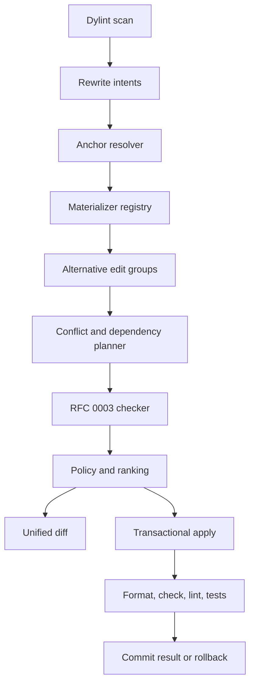

# RFC 0005: Validated ownership and borrow rewriter

## Preamble

- **RFC number:** 0005
- **Status:** Proposed
- **Created:** 2026-08-30
- **Scope:** Discovery, materialization, review, and transactional
  application of ownership and borrowing rewrites.
- **Depends on:** RFC 0003.
- **Consumes rules from:** Whitaker Phase 9 and RFC 0004.
- **Precedence documents:** `docs/whitaker-cli-design.md`,
  `docs/ownership-shape-lints-design.md`, and any later accepted ADRs.

## 1. Summary

This RFC proposes a first-class Whitaker rewriter for the existing ownership
lints and the borrow-workaround rules proposed by RFC 0004.

The rewriter should:

1. collect versioned rewrite intents from Dylint rules;
2. resolve their semantic anchors against current source;
3. materialize one or more concrete rewrite alternatives;
4. invoke RFC 0003 to classify each alternative under NLL and Polonius;
5. rank compiler-valid alternatives;
6. show a deterministic diff;
7. apply selected edit groups transactionally; and
8. run post-application formatting, compiler, lint, and test gates with rollback
   on failure.

The rewriter must separate three questions:

- **Can the edit be constructed?**
- **Does the rewritten program compile under the accepted checker?**
- **Is the transformation sufficiently behaviour-preserving to apply
  automatically?**

Compiler acceptance answers only the second question.

The command surface should be:

```plaintext
whitaker rewrite check
whitaker rewrite diff
whitaker rewrite apply
whitaker rewrite explain <REWRITE-ID>
```

Polonius-only rewrites must remain explicit. The default project policy should
accept only NLL-valid rewrites until `whitaker.toml` or a CLI option authorizes
Polonius Alpha.

## 2. Problem

A lint can point to ownership inflation, but agents and developers still need to
perform the difficult step: reconstruct the direct borrowing form.

That step is not uniformly local.

`clone_only_used_by_borrow` may require replacing a clone binding and all of its
uses. `owned_param_causes_clone` may require changing a private function
signature and several call sites. A repeated collection lookup may have both an
`entry` rewrite and a Polonius-only direct-borrow rewrite. A staged identifier
loop may require selecting a mutable iterator. A temporary snapshot may require
splitting fields or changing a helper signature.

Ordinary rustc suggestions are valuable for simple spans, but they do not
provide:

- versioned semantic recipes;
- multi-file edit groups;
- alternative rewrites;
- dependencies and conflicts between candidates;
- NLL-versus-Polonius validation;
- target-aware Cargo replay;
- transactional application;
- rollback after failed tests; or
- agent-oriented structured explanations.

Without a rewriter, a lint can become a stern sign beside an unbuilt bridge.

## 3. Current state

The ownership-shape design proposes three lints:

- `clone_only_used_by_borrow`;
- `owned_param_causes_clone`; and
- `local_shared_ownership`.

It also proposes exact mappings such as:

- `String` to `&str`;
- `Vec<T>` to `&[T]`;
- `PathBuf` to `&Path`; and
- `OsString` to `&OsStr`.

The rustc diagnostic system supports applicability levels ranging from
`MachineApplicable` to `MaybeIncorrect`, and tools may consume compiler
suggestions.[^1] Whitaker needs a richer model because several proposed
transformations span functions or files.

RFC 0003 defines a compiler-validation engine. RFC 0004 defines nine additional
candidate-generating rules. The planned Phase 11 overlay design supplies the
basis for isolated source replay. The unified CLI supplies configuration,
localization, installation, and Cargo orchestration.

This RFC connects those pieces into one product workflow.

## 4. Goals and non-goals

### 4.1. Goals

- Rewrite simple ownership findings automatically when the transformation is
  mechanical and compiler-validated.
- Produce reviewable multi-file diffs for private signature changes and complex
  borrowing simplifications.
- Support alternative recipes and choose the best validated result.
- Preserve comments, attributes, line endings, and unrelated source.
- Apply dependent edits atomically.
- Detect and resolve candidate conflicts deterministically.
- Never apply a stale plan.
- Roll back when post-application gates fail.
- Support explicit NLL and Polonius project policies.
- Emit stable JSON suitable for agents.
- Reuse one materializer and planner architecture across existing and future
  lints.
- Keep Dylint rule crates responsible for detection, not filesystem mutation.

### 4.2. Non-goals

- Become a general-purpose Rust refactoring engine.
- Replace rust-analyzer assists.
- Rewrite macro expansions without editable call-site source.
- Auto-apply arbitrary `Rc`, `Arc`, `RefCell`, `Mutex`, or `RwLock`
  transformations.
- Prove semantic equivalence.
- Stage or commit changes in version control.
- Modify manifests unless a future RFC explicitly authorizes manifest recipes.
- Hide Polonius-only portability requirements.
- Run every feature and target matrix by default.
- Apply research-grade helper inlining automatically.

## 5. User experience

### 5.1. Discover and validate

```bash
whitaker rewrite check --select OWN,BOR -- --all-features
```

The command should discover intents, materialize alternatives, and invoke RFC
0003. It should not modify source.

Example output:

```text
3 validated rewrites

OWN001-14b7 clone_only_used_by_borrow
  result: NLL and Polonius
  confidence: mechanical
  changed files: 1

OWN002-67c1 owned_param_causes_clone
  result: NLL and Polonius
  confidence: locally reasoned
  changed files: 3

BOR001-9e20 lookup_then_relookup
  result: Polonius Alpha only
  confidence: mechanical
  changed files: 1
  policy: not currently applicable
```

### 5.2. Inspect diffs

```bash
whitaker rewrite diff OWN001-14b7
whitaker rewrite diff --select BOR001
```

Diff output should be ordinary unified diff with a prose summary before each
edit group. Colour may enhance output but must not carry meaning alone.

### 5.3. Apply rewrites

```bash
whitaker rewrite apply OWN001-14b7
whitaker rewrite apply --safe
whitaker rewrite apply --allow-polonius BOR001-9e20
```

`--safe` should apply only candidates meeting the default automatic policy:

- mechanical semantic confidence;
- accepted by the configured project checker;
- no overlapping or unresolved dependent edits;
- formatting check passed;
- compiler check passed; and
- no recipe-specific automatic-application prohibition.

`--allow-polonius` permits, but does not force, Polonius-only rewrites. It
should fail unless project policy also declares Polonius acceptable or
`--accept-borrow-checker polonius-next` is supplied explicitly.

### 5.4. Explain a candidate

```bash
whitaker rewrite explain BOR002-a882
```

The explanation should include:

- the detected source shape;
- the selected and rejected alternatives;
- compiler-validation results;
- semantic assumptions;
- affected targets;
- portability;
- automatic-application eligibility;
- relevant diagnostics; and
- commands required to reproduce validation.

### 5.5. Machine-readable use

Every rewrite subcommand should support `--json`. This does not make `--json` a
global CLI flag; it is a subcommand-specific output contract suitable for
agents and CI.

## 6. Proposed architecture

The following description serves as assistive text for Figure 1. Dylint rules
write versioned intents into a scan session. The rewriter loads them, resolves
anchors, invokes a recipe materializer, builds an edit plan, checks conflicts,
and asks RFC 0003 to validate each alternative. A policy engine decides whether
a result may be shown, selected, or automatically applied. The transactional
writer updates source and runs post-application gates.



_Figure 1: Rewrite discovery, materialization, validation, policy, and
transactional application._

### 6.1. Crate boundaries

RFC 0003 introduces `whitaker_rewrite_model`. This RFC should add:

```text
crates/
├── whitaker_rewrite_model/
├── whitaker_rewrite_check/
└── whitaker_rewrite_engine/
    ├── anchors/
    ├── apply/
    ├── conflicts/
    ├── materializers/
    │   ├── ownership/
    │   └── borrow_workarounds/
    ├── planning/
    ├── policy/
    ├── reporting/
    └── session/
```

The root CLI should depend on `whitaker_rewrite_engine`.

Lint crates should depend only on `whitaker_rewrite_model` and shared analysis
helpers. They must not depend on the engine or invoke Cargo recursively.

### 6.2. Discovery session

`whitaker rewrite check` should run the selected lint bundle in rewrite-scan
mode. The CLI creates a session directory and sets:

```plaintext
WHITAKER_REWRITE_SESSION_DIR=<absolute session directory>
WHITAKER_REWRITE_SCHEMA_VERSION=<supported version>
WHITAKER_REWRITE_MODE=collect
```

Each rustc process writes candidates atomically. The engine then:

1. validates every JSON envelope;
2. rejects candidates outside the workspace;
3. deduplicates by rule, anchor, and payload digest;
4. sorts candidates deterministically;
5. reports unsupported recipe versions; and
6. retains source-process logs for verbose diagnostics.

Source text should not be copied into durable intent files except for bounded
snippets needed to recover an anchor. Whole-file contents remain in the
workspace or temporary overlay.

## 7. Semantic anchors and staleness

### 7.1. Anchor model

A byte span is necessary for editing but insufficient for recovery after nearby
changes. Each intent should include:

```rust,no_run
pub struct SemanticAnchor {
    pub path: WorkspaceRelativePath,
    pub base_file_sha256: Sha256Digest,
    pub span: ByteRange,
    pub snippet_sha256: Sha256Digest,
    pub enclosing_def_path: Option<String>,
    pub enclosing_signature_sha256: Option<Sha256Digest>,
    pub before_context_sha256: Option<Sha256Digest>,
    pub after_context_sha256: Option<Sha256Digest>,
}
```

### 7.2. Resolution policy

The resolver should try, in order:

1. exact whole-file digest and byte range;
2. exact snippet plus enclosing item fingerprint;
3. unique snippet with matching bounded before and after context; and
4. stale.

The resolver must not guess when multiple matches remain. It must not use
unbounded fuzzy matching for automatic edits.

A recovered anchor is eligible for diff generation but should lose automatic
application unless the materializer re-runs all structural preconditions.

### 7.3. Macro source

Candidates whose primary span comes solely from expansion should be rejected.
A macro-generated finding may proceed only when rustc identifies a writable,
user-authored call-site span and the recipe is explicitly designed for that
macro surface.

## 8. Materializer registry

### 8.1. Registry contract

A materializer converts one typed recipe payload into bounded alternatives.

```rust,no_run
pub trait RewriteMaterializer {
    fn kind(&self) -> RecipeKind;
    fn supported_versions(&self) -> VersionRange;

    fn materialize(
        &self,
        context: &MaterializeContext<'_>,
        intent: &RewriteIntent,
    ) -> Result<Vec<RewriteAlternative>, MaterializeError>;
}
```

A `RewriteAlternative` contains:

```rust,no_run
pub struct RewriteAlternative {
    pub alternative_id: AlternativeId,
    pub description_key: MessageKey,
    pub edits: MaterializedRewrite,
    pub semantic_confidence: SemanticConfidence,
    pub proof_obligations: Vec<ProofObligation>,
    pub applicability_ceiling: ApplicabilityCeiling,
    pub expected_effects: ExpectedEffects,
}
```

### 8.2. Materializer requirements

A materializer must:

- revalidate rule-specific structural preconditions;
- preserve source outside declared edits;
- preserve comments and attributes where possible;
- declare whether it may change evaluation, panic, or drop order;
- declare whether it changes public or private signatures;
- declare target scope;
- declare automatic-application eligibility; and
- produce deterministic output.

A materializer should not call the compiler. RFC 0003 owns validation.

### 8.3. Recipe versioning

Recipe kinds should be stable strings:

```plaintext
ownership.clone_only_used_by_borrow
ownership.owned_param_causes_clone
borrow.lookup_then_relookup
borrow.index_round_trip_for_mutation
```

Each kind carries an independent integer version. Adding an optional payload
field may preserve the version. Changing semantics or required fields must bump
it.

Unknown kinds or versions should remain inspectable in JSON but cannot be
materialized.

## 9. Existing ownership-lint materializers

### 9.1. `clone_only_used_by_borrow`

#### Supported first-release forms

1. Direct argument clone:

   ```rust
   render(&path.clone());
   ```

   becomes:

   ```rust
   render(&path);
   ```

2. Simple local clone:

   ```rust
   let temporary = path.clone();
   render(&temporary);
   log::debug!("{}", temporary.display());
   ```

   becomes:

   ```rust
   render(&path);
   log::debug!("{}", path.display());
   ```

#### Preconditions

- Every clone-local use has an editable span.
- The local does not escape.
- Pattern type and mutability remain valid.
- Removing the binding does not remove comments or attributes.
- No use depends on clone identity or owned method resolution.
- RFC 0003 accepts the result.

#### Policy

A direct argument rewrite may be `MachineApplicable`. A multi-use local
substitution begins as `LocallyReasoned` until corpus validation establishes
low risk.

A `PotentiallyPathSensitive` conflict from Phase 9 should still materialize the
direct borrow. RFC 0003 decides whether it is NLL-valid, Polonius-only, or
invalid.

### 9.2. `owned_param_causes_clone`

#### Supported first-release mappings

- `String` to `&str`;
- `Vec<T>` to `&[T]`;
- `PathBuf` to `&Path`; and
- `OsString` to `&OsStr`.

#### Edit group

The rewrite group must atomically include:

- the parameter type;
- any necessary pattern adjustment;
- every known same-crate call site;
- method receiver or turbofish changes where required; and
- imports introduced or removed by the exact mapping.

#### Preconditions

- Callee is private or explicitly authorized.
- All relevant call sites in the selected feature configuration are known.
- Parameter use is read-only.
- Trait, extern, callback, and async signature constraints are absent.
- No function pointer, closure coercion, or exported symbol depends on the old
  type.
- Package and reverse-dependent targets compile.

#### Policy

This is a multi-file, compiler-validated rewrite. It should begin as
`LocallyReasoned` and require explicit selection. Automatic application may be
enabled after corpus validation for private functions with complete call-site
coverage.

### 9.3. `local_shared_ownership`

The first release should not automatically transform general `Rc`, `Arc`,
`Cell`, `RefCell`, `Mutex`, or `RwLock` code.

The materializer may produce review-only alternatives for tightly bounded
cases:

- a local `Cell<Copy>` used sequentially;
- an `Rc<T>` with exactly one strong handle and no `Weak`;
- a local `RefCell<T>` with non-overlapping sequential borrow sites; and
- an `Arc<T>` that never crosses a thread or task and has no clone.

These alternatives should be labelled `ReviewRequired` and shown only when RFC
0003 accepts them. No first-release `apply --safe` path should include them.

## 10. Borrow-workaround materializers

| Rule | First materializer | Automatic ceiling |
| --- | --- | --- |
| `BOR001` | Entry API or direct conditional borrow | Mechanical |
| `BOR002` | Replace remove/reinsert with `get_mut` or entry mutation | Review required initially |
| `BOR003` | Direct field split, destructuring, or helper field parameters | Review required |
| `BOR004` | Replace position/index round-trip with `iter_mut().find` | Mechanical |
| `BOR005` | Replace staged keys with mutable or owned-key iteration | Review required |
| `BOR006` | Fuse read and mutable search passes | Mechanical when predicate is pure |
| `BOR007` | Remove snapshot and split direct borrows | Review required |
| `BOR008` | Flatten reference-only scope fence | Mechanical |
| `BOR009` | Inline and optionally remove single-use helper | Diff only |

_Table 1: First materializers and their maximum automatic policy._

### 10.1. Alternative generation

`BOR001`, `BOR003`, and `BOR005` may have several viable rewrites. The
materializer should keep the alternative set bounded by a configurable maximum,
initially four.

For example, `BOR001` may produce:

1. `HashMap::entry`;
2. direct `match map.get_mut(...)`;
3. direct early-return form; and
4. removal of only a redundant existence check.

RFC 0003 validates each alternative. The policy engine then ranks successful
ones.

### 10.2. Structural transformations

Field splitting and helper inlining must preserve the source order of
expressions. A materializer may introduce a destructuring borrow:

```rust
let Self { cache, index, .. } = self;
rebuild(cache, index);
```

only when:

- the pattern can name every required field;
- no private-field visibility boundary is crossed;
- the original method does not require another part of `self`;
- `Drop` implementation constraints do not prohibit moving or destructuring;
- the source remains editable and clear; and
- compiler validation succeeds.

### 10.3. No invented unsafe code

No recipe may introduce `unsafe`, raw pointers, unchecked indexing, or
`get_unchecked` to bypass borrowing. A candidate requiring those forms is
rejected.

## 11. Safety and applicability model

### 11.1. Independent evidence axes

Every selected alternative should report:

```rust,no_run
pub struct RewriteEvidence {
    pub materialization: MaterializationEvidence,
    pub compiler: CompilerEvidence,
    pub semantics: SemanticConfidence,
    pub tests: TestEvidence,
    pub portability: Portability,
}
```

The axes mean:

- **Materialization evidence:** structural preconditions held.
- **Compiler evidence:** RFC 0003 accepted the edit.
- **Semantic confidence:** recipe-specific equivalence confidence.
- **Test evidence:** which tests or gates passed.
- **Portability:** NLL or Polonius requirement.

### 11.2. Semantic-confidence levels

```rust,no_run
pub enum SemanticConfidence {
    Mechanical,
    LocallyReasoned,
    ReviewRequired,
}
```

`Mechanical` requires that the recipe preserves:

- expression evaluation count and order;
- control-flow edges;
- drop points for owned values;
- collection membership and order;
- error and early-return behaviour; and
- public signatures.

`LocallyReasoned` permits a bounded signature or ownership change supported by
MIR and complete local call-site analysis.

`ReviewRequired` covers changes whose compiler validity is known but whose
panic, drop, transaction, framework, or API semantics require human judgement.

### 11.3. Mapping to rustc applicability

Whitaker should be more conservative than the compiler suggestion ceiling.

| Whitaker evidence | Maximum rustc-style applicability |
| --- | --- |
| Mechanical, current anchor, accepted checker | `MachineApplicable` |
| Locally reasoned, current anchor, accepted checker | `MaybeIncorrect` initially |
| Review required | Diagnostic or diff only |
| Stale or unvalidated | No suggestion |
| Polonius-only without project authorization | No applicable suggestion |

_Table 2: Mapping from Whitaker evidence to suggestion applicability._

The rustc development guide explicitly recommends conservative applicability
selection.[^1]

### 11.4. Project borrow-checker policy

The default is:

```toml
[rewrite]
accepted_borrow_checker = "nll"
```

A project intentionally building with Polonius may configure:

```toml
[rewrite]
accepted_borrow_checker = "polonius-next"
```

This setting means that Polonius-only rewrites are eligible for policy
evaluation. It does not make `ReviewRequired` rewrites automatic.

The report must attach a portability note to every Polonius-only edit. The
rewriter must not modify `.cargo/config.toml` or `rust-toolchain.toml` as a side
effect.

## 12. Planning, dependencies, and conflicts

### 12.1. Rewrite groups

A rewrite group is the smallest atomic semantic unit. Examples include:

- one clone expression replacement;
- one clone binding plus all use substitutions;
- one function signature plus all call sites; or
- one helper inline plus helper removal.

A group either applies completely or not at all.

### 12.2. Dependency graph

Candidates may depend on other candidates:

- a call-site rewrite depends on its signature rewrite;
- import removal depends on every use removal;
- helper deletion depends on successful inlining; and
- snapshot removal may depend on a field-splitting rewrite.

The planner should model these as a directed acyclic graph. Cycles indicate a
materializer defect or an unsupported compound refactor.

### 12.3. Conflict graph

Two groups conflict when:

- their original byte ranges overlap;
- one changes an enclosing item used as the other's semantic anchor;
- one deletes a definition edited by the other;
- their replacement imports disagree; or
- their semantic claims are mutually exclusive.

The planner should choose a deterministic maximal non-conflicting set based on:

1. explicit user selection;
2. automatic eligibility;
3. accepted-checker compatibility;
4. semantic confidence;
5. rule priority;
6. smaller impact scope;
7. smaller changed span; and
8. rewrite identifier.

No heuristic choice should silently discard an explicitly selected candidate.
The CLI should report the conflict and request a narrower selection.

### 12.4. Replanning after application

Applied edits make remaining byte spans stale. The engine should therefore
operate in rounds:

1. select a non-conflicting batch;
2. validate it in an overlay;
3. apply it transactionally;
4. rerun discovery on affected packages; and
5. construct a fresh plan.

The engine should not attempt to adjust every remaining span arithmetically
across arbitrary source changes.

## 13. Transactional application

### 13.1. Preflight

Before writing, the engine must verify:

- every file digest;
- every edit boundary;
- every dependency;
- every conflict;
- selected project policy;
- successful compiler validation; and
- clean materializer invariants.

A dirty version-control tree is not inherently unsafe. Digest matching is the
authoritative precondition. The CLI may offer `--require-clean-vcs` for teams
that prefer it.

### 13.2. Journal

Each application session should create:

```text
target/whitaker/rewrite/<session-id>/
├── plan.json
├── report.json
├── originals/
├── candidate/
├── logs/
└── rollback.json
```

`originals/` contains the exact original bytes for touched files. Durable
reports use workspace-relative paths. Secrets must be redacted from logs.

### 13.3. Atomic file replacement

For each touched file, the engine should:

1. write transformed bytes to a sibling temporary file;
2. flush and close the temporary file;
3. preserve relevant permissions;
4. atomically rename it over the original where the platform permits; and
5. record completion in the journal.

If any file replacement fails, already replaced files must be restored from the
journal.

The implementation should use capability-based filesystem handles and reject
paths escaping the workspace.

### 13.4. Post-application gates

After source replacement, the engine should run:

1. formatting check;
2. the accepted borrow-checker compile;
3. selected Clippy or Whitaker lint gates;
4. affected tests when configured; and
5. workspace gates when required by impact scope.

If a mandatory gate fails, the default behaviour is rollback. `--keep-failed`
may retain the source and journal for investigation, but must be explicit.

### 13.5. Rollback

Rollback restores exact original bytes, then reruns the source digest check.
A rollback failure is a high-severity operational error and must preserve all
journal data.

The rewriter should never rely on Git for rollback. Git may be absent, the tree
may be dirty, and generated worktrees may not have repository metadata.

## 14. Formatting policy

### 14.1. Replacement formatting

Materializers should emit locally formatted Rust matching the surrounding
indentation. They should not rewrite unrelated lines.

### 14.2. Default format gate

The default should be:

```toml
[rewrite.format]
mode = "check"
```

After applying a candidate in the overlay, run the repository's resolved
formatting check. A failed check prevents automatic application.

### 14.3. Optional formatting application

`mode = "apply"` may run `rustfmt` on touched files. Any additional rustfmt
changes must appear in the displayed diff and join the same transactional
journal.

Whole-workspace `cargo fmt` should not run silently because it can modify files
unrelated to the candidate.

## 15. Validation and test policy

### 15.1. Validation levels

```rust,no_run
pub enum RewriteValidationLevel {
    Compiler,
    AffectedTestsCompile,
    AffectedTestsRun,
    PackageGates,
    WorkspaceGates,
}
```

The default for `rewrite check` is `Compiler`.

The default for `rewrite apply --safe` should be:

- compiler validation;
- formatting check; and
- affected tests when Whitaker can determine them cheaply.

A package or workspace signature rewrite should escalate to package or
workspace gates.

### 15.2. Test selection

Whitaker may derive affected tests from:

- Cargo target ownership;
- source-file inclusion;
- reverse workspace dependencies;
- existing test-support analysis;
- configured test commands; and
- rule-specific impact.

When affected tests cannot be localized, the report should say so and fall back
to package tests or explicit user policy.

### 15.3. Polonius-only tests

Polonius-only source must compile and run requested tests under Polonius. NLL
failure remains a portability fact and should not cause rollback when Polonius
is the accepted project checker.

## 16. Batching and performance

### 16.1. Independent batches

Validating candidates one at a time maximizes attribution but may be expensive.
The engine may batch independent, non-overlapping, body-local mechanical
rewrites.

A batch must have no dependency or conflict edges. The report retains
per-candidate identities.

### 16.2. Failure isolation

If a batch fails validation, the engine should bisect the batch
deterministically until it isolates failing candidates. Successful candidates
may retain cached results.

### 16.3. Default limits

```toml
[rewrite.performance]
max_alternatives_per_intent = 4
max_candidates_per_batch = 8
max_parallel_cargo_processes = 1
```

One Cargo process at a time is the safe initial default because concurrent
builds can contend for caches, build-script resources, databases, and ports.

### 16.4. Metrics

Whitaker should report locally:

- intents discovered;
- intents materialized;
- alternatives checked;
- NLL-valid alternatives;
- Polonius-only alternatives;
- rejected alternatives;
- cache hits;
- compile duration;
- applied groups;
- rollback count; and
- post-application test failures.

No source code or metrics should leave the machine unless a separate telemetry
policy is adopted.

## 17. JSON contract for agents

A representative result is:

```json
{
  "schema_version": 1,
  "rewrite_id": "BOR001-9e20",
  "rule": {
    "code": "BOR001",
    "name": "lookup_then_relookup"
  },
  "status": "validated",
  "selected_alternative": "entry_api",
  "portability": "nll",
  "semantic_confidence": "mechanical",
  "automatic": true,
  "files": [
    {
      "path": "crates/cache/src/store.rs",
      "changed_ranges": [
        {
          "start_byte": 1820,
          "end_byte": 2155
        }
      ]
    }
  ],
  "validation": {
    "compiler": "rustc 1.xx.0-nightly (...)",
    "targets": ["cache/lib"],
    "features": ["default"],
    "nll": "accepted",
    "polonius_next": "accepted",
    "tests": "not_run"
  },
  "commands": {
    "diff": "whitaker rewrite diff BOR001-9e20",
    "apply": "whitaker rewrite apply BOR001-9e20"
  }
}
```

Stable identifiers, enum values, paths, rule codes, and JSON keys must not be
localized. Human explanations should use message keys and locale rendering.

The JSON must include rejected alternatives and reasons when `--verbose` or an
equivalent detail level is selected. This lets an agent understand why an
`entry` rewrite won over a Polonius-only direct rewrite.

## 18. Configuration

```toml
[rewrite]
enabled = true
accepted_borrow_checker = "nll"
discovery = ["OWN", "BOR"]
unvalidated = "silent"
rollback_on_failure = true
require_clean_vcs = false

[rewrite.apply]
automatic = "mechanical"
allow_polonius_only = false
allow_multi_file = false
allow_review_required = false

[rewrite.validation]
level = "compiler"
scope = "auto"
offline = false
locked = true
run_affected_tests = true

[rewrite.format]
mode = "check"

[rewrite.performance]
max_alternatives_per_intent = 4
max_candidates_per_batch = 8
max_parallel_cargo_processes = 1
```

CLI flags override environment variables, and environment variables override
`whitaker.toml`, following the unified CLI model.

Per-rule configuration may lower automatic policy but must not raise a
materializer's declared applicability ceiling.

## 19. Compatibility and migration

### 19.1. Existing lint behaviour

Existing diagnostics remain valid without the rewriter. Simple rustc
suggestions may continue to be emitted.

When rewrite mode is active, diagnostics should include a rewrite identifier
and avoid duplicating the full diff in compiler output.

### 19.2. Toolchain compatibility

The rewriter uses the target workspace toolchain through RFC 0003. The
Whitaker binary and its Dylint bundle may have their own installation
constraints, but a rewrite report must record the target compiler that
validated the source.

### 19.3. Schema compatibility

Intent, plan, and report schemas must be versioned independently.

- Readers ignore unknown optional fields.
- Readers reject unknown required recipe versions.
- Applied journals remain readable for at least one major Whitaker release
  after creation.
- A newer CLI may revalidate an older materialized plan only when source digests
  and recipe semantics remain compatible.

### 19.4. Roadmap integration

On acceptance, the roadmap should add:

- rewrite-intent emission to Phase 9;
- shared overlay extraction from Phase 11;
- the rewrite model and checker from RFC 0003;
- the `BOR` family from RFC 0004; and
- a new rewrite product phase covering materializers, planning, application,
  and CLI integration.

The three RFCs should be implemented in dependency order:

1. RFC 0003 model and checker;
2. simple existing ownership materializers;
3. RFC 0004 high-confidence lints;
4. transactional diff and apply;
5. Polonius-only opt-in;
6. review-only and research transformations.

## 20. Testing strategy

### 20.1. Unit tests

Unit tests should cover:

- anchor resolution;
- stale and ambiguous anchors;
- materializer preconditions;
- alternative ranking;
- dependency and conflict graphs;
- deterministic maximal-set selection;
- edit application;
- journal state transitions;
- rollback;
- policy decisions; and
- JSON compatibility.

### 20.2. Property tests

Property tests should verify:

- non-overlapping edit composition;
- application followed by rollback restores exact bytes;
- conflict planning is deterministic;
- dependency closure is complete;
- batching never combines conflicting groups; and
- stale plans never write.

### 20.3. Dylint and golden tests

Each recipe should have:

- detector UI fixtures;
- intent JSON golden files;
- before-and-after source golden files;
- NLL and Polonius validation fixtures;
- formatting fixtures; and
- localized explanation snapshots.

### 20.4. Behaviour tests

Behaviour-driven scenarios should cover:

- check without mutation;
- diff selection;
- safe automatic apply;
- explicit Polonius apply;
- policy rejection of Polonius-only source;
- multi-file signature rewriting;
- conflict reporting;
- stale source;
- failed formatting;
- failed tests and rollback;
- `--keep-failed`;
- dirty working tree with matching digests;
- existing compiler wrappers; and
- JSON parity with human status.

### 20.5. Semantic regression fixtures

Recipe fixtures should deliberately test:

- panic between remove and reinsert;
- drop-sensitive types;
- insertion-ordered maps;
- rollback snapshots;
- `Weak` handles;
- async and thread captures;
- trait-constrained signatures;
- iterator membership mutation;
- public API references; and
- macro expansions.

### 20.6. Corpus rollout

The initial corpus should include Whitaker, Gauss, Weaver, ddlint, Stilyagi,
Netsuke, Lille, Skyjoust once its runtime exists, and mxd as an async-heavy
negative control.

For every candidate, record:

- detector result;
- materialization success;
- compiler classification;
- test classification;
- reviewer decision;
- applied or rejected status; and
- reason for rejection.

Automatic promotion should require both low false-positive rates and low
post-application rollback rates.

## 21. Rollout plan

### 21.1. Stage 1: Diff-only clone rewrites

- Implement direct argument and simple local clone materializers.
- Add `rewrite check`, `rewrite diff`, and `rewrite explain`.
- Do not write source.

### 21.2. Stage 2: Transactional local application

- Add journals, atomic replacement, formatting checks, compiler checks, and
  rollback.
- Permit `apply --safe` for direct clone and `BOR004` mechanical rewrites.

### 21.3. Stage 3: Multi-file private signatures

- Implement exact owned-to-borrow mappings.
- Add package and reverse-dependency validation.
- Keep automatic multi-file application disabled by default.

### 21.4. Stage 4: High-confidence `BOR` rules

- Add `BOR001` and `BOR006`.
- Add alternative ranking.
- Add independent batching and failure bisection.

### 21.5. Stage 5: Polonius-only policy

- Add explicit project policy and `--allow-polonius`.
- Add portability diagnostics and reproduction commands.
- Retain opt-in status while Polonius Alpha remains unstable.

### 21.6. Stage 6: Review-only transformations

- Add `BOR002`, `BOR003`, `BOR005`, and `BOR007`.
- Add restricted `local_shared_ownership` alternatives.
- Keep diff-only defaults.

### 21.7. Stage 7: Structural research

- Prototype `BOR008` and `BOR009`.
- Evaluate whether helper inlining belongs in Whitaker or a future
  rust-analyzer integration.

## 22. Alternatives considered

### 22.1. Emit rustc suggestions and use `cargo fix`

This works well for local machine-applicable edits. It does not model
alternative recipes, multi-file dependencies, Polonius validation,
transactional rollback, or agent explanations. Whitaker should still emit
simple suggestions, but they are not a complete rewriter.

### 22.2. Use `syn` to parse and print whole files

Whole-file syntax-tree printing risks comment and formatting churn, cannot
represent all macro-expanded semantics, and duplicates rustc parsing. It is
rejected as the primary engine.

### 22.3. Delegate every rewrite to rust-analyzer

rust-analyzer has strong refactoring infrastructure, but Whitaker's candidates
depend on MIR use classification, lint-specific evidence, and NLL-versus-
Polonius validation. A future integration may expose selected intents as
assists, but it should not be the only implementation.

### 22.4. Let an agent rewrite from diagnostic prose

This is the current informal workflow. It is flexible but non-deterministic,
difficult to test, and prone to repeating the same borrow-check negotiation.
Structured recipes provide a better agent substrate.

### 22.5. Apply every compiler-valid rewrite

Compilation does not preserve panic, drop, ordering, transaction, or framework
semantics. Automatic policy must remain stricter than compiler acceptance.

### 22.6. Require a clean Git tree

A clean tree is a convenient policy but not a correctness condition. Exact
digests and transactional journals provide a version-control-independent
safety boundary. Teams may opt into a clean-tree requirement.

## 23. Open questions

1. Should `rewrite check` be a subcommand or an option of `whitaker check`?
2. Should simple machine-applicable lint suggestions be imported as rewrite
   intents automatically?
3. Should automatic multi-file private signature rewrites wait for complete
   workspace feature-matrix coverage?
4. How should configured external effect summaries be signed or reviewed?
5. Should affected-test selection integrate with an existing test impact tool?
6. Should formatting application use per-file `rustfmt`, repository commands,
   or only a check?
7. How many previous journal schema versions should rollback support?
8. Should the rewriter preserve failed overlays automatically for
   `ReviewRequired` candidates?
9. Should Polonius-only candidates be auto-applicable once Polonius stabilizes,
   or should project policy remain explicit permanently?
10. Can `local_shared_ownership` ever reach `Mechanical` confidence outside
    trivial `Cell<Copy>` cases?
11. Should helper inlining move to a language-server assist while Whitaker keeps
    only discovery and validation?
12. How should generated files with reproducible generators participate in
    rewrite plans?

## 24. Recommendation

Whitaker should implement a recipe-based, compiler-validated, transactional
rewriter.

The first release should be modest: simple clone removal, deterministic diffs,
RFC 0003 validation, and rollback-safe application. The architecture should
nevertheless support multi-file signatures, multiple alternatives, Polonius
portability, and the `BOR` family from the outset.

The strict separation between detection, materialization, compiler validation,
semantic policy, and application is the central design decision. It permits
aggressive candidate discovery without aggressive source mutation, and it gives
agents exactly the missing feedback loop:

> here is the direct rewrite, here is the compiler evidence, here is the
> portability requirement, and here is the bounded command that applies it.

## References

[^1]: Rust Compiler Development Guide, "Errors and lints":
    <https://rustc-dev-guide.rust-lang.org/diagnostics.html>

[^2]: Whitaker CLI design: `../whitaker-cli-design.md`

[^3]: Whitaker ownership-shape lints design:
    `../ownership-shape-lints-design.md`

[^4]: Whitaker test-support overlay design:
    `../technical-design-for-test-support-dead-code-and-masked-dead-code-expectations.md`

[^5]: RFC 0003, compiler-validated rewrite checking:
    `0003-compiler-validated-rewrite-checking.md`

[^6]: RFC 0004, borrow-workaround lint family:
    `0004-borrow-workaround-lint-family.md`
