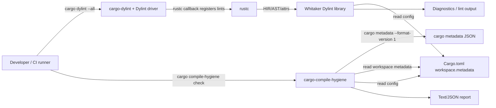
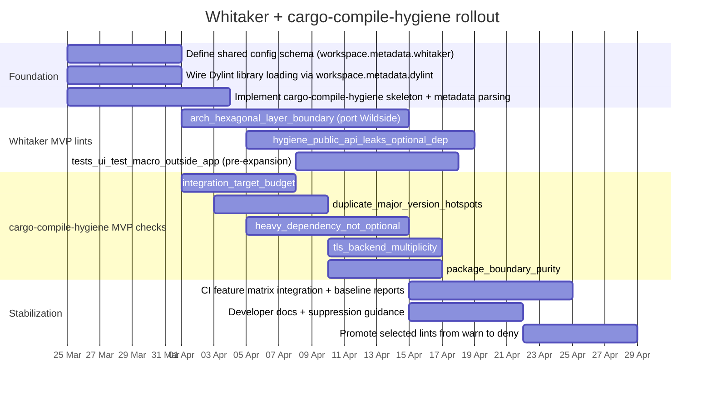

# Whitaker and cargo-compile-hygiene Technical Design

## Executive summary

This design proposes a two-part enforcement system for Rust workspaces:

Whitaker, a **Dylint-based** lint suite that runs inside `rustc` and enforces
(a) **architectural boundaries** (including a hexagonal “domain / inbound /
outbound” rule-set modelled on the existing Wildside architecture lint) and (b)
**compile-time hygiene** rules that are best expressed at the **source/HIR**
level. [^1][^4]

`cargo-compile-hygiene`, a **Cargo-aware tool** (a `cargo` custom subcommand)
that consumes `Cargo.toml` plus `cargo metadata` output to enforce compile-time
hygiene rules that are best expressed at the **package/target/dependency
graph** level (integration test target budgets, heavy dependency gating,
duplicate version hotspots, TLS backend multiplicity, and package boundary
purity). [^2][^1]

Both tools share configuration via `Cargo.toml` workspace metadata (and
optionally `dylint.toml`/`dylint.toml`-style tables for Dylint), enabling a
single policy source of truth (layer definitions, forbidden dependencies,
feature “islands”, thresholds). Cargo explicitly supports third-party tooling
via (a) `cargo metadata`, (b) stable JSON message formats, and (c) custom
subcommands, and it also supports manifest metadata intended for external
tools. [^2]

The design is driven by the concrete failures seen in Axinite and Gauss:
repeated link/compile work due to many integration test crates, always-compiled
heavy optional dependencies, duplicate dependency stacks, and package boundary
contamination (notably UI dependencies leaking into “core” layers). [^4]

Non-goals: debuginfo/profile tuning (explicitly out of scope), UI feature
auditing, and whole-workspace async-trait migration auditing (both explicitly
excluded). [^4]

## Problem statement and goals

Large Rust workspaces often accumulate “hidden” compile-time costs that do not
show up as obvious code smells: integration tests proliferate as dozens of
separate crates; heavyweight subsystems (WASM runtimes, Docker clients, PDF
toolchains) stay always-on; dependency resolution drags in parallel HTTP/TLS
stacks; and architectural layering decays until a change in one corner forces
costly recompilation everywhere. Axinite’s investigation quantified these
effects: hundreds of crates in the graph, many integration test binaries, and
heavy dependencies contributing significant compile-time and link-time
overhead. [^4]

Cargo’s own documentation highlights one of the major mechanisms: **each file
under `tests/` is compiled as a separate crate**, and Cargo explicitly notes
that “a lot of integration tests” can be inefficient and suggests consolidating
into fewer targets split into modules. This aligns with Axinite’s measured
link-time bottleneck and the consolidation plan that reduced test binaries
substantially. [^2][^4]

Gauss’s work shows the dual: even if the “clean build” remains dominated by
heavy upstream GUI dependencies, **package boundaries enable selective
compilation** (`cargo test -p gauss-core`) that avoids pulling UI dependencies
when working on pure model/SVG logic. This is fundamentally a package graph
property, not a source-only property. [^4]

The goals therefore separate cleanly into two enforcement planes:

- **Plane A (inside rustc / HIR):** enforce architectural boundaries and
  code-level constraints (who may import what; public API does not leak
  optional deps; feature-gated “islands” remain bounded; UI test harness macros
  do not appear in non-app crates). This is Whitaker’s remit, implemented as
  Dylint lints. Dylint runs lints loaded from dynamic libraries, and—like
  Clippy—operates by registering lint passes with `rustc`. [^1]

- **Plane B (workspace graph / Cargo metadata):** enforce packaging-and-graph
  constraints (how many test targets; duplicate versions; heavy dependency
  “optionality”; TLS backend multiplicity; package boundary purity). This is
  `cargo-compile-hygiene`’s remit, implemented using `cargo metadata`’s JSON.
  Cargo recommends using `--format-version` to stabilise expectations. [^2]

A critical design constraint: Dylint’s lints rely on `rustc` internal APIs (as
Clippy does), so Whitaker must be versioned and maintained with the Rust
toolchain; Dylint’s design amortises cost by grouping lints by compiler version
and sharing intermediate compilation results. [^1]

## Configuration, taxonomy, and developer experience

### Policy storage and shared configuration model

Cargo explicitly allows third-party tools to store configuration in
`Cargo.toml` via `package.metadata` (and, by extension, workspace metadata),
and Cargo ignores those metadata keys rather than warning about them. This
provides the canonical place to define Whitaker/cargo-compile-hygiene policy
without inventing a bespoke file format. [^2]

Dylint also supports **workspace metadata**: a workspace can declare the Dylint
libraries it should be linted with under `workspace.metadata.dylint.libraries`
in `Cargo.toml` or `dylint.toml`. Dylint will download/build those entries
similarly to dependencies. [^1]

Whitaker should therefore adopt a two-tier configuration model:

- **Tool wiring:** `[workspace.metadata.dylint]` declares the Whitaker Dylint
  library location (path or git) as Dylint expects. [^1]
- **Policy:** `[workspace.metadata.whitaker]` (or
  `[workspace.metadata.whitaker.*]`) stores shared policy consumed by both
  Whitaker and `cargo-compile-hygiene`. This keeps Dylint’s own metadata
  namespace reserved for Dylint configuration. [^2][^1]
- **Per-lint tunables:** either (a) keep them under
  `[workspace.metadata.whitaker.lints.<lint>]`, or (b) expose a Dylint-native
  `dylint.toml` configuration table keyed by library name, as Dylint supports
  configurable libraries. For multi-lint libraries, Dylint’s `dylint_linting`
  utilities require an explicit `register_lints` and `init_config` call. [^1]

### Whitaker lint namespaces and naming conventions

Rust tool lints conventionally use a `tool::lint_name` namespace (e.g.,
`clippy::…`). The `rustc_session::declare_tool_lint!` macro directly encodes
this `tool :: NAME, Level, desc` shape. [^3]

Whitaker should use **one tool namespace**: `whitaker::…`. Because tool lints
do not support multi-segment namespaces beyond the tool name, Whitaker
namespaces should be encoded as prefixes in the lint name:

- `whitaker::arch_*` for architectural boundary lints
- `whitaker::hygiene_*` for compile-time hygiene lints
- `whitaker::tests_*` for test-graph and harness-related lints
- `whitaker::advisory_*` for best-effort/low-confidence lints

Discovery/navigation guidance:

- `cargo dylint list …` is the primary “what lints exist?” interface (Dylint’s
  own docs use `cargo dylint … list`). [^1]
- Whitaker should create **lint groups** (registering groups with rustc’s lint
  store) analogous to `clippy::all` and Clippy’s category approach, enabling
  “turn on everything in CI” without manually listing dozens of lints. (This is
  a design choice; rustc supports lint grouping machinery via the lint store
  model described in the compiler dev guide.) [^3]
- Default “developer local” guidance: enable `whitaker::arch_*` and
  `whitaker::hygiene_*` at `warn` locally, escalate in CI. Rust supports
  multiple lint levels and configuration via attributes and CLI flags. [^3]

### Severity levels and build gating

Rustc defines several lint levels (`allow`, `expect`, `warn`, `force-warn`,
`deny`, `forbid`). “Forbid” prevents lowering the level via attributes (subject
to lint capping). [^3]

Whitaker should standardise on three policy severities (mapped onto rustc
levels):

- **hard policy (default `deny`):** architectural boundary violations that
  should never ship (e.g., a “domain” layer importing infrastructure crates, or
  `gauss-core` importing `gpui`). These should fail CI by default. [^3][^4]
- **soft policy (default `warn`):** compile-time hygiene issues that merit
  action but may have local exceptions (e.g., a public API uses an optional dep
  type in a non-critical surface; a feature-island rule triggers in
  transitional code). [^3][^4]
- **advisory (default `allow` or `warn` behind a group):** low-confidence
  suggestions such as `async_trait_clear_misuse`, which should not block merges
  and should avoid warning fatigue. [^3][^4]

This separation aligns with the Rust community’s broader warning-fatigue
concerns: warnings should remain meaningful and not drown developers; hard
failures should be reserved for clear architectural contracts. [^3]

### Feature-matrix and “unknown lint” ergonomics

Dylint passes `--cfg=dylint_lib="LIBRARY_NAME"` during lint runs, enabling
`cfg_attr`-based suppression without “unknown lint” warnings when Dylint is not
running. Dylint documents both the mechanism and the limitation: this does
**not** work for pre-expansion lints, where the workaround is
`#[allow(unknown_lints)]`. [^1]

Whitaker should codify a convention:

- For **early/late** Whitaker lints: allow suppressions using
  `#[cfg_attr(dylint_lib = "whitaker", allow(whitaker::…))]`. [^1]
- For **pre-expansion** Whitaker lints (notably `ui_test_macro_outside_app` and
  likely `async_trait_clear_misuse` if it keys off attribute macros): suppress
  with `#[allow(unknown_lints)] #[allow(whitaker::…)]` and document this as a
  rare escape hatch. [^1]

For workspaces using recent rustc, Dylint’s docs also note `unexpected_cfg`
warnings and provide a workspace-level `.toml` snippet to whitelist
`cfg(dylint_lib, values(any()))`. Whitaker should include this in the standard
rollout. [^1]

## Whitaker lint suite design

### Implementation architecture

Whitaker is a **single Dylint library** named `whitaker` (crate name
`whitaker_lints` or similar), exporting multiple lints. Because Dylint’s macro
helpers vary between single-lint libraries and multi-lint libraries, Whitaker
should implement an explicit `register_lints(sess, lint_store)` and call
`dylint_linting::init_config(sess)` before reading configuration. [^1]

Whitaker will implement a mixture of:

- **Late lints** (HIR + type information) for API-shape analyses and precise
  name resolution.
- **Early lints** (AST, no type information) for purely syntactic imports/paths
  where resolution suffices.
- **Pre-expansion lints** for rules that must observe attribute-macro syntax
  prior to expansion. Dylint’s tooling explicitly supports
  `declare_pre_expansion_lint!` / `impl_pre_expansion_lint!`. [^1][^3]

Rustc/Clippy guidance: a `LateLintPass` has access to type and symbol
information that an `EarlyLintPass` does not. Most “semantic” lints should be
late. [^3]

### Common configuration schema shapes

Whitaker should standardise configuration like this (examples; open-ended
defaults):

```toml
# Cargo.toml (workspace root)

[workspace.metadata.dylint]
libraries = [{ path = "tools/whitaker" }]

[workspace.metadata.whitaker]
# Global defaults for both Whitaker and cargo-compile-hygiene
policy_version = 1

[workspace.metadata.whitaker.layers]
# Layer names are stable identifiers used by multiple lints.
# Each layer maps to a set of (packages, paths) that belong to it.
domain = { packages = ["backend"], path_prefixes = ["backend/src/domain/"] }
inbound = { packages = ["backend"], path_prefixes = ["backend/src/inbound/"] }
outbound = { packages = ["backend"], path_prefixes = ["backend/src/outbound/"] }

[workspace.metadata.whitaker.lints.arch_hexagonal_layer_boundary]
# Internal module roots that each layer must not depend on.
forbid_internal = { domain = ["inbound", "outbound"], inbound = ["outbound"], outbound = ["inbound"] }
# External crates forbidden per layer.
forbid_external = { domain = ["diesel", "utoipa"], inbound = ["diesel"], outbound = ["actix_web"] }

[workspace.metadata.whitaker.lints.hygiene_feature_island_breach]
# Feature islands define “heavy optional subsystems” that must remain bounded.
islands = [
  { name = "wasm", feature = "wasm", deps = [
    "wasmtime", "wasmtime_wasi", "wasmparser",
  ], allowed_paths = ["src/tools/wasm/", "src/channels/wasm/"] },
  { name = "docker", feature = "docker", deps = ["bollard"],
    allowed_paths = ["src/sandbox/", "src/orchestrator/"] },
]

[workspace.metadata.whitaker.lints.tests_ui_test_macro_outside_app]
app_packages = ["gauss"] # only the app crate may contain gpui::test
```

This uses Cargo’s manifest metadata facility for tool configuration. [^2]

Where per-lint tunables need a Dylint-native `dylint.toml`, Whitaker can also
expose:

```toml
# dylint.toml (workspace root)
[whitaker]
# A single table for the Whitaker library; Whitaker interprets its structure.
policy_version = 1
```

Dylint supports configurable libraries via `dylint.toml` keyed by library name,
and `dylint_linting` provides config parsing helpers. [^1]

### Lint designs

Below, each lint includes: purpose, scope, false-positive risks, phase/type
needs, config examples, diagnostics, autofix feasibility, and test plan.

#### `whitaker::hygiene_forbidden_external_crate_in_layer`

Purpose: enforce that specific layers (defined by package + path prefix) do not
reference specific external crates. This is the “external-crate half” of
Wildside’s architecture lint, and it is also useful for compile-time hygiene
(“heavy deps should not be imported by most of the codebase”). [^4]

Scope: counts *resolved* uses of external crates in paths (`use`, type paths,
expression paths), within files that Whitaker maps into a configured layer.
Should operate at crate scope across all targets selected by the invocation
(`--all-targets` recommended). [^2][^1][^3]

False-positive risks:

- Lexical path scanning (as Wildside currently does via `syn`) can misclassify
  local modules named like external crates or fail to resolve renamed imports.
  Whitaker should prefer rustc name resolution (HIR `Res`) where possible.
  [^4][^3]
- Re-exports: a layer might legitimately depend on a local façade crate that
  re-exports a forbidden crate; policy must decide whether to forbid the façade
  or the underlying crate.

Phase and type info:

- Recommended: **Late lint** to use HIR and resolution. Late lints run on HIR
  and have full type/symbol information; early lints do not. [^3]
- HIR needs: path resolution (`Res::Def` / crate root), span-to-file mapping
  for layer inference.

Config example:

```toml
[workspace.metadata.whitaker.lints.hygiene_forbidden_external_crate_in_layer]
rules = [
  { layer = "domain", forbid = ["diesel", "utoipa"] },
  { layer = "inbound", forbid = ["diesel"] },
]
```

Diagnostics/messages:

- Primary message: `layer '{layer}' must not depend on external crate '{crate}'`
- Include note with: configured rule origin (policy key), and hint to move code
  behind an adapter boundary or feature gate.
- Provide a “help” line pointing to the allowed layer or façade crate, if
  configured.

Autofix feasibility:

- Generally **not machine-applicable**. Automatic refactors (moving code across
  layers, introducing adapters) are semantic and project-specific. Provide
  “guidance-only” suggestions (Applicability: `MaybeIncorrect`), not
  `MachineApplicable`. This matches Clippy’s general caution where suggestions
  may be non-trivial. [^3]

Test plan:

- Use Dylint UI testing harness (`dylint_uitesting`) to verify diagnostics and
  spans; the crate is designed to run compiletest-style UI tests for Dylint
  libraries. [^1]
- Sample tests (positive/negative):
  - **OK:** a domain file imports `crate::domain::…` and `serde`.
  - **Fail:** a domain file imports `diesel::prelude::*`.
  - **Fail:** an inbound file imports `utoipa::ToSchema` if inbound forbids it.
  - **Edge:** `use diesel as db;` should still flag `diesel` (requires
    resolution, not lexical segment matching).

#### `whitaker::hygiene_public_api_leaks_optional_dep`

Purpose: prevent public API surfaces from exposing types from dependencies that
are intended to be optional/feature-gated. This directly supports
feature-gating plans like Axinite’s `docker` gating, where
`SandboxError::Docker` and `ContainerRunner` currently leak `bollard` in public
shapes. [^4]

Scope:

- Public items: `pub fn`, `pub struct` fields (public), `pub enum` variants,
  `pub trait` methods, `pub type`, and re-exports (`pub use`).
- “Leakage” definition: a public signature or exported type mentions a type
  whose defining crate is (a) listed as optional in Cargo metadata or (b)
  listed in Whitaker’s optional-dep policy map.

False-positive risks:

- Some crates intentionally expose third-party types as part of their API
  (e.g., façade crates). This needs allowlists per package/module.
- Type alias indirection can hide direct references; need to walk the full type
  graph of exported types (bounded for performance).

Phase and type info:

- Must be **Late lint**, because it must understand the *types* of signatures
  and where those types are defined. Late lints have access to `LateContext`
  and typeck results; early lints do not. [^3]
- Needs:
  - `LateContext::tcx` to map `Ty`/`AdtDef`/`DefId` to defining crate.
  - Possibly HIR traversal to find public items and gather their exposed `Ty`s.

Config example:

```toml
[workspace.metadata.whitaker.lints.hygiene_public_api_leaks_optional_dep]
# Map optional deps to the Cargo feature that gates them (used for fix guidance).
optional_deps = { bollard = "docker", wasmtime = "wasm", pdf_extract = "pdf" }

# Allowlist exceptional modules or items.
allow = [
  { package = "some-facade", paths = ["src/public_api.rs"] }
]
```

Diagnostics/messages:

- Message:
  `public API exposes optional dependency type '{crate}::{type}'`
  `(gated by feature '{feature}')`
- Help: “Introduce a project-owned error wrapper / newtype, or gate the API
  with `#[cfg(feature = "...")]`”.
- Note: include where the optional dep is configured (feature name), and the
  exact public item path (symbol path) that leaks it.

Autofix feasibility:

- **Partially feasible** as a *guided edit*, not a one-click fix:
  - If the leaked type appears in an error enum variant (like
    `SandboxError::Docker(#[from] bollard::errors::Error)`), propose a wrapper
    variant type `DockerError` behind `#[cfg(feature="docker")]` plus a
    non-optional “opaque” error. This is non-trivial and should be
    `MaybeIncorrect`. [^4]
  - If the leaked type appears only in a `pub use`, an autofix could suggest
    removing or gating the re-export (still risky).

Test plan:

- UI tests with small fixtures:
  - A `pub enum Error { Docker(bollard::errors::Error) }` with `bollard` marked
    optional in a test `Cargo.toml` should fail.
  - Same enum but `#[cfg(feature="docker")]` on variant should pass when
    feature is off (requires feature-matrix UI tests: run with and without
    feature).
  - A private function leaking optional type should not trigger.
- Include regression tests derived from Axinite’s identified leakage points to
  ensure the lint matches real patterns. [^4]

#### `whitaker::hygiene_feature_island_breach`

Purpose: enforce that “heavy optional” subsystems remain confined to configured
**feature islands**: code that depends on a heavy crate (or its transitive
surface) must live under specific paths/modules and be guarded by
`#[cfg(feature="…")]` as required. This operationalises Axinite’s `wasm`
(wasmtime) and `docker` (bollard) feature-gating plans. [^4]

Scope:

- Two constraints:
  1. **Control-plane:** references to island dependency crates are only allowed
     in configured `allowed_paths` (and optionally allowed modules).
  2. **Feature-plane:** those references must be under effective
     `cfg(feature="X")` (module-level or item-level).

False-positive risks:

- Transitive references can appear through re-exported types or trait bounds; a
  strict “any mention of `wasmtime::…`” rule is clearer than trying to detect
  semantic transitivity.
- `cfg` evaluation is subtle: `cfg(any(feature="wasm", test))` may be
  acceptable; policy must decide acceptable patterns.

Phase and type info:

- Recommended: **Late lint** for accurate path resolution and spans, plus
  attribute inspection on HIR items/modules.
- Needs:
  - Map item spans to source file paths and check prefix matches.
  - Inspect `#[cfg]` attributes in the HIR tree to compute an “effective cfg
    environment” for each item (best-effort).

Config example:

```toml
[workspace.metadata.whitaker.lints.hygiene_feature_island_breach]
islands = [
  { name = "wasm", feature = "wasm", crate_roots = [
    "wasmtime", "wasmtime_wasi", "wasmparser",
  ], allowed_paths = ["src/tools/wasm/", "src/channels/wasm/"] },
  { name = "docker", feature = "docker", crate_roots = ["bollard"],
    allowed_paths = ["src/sandbox/", "src/orchestrator/"] },
]
cfg_allow_patterns = [
  "cfg(feature = \"{feature}\")",
  "cfg(any(feature = \"{feature}\", test))",
]
```

Diagnostics/messages:

- If outside allowed paths:
  `feature-island '{island}' dependency '{crate}' used outside allowed paths`
  plus the configured expected path prefixes.
- If missing cfg:
  `feature-island '{island}' dependency '{crate}' missing feature guard`
- Include actionable hint: “wrap the module/function in `#[cfg(feature="…")]`
  or move this code under {allowed_paths[0]}”.

Autofix feasibility:

- For missing `cfg` guard on a whole module file, suggest adding
  `#![cfg(feature="…")]` or `#[cfg(feature="…")] mod …;` (but do not apply
  automatically; applicability depends on module structure).
- For path relocation, no autofix.

Test plan:

- Feature-matrix UI tests:
  - With `--no-default-features`: ensure non-island packages compile without
    wasmtime/bollard references (matches Axinite’s validation pathways).
    [^4]
  - With `--all-features`: ensure islands compile when enabled.
- Sample cases:
  - `src/tools/wasm/runtime.rs` uses `wasmtime` under `#[cfg(feature="wasm")]`
    → ok.
  - `src/tools/mod.rs` uses `wasmtime` without guard → fail.
  - `src/sandbox/container.rs` uses `bollard` but file lacks cfg → fail.
    [^4]

#### `whitaker::tests_ui_test_macro_outside_app`

Purpose: enforce that UI integration testing harnesses (specifically
`#[gpui::test]`) remain confined to app crates, preventing UI dependencies from
creeping into pure crates and forcing expensive UI compilation during
logic-only work. This supports Gauss’s package split goals and test relocation
goals, where core/SVG crates must not pull GPUI. [^4]

Scope:

- Detect the attribute macro `gpui::test` (and optionally other UI test harness
  macros) attached to functions or modules outside designated app packages.

False-positive risks:

- If a project uses a similarly named attribute in another crate, a purely
  lexical check could misfire; use resolved attribute paths if possible.
- Procedural attribute macros are expanded; after expansion, the original
  attribute may not survive into HIR, so detection may require pre-expansion
  analysis.

Phase and type info:

- Recommended: **Pre-expansion lint**, because the rule is about the presence
  of an attribute macro before it is expanded away. Dylint tooling explicitly
  supports pre-expansion lints (`declare_pre_expansion_lint!` /
  `impl_pre_expansion_lint!`). [^1]
- Type info: not required; attribute syntax is sufficient.

Config example:

```toml
[workspace.metadata.whitaker.lints.tests_ui_test_macro_outside_app]
app_packages = ["gauss"]
forbid_attributes = ["gpui::test"]
```

Diagnostics/messages:

- `UI test macro #[gpui::test] is not allowed outside app packages (allowed: gauss)`
- Note: “Move this test into the app crate, or replace with non-UI test harness
  if possible.”

Autofix feasibility:

- No safe autofix; moving tests across crates affects module paths, fixtures,
  and build/test invocation.

Test plan:

- Pre-expansion UI tests:
  - In a non-app crate, a function annotated `#[gpui::test]` should trigger.
  - In the app crate, the same should not trigger.
- Include a regression test using Gauss-like crate names: `gauss-core`
  containing a `#[gpui::test]` should fail. [^4]
- Document suppression mechanics for pre-expansion lints
  (`#[allow(unknown_lints)]`) per Dylint guidance. [^1]

#### `whitaker::arch_hexagonal_layer_boundary` (internal + external rules)

Purpose: replicate (and improve upon) Wildside’s repo-local architecture lint
inside Whitaker/Dylint:

- forbid **internal layer crossings** (domain ↛ inbound/outbound; inbound ↛
  outbound; outbound ↛ inbound)
- forbid **external framework/infrastructure crates** per layer (e.g., domain
  must not depend on `diesel`, `utoipa`, `actix_web`, etc.)
- infer layer membership from file path under a configured root, mirroring
  Wildside’s `backend/src/{domain,inbound,outbound}/…` convention. [^4]

This lint is the primary “architectural boundary” mechanism;
`forbidden_external_crate_in_layer` is effectively its external-only subset and
can be implemented either as a separate lint (for narrower policy use) or as
one rule-family under this umbrella lint.

Scope:

- All Rust modules in configured layer roots.
- Path uses appearing in `use` trees and ordinary path expressions/types.

Wildside baseline behaviour:

- Wildside collects `syn::Path` segments and determines whether a path root
  indicates an internal module root (`crate::domain`, `backend::outbound`,
  etc.) or an external crate root (first segment not
  `crate/self/super/backend`). It then compares against per-layer forbidden
  roots and emits one violation per file per unique message. [^4]
- It infers layer from the first path component under `backend/src` and errors
  if it cannot infer. [^4]
- Its unit tests demonstrate both internal and external violations.
  [^4]

False-positive/false-negative risks (and how Whitaker improves):

- Lexical segment matching can mis-handle renamed imports, glob imports, or
  local modules shadowing crate names. A rustc-based lint can use HIR
  resolution to identify whether a path resolves to an external crate or a
  local module. Late linting provides symbol information not available in early
  passes. [^3]
- Conversely, macro-generated imports may appear only after expansion; since
  the intent is “architectural reality”, Whitaker should run post-expansion
  (early/late), not pre-expansion, so it sees the actual expanded module graph.

Phase and type info:

- Recommended: **Late lint** for best precision (HIR + resolution). The
  boundary rule is structural, but resolution accuracy matters enough to
  justify late. [^3]
- Type info: not required, but symbol resolution is highly desirable.

Config example (Wildside-equivalent policy):

```toml
[workspace.metadata.whitaker.lints.arch_hexagonal_layer_boundary]
root = "backend/src"
layers = ["domain", "inbound", "outbound"]

forbid_internal = { domain = ["inbound", "outbound"], inbound = ["outbound"], outbound = ["inbound"] }

forbid_external = {
  domain = ["diesel", "utoipa", "actix_web", "awc"],
  inbound = ["diesel"],
  outbound = ["actix_web", "awc"],
}
```

Diagnostics/messages:

- Mirror Wildside’s human-readable messages for familiarity:
  - `domain module must not depend on crate::outbound`
  - `inbound module must not depend on external crate 'diesel'`
    [^4]
- Add structured notes:
  - Inferred layer (domain/inbound/outbound)
  - Reference kind (use-path vs type-path vs expr-path)
  - If available, resolved `DefId` / crate of origin.

Autofix feasibility:

- No safe autofix.

Test plan:

- Port Wildside’s test cases nearly verbatim into Dylint UI test fixtures:
  - inbound importing `crate::domain::UserId` → ok
  - inbound importing `crate::outbound::…` → fail
  - inbound importing `diesel::prelude::*` → fail
  - domain importing `utoipa::ToSchema` → fail [^4]
- Add additional cases validating resolution improvements:
  - `use diesel as db; use db::prelude::*;` should still fail.
  - A local module called `diesel` should *not* be treated as external if it
    resolves locally (resolution-based correctness).

#### `whitaker::advisory_async_trait_clear_misuse`

Purpose: provide low-confidence, non-blocking guidance where `#[async_trait]`
usage is locally migratable to native async traits, without attempting
whole-workspace auditing (explicitly excluded). The Axinite audit found that
native async traits are not object-safe and that most uses are blocked by
`dyn Trait` call sites; only a small subset was verified migratable. [^4]

Scope:

- Only flag cases meeting *all* of:
  - `#[async_trait]` appears on a trait definition or impl in the current crate,
  - the trait is not used as a trait object (`dyn Trait`) within the current
    crate (best-effort), and
  - the trait is crate-private (or otherwise clearly local), reducing public
    API churn risks.

False-positive risks:

- Trait-object usage may exist in downstream crates, or behind feature gates,
  or in rarely compiled targets. Without whole-workspace analysis, the lint
  must remain advisory and conservative. [^4]
- `async-trait` imposes a default `Send` bound behaviour; native async traits
  do not automatically impose equivalent bounds, so naive migration guidance
  can be wrong. The migration plan explicitly calls this out as a risk. [^4]

Phase and type info:

- Detection of `#[async_trait]` likely requires **pre-expansion linting**
  (attribute macro), because the attribute macro expands away. Dylint supports
  pre-expansion lints. [^1]
- To check local `dyn Trait` usage robustly, use a **late pass** as a
  second-stage analysis: record candidate traits in pre-expansion, then in late
  lint evaluate whether there are `TyKind::Dynamic` uses referencing that
  trait’s `DefId`. (This is a two-phase implementation inside one library.)

Config example:

```toml
[workspace.metadata.whitaker.lints.advisory_async_trait_clear_misuse]
mode = "conservative"              # "off" | "conservative" | "aggressive"
max_suggestions_per_crate = 10
ignore_traits = ["Tool", "Database"]  # known dyn-backed traits
```

Diagnostics/messages:

- `async-trait appears migratable: trait '{TraitName}' is not used as dyn
  Trait in this crate`
- Notes:
  - remind about `Send` semantics and object safety (link to internal migration
    guidance)
  - recommend verifying with `cargo check` and relevant feature combinations
    (because feature-gated `dyn` use can exist). [^4]

Autofix feasibility:

- Not safe; too many semantic constraints (object safety, `Send`, return type
  syntax). The best output is a structured suggestion describing the manual
  steps, and explicitly marking it advisory.

Test plan:

- Fixtures:
  - A private trait `#[async_trait] trait Foo { async fn f(&self); }` used only
    concretely → advisory triggers.
  - Same trait used as `Box<dyn Foo>` → no advisory.
  - A public dyn-backed trait listed in `ignore_traits` → no advisory.
- Include a regression check that the lint does not trigger on known dyn-heavy
  patterns (consistent with Axinite’s classification). [^4]

## cargo-compile-hygiene design

### Tool shape and why it is a Cargo subcommand

Cargo explicitly supports third-party tooling via custom subcommands, and it
provides `cargo metadata` for machine-readable workspace structure and
dependency graphs. [^2]

Therefore, implement as a `cargo` plugin:

- Binary name: `cargo-compile-hygiene`
- User-facing invocation: `cargo compile-hygiene …`
- Implementation language: Rust, using the `cargo_metadata` crate to parse
  `cargo metadata` output. Cargo docs recommend `--format-version`, and the
  `cargo_metadata` crate is the standard Rust API for parsing the JSON. [^2]

### Commands and CLI UX

Proposed subcommands:

- `cargo compile-hygiene check`  
  Run all checks and return exit status based on configured severities.
- `cargo compile-hygiene check --json`  
  Emit machine-readable JSON report for CI dashboards.
- `cargo compile-hygiene explain <finding-id>`  
  Print an expanded explanation and “how to fix” guidance.
- `cargo compile-hygiene baseline --write`  
  Record current metrics (test target count, duplicates, heavy deps) into a
  baseline file for regression detection.

Core flags:

- `--manifest-path …` (pass-through to Cargo conventions)
- `--features …`, `--all-features`, `--no-default-features` (passed to
  `cargo metadata` / to `cargo` feature selection, used to model feature-matrix
  behaviour)
- `--target …` and `--filter-platform …` where applicable (Cargo supports
  `--filter-platform` for `cargo metadata`). [^2]

### Inputs and data sources

Primary inputs:

- Workspace `Cargo.toml` (for `[workspace.metadata.whitaker]` and workspace
  member discovery).
- `cargo metadata --format-version 1` output (packages, targets, resolved
  dependency graph). Cargo documents the JSON output and recommends
  `--format-version`. [^2]

Secondary inputs (optional enhancements; not required for initial MVP):

- `cargo tree -d` for human debugging, but the tool should not shell out; it
  should compute duplicates directly from metadata. Cargo’s docs explain that
  duplicates matter for build time and show how `--duplicates` highlights them.
  [^2]

### Checks

#### `integration_target_budget`

What it checks:

- Count integration test targets per package (targets with kind `"test"` and
  src paths under `tests/`).
- Flag packages exceeding `max_integration_tests_per_package` (default example:
  12), and flag workspaces exceeding `max_integration_tests_total` (default
  example: 60).

Why it matters:

- Cargo compiles each integration test file as a separate crate/executable, and
  Cargo notes that many such crates can be inefficient and recommends
  consolidating into fewer targets split into modules. [^2]
- Axinite’s measured hot path was “re-links N test binaries,” and its
  consolidation plan reduces test binaries by grouping modules under fewer
  harnesses. [^4]
- Gauss’s consolidation plan shows the organisational vs compile-time
  trade-off: a naming convention improves discoverability but does not reduce
  target count, so this check should focus on target counts rather than file
  naming aesthetics. [^4]

Implementation sketch:

- In `cargo_metadata::Metadata`, iterate `packages[].targets[]` and filter
  where `kind` contains `"test"` and `src_path` includes `/tests/`.
- Group by package ID; count.

Config schema example:

```toml
[workspace.metadata.whitaker.compile_hygiene.integration_target_budget]
max_integration_tests_per_package = 12
max_integration_tests_total = 80
ignore = [
  { package = "ironclaw", target = "html_to_markdown", reason = "required-features gated" }
]
```

Outputs:

- Human report includes top offending packages, counts, and suggested
  consolidation strategy referencing Cargo’s recommended approach. [^2]

#### `heavy_dependency_not_optional`

What it checks:

- Direct dependencies that have a transitive footprint above a threshold
  (default example: `transitive_crates >= 100`) and are not optional / not
  feature-gated according to policy.

Why it matters:

- Axinite identified heavyweight always-compiled dependencies (e.g., wasmtime
  ecosystem, bollard) and proposed feature gating to make them optional for
  developers not working on those areas. [^4]

Implementation sketch:

- Build a package dependency graph from `metadata.resolve`.
- For each workspace member package, evaluate each direct dependency edge in
  `packages[].dependencies`:
  - Compute reachable node count from that dependency node (unique package IDs).
  - Determine whether the dependency is optional:
    - In manifest: dependency `optional = true` (available via `cargo metadata`
      packages reproduction of `Cargo.toml` fields), or
    - In Whitaker policy mapping: heavy deps list with expected feature.
- Emit finding if “heavy” + “not optional” + “not in allowlist”.

Config schema example:

```toml
[workspace.metadata.whitaker.compile_hygiene.heavy_dependency_not_optional]
heavy_threshold_transitive_crates = 100
heavy_deps = { wasmtime = "wasm", bollard = "docker", pdf_extract = "pdf" }
allow = [
  { package = "gauss", dep = "gpui", reason = "app crate" }
]
```

Outputs:

- Provide transitive count, and a “how to fix” note: make dep optional + gate
  behind feature + rerun feature matrix.

#### `duplicate_major_version_hotspots`

What it checks:

- Packages present in multiple versions in the resolved graph (same name,
  different `semver`), especially major-version duplicates.

Why it matters:

- Cargo’s own docs note that avoiding building a package multiple times can
  benefit build times and executable sizes, and `cargo tree --duplicates`
  exists to identify duplicates. [^2]
- Axinite observed many duplicated core stacks (HTTP/TLS and other ecosystem
  crates) due to a heavy dependency pulling an older stack. [^4]

Implementation sketch:

- From `metadata.packages`, group by `name`, list distinct versions. Flag if >1.
- Compute severity score:
  - Weight by number of distinct major versions.
  - Weight by “fan-in” (how many nodes depend on each version) using
    `resolve.nodes` reverse edges.
- Optionally compute “hotspot explanation” paths (minimal path to root) to help
  remediation.

Config schema example:

```toml
[workspace.metadata.whitaker.compile_hygiene.duplicate_major_version_hotspots]
max_duplicates_per_crate = 1         # allow at most 1 version
prefer_report_top_n = 25
ignore = ["hashbrown"]              # example: if ecosystem reality makes it noisy
```

Outputs:

- Include top N duplications with versions and likely introducers.
- Provide hints: update the older dependency; align feature flags; consider
  dependency replacement.

#### `tls_backend_multiplicity`

What it checks:

- Whether both major TLS backend stacks are present in the build graph at once
  (heuristic: presence of both `rustls`-family packages and
  `native-tls`/`openssl-sys`).

Why it matters:

- Axinite identified both rustls and native-tls being compiled due to
  conflicting reqwest feature selections, and noted that native-tls can pull in
  C compilation (openssl-sys), increasing build time variability and cost. [^4]

Implementation sketch:

- Define backend signatures:
  - rustls: package names matching `rustls`, `tokio-rustls`, `hyper-rustls`,
    etc.
  - native/openssl: `native-tls`, `openssl`, `openssl-sys`, etc.
- Flag if both non-empty sets appear in the resolved graph for the same feature
  configuration.

Feature-matrix note:

- `cargo metadata` feature reporting can be tricky in workspaces; the tool
  should therefore run in each CI feature configuration (default,
  no-default-features+selected minimal, all-features), mirroring the same
  invocation patterns used for build/test. (Cargo issues discuss how resolved
  features may be aggregated across workspace members, so treat
  per-configuration runs as the unit of truth.) [^2]

Config schema example:

```toml
[workspace.metadata.whitaker.compile_hygiene.tls_backend_multiplicity]
deny_if_both_present = true
rustls_markers = ["rustls", "tokio-rustls"]
native_markers = ["native-tls", "openssl-sys"]
```

Outputs:

- “Both TLS stacks detected: rustls (N crates) and native-tls/openssl (M
  crates).”
- Show a short list of introducer packages (reverse dependency roots).

#### `package_boundary_purity`

What it checks:

- Package-level “purity” constraints: certain packages must not depend on
  certain crates, matching architectural boundaries that should be visible at
  the Cargo graph level (stronger than source-only checks).

Why it matters:

- Gauss’s crate split explicitly requires `gauss-core` and `gauss-svg` to
  remain GPUI-independent; the split’s value depends on preventing UI deps from
  re-entering core crates. [^4]

Implementation sketch:

- For each configured package rule, examine its resolved dependencies (direct
  and/or transitive) and fail if any forbidden package names appear.
- Provide two modes:
  - direct-only (fast, less strict)
  - transitive (stronger, default for “no gpui in core”)

Config schema example:

```toml
[workspace.metadata.whitaker.compile_hygiene.package_boundary_purity]
rules = [
  { package = "gauss-core", forbid = ["gpui", "gpui-component", "accesskit"], transitive = true },
  { package = "gauss-svg", forbid = ["gpui", "gpui-component", "accesskit"], transitive = true },
]
```

Outputs:

- List the forbidden package found and the shortest path
  (`gauss-core -> … -> gpui`), using metadata graph traversal.

### Output formats and example reports

Human-readable (default):

```text
cargo-compile-hygiene report (features: default; target: host)
- integration_target_budget: FAIL
  ironclaw: 43 integration test targets (budget: 12). Suggest consolidating under fewer harnesses.
- heavy_dependency_not_optional: WARN
  ironclaw: wasmtime (≈300 transitive crates) is non-optional. Expected feature gate: wasm.
- duplicate_major_version_hotspots: WARN
  rustls: versions 0.22.x, 0.23.x present (major duplicates); likely introduced via libsql stack.
- tls_backend_multiplicity: FAIL
  rustls and native-tls/openssl detected concurrently. Investigate reqwest default-features mismatch.
- package_boundary_purity: PASS
```

JSON (`--json`):

- A single JSON object containing:
  - `invocation`: manifest path, feature flags, target/filter platform,
    timestamp
  - `findings`: array of typed findings with IDs, severity, summary, details,
    and suggested remediation
  - `metrics`: counts (targets, duplicates, heavy deps)

CI integration:

- Exit codes:
  - 0 if no findings above configured failure threshold.
  - 1 if any `deny` findings (or configured levels) exist.

This aligns with standard CLI tooling expectations and Cargo subcommand
ergonomics. [^2]

## Integration, CI, and rollout

### Component interaction and data flow



Dylint runs lints from dynamic libraries by registering them with `rustc` via a
driver; its architecture mirrors the “driver wraps rustc” model used by Clippy,
and it shares compilation work across lints compiled for the same toolchain.
[^1]

Cargo-compile-hygiene uses Cargo’s external tool facilities: custom subcommands
plus `cargo metadata` JSON. Cargo recommends passing `--format-version` because
output can evolve. [^2]

### Invocation patterns and feature-matrix handling

Because both code-level and graph-level findings can vary with features,
enforce under a feature matrix aligned with existing project practices:

- **default features** (baseline developer experience)
- **no-default-features + minimal feature set** (ensures optional heavy
  subsystems are truly optional)
- **all-features** (ensures full product surface still compiles)

This mirrors Axinite’s gating plans and is a necessary companion to feature
islands. [^4]

Example CI (pseudo-commands):

```bash
# Whitaker lints across all targets
cargo dylint --all -- --all-targets

cargo dylint --all -- --all-targets --no-default-features --features "libsql,test-helpers"
cargo dylint --all -- --all-targets --all-features --features "test-helpers"

# Graph hygiene checks (same matrix)
cargo compile-hygiene check
cargo compile-hygiene check --no-default-features --features "libsql,test-helpers"
cargo compile-hygiene check --all-features --features "test-helpers"
```

Cargo’s own documentation explains integration targets and `tests/` behaviour;
running with `--all-targets` ensures non-default targets
(examples/tests/benches) are included, matching the practical locations where
boundary violations often hide. [^2][^3]

### Comparison table: what belongs where

| Check / policy                                        | Whitaker (Dylint) | cargo-compile-hygiene | Repo-specific checker | Rationale                                                                                               |
| ----------------------------------------------------- | ----------------- | --------------------- | --------------------- | ------------------------------------------------------------------------------------------------------- |
| `forbidden_external_crate_in_layer`                   | Yes               | No                    | No                    | Needs per-use resolution and file/layer mapping inside rustc; best expressed as a lint. [^3]            |
| `public_api_leaks_optional_dep`                       | Yes               | No                    | No                    | Requires type-level inspection of exported signatures; late lint. [^3]                                  |
| `feature_island_breach`                               | Yes               | No                    | No                    | Needs source location + cfg context; best enforced in lint passes. [^1]                                 |
| `ui_test_macro_outside_app`                           | Yes               | No                    | No                    | Detects attribute macro usage; requires pre-expansion linting. [^1]                                     |
| `hexagonal_layer_boundary`                            | Yes               | No                    | No                    | Architectural boundary rule-set; Dylint improves Wildside’s lexical approach via resolution. [^4][^3]   |
| `async_trait_clear_misuse` (advisory)                 | Yes               | No                    | No                    | Code-level advisory; whole-workspace audit excluded. [^4]                                               |
| `integration_target_budget`                           | No                | Yes                   | No                    | Depends on targets and package graph; Cargo metadata. [^2]                                              |
| `heavy_dependency_not_optional`                       | No                | Yes                   | No                    | Depends on resolved dependency graph + optionality. [^2]                                                |
| `duplicate_major_version_hotspots`                    | No                | Yes                   | No                    | Graph-level duplicate analysis; matches `cargo tree --duplicates` intent. [^2]                          |
| `tls_backend_multiplicity`                            | No                | Yes                   | No                    | Graph-level presence of TLS stacks; depends on resolved deps per feature config. [^4]                   |
| `package_boundary_purity`                             | No                | Yes                   | No                    | Package dependency purity is a Cargo graph property; complements Whitaker. [^4]                         |
| Redundant `make` pipelines (e.g., `check` + `clippy`) | No                | No                    | Yes                   | Not a Rust/Cargo semantic issue; a repo build orchestration issue. [^4]                                 |

### Rollout timeline



The emphasis is to land hard-boundary lints early (architectural contracts) and
keep compile-time hygiene checks initially as warning/reporting, then promote
once noise is understood. This matches the risk profile implied by Rust lint
levels and the desire to avoid warning fatigue. [^3]

## Migration guidance for Axinite and Gauss

### Axinite migration steps (concrete)

Axinite’s build-time investigation identifies: many integration test binaries;
always-compiled heavy dependencies intended to be optional (wasmtime, bollard,
pdf); duplicate dependency stacks; and TLS backend multiplicity. [^4]

A practical migration sequence:

1. **Introduce `cargo-compile-hygiene` in “report-only” mode**  
   Configure budgets and heavy deps list but do not fail CI immediately. Record
   a baseline report for default features and the minimal feature set. (Cargo
   supports external tools and versioned metadata output; use
   `--format-version 1`.) [^2]

2. **Enforce `integration_target_budget`**  
   Set a target budget that reflects post-consolidation expectations. Axinite
   already has a plan that reduced test binaries substantially by grouping into
   fewer harnesses. Make the budget slightly above the achieved count to allow
   small growth. [^4]

   Example config:

   ```toml
   [workspace.metadata.whitaker.compile_hygiene.integration_target_budget]
   max_integration_tests_per_package = 12
   ```

3. **Adopt feature islands** (`wasm`, `docker`, `pdf`, `cli`) and enforce with
   Whitaker Axinite has explicit feature-gating plans for wasmtime (`wasm`) and
   bollard (`docker`). Implement the Cargo feature gates, then add Whitaker’s
   `feature_island_breach` and `public_api_leaks_optional_dep` to prevent
   regressions. [^4]

   Example islands config:

   ```toml
   [workspace.metadata.whitaker.lints.hygiene_feature_island_breach]
   islands = [
     { name = "wasm", feature = "wasm", crate_roots = [
       "wasmtime", "wasmtime_wasi", "wasmparser",
     ], allowed_paths = ["src/tools/wasm/", "src/channels/wasm/"] },
     { name = "docker", feature = "docker", crate_roots = ["bollard"],
       allowed_paths = ["src/sandbox/", "src/orchestrator/"] },
   ]
   ```

4. **Enable `tls_backend_multiplicity`**  
   Once feature sets stabilise, make that check a failure in CI for default
   features if the project intends to standardise on one TLS backend. Axinite
   explicitly observed dual stacks due to conflicting reqwest defaults. [^4]

5. **Track duplicates as hotspots, not “must fix”**  
   Axinite’s duplicate stacks are partly upstream (libsql pulling older
   ecosystems). Use `duplicate_major_version_hotspots` to surface and rank
   them, but keep failures off unless you have a realistic remediation path.
   Cargo’s docs frame duplicates as something to identify and investigate; they
   do not guarantee easy resolution. [^2][^4]

6. **Keep async-trait migration lint advisory**  
   Axinite’s own audit shows most async-trait uses are blocked by trait-object
   patterns; enforce neither a deny lint nor a cargo-level audit (excluded).
   Only ship `async_trait_clear_misuse` as advisory with a conservative mode.
   [^4]

### Gauss migration steps (concrete)

Gauss’s crate split is complete and establishes a clear graph: `gauss` (app)
depends on `gauss-core` and `gauss-svg`, and `gauss-svg` depends on
`gauss-core`, with the goal that core/SVG do not compile GPUI. [^4]

A Gauss-focused migration sequence:

1. **Lock package boundary purity in cargo-compile-hygiene**  
   Immediately set `package_boundary_purity` rules for `gauss-core` and
   `gauss-svg` to forbid `gpui`, `gpui-component`, and `accesskit`
   transitively. This preserves the primary benefit of the split. [^4]

2. **Add Whitaker UI test macro confinement**  
   Enforce `ui_test_macro_outside_app` so `#[gpui::test]` can never appear
   outside the app crate, consistent with planned test relocation and crate
   purity. [^4]

3. **Treat integration test target budgets cautiously**  
   Gauss’s integration-test consolidation plan ended up preserving target
   counts for pragmatic reasons (naming convention instead of module
   consolidation). If you later decide build-time reductions matter more than
   isolation, set budgets that reflect a desired future state and use the
   tool’s reporting to drive an incremental consolidation project. [^4]

4. **Add architectural lints only where architecture is explicit**  
   If Gauss has explicit layer boundaries akin to Wildside’s
   domain/inbound/outbound model, adopt `hexagonal_layer_boundary`. Otherwise,
   keep Whitaker’s layering rules focused on “GPUI must not leak into core/SVG”
   and on optional heavy features (if any). Wildside’s success rests on
   path-based layer inference and explicit forbidden root lists. [^4]

### Example combined config snippets

Gauss (workspace root):

```toml
[workspace.metadata.dylint]
libraries = [{ path = "tools/whitaker" }]

[workspace.metadata.whitaker.compile_hygiene.package_boundary_purity]
rules = [
  { package = "gauss-core", forbid = ["gpui", "gpui-component", "accesskit"], transitive = true },
  { package = "gauss-svg", forbid = ["gpui", "gpui-component", "accesskit"], transitive = true },
]

[workspace.metadata.whitaker.lints.tests_ui_test_macro_outside_app]
app_packages = ["gauss"]
forbid_attributes = ["gpui::test"]
```

Axinite (workspace root), illustrative additions:

```toml
[workspace.metadata.whitaker.compile_hygiene.integration_target_budget]
max_integration_tests_per_package = 12

[workspace.metadata.whitaker.compile_hygiene.heavy_dependency_not_optional]
heavy_threshold_transitive_crates = 100
heavy_deps = { wasmtime = "wasm", bollard = "docker" }

[workspace.metadata.whitaker.compile_hygiene.tls_backend_multiplicity]
deny_if_both_present = true
rustls_markers = ["rustls"]
native_markers = ["native-tls", "openssl-sys"]
```

These examples deliberately leave numeric thresholds adjustable; they
illustrate the default shape rather than asserting a single “correct” budget.
Cargo’s manifest metadata mechanism exists precisely to support that sort of
tool configuration. [^2]

## References

[^1]: Dylint references covering the execution model, `rustc_private` coupling,
      configuration, conditional compilation, pre-expansion lints, and
      `dylint_linting` support.
      <https://blog.trailofbits.com/2021/11/09/write-rust-lints-without-forking-clippy/>
      <https://github.com/trailofbits/dylint>
      <https://docs.rs/crate/dylint_linting/latest>
      <https://docs.rs/dylint_uitesting>
[^2]: Cargo documentation covering external tools, `cargo metadata`, target
      structure, manifest metadata, duplicate-tree inspection, and per-feature
      graph analysis.
      <https://doc.rust-lang.org/cargo/reference/external-tools.html>
      <https://doc.rust-lang.org/cargo/commands/cargo-metadata.html>
      <https://doc.rust-lang.org/cargo/reference/cargo-targets.html?utm_source=chatgpt.com>
      <https://doc.rust-lang.org/cargo/reference/manifest.html>
      <https://dev-doc.rust-lang.org/beta/cargo/commands/cargo-tree.html>
[^3]: Rust compiler and Clippy development references covering tool-lint
      registration, lint stores, lint levels, late versus early passes, and
      type-checking context.
      <https://doc.rust-lang.org/beta/nightly-rustc/rustc_session/macro.declare_tool_lint.html>
      <https://github.com/rust-lang/rustc-dev-guide/blob/main/src/diagnostics/lintstore.md?plain=1>
      <https://doc.rust-lang.org/rustc/lints/levels.html>
      <https://doc.rust-lang.org/stable/clippy/development/lint_passes.html?utm_source=chatgpt.com>
      <https://docs.adacore.com/live/wave/rust/html/rust_ug/_static/clippy/development/type_checking.html?utm_source=chatgpt.com>
      <https://github.com/rust-lang/rust-clippy>
[^4]: Repository evidence from Wildside, Axinite, and Gauss used to motivate
      the lint split, package-boundary rules, feature islands, and advisory
      `async-trait` hygiene.
      <https://github.com/leynos/wildside/blob/main/docs/rfcs/0001-wildside-architecture-boundary-lint.md>
      <https://github.com/leynos/wildside/blob/main/src/architecture_boundary.rs>
      <https://github.com/leynos/axinite/blob/main/docs/execplans/compile-time-hygiene.md>
      <https://github.com/leynos/axinite/blob/main/docs/execplans/consolidate-test-binaries.md>
      <https://github.com/leynos/axinite/blob/main/docs/execplans/wasm-feature-island.md>
      <https://github.com/leynos/axinite/blob/main/docs/execplans/docker-feature-island.md>
      <https://github.com/leynos/axinite/blob/main/docs/execplans/async-trait-audit.md>
      <https://github.com/leynos/gauss/blob/main/docs/crate-split.md>
      <https://github.com/leynos/gauss/blob/main/docs/integration-test-layout.md>
      <https://github.com/leynos/gauss/blob/main/docs/svg-core-boundary.md>
