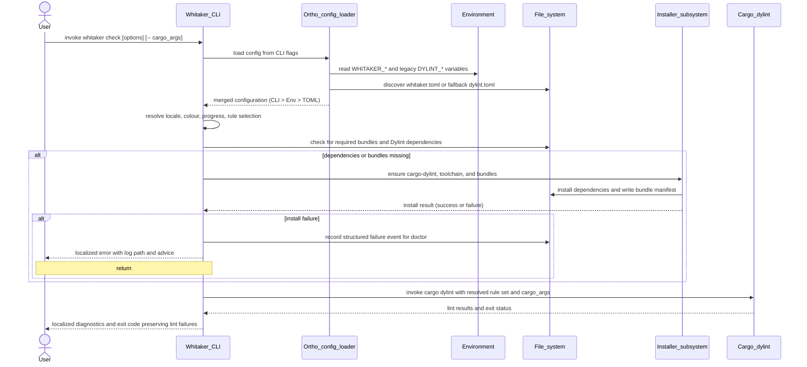
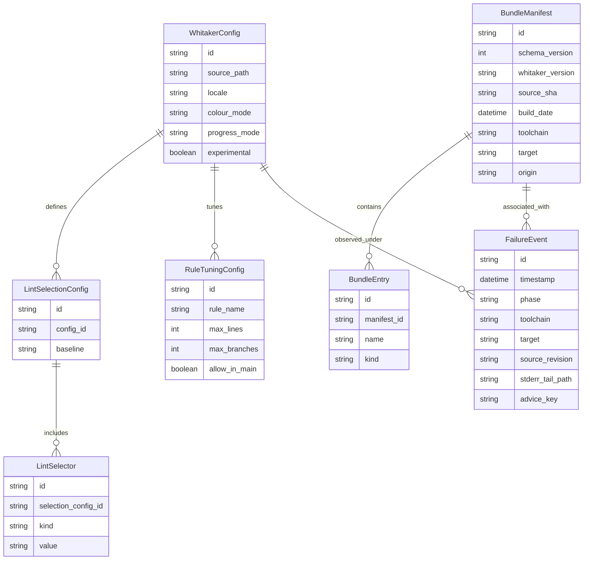

# Whitaker CLI design

## Context and problem statement

Whitaker currently presents a split public user experience. The documented
happy path installs `whitaker-installer`, runs that installer, and then relies
on generated `whitaker` and `whitaker-ls` wrapper scripts.[^1] The installer
also owns Dylint dependency installation, workspace cloning or updating,
library builds, staging, and wrapper generation. That design works, but it
exposes the implementation mechanism rather than a coherent product surface.

The current documentation also leaves the status of experimental lints
ambiguous. The original design document framed Bumpy Road as experimental,
while the user guide lists `bumpy_road_function` among shipped lints, and the
installer currently reports that there are no experimental lints in the
release.[^1][^2] The new CLI should remove that ambiguity entirely.

This document proposes a single public `whitaker` executable that manages
Whitaker lint bundles, Dylint dependencies, configuration discovery, and
diagnostics directly. The design treats localization and accessibility as
first-class concerns rather than optional polish.

## Goals

- Present one public executable for the Whitaker core lint suite.
- Make `whitaker check` the default path for humans and automation.
- Preserve Dylint's toolchain-specific dynamic library model without exposing
  wrapper scripts.
- Replace the current experimental-rule ambiguity with a stable, explicit rule
  selection model.
- Standardize configuration across CLI flags, environment variables, and
  `whitaker.toml` using
  [`ortho_config`](https://github.com/leynos/ortho-config) (`ortho_config`).[^4]
- Ensure help text, diagnostics, progress reporting, and machine-readable
  output remain localizable and accessible.

## Non-goals

- Replacing Dylint's underlying loading mechanism.
- Collapsing all toolchain-specific artefacts into one universal binary.
- Making `ALL` the default rule baseline.
- Preserving generated wrapper scripts as a long-term public interface.

## Design principles

- `whitaker` is the product, while Dylint remains the mechanism.
- Command names, rule codes, manifest keys, and JSON fields are stable and are
  never translated.
- Human-facing prose is localizable, with `en-GB` as the fallback locale.
- Output never relies on colour, position, or animation alone to convey state.
- CLI flags override environment variables, and environment variables override
  configuration files.
- Stable defaults should remain stable across upgrades, while opt-in modes may
  expose more aggressive behaviour.

## Public CLI surface

Whitaker should expose one public executable for the core suite:

```plaintext
$ whitaker --help
Usage: whitaker <COMMAND>

Commands:
  check     Run Whitaker core lints
  install   Install or repair Whitaker dependencies and lint bundles
  ls        Show installed lints, bundle metadata, and effective enablement
  doctor    Diagnose config, toolchain, dependencies, bundles, and recent failures
  help      Print this message or the help of the given subcommand
```

`whitaker` becomes a real Rust binary. `whitaker-ls` disappears in favour of
`whitaker ls`. `whitaker-installer` survives for one compatibility release as a
thin shim that prints a deprecation notice and dispatches to
`whitaker install`, then it is removed.

## Accessibility and localization requirements

Localization and accessibility should shape the CLI contract from the first
release of the unified binary.

- Every human-facing string, including `--help`, install progress, failure
  summaries, and `doctor` advice, should be localizable.
- Rule codes, lint names, selectors, manifest schema fields, exit codes, and
  JSON keys must remain language-neutral and stable across locales.
- `en-GB` should be the fallback locale, with compatibility support for the
  existing `DYLINT_LOCALE` setting during the migration window.[^1]
- Text output must use explicit status words such as `enabled`, `disabled`,
  `warning`, and `error`; colour may reinforce status, but colour must never be
  the only signal.
- Progress rendering should default to line-oriented output. Animated spinners
  should be avoided by default because they degrade screen reader behaviour and
  create noisy logs. A plain progress mode should always be available.
- Commands that produce operational state summaries should support `--json`.
  `whitaker ls` must support `--json`, and `whitaker doctor` should support it
  as well for accessibility tooling, shell automation, and agent workflows.
- Narrow terminals should render block-oriented summaries instead of depending
  on fixed-width column layouts.

The design therefore standardizes the following shared output controls for
human-facing subcommands:

```plaintext
Common options:
  --locale <LOCALE>         Override the configured locale
  --colour <WHEN>           auto | always | never
  --progress <MODE>         auto | plain | off
  -q, --quiet
  -v, --verbose...
```

## `whitaker check`

`whitaker check` should be the default working path:

```plaintext
cargo binstall whitaker
whitaker check
```

If Dylint dependencies or Whitaker lint bundles are missing, `check` should
install them lazily and then run. That produces a working out-of-the-box path
for interactive use, while still allowing explicit provisioning through
`whitaker install`.

The subcommand should expose the following surface:

```plaintext
$ whitaker check --help
Usage: whitaker check [OPTIONS] [-- <cargo args...>]

Rule selection:
  --select <SELECTOR[,SELECTOR...]>
  --ignore <SELECTOR[,SELECTOR...]>
  --extend-select <SELECTOR[,SELECTOR...]>
  --experimental

Install behaviour:
  --no-install
  --offline
  --build-from-source

General:
  --config <PATH>
  --locale <LOCALE>
  --colour <WHEN>
  --progress <MODE>
  -q, --quiet
  -v, --verbose...
```

`check` should forward trailing arguments after `--` to `cargo dylint` or the
underlying cargo invocation. Exit codes should preserve lint failure semantics
from the underlying execution path, while install and configuration failures
should produce distinct operational errors.

The following sequence diagram shows the proposed `whitaker check` flow from
configuration loading through lazy installation and Dylint execution.



_Figure 1: Sequence diagram showing how `whitaker check` merges configuration,
performs lazy dependency repair when required, records install failures for
`doctor`, and then delegates to `cargo dylint`._

## Rule identifiers and selection model

Whitaker should borrow Ruff's selection algebra, but not its full vocabulary or
scale.[^3] The suite is small and opinionated, so selectors should accept
stable rule codes and canonical lint names.

| Code       | Lint                          |
| ---------- | ----------------------------- |
| `DOC001`   | `function_attrs_follow_docs`  |
| `DOC002`   | `module_must_have_inner_docs` |
| `DOC003`   | `test_must_not_have_example`  |
| `MOD001`   | `module_max_lines`            |
| `COND001`  | `conditional_max_n_branches`  |
| `PAN001`   | `no_expect_outside_tests`     |
| `PAN002`   | `no_unwrap_or_else_panic`     |
| `MAINT001` | `bumpy_road_function`         |

_Table 1: Proposed stable Whitaker rule codes and canonical lint names._

Selectors should support the following forms:

- `DEFAULT` for the stable core baseline.
- `ALL` for all families, with experimental rules included only when
  experimental mode is enabled.
- A family prefix such as `DOC`.
- An exact rule code such as `PAN001`.
- A canonical lint name such as `module_max_lines`.

Selection precedence should remain simple and predictable:

1. Start from `DEFAULT`.
2. If configuration supplies `select`, replace that baseline.
3. If the CLI supplies `--select`, replace the configuration baseline.
4. Apply `extend-select`.
5. Apply `ignore`.
6. Drop experimental rules unless experimental mode is enabled.

Whitaker should deliberately deviate from Ruff in one place. If the user has
not supplied an explicit `select`, `--experimental` should extend the implicit
default selection with experimental rules. If the user has supplied an explicit
`select`, `--experimental` should only make experimental selectors eligible.
That keeps the curated suite immediately useful without making the selection
model surprising.

Examples:

```plaintext
whitaker check
whitaker check --ignore MOD001 -- --all-features
whitaker check --select PAN,DOC003
whitaker check --experimental
whitaker check --experimental --select MAINT001
```

`DEFAULT` should remain the recommended baseline. `ALL` should continue to mean
"accept moving strictness", rather than becoming the product default.

## Configuration model

Whitaker should stop treating `dylint.toml` as the primary user-facing home for
configuration. `dylint.toml` names the mechanism, while `whitaker.toml` names
the product and is clearer to discover, document, and support.[^1]

Configuration discovery and merging should be implemented with
[`ortho_config`](https://github.com/leynos/ortho-config) via the `ortho_config`
crate.[^4] That gives Whitaker a consistent model for merging CLI flags,
environment variables, and TOML configuration, including subcommand helpers and
comma-separated environment values.

The canonical configuration should look like this:

```toml
[lint]
select = ["DEFAULT"]
ignore = []
experimental = false

[install]
lazy = true
prefer_prebuilt = true
allow_build_from_source = true

[diagnostics]
locale = "en-GB"

[output]
colour = "auto"
progress = "plain"

[module_max_lines]
max_lines = 400

[conditional_max_n_branches]
max_branches = 2

[no_expect_outside_tests]
additional_test_attributes = ["tokio::test", "rstest"]

[test_must_not_have_example]
additional_test_attributes = ["actix_rt::test"]

[no_unwrap_or_else_panic]
allow_in_main = false
```

The environment model should follow the same naming scheme:

```plaintext
WHITAKER_LINT_SELECT=PAN,DOC
WHITAKER_LINT_IGNORE=DOC003
WHITAKER_LINT_EXPERIMENTAL=true
WHITAKER_DIAGNOSTICS_LOCALE=cy
WHITAKER_OUTPUT_COLOUR=never
WHITAKER_OUTPUT_PROGRESS=plain
WHITAKER_MODULE_MAX_LINES_MAX_LINES=500
```

Compatibility behaviour should remain in place for one release:

- Read `dylint.toml` when `whitaker.toml` is absent.
- Read legacy environment names such as `DYLINT_LOCALE`.
- Emit deprecation warnings that name the replacement key or file.

The following entity-relationship diagram summarizes how configuration,
selection state, installed bundle manifests, and recorded failures relate to
one another.



_Figure 2: Entity-relationship diagram showing how Whitaker configuration, lint
selection, installed bundle manifests, and recorded failure events relate to
one another._

## `whitaker install`

`whitaker install` should retain the role of the current installer, but with a
smaller and more explicit contract:

```plaintext
whitaker install
whitaker install --build-from-source
whitaker install --offline
whitaker install --toolchain nightly-2025-09-18
```

Semantically, `install` should do four things:

1. Ensure `cargo-dylint` and `dylint-link` exist.
2. Ensure the active toolchain exists.
3. Ensure the required Whitaker lint bundle for that toolchain and target
   exists.
4. Record the outcome with enough metadata for `ls` and `doctor`.

The source-build path should not clone `main` as the normal flow. When a source
build is necessary, Whitaker should resolve a versioned source tree that
matches the installed CLI release, or an explicitly requested revision. That
keeps installed metadata honest when the product later reports source revision
and build date.

`--build-only` should be renamed to `--build-from-source`. The old flag may
survive as a hidden compatibility alias for one or two releases.
`--skip-wrapper` should be removed because wrapper generation disappears.

## Bundle manifests and `whitaker ls`

The current installer scanner can infer crate name, toolchain, and file path
from staged filenames, but it cannot report source revision, build date,
origin, or effective configuration state because that metadata does not exist
in the installed artefacts today.[^5]

Each installed bundle should therefore carry a manifest:

```json
{
  "schema_version": 1,
  "whitaker_version": "0.3.0",
  "source_sha": "502edb6",
  "build_date": "2026-04-05T19:14:00Z",
  "toolchain": "nightly-2025-09-18",
  "target": "x86_64-unknown-linux-gnu",
  "origin": "prebuilt",
  "bundles": [
    { "name": "whitaker_suite", "kind": "stable" },
    { "name": "whitaker_experimental", "kind": "experimental" }
  ]
}
```

With that substrate, `whitaker ls` can expose both installed artefacts and
effective enablement:

```plaintext
$ whitaker ls
toolchain  nightly-2025-09-18
target     x86_64-unknown-linux-gnu
version    0.3.0
source     502edb6
built      2026-04-05T19:14:00Z
origin     prebuilt
config     /work/foo/whitaker.toml

DOC001   function_attrs_follow_docs      enabled
DOC002   module_must_have_inner_docs     enabled
DOC003   test_must_not_have_example      disabled: ignored by config
MOD001   module_max_lines                enabled
MAINT001 bumpy_road_function             disabled: experimental mode off
```

`whitaker ls` must support `--json`. The text form should remain readable in
terminals and screen readers by using explicit state labels instead of visual
markers alone.

## `whitaker doctor`

`whitaker doctor` should be opinionated without becoming melodramatic. Missing
prebuilt artefacts are a warning, not a catastrophe, when a source build
fallback is available.

The command should check:

- Configuration discovery and parse status.
- Active workspace and toolchain detection.
- Presence of `cargo-dylint` and `dylint-link`.
- Availability of matching prebuilt dependency binaries for the host target.
- Availability of matching prebuilt lint bundles for the active toolchain and
  target.
- Whether the installed bundle matches the current CLI version.
- Whether selected lints are actually installed.
- Whether recent local build failures exist.

`doctor` should support both text and JSON output. Text mode should present a
top-down summary with explicit severity labels and concrete follow-up advice.
JSON mode should preserve the same underlying facts for automation and
accessibility tooling.

## Failure recording

The current installer metrics model records aggregate successful installs, but
that is too thin for `doctor` and for local repair workflows.[^6] Whitaker
should record each failed local build or failed dependency installation as a
structured event with:

- Timestamp
- Phase
- Toolchain
- Target
- Source revision
- Standard error tail
- Recommended advice

Failures should be surfaced both at the point of failure and later through
`whitaker doctor`.

```plaintext
error: failed to build Whitaker core lints from source
phase: cargo build
toolchain: nightly-2025-09-18
target: x86_64-unknown-linux-gnu
source: 502edb6
log: ~/.local/share/whitaker/state/failures/2026-04-12T14-22-03Z-build.log

This failure has been recorded. Run `whitaker doctor` for a summary.
```

This message should remain localizable, while the structured fields and the log
path stay stable.

## Compatibility and migration

The migration should proceed in four steps:

1. Add a real `whitaker` binary at the root package, move the current
   installer logic behind an internal library boundary, and copy the working
   `cargo-binstall` metadata pattern from `whitaker-installer` onto
   `whitaker`.[^7]
2. Introduce the bundle manifest and failure-log formats, then teach `ls` and
   `doctor` to consume them.
3. Switch configuration loading to `ortho_config`, with `whitaker.toml` as the
   canonical file and `dylint.toml` as the compatibility bridge.[^4]
4. Publish one release where `whitaker-installer` acts as a deprecation shim
   and `whitaker ls` accepts `list` as an alias, then remove the old public
   entry points.

During the compatibility release, deprecation notices should be concise,
screen-reader-friendly, and explicit about the replacement command.

## Expected outcomes

If implemented, this design should deliver:

- One public executable for the Whitaker core suite.
- A default `whitaker check` flow that installs dependencies lazily when
  needed.
- A clear, stable rule-selection model with explicit experimental handling.
- Honest installation metadata for `ls` and actionable recovery data for
  `doctor`.
- One configuration model across CLI flags, environment variables, and TOML.
- A localized, accessible CLI surface that is usable in interactive shells,
  CI logs, and agent-driven workflows.

[^1]: [Whitaker user guide](users-guide.md)
[^2]: [Whitaker Dylint suite design](whitaker-dylint-suite-design.md)
[^3]: [The Ruff linter](https://docs.astral.sh/ruff/linter/)
[^4]: [leynos/ortho-config](https://github.com/leynos/ortho-config)
[^5]: [Installer scanner implementation](../installer/src/scanner.rs)
[^6]: [Installer metrics implementation](../installer/src/install_metrics.rs)
[^7]: [Installer Cargo manifest](../installer/Cargo.toml)
