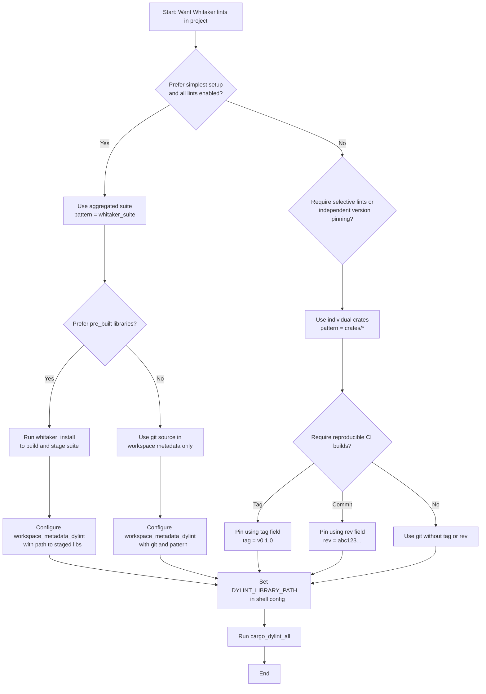

# Whitaker Rust Dylint Workspace — Lint Suite Design and Roadmap

This single document consolidates the workspace design, the seven core lints
(with the **revised conditional rule**), the separate `no_unwrap_or_else_panic`
lint crate, a feasibility study for a **Bumpy Road** detector, and a phased
**roadmap**.

## 0) Objectives

- Provide seven Dylint rules as separate crates, plus an optional **aggregated
  suite** crate.
- Keep configuration simple via `dylint.toml` and workspace metadata.
- Offer robust UI tests and CI.
- Add an extra restriction lint: **`no_unwrap_or_else_panic`**.
- Explore an advanced maintainability signal (**Bumpy Road**) as an
  experimental lint.

## 1) Workspace layout

```text
<repo-root>/
├─ Cargo.toml                     # workspace + dylint metadata
├─ rust-toolchain.toml            # nightly pinned for lints
├─ dylint.toml                    # optional defaults per lint
├─ crates/
│  ├─ function_attrs_follow_docs/
│  ├─ no_expect_outside_tests/
│  ├─ public_fn_must_have_docs/
│  ├─ module_must_have_inner_docs/
│  ├─ conditional_max_n_branches/     # revised: complex conditional detection
│  ├─ test_must_not_have_example/
│  ├─ module_max_lines/
│  └─ no_unwrap_or_else_panic/        # separate crate
├─ suite/                         # aggregated dylint library (optional)
├─ installer/                     # optional convenience binary
├─ common/                        # shared helpers for lints
└─ ci/                            # CI workflows
```

### Top-level `Cargo.toml`

```toml
[workspace]
members = ["crates/*", "suite", "installer", "common"]
resolver = "2"

[workspace.package]
edition = "2024"

[workspace.lints.rust.unexpected_cfgs]
level = "warn"
check-cfg = ["cfg(dylint_lib, values(any()))"]

[workspace.dependencies]
camino = "1"
dylint_linting = "5"
dylint_testing = "5"
serde = { version = "1", features = ["derive"] }
thiserror = "2"
toml = "0.9"

[workspace.metadata.dylint]
libraries = [ { git = "https://example.com/your/repo.git", pattern = "crates/*" } ]
```

> Pin a nightly in `rust-toolchain.toml` aligned with the targeted
> `dylint_linting` version.

### Phase 2 scaffolding

- Introduced `whitaker::lints::LintCrateTemplate`, generating canonical
  manifests and `lib.rs` boilerplate for new lint crates.
- The helper enforces crate-name hygiene, requires relative UI directories,
  and emits a default `whitaker::declare_ui_tests!` invocation to wire shared
  UI tests.
- Crate-name validation now rejects trailing separators, normalizes
  Windows-style separators to forward slashes, and refuses parent directory
  traversal, so template consumers stay within their crate boundaries.
- Workspace dependencies now surface `dylint_linting`, `dylint_testing`,
  `camino`, `serde`, `thiserror`, `toml`, and proxy crates such as
  `rustc_attr_data_structures` so lint crates can opt into shared versions via
  `workspace = true`.
- The workspace pins `nightly-2025-09-18` in `rust-toolchain.toml` and
  forces `-C prefer-dynamic` via `.cargo/config.toml`. Preferring dynamic
  std/core keeps `rustc_private` consumers (for example `rustc_driver` in
  Dylint) from pulling mixed static and dynamic runtimes, eliminating the
  duplicate symbol errors seen on newer nightlies while staying on a toolchain
  recent enough for `dylint_linting` 5.x.
- UI harness helpers now prepare the cdylib expected by the driver. Before each
  run, the harness copies `lib<crate>.so` to the `lib<crate>@<toolchain>.so`
  name derived from `RUSTUP_TOOLCHAIN`. The copy is skipped for synthetic crate
  names used by tests, so unit coverage can continue to inject stub runners
  without touching the filesystem.

## 2) Common crate (`common`)

Utilities shared by lints:

- **Attribute helpers:** doc vs non-doc; inner vs outer; detect `#[test]`-like
  attributes (`test`, `tokio::test`, `rstest`).
- **Context:** `in_test_like_context`, `is_test_fn`, `is_in_main_fn`.
- **Types:** `recv_is_option_or_result`.
- **Spans:** `span_to_lines`, `span_line_count`, `def_id_of_expr_callee`,
  `is_path_to`.
- **Visibility:** effective export check via `cx.tcx`/`effective_visibilities`.
- **Diagnostics:** `span_lint`, formatting helpers, suggestion utilities.

### Implementation notes — Phase 1 delivery

- Adopted lightweight domain models rather than compiling against the unstable
  `rustc_*` crates. `Attribute`, `ContextEntry`, `SimplePath`, and `Expr`
  encode the data needed by early lints without tying the helpers to a specific
  compiler snapshot.
- Attribute helpers normalize paths into `Vec<String>` segments, allowing
  reusable matching logic for doc comments and test-like markers. This ensures
  future lints can extend the recognized attribute set without restructuring
  the API.
- Context detection operates on an explicit stack of `ContextEntry` frames. The
  helpers analyze the recorded attributes so callers can reason about ambient
  test contexts without leaking traversal state.
- Span utilities introduce `SourceLocation`/`SourceSpan` wrappers with
  validation, providing deterministic line counting and range projection for
  diagnostics while flagging inverted spans early.
- Diagnostics are constructed via a builder (`span_lint`) that gathers notes,
  help messages, and suggestions before emitting a concrete `Diagnostic`. The
  structure mirrors `rustc` concepts but keeps the surface area simple for unit
  and behaviour tests.
- UI test harness helpers live in `whitaker::testing::ui`. The helpers validate
  crate names and UI directories before invoking `dylint_testing::ui_test`, and
  expose `run_ui_tests!` plus `declare_ui_tests!` macros. The macros expand
  `env!("CARGO_PKG_NAME")` in the caller so dependent lint crates always pass
  their own names to the harness while publishing the canonical `ui` test
  without copying boilerplate. Tests inject stub runners via `run_with_runner`
  to cover happy and unhappy paths without touching the real filesystem.
- Path handling standardises on a caret requirement anchored at `camino`
  v1.1.10. Transitive constraints currently resolve this to 1.2.1. This keeps
  the workspace benefiting from the maintenance fixes delivered since 1.1.6,
  including the `unexpected_cfgs`-warning resolution needed for lint workspaces.
- Shared configuration lives in `whitaker::config::SharedConfig`. The
  `load()` helper uses the Dylint loader for Whitaker itself, while
  `load_with()` accepts the caller's crate name plus an injectable loader so
  individual lint crates can read their matching tables in `dylint.toml` or
  tests can stub the source. `serde` defaults keep fields optional so teams can
  override only the `module_max_lines.max_lines` threshold (default 400)
  without rewriting the table. Unknown fields are rejected via
  `deny_unknown_fields` so configuration typos fail fast during deserialization.
- Unit and behaviour coverage lean on `rstest` fixtures and `rstest-bdd`
  scenarios (v0.1.0) to exercise happy, unhappy, and edge cases without
  duplicating setup logic.
- Adopt the rstest-bdd 0.1.0 stable release to eliminate alpha regressions
  whilst keeping compile-time validation consistent across lint crates.

### Localization infrastructure

- Adopt `fluent-templates` and `once_cell` as workspace dependencies,
  so each lint crate can load translated diagnostics without manual resource
  management. Both crates live in `[workspace.dependencies]` to keep versions
  aligned and to simplify adoption across current and future lints.
- Provide `common::i18n::Localizer`, a wrapper around the static loader that
  records when the fallback locale is used and surfaces missing message errors
  eagerly. The helper exposes convenience accessors for direct messages and
  Fluent attributes while supporting argument interpolation.
- Introduce `common::i18n::get_localizer_for_lint`, centralising the
  environment/configuration resolution so lint crates share identical logging
  and fallback semantics. The helper reads `DYLINT_LOCALE`, applies workspace
  configuration, emits a debug summary, and returns the resolved `Localizer`.
- Wrap message resolution with `common::i18n::safe_resolve_message_set`, which
  delegates to `resolve_message_set` and captures failures in a single place.
  The wrapper emits a `span_delayed_bug` through the lint context, logs the
  missing key, and returns deterministic English strings so lints can continue
  emitting diagnostics without panicking.
- Cache a `Localizer` inside each lint pass, so diagnostics can resolve
  translations at emission time without repeatedly negotiating locales. The
  lints supply structured arguments such as the offending attribute snippet or
  receiver type, keeping Fluent bundles free from ad hoc string formatting.
- When lookups fail, report the missing message via `delay_span_bug` and fall
  back to deterministic English strings, so the lint still emits actionable
  output whilst flagging the translation defect for developers.
- Embed `.ftl` resources under `locales/<lang>/<crate>.ftl` using
  `fluent_templates::static_loader!`. The loader resides in `common::i18n` and
  exposes a `FluentBundle` facade that lint crates invoke through helper
  functions (`message`, `note`, `help`). Embedding avoids runtime I/O and keeps
  CI deterministic.
- Ship an `en-GB` fallback plus `cy` and `gd` secondary locales that translate
  every lint slug. The additional bundles act as reference implementations for
  translators and drive behavioural coverage that exercises non-English
  lookups, including languages with richer plural categories, alongside
  fallback resolution.
- Keep Fluent resources compatible with the `fluent-syntax 0.12` parser shipped
  by `fluent-templates 0.13`. Named term arguments triggered parser failures in
  the Welsh bundles, so the `cy` resources now inline select expressions and
  avoid helper terms when plural logic is required. This keeps localisation
  coverage intact without requiring a dependency upgrade.
- Provide an `en-GB` fallback bundle that always loads. Additional locales live
  alongside it and are discovered dynamically when the loader initialises.
  Messages use stable slugs such as `function_attrs_follow_docs.primary` and
  `.help` attributes to mirror the structure used by `rustc`.
- Honour a `DYLINT_LOCALE` environment variable and a `dylint.toml` override in
  `SharedConfig`. The helper resolves the caller locale in the order: explicit
  argument, `DYLINT_LOCALE`, configuration entry, and finally the fallback.
  This keeps command-line, CI, and editor integrations predictable while
  enabling non-English smoke tests.
- Provide `common::i18n::resolve_localizer`, which returns a
  `LocaleSelection` capturing the chosen locale and its provenance. The
  resolver trims whitespace, skips empty candidates, and logs unsupported
  locales before falling back, so precedence remains observable without
  duplicating the lookup order.
- Exercise locale selection through `rstest-bdd` scenarios so explicit,
  environment, configuration, and fallback branches stay documented. The tests
  assert the resolved source to prevent precedence regressions.
- Emit structured diagnostics by formatting all human-facing text through the
  bundle before calling `span_lint`. Primary messages, labels, notes, and help
  text each source their own Fluent attribute, so translators do not wrestle
  with concatenated phrases. Suggestion titles and placeholders pass concrete
  arguments (`{ flag }`, `{ subject }`) rather than interpolated strings to
  maintain parity with `rustc`'s diagnostic pipeline.
- Extend the UI harness with a Welsh smoke test that exercises the
  `function_attrs_follow_docs` fixtures under `DYLINT_LOCALE=cy`. The harness
  continues to execute via `dylint_testing`'s JSON output to keep diagnostics
  machine-readable while proving non-English locales work end to end.
- Exercise localisation helpers with `rstest-bdd` behaviour tests, using stub
  lookups to simulate missing translations alongside happy paths in English,
  Welsh, and Gaelic. This guarantees the Fluent arguments remain stable and
  protects the fallback code paths from regression.
- Add a `ftl_bundles_parse_successfully` integration test that iterates over
  every `.ftl` file with `FluentResource::try_new`. The test collects all
  bundles via `support::i18n_ftl::file_pairs`, surfaces parser errors alongside
  duplicate message identifiers, and panics with actionable file paths so
  malformed resources fail fast.
- Pair the parser check with a BDD module (`ftl_smoke_behaviour`) and a
  matching `i18n_ftl_smoke.feature` file. The scenarios assert discovery
  behaviour, cover representative happy/unhappy parse cases, and keep the smoke
  fixtures executable via `rstest-bdd`.
- Normalise Unicode isolation marks (`\u{2068}`/`\u{2069}`) inside behaviour
  assertions so tests remain readable while still verifying the formatted
  output that Fluent now emits for bidi safety.

## 3) Seven core lints (specs + sketches)

| Crate                         | Kind            | Summary                                                                                                                 | Level |
| ----------------------------- | --------------- | ----------------------------------------------------------------------------------------------------------------------- | ----- |
| `function_attrs_follow_docs`  | style           | Outer doc comments on functions must precede other outer attributes.                                                    | warn  |
| `no_expect_outside_tests`     | restriction     | Ban `.expect(…)` on `Option`/`Result` outside test/doctest contexts (per effective visibility of the enclosing item).   | deny  |
| `public_fn_must_have_docs`    | pedantic        | Publicly exported functions require at least one outer doc comment.                                                     | warn  |
| `module_must_have_inner_docs` | pedantic        | Every module must start with a `//!` inner doc comment.                                                                 | warn  |
| `conditional_max_n_branches`  | style           | Flag conditionals with more than the configured number of predicate branches; encourage decomposition.                  | warn  |
| `test_must_not_have_example`  | style           | Test functions (e.g. `#[test]`, `#[tokio::test]`) must not ship example blocks or `# Examples` headings in docs.        | warn  |
| `module_max_lines`            | maintainability | Flag modules whose span exceeds 400 lines; encourage decomposition or submodules.                                       | warn  |

### Per-lint crate scaffolding

Each lint crate is a `cdylib` exposing a single lint. The shared structure
keeps dependencies aligned and ensures UI tests run uniformly.

```toml
[package]
name = "function_attrs_follow_docs"
version = "0.1.0"
edition = "2024"

[lib]
crate-type = ["cdylib"]

[dependencies]
dylint_linting = { workspace = true }
rustc_hir = { workspace = true }
rustc_lint = { workspace = true }
rustc_middle = { workspace = true }
rustc_session = { workspace = true }
rustc_span = { workspace = true }
common = { path = "../../common" }

[dev-dependencies]
dylint_testing = { workspace = true }
whitaker = { path = "../../" }
```

Whitaker's workspace includes thin `rustc_*` proxy crates so generated lint
crates can depend on `rustc_private` APIs via `workspace = true` without
repeating the re-export boilerplate in each project.

> Swap the `name` per crate. Tests live under `tests/ui` with `dylint_testing`
> providing the harness.

### 3.1 `function_attrs_follow_docs` (style, warn)

Ensure function doc comments precede other **outer** attributes.

Sketch:

```rust
use dylint_linting::{declare_late_lint, impl_late_lint};
use rustc_hir as hir; use rustc_lint::{LateContext, LateLintPass};

declare_late_lint!(pub FUNCTION_ATTRS_FOLLOW_DOCS, Warn, "function attributes must follow doc comments");

pub struct Pass;
impl_late_lint! { FUNCTION_ATTRS_FOLLOW_DOCS, Pass,
  fn check_item<'tcx>(&mut self, cx: &LateContext<'tcx>, it: &'tcx hir::Item<'tcx>) {
    if let hir::ItemKind::Fn(..) = it.kind {
      let attrs = cx.tcx.hir().attrs(it.hir_id());
      common::check_doc_then_attrs(cx, it.span, attrs, "functions");
    }
  }
  fn check_impl_item<'tcx>(&mut self, cx: &LateContext<'tcx>, it: &'tcx hir::ImplItem<'tcx>) {
    if let hir::ImplItemKind::Fn(..) = it.kind {
      let attrs = cx.tcx.hir().attrs(it.hir_id());
      common::check_doc_then_attrs(cx, it.span, attrs, "methods");
    }
  }
}
```

Implementation details:

- The lint now maps `rustc_hir::Attribute` values into a small
  `OrderedAttribute` abstraction, so the ordering logic can be unit-tested
  without depending on compiler types. `AttrInfo::from_hir` records the span,
  whether the attribute is a doc comment (via `doc_str`), and whether it is
  outer by reading the attribute style (`AttrStyle`). Inner attributes
  therefore remain excluded from the ordering check in line with the
  implementation.
- `FunctionKind` labels free functions, inherent methods, and trait methods so
  diagnostics mention the affected item type explicitly.
- Diagnostics now rely on `LateContext::emit_spanned_lint`, highlighting the
  misplaced doc comment and adding a note on the attribute that must move
  behind it. The help message guides the developer to reposition the comment
  before other outer attributes.
- Behaviour-driven tests cover doc comments that already appear first, cases
  where they are misplaced, functions with no docs, and scenarios where inner
  attributes precede the docs. UI fixtures exercise free functions, methods,
  and trait methods to ensure the lint surfaces in each context, including
  explicit `#[doc = "..."]` attributes so attribute-based documentation is
  linted consistently.

### 3.2 `no_expect_outside_tests` (restriction, deny)

Forbid `.expect(…)` on `Option`/`Result` outside tests/doctests.

The lint inspects the crate-wide `Crate::is_doctest` flag, so doctest harnesses
produced by `rustdoc` bypass the check entirely. This keeps documentation
examples ergonomic while leaving the runtime lint strict.

Recognized test attributes now combine the built-in shortlist with an
`additional_test_attributes` array loaded from `dylint.toml`. These values are
stored as fully qualified paths (for example `my_framework::test`) and threaded
through the context collector so custom harness macros are treated like
first-party attributes when summarizing the traversal stack.

Sketch:

```rust
use rustc_hir::{Expr, ExprKind};

declare_late_lint!(pub NO_EXPECT_OUTSIDE_TESTS, Deny, ".expect() must not be used outside of test or doctest");
impl_late_lint! { NO_EXPECT_OUTSIDE_TESTS, Pass,
  fn check_expr<'tcx>(&mut self, cx: &LateContext<'tcx>, e: &'tcx Expr<'tcx>) {
    if let ExprKind::MethodCall(seg, recv, ..) = e.kind {
      if seg.ident.name.as_str() == "expect"
        && common::recv_is_option_or_result(cx, recv)
        && !common::in_test_like_context(cx, e.hir_id) {
        common::span_lint(cx, NO_EXPECT_OUTSIDE_TESTS, e.span, "`.expect(…)` outside tests");
      }
    }
  }
}
The implementation interrogates typeck results to confirm the method receiver
resolves to `Option` or `Result` by walking the ADT definition. A context
summarizer climbs the HIR parent stack collecting function, module, and impl
entries, then flags test scenarios when a recognized attribute or a
`cfg(test)` guard appears. Diagnostics lean on that summary: the primary
message is accompanied by notes that echo the enclosing function name and the
receiver type, plus a help hint that nudges developers toward explicit error
handling.

`cfg_attr(test, ..)` annotations are ignored unless they inject a `cfg(test)`
gate (for example, `cfg_attr(test, cfg(test))`). This distinction prevents
production-only functions that merely relax warnings or lints under test builds
from being misclassified as test code, eliminating a class of false negatives
observed during feature rollout.

Behaviour-driven unit tests exercise the summarizer in isolation, covering
plain functions, explicit test attributes, modules guarded by `cfg(test)`, and
paths added via configuration. UI fixtures demonstrate the denial emitted for
ordinary functions and the absence of findings inside `#[test]` contexts.

```

### 3.3 `public_fn_must_have_docs` (pedantic, warn)

Any effectively exported function must have a doc comment.

Sketch uses `effective_visibilities` and `has_outer_doc`.

### 3.4 `module_must_have_inner_docs` (pedantic, warn)

Warn when a module fails to open with an inner doc comment such as `//!` or
`#![doc = "…"]`. Teams must explain a module's purpose before adding
configuration attributes or code so that readers understand the file without
scrolling.

**Implementation (2025-11-17).** The lint inspects every `ItemKind::Mod`
definition that originates from source (macro-expanded modules are skipped to
avoid flagging generated helper modules). Rather than walk the attribute AST,
the detector reads the module body's first snippet via `module_body_span` and
parses the leading attribute identifier. `//!` and inner attributes whose name
is exactly `doc` (including those injected via `cfg_attr`) mark the module as
documented. The attribute parser tolerates spacing after the `#!` marker and
traces the first-level `cfg_attr` meta list to find `doc` entries, which avoids
substring-based false positives such as `#![allow(undocumented_unsafe_blocks)]`
and misclassifying `documentation = "…"`. If the snippet starts with an inner
attribute marker (`#`) before any doc, the lint emits `FirstInnerIsNotDoc` and
highlights the offending token, unless the leading attribute is a doc-less
`cfg_attr` wrapper, in which case it falls back to `MissingDocs` so the
diagnostic targets the module start. The shared span helpers from
`whitaker::hir` supply consistent ranges for inline and file modules. Localized
strings pull from `locales/*/module_must_have_inner_docs.ftl`, passing the
module name via the Fluent argument map, and fall back to a deterministic
English message whenever localisation fails.

**Testing.** Unit tests (rstest) and `rstest-bdd` scenarios exercise the
snippet classifier, covering happy paths, missing docs, inner attributes that
precede documentation, outer-doc-only modules, `cfg_attr`-injected docs,
whitespace-tolerant `#![ doc = "" ]` syntax, and false-positive rejection for
attributes such as `#![allow(undocumented_unsafe_blocks)]` or
`#![documentation = "…"]`. UI fixtures capture inline modules, file modules
(via `#[path = "…"]`), and macro-generated modules to prove that macro output
remains exempt. A Welsh (`cy`) UI smoke test asserts that diagnostics localize
correctly under `DYLINT_LOCALE=cy`.

### 3.5 `conditional_max_n_branches` (style, warn)

Renamed from `conditional_max_two_branches` to reflect the new configurable
branch limit. The lint now defaults to **two predicate branches** and emits a
diagnostic when a conditional expression introduces **more than** the allowed
number of predicate branches.

**Intent.** Discourage complex boolean predicates inside `if`, `while`, and
match guard conditions. Inline expressions such as
`if x.started() && y.running() && z.available()` obscure the business rule and
contribute to the Complex Method smell. Encourage encapsulation via a
well-named helper or a local variable.

**Rationale.** Teams often accrete guard clauses by bolting additional
`&&`/`||`/`!` terms into a conditional. The logic becomes entangled with
control-flow, harming readability and reuse. Extracting the predicate makes the
rule explicit, improves testability, and reduces accidental duplication.

**How to fix.** Apply the *Decompose Conditional* refactoring. Prefer
extracting the predicate into a function with a domain-flavoured name. When a
function is overkill, bind the expression to a local variable and branch on
that name.

**Design decision (2025-11-14).** Localization relies on a shared
`common::i18n::branch_phrase` helper to render both the current branch count
and the configured limit. This keeps Fluent resources and diagnostics in sync
across English, Welsh, and Scottish Gaelic without duplicating mutation rules.

**Lint metadata.**

- Crate: `conditional_max_n_branches`.
- Kind: `style`.
- Default level: `warn`.
- Escape hatch: `#[allow(conditional_max_n_branches)]`.

**Detection model.** A *complex conditional* is any boolean-valued expression
in a branching position that contains more predicate branches than the
configured limit. A branch is a boolean leaf (comparisons, boolean-returning
calls, boolean identifiers, etc.). Logical connectives (`&&`, `||`, `!`) form
the internal nodes of the predicate tree.

**Positions checked.**

- `if <cond> { … }` where `<cond>` is not an `ExprKind::Let` (i.e. exclude `if
  let`).
- `while <cond> { … }` with the same exclusion for `while let`.
- `match` guards represented in HIR as `Guard::If(<cond>)`.

**Algorithm.** Traverse the HIR expression and compute the number of branches:

```text
count_branches(e) =
  if e is Binary(And|Or, lhs, rhs): count_branches(lhs) + count_branches(rhs)
  if e is Unary(Not, inner):         count_branches(inner)
  else:                              1
```

Emit a diagnostic when `count_branches(e) > max_branches`, where the default
`max_branches` is `2`.

**Implementation sketch (`src/lib.rs`).**

```rust
use dylint_linting::{declare_late_lint, impl_late_lint};
use rustc_hir as hir;
use rustc_hir::{BinOpKind, Expr, ExprKind, Guard, UnOp};
use rustc_lint::{LateContext, LateLintPass};

declare_late_lint!(
    pub CONDITIONAL_MAX_N_BRANCHES,
    Warn,
    "complex conditional in a branch; decompose or extract"
);

pub struct Pass;

impl_late_lint! {
    CONDITIONAL_MAX_N_BRANCHES,
    Pass,

    fn check_expr<'tcx>(&mut self, cx: &LateContext<'tcx>, e: &'tcx Expr<'tcx>) {
        match e.kind {
            ExprKind::If(cond, ..) | ExprKind::While(cond, ..) => {
                if !matches!(cond.kind, ExprKind::Let(..))
                    && count_branches(cond) > self.max_branches
                {
                    emit_conditional_lint(cx, cond.span);
                }
            }
            ExprKind::Match(_, arms, _) => {
                for arm in *arms {
                    if let Some(Guard::If(guard)) = arm.guard {
                        if count_branches(guard) > self.max_branches {
                            emit_conditional_lint(cx, guard.span);
                        }
                    }
                }
            }
            _ => {}
        }
    }
}
```

The runtime implementation tracks the configured limit, loads localisation via
`SharedConfig`, and feeds both `branches` and `limit` plus their rendered
phrases into Fluent, so diagnostics remain idiomatic across locales.

**Notes.** Parentheses are normalized away by HIR, so grouping does not affect
the branch count. Bitwise operators (`&`, `|`, `^`) are ignored unless they
feed a boolean context via casts. `if let`/`while let` are intentionally
excluded because they are matching patterns, not boolean predicates.

**Diagnostics.**

- Message: “Collapse the {name} to {limit_phrase} or fewer.”
- Note (why): “The {name} currently contains {branch_phrase}.”
- Help: “Extract helper functions or simplify the {name} to reduce branching.”

**Configuration.**

```rust
#[derive(serde::Deserialize)]
struct Config {
    /// Maximum predicate branches allowed in a condition. Default: 2.
    max_branches: Option<usize>,
}
```

Read via `dylint_linting::config_or_default` and honour crate-level overrides
in `dylint.toml`.

**False positives / limitations.**

- Intentional short-circuiting (e.g. defensive double checks) may still warrant
  more branches; users can increase `max_branches` or allow the lint locally.
- Predicate name inference in suggestions remains non-trivial. Favour clear
  diagnostic text over brittle guesses.
- Extracting to a function must preserve ownership and short-circuit semantics;
  prefer local binding when moves or borrows complicate extraction.

**UI tests.**

```text
crates/conditional_max_n_branches/ui/
├─ fail_if_three_branches.rs     # default limit hit via three-way conjunction
├─ fail_while_guard.rs           # `while` guard with nested disjunction
├─ fail_match_guard.rs           # match guard with three branches
├─ fail_configured_limit.rs      # `max_branches = 1` highlights two-branch cond
├─ pass_if_two_branches.rs       # default limit allows two branches
├─ pass_custom_limit.rs          # raised limit accepts three branches
└─ pass_if_let.rs                # pattern guards remain out of scope
```

Each `.rs` pairs with a `.stderr` expectation via `dylint_testing::ui_test`.

### 3.6 `test_must_not_have_example` (style, warn)

Forbid examples or fenced code blocks in `#[test]` docs.

Heuristic: detect Markdown `# Examples` heading or fenced code (``` / ```rust)
in collected doc text.

### 3.7 `module_max_lines` (maintainability, warn)

Lint when module span exceeds 400 lines. Configurable via `max_lines`.

**Implementation notes (2025-03-17).**

- Module spans are measured using `hir::Mod::spans.inner_span` to count only the
  module body. When the compiler cannot provide an inner span (for example, in
  external modules), the lint falls back to the item span, mirroring how the UI
  expectations are derived.
- Line counts use `SourceMap::span_to_lines`; failures log at debug level and
  skip the module instead of emitting a partially formed diagnostic. This keeps
  the lint resilient when expansion hygiene obscures the original source.
- Macro expansions are ignored. The call site is often a single `mod` block in a
  macro definition and warning there would not guide the developer who wrote
  the expanded code.
- Diagnostics are localised via the shared `Localizer`,
  with fallback strings matching the bundled Fluent resources. The module ident
  span is highlighted whilst an additional note points to the declaration
  header to minimise visual noise in long files.

### 3.8 `no_std_fs_operations` (restriction, deny)

Forbid ambient filesystem calls routed through `std::fs` so teams must rely on
capability-bearing handles (`cap_std::fs::Dir`) and UTF-8 (the 8-bit Unicode
Transformation Format) paths from `camino`. Any `std::fs` import, type,
function, or inherent method usage trips this lint, covering both fully
qualified paths (`std::fs::read_to_string`) and items pulled in via
`use std::fs::{self, File}`.

**Implementation.**

- `NoStdFsOperations` implements `LateLintPass::check_path` so every `hir::Path`
  (expressions, type positions, use trees, patterns) is inspected once.
- Detected paths are converted to strings via `tcx.def_path_str(def_id)` and fed
  into a `SimplePath` parser. A match requires the first two segments to equal
  `["std", "fs"]`. Re-exports remain covered because the resolved `DefId`
  points back to `std`.
- Each finding produces a `StdFsUsage` struct containing the resolved operation
  label (for diagnostics) and a category (`Import`, `Type`, or `Call`). The
  category drives unit tests and future config knobs but diagnostics currently
  emphasize the operation name only to keep translations succinct.
- Diagnostics reuse Fluent bundles (`no_std_fs_operations.ftl`) with the
  operation label supplied via `{ $operation }`. The note explains why ambient
  access is disallowed and the help recommends `cap_std::fs` + `camino`.

**Tests.**

- Unit tests cover the operation classifier, ensuring paths such as
  `std::fs::File::open`, `std::fs::remove_file`, bare module references, and
  renamed imports all register as `StdFsUsage` while `cap_std::fs` remains
  untouched.
- Behaviour-driven tests (via `rstest-bdd 0.1.0`) exercise localisation, failure
  fallbacks, and the world state used to model capability hints. Scenarios
  cover en-GB, cy, and gd locales, as well as missing-message paths.
- UI fixtures demonstrate unhappy paths (imports, function calls, and type
  aliases) along with happy paths that rely on `cap_std::fs` and `camino`
  equivalents. Locale smoke tests run through the Welsh harness to keep Fluent
  bundles wired up.

## 4) Additional restriction lint (separate crate): `no_unwrap_or_else_panic`

Separate Dylint crate that **only** targets panicking `unwrap_or_else`
fallbacks on `Option`/`Result`. Plain `.unwrap()` / `.expect(...)` remain the
remit of other policies; this lint closes the “unwrap_or_else(|| panic!(…))”
loophole without broadening scope.

### Intent

Discourage disguising panics as error handling. Expressions such as
`maybe.unwrap_or_else(|e| panic!("{e:?}"))` should propagate errors rather than
crashing. Provide a diagnostic nudging developers toward structured error
returns.

### Crate layout

```text
crates/no_unwrap_or_else_panic/
├─ Cargo.toml
└─ src/
   ├─ lib.rs           # feature gating, public surface
   ├─ context.rs       # test/main/doctest detection
   ├─ policy.rs        # pure decision logic (unit tested)
   ├─ panic_detector.rs# shared panic + unwrap/expect detector
   └─ diagnostics.rs   # localisation + emission
crates/no_unwrap_or_else_panic/ui/
  ├─ bad_unwrap_or_else_panic.rs       # direct panic
  ├─ bad_unwrap_or_else_panic_any.rs   # panic_any
  ├─ bad_unwrap_or_else_unwrap.rs      # inner unwrap panic
  ├─ bad_main.rs                       # main panics without allow
  ├─ ok_in_test.rs                     # test context allowed
  ├─ ok_main_allowed.rs                # allow_in_main config
  ├─ ok_map_err.rs                     # propagates errors
  ├─ ok_unwrap_or_else_safe.rs         # safe fallback
  ├─ ok_plain_unwrap.rs                # plain unwrap allowed
  ├─ ok_plain_expect.rs                # plain expect allowed
  └─ ok_custom_unwrap_or_else.rs       # non-Option/Result receiver ignored
```

### `Cargo.toml`

```toml
[package]
name = "no_unwrap_or_else_panic"
version = "0.1.0"
edition = "2024"

[lib]
crate-type = ["cdylib"]

[dependencies]
dylint_linting = { workspace = true }
common          = { path = "../../common" }
serde           = { version = "1", features = ["derive"] }

clippy_utils    = { workspace = true, optional = true }

[features]
dylint-driver = [
    "dep:dylint_linting",
    "dep:log",
    "dep:rustc_ast",
    "dep:rustc_hir",
    "dep:rustc_lint",
    "dep:rustc_middle",
    "dep:rustc_span",
    "dep:serde",
    "dep:whitaker",
]
clippy = ["dylint-driver", "dep:clippy_utils"]

[dev-dependencies]
dylint_testing = { workspace = true }
```

> `dylint-driver` gates rustc_private linkage; tests build without it to avoid
> duplicate std/core. `clippy` is optional and now shares the same panic-path
> detector as the non-Clippy build.

### Detector highlights

- Gated to `unwrap_or_else` on `Option`/`Result` only.
- Panics detected via a shared `PANIC_PATHS` table (core/std panic entry points)
  plus inner `unwrap`/`expect` on the closure body.
- Clippy and non-Clippy builds share the same path-based detector; no substring
  heuristics.
- Context guard:
  - skips doctests (`UNSTABLE_RUSTDOC_TEST_PATH` present),
  - skips test-like scopes (including `#[cfg(test)]` and common test attrs),
  - optional `allow_in_main` config (default: false).
- Policy is a pure function (`policy::should_flag`) with unit tests covering all
  branches.

### Tests

- **Unit:** policy matrix (`should_flag`), panic detector path matching,
  `receiver_is_option_or_result`.
- **UI:** panicking closures (direct panic, `panic_any`, inner unwrap), allowed
  paths (map_err, safe fallback, test context, allow_in_main), scope guards
  (plain unwrap/expect, non-Option/Result receivers).
- **Build guard:** integration test ensures `.cargo/config.toml` retains
  `-C prefer-dynamic` to prevent duplicate std/core during lint cdylib builds.

### Behaviour

- Emits on panicking `unwrap_or_else` outside tests/doctests.
- Suggests propagating errors or using `expect` with a message; the lint does
  **not** flag plain `unwrap` / `expect`.
- Config: `no_unwrap_or_else_panic.allow_in_main = true` permits panics in
  `main`; default is `false`.

### UI tests

```text
bad_unwrap_or_else_panic.rs   # warns on inline panic
ok_map_err.rs                 # ok: propagates errors via map_err/Result
ok_in_test.rs                 # ok: tests may panic intentionally
bad_indirect_panic.rs         # document limitation: helper fn panics indirectly
```

Pair each `.rs` with a `.stderr` expectation using `dylint_testing::ui_test`.

### Workspace integration

- Already covered by the `crates/*` glob in the workspace members.
- Intentionally excluded from the aggregated `suite` crate so teams can opt in
  separately when the policy fits.

```toml
[workspace.metadata.dylint]
libraries = [
  { git = "https://example.com/your/repo.git", pattern = "crates/no_unwrap_or_else_panic" }
]
```

### CI and build matrix

- `cargo test --workspace --all-targets` (includes this crate).
- UI suite exercises panicking and non-panicking fallbacks, allow-in-main,
  panic_any, inner unwrap, plain unwrap/expect (allowed), and non-Option/Result
  receivers.
- Build guard test asserts `.cargo/config.toml` keeps `-C prefer-dynamic`
  (prevents duplicate std/core during lint cdylib builds).
- Optional `--features clippy` builds share the same panic-path detector as the
  default build; no substring heuristics remain.

### Limitations and future work

- Indirect panics invoked through helper functions are not flagged by
  default; the UI test documents this behaviour.
- Consider a `detect_indirect` configuration knob backed by MIR analysis for
  closures that always diverge (`!` type), albeit at higher maintenance cost.
- Allow a module allowlist, mirroring `no_expect_outside_tests`, if teams
  need targeted exemptions.

### Implementation decisions (2025-11-27)

- The lint now ships in `crates/no_unwrap_or_else_panic` with a
  default **deny** level and localisation wired through the shared Fluent
  bundles.
- A new `allow_in_main` boolean configuration controls whether panicking
  fallbacks are permitted inside `main`; the default keeps panics forbidden.
- Panic detection prefers `clippy_utils::macros::is_panic` when the optional
  `clippy` feature is enabled and falls back to matching well-known panic paths
  (e.g. `core::panicking::panic_fmt` and `std::rt::panic_fmt`) plus
  `unwrap`/`expect` on `Option`/`Result` receivers.
- Behavioural coverage relies on `rstest-bdd` scenarios that assert lint
  decisions across production, test, doctest, and `main` contexts; UI tests
  document both the enforced and allowed configurations.

## 5) Aggregated library (`whitaker_suite`) — optional

Bundle all lint crates for users who prefer a single dynamic library. The
`whitaker_suite` crate enables the `constituent` feature on each lint
dependency so their individual dylint entrypoints stay dormant while the
combined pass exposes a single `register_lints` symbol.

```toml
[package]
name = "whitaker_suite"
version = "0.1.0"
edition = "2024"

[lib]
crate-type = ["cdylib", "rlib"]

[dependencies]
dylint_linting = { workspace = true }
function_attrs_follow_docs = { path = "../crates/function_attrs_follow_docs",
    features = ["dylint-driver", "constituent"] }
no_expect_outside_tests = { path = "../crates/no_expect_outside_tests",
    features = ["dylint-driver", "constituent"] }
module_must_have_inner_docs = { path = "../crates/module_must_have_inner_docs",
    features = ["dylint-driver", "constituent"] }
conditional_max_n_branches = { path = "../crates/conditional_max_n_branches",
    features = ["dylint-driver", "constituent"] }
module_max_lines = { path = "../crates/module_max_lines",
    features = ["dylint-driver", "constituent"] }
no_unwrap_or_else_panic = { path = "../crates/no_unwrap_or_else_panic",
    features = ["dylint-driver", "constituent"] }
no_std_fs_operations = { path = "../crates/no_std_fs_operations",
    features = ["dylint-driver", "constituent"] }
```

```rust
use conditional_max_n_branches::ConditionalMaxNBranches;
use dylint_linting::{declare_combined_late_lint_pass, dylint_library};
use function_attrs_follow_docs::FunctionAttrsFollowDocs;
use module_max_lines::ModuleMaxLines;
use module_must_have_inner_docs::ModuleMustHaveInnerDocs;
use no_expect_outside_tests::NoExpectOutsideTests;
use no_std_fs_operations::NoStdFsOperations;
use no_unwrap_or_else_panic::NoUnwrapOrElsePanic;
use rustc_lint::{LateLintPass, LintStore};
use rustc_session::Session;

dylint_library!();

declare_combined_late_lint_pass!(SuitePass => [
    FunctionAttrsFollowDocs,
    NoExpectOutsideTests,
    ModuleMustHaveInnerDocs,
    ConditionalMaxNBranches,
    ModuleMaxLines,
    NoUnwrapOrElsePanic,
    NoStdFsOperations,
]);

#[no_mangle]
pub extern "C" fn register_lints(sess: &Session, store: &mut LintStore) {
    dylint_linting::init_config(sess);
    store.register_lints(&[
        function_attrs_follow_docs::FUNCTION_ATTRS_FOLLOW_DOCS,
        no_expect_outside_tests::NO_EXPECT_OUTSIDE_TESTS,
        module_must_have_inner_docs::MODULE_MUST_HAVE_INNER_DOCS,
        conditional_max_n_branches::CONDITIONAL_MAX_N_BRANCHES,
        module_max_lines::MODULE_MAX_LINES,
        no_unwrap_or_else_panic::NO_UNWRAP_OR_ELSE_PANIC,
        no_std_fs_operations::NO_STD_FS_OPERATIONS,
    ]);
    store.register_late_pass(|_| Box::new(SuitePass));
}
```

Re-export `register_suite_lints` and `suite_lint_decls` so tests and
documentation can assert the wiring without needing a `Session`. Behaviour
coverage uses `rstest-bdd 0.1.0` to prove the happy path registration and to
surface the duplicate-lint panic when called twice.

## 6) Installer CLI — optional

- Builds/stages the CDyLibs, runs `dylint-link`, copies them to a target dir,
  and prints a shell snippet:
  - `export DYLINT_LIBRARY_PATHS="$HOME/.local/share/dylint/lib"`

## 7) Testing strategy

- UI tests per crate using `dylint_testing`.
- Boilerplate:

```rust
#[test]
fn ui() { dylint_testing::ui_test(env!("CARGO_PKG_NAME"), "ui"); }
```

## 8) CI (GitHub Actions)

- Matrix on Linux/macOS/Windows.
- Steps: build; `cargo dylint --workspace -- -D warnings`; UI tests;
  `cargo clippy -D warnings`; `cargo fmt --check`.
- Optional feature matrix for `clippy_utils`.

## 9) Consumer integration

**Workspace metadata** (preferred):

```toml
[workspace.metadata.dylint]
libraries = [ { git = "https://example.com/your/repo.git", pattern = "crates/*" } ]
```

Then:

```bash
cargo install cargo-dylint dylint-link
cargo dylint --all
```

VS Code rust-analyser integration uses `cargo dylint` as the check command.

## 10) Configuration knobs (examples)

- `module_max_lines.max_lines = 400`
- `conditional_max_n_branches.max_branches = 2`
- `no_expect_outside_tests` allowlist of modules (regex)
- `no_unwrap_or_else_panic.allow_in_main = false`

## 11) Examples (bad → good excerpts)

- **Function attributes order**

```rust
// bad
#[inline]
/// Frobnicate.
pub fn frob() {}
// good
/// Frobnicate.
#[inline]
pub fn frob() {}
```

- **`.expect(…)` outside tests**

```rust
// bad
let n = env::var("PORT").expect("PORT missing");
// good
let n = env::var("PORT").map_err(|e| anyhow::anyhow!("PORT: {e}"))?;
```

- **Public fn must have docs**

```rust
// bad
pub fn important() {}
// good
/// Important entry point.
pub fn important() {}
```

- **Module must have `//!`**

```rust
//! Utilities
mod util { /* … */ }
```

- **Complex predicate (decompose conditional)**

```rust
// bad
if x.started() && y.running() { … }
// better
if should_process(x, y) { … }
fn should_process(x:&X,y:&Y)->bool{ x.started() && y.running() }
```

- **Tests without examples**

```rust
#[test]
fn adds() {}
```

- **Module line limit**
Split oversized modules into submodules.

## 12) Advanced lint feasibility: **Bumpy Road**

The “Bumpy Road” smell captures functions that contain several distinct
clusters of nested branching and complex predicates. The lint is practical to
implement with a Dylint `LateLintPass`: model a per-line complexity signal,
smooth it, and flag functions exhibiting two or more peaks (“bumps”).

**Lint contract.**

- Name: `bumpy_road_function` (alias `complexity_bumpy_road`).
- Kind: `style` (could be `maintainability`).
- Default level: `warn`.
- Scope: free functions, inherent and trait methods (closures optional).
- Trigger: at least two bumps above a configurable threshold.
- Message: “Multiple clusters of nested conditional logic; extract smaller
  functions to smooth this ‘bumpy road’.”

**Signal construction.** Traverse each function body, tracking nesting depth
and predicate complexity.

- Maintain a depth counter for entering/leaving `if`/`else`, `match`, loops.
- Count predicate branches with `count_branches(expr)` where `&&`/`||` add,
  `!` recurses, comparisons and boolean leaves count as one.
- Optionally add a control-flow weight for constructs such as `match` to reflect
  structural heft.

Collect segments `(start_line, end_line, value)` using `SourceMap` mapping and
accumulate contributions with weights (`wD = 1.0`, `wP = 0.5`, `wK = 0.5`).
Rasterise once per function to produce a per-line signal `C[line]` representing
local complexity.

```rust
fn count_branches(expr: &Expr<'_>) -> usize {
    match expr.kind {
        ExprKind::Binary(op, lhs, rhs)
            if matches!(op.node, BinOpKind::And | BinOpKind::Or) =>
        {
            count_branches(lhs) + count_branches(rhs)
        }
        ExprKind::Unary(UnOp::Not, inner) => count_branches(inner),
        ExprKind::Binary(op, ..)
            if matches!(
                op.node,
                BinOpKind::Eq | BinOpKind::Ne | BinOpKind::Lt | BinOpKind::Le | BinOpKind::Gt | BinOpKind::Ge
            ) =>
        {
            1
        }
        _ => 1,
    }
}
```

Apply a small moving-average window (`window = 3` by default) to smooth spikes.
Threshold the smoothed signal at `T = 3.0` to identify contiguous bumps; ignore
intervals shorter than `min_bump_lines` (default 2). Warn when the function has
two or more such bumps. Record severity via the area above the threshold and
highlight the top two intervals in the diagnostic.

**Phase 5 implementation decisions.**

- Treat function and segment line ranges as one-based and inclusive.
- Reject any segment that does not intersect the function line range (do not
  clamp it), so span-mapping mistakes fail fast during lint development.
- Rasterize segments using a difference array, so the build cost is
  `O(lines + segments)` per function.
- Require `window` to be positive and odd, so the average is centred.
- Contract the smoothing window at the start/end of a function rather than
  padding, so edges are deterministic without introducing extra artefacts.
- When configuration values are invalid (negative threshold, even/zero window,
  negative weights), fall back to defaults and log at debug level rather than
  panicking.
- Exclude the lint from the aggregated `whitaker_suite` crate by default;
  enable it via the `whitaker_suite` feature flag `experimental-bumpy-road`, or
  load the lint crate directly when opting into experimental checks.

**Algorithm sketch.**

1. Walk the function HIR, updating depth and collecting segments for blocks,
   branches, and predicate spans.
2. Rasterise segments to per-line values, then smooth with the configured
   window.
3. Detect bumps where the smoothed value meets or exceeds `threshold`.
4. Emit a diagnostic on the function name span when bumps ≥ 2, attaching labels
   on the largest intervals and explaining that distribution (multiple peaks)
   is the issue.

**Configuration** (via `dylint.toml`).

```toml
[bumpy_road_function]
threshold = 3.0
window = 3
min_bump_lines = 2
include_closures = false
weights = { depth = 1.0, predicate = 0.5, flow = 0.5 }
```

**Diagnostics and guidance.** The lint recommends extracting helper functions
or refactoring highlighted sections. Secondary labels point to the top bumps,
and a note clarifies that the smell concerns several peaks rather than a single
deep nest.

**Precision considerations.** Ignore spans from external macro expansions or
`#[automatically_derived]` contexts to avoid noise. Guard-clause heavy
functions typically remain below the threshold after smoothing. Deep single
nests fall under other lints such as `excessive_nesting`.

**Performance.** The pass is linear in the size of each function’s HIR. Segment
rasterisation touches at most the number of lines in the function, keeping the
overhead negligible for typical Rust code.

**Test plan.** Provide UI cases covering two separated nested blocks,
distributed complex predicates, guarded matches, and negative examples (single
peak, guard clauses, macro-heavy code from external crates).

**Implementation notes.** Use `SourceMap` for line mapping and `span` hygiene
checks (`span.from_expansion()`, `span.source_callee()`) to decide when to skip
data. Consider extracting the signal/bump detector into an internal helper
crate for unit tests. The approach dovetails with `conditional_max_n_branches`
and other maintainability lints for a complementary suite.

**Verdict.** The Bumpy Road lint is realistic and actionable. It approximates
CodeScene’s smell by emphasising the distribution of complexity within a single
function and can ship as an experimental Dylint rule guarded by a feature flag.

## 13) Maintenance policy

- Treat nightly pin as a floor; bump alongside `dylint_linting`.
- Version each lint crate independently; offer `whitaker_suite` for
  convenience.
- Keep a changelog; document behaviour changes (e.g., conditional lint
  semantics).

## 14) Deliverables checklist

- [ ] Seven `cdylib` crates under `crates/*` with skeletons.
- [ ] `common` helpers.
- [ ] Optional `whitaker_suite` aggregated crate.
- [ ] Optional `installer` CLI.
- [ ] UI tests per crate.
- [ ] CI workflows.

## 15) Phased roadmap (small, nested tasks)

### Phase 0 — Repo scaffolding

- Initialise workspace
  - Create `Cargo.toml` with `[workspace]`, resolver = 2, members = `crates/*`,
    `common`, `suite`, `installer`.
  - Add `rust-toolchain.toml` (pin nightly) and `rustfmt.toml`.
  - Add `dylint.toml` (empty to start).
- Set up licensing, CODEOWNERS, CONTRIBUTING, README.
- Add a minimal `justfile`/Makefile for common commands.

### Phase 1 — Common infrastructure

- Implement `common` crate helpers
  - Attribute helpers; context (`in_test_like_context`, `is_test_fn`,
    `is_in_main_fn`).
  - Type helpers; span helpers; visibility helpers.
  - Diagnostics helpers and suggestion utilities.
- Add `dylint_testing` harness macro.
- CI skeleton
  - Workflow with cache + matrix (Linux/macOS/Windows).
  - Jobs: build; UI tests on all lints.

### Phase 2 — Implement seven core lints

- `function_attrs_follow_docs` (order checks + UI tests)
- `no_expect_outside_tests` (receiver type check + context guard + UI tests)
- `public_fn_must_have_docs` (effective visibility + UI tests)
- `module_must_have_inner_docs` (inline/file modules + UI tests)
- `conditional_max_n_branches` (**complex predicate** detector)
  - Count predicate branches; config `max_branches`; examples in diagnostics;
    UI tests for `if`/`while`/guards.
- `test_must_not_have_example` (doc text scan + UI tests)
- `module_max_lines` (line counting + config + UI tests)

### Phase 3 — Additional restriction lint (separate crate)

- `no_unwrap_or_else_panic`
  - Detect panicking closure; config `allow_in_main`.
  - UI tests: direct panic, allowed in tests; note indirect-panic limitation.

### Phase 4 — Aggregated suite (optional)

- `whitaker_suite` cdylib with all lints as constituents; combined pass macro.
- UI test verifying registration via `cargo dylint`.

### Phase 5 — Installer CLI (optional)

- Enumerate cdylibs; build `--release`; run `dylint-link`; copy to dest.
- Print `DYLINT_LIBRARY_PATHS` snippet.
- Smoke-test with a tiny sample project.

### Phase 6 — Configuration, docs, and examples

- Per-lint docs: rationale, why, how to fix (include *Decompose Conditional*
  guidance).
- `examples/` projects (before/after and a kitchen sink crate).
- VS Code/rust-analyser override command snippet.

### Phase 7 — CI hardening and QA

- Enforce `cargo dylint -- -D warnings`, `cargo clippy -D warnings`,
  `cargo fmt --check`.
- Feature matrix for `clippy_utils` on/off.
- Deterministic UI tests; add `just fix-ui` target.

### Phase 8 — Publishing & consumer integration

- Tag/publish or provide Git URL usage.
- Document consumer setup via `[workspace.metadata.dylint]`.
- Adoption checklist for downstream teams.

### Phase 9 — Field feedback and tuning

- Collect FP/FN reports; add fixtures.
- Adjust defaults (`max_branches`, `max_lines`); add targeted allowlists.

### Phase 10 — Extensions (nice-to-haves)

- Experimental **Bumpy Road** lint behind a feature flag.
- Auto-suggestions for local-binding extraction in complex predicates.
- Optional JSON report of lint counts per crate/module.

### Phase 11 — Maintenance

- Track rustc/dylint; bump nightly + deps in lockstep.
- Maintain CHANGELOG; periodic re-runs of examples; refresh UI snapshots.

______________________________________________________________________

## 16) Phase 3 documentation design decisions

This section records design decisions made during Phase 3 consumer guidance and
workspace metadata documentation work.

### CLI documentation placement

**Decision:** Document `whitaker-installer` CLI in the existing
`users-guide.md` rather than creating a separate file.

**Rationale:** Keeping all consumer-facing documentation consolidated reduces
navigation overhead for users. The CLI is an optional convenience tool that
complements the workspace metadata approach; it does not warrant standalone
documentation. Users benefit from seeing both methods (workspace metadata and
pre-built libraries) in the same guide so they can compare and choose.

### Documentation testing approach

**Decision:** Use rstest-bdd scenarios to validate that documented TOML
examples parse correctly. Tests live in `installer/tests/behaviour_docs.rs`
with feature specifications in
`installer/tests/features/consumer_guidance.feature`.

**Rationale:** BDD scenarios document expected behaviour in human-readable
form, which aligns with the project's existing test patterns. Validating TOML
examples ensures documentation does not drift from valid syntax over time. The
tests are lightweight (parsing only) and run quickly as part of the standard
test suite.

### Workspace metadata example selection

**Decision:** Include examples for suite-only, individual crates,
version-pinned (tag and commit), and pre-built path configurations in the
user's guide.

**Rationale:** These cover the primary consumer use cases:

- **Suite-only** — Simplest setup for projects wanting all lints with minimal
  configuration.
- **Individual crates** — For projects needing selective lint adoption or
  independent version pinning.
- **Version pinning** — Essential for reproducible CI builds.
- **Pre-built path** — Enables faster lint runs when libraries are pre-staged
  via `whitaker-installer`.

The examples progress from simple to advanced, matching the learning curve for
new adopters.

Flowchart: consumer decision flow for adopting Whitaker lints, showing suite
versus individual crate choices, installation and workspace configuration
options, version pinning strategies, and final lint execution.



*Figure 1: Consumer decision flow for Whitaker lint adoption.*

### Lint documentation structure

**Decision:** Document each lint with consistent sections: Purpose, Scope and
behaviour, Configuration, What is allowed, What is denied, How to fix.

**Rationale:** This structure mirrors the existing lint documentation pattern
established for `no_unwrap_or_else_panic` and `function_attrs_follow_docs`. It
ensures users can quickly find the information they need without reading the
full section. The "How to fix" sections provide actionable guidance rather than
just describing what is wrong.
